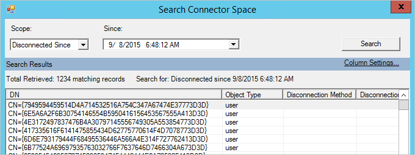

<properties
   pageTitle="Azure AD Connect 同步：防止意外删除 | Azure"
   description="本主题说明 Azure AD Connect 中的防止意外删除功能。"
   services="active-directory"
   documentationCenter=""
   authors="AndKjell"
   manager="femila"
   editor=""/>

<tags
   ms.service="active-directory"
   ms.devlang="na"
   ms.topic="article"
   ms.tgt_pltfrm="na"
   ms.workload="identity"
   ms.date="09/01/2016"
   wacn.date="10/11/2016"
   ms.author="billmath"/>

# Azure AD Connect 同步：防止意外删除
本主题说明 Azure AD Connect 中的防止意外删除功能。

安装 Azure AD Connect 时，将默认启用防止意外删除功能，并将其配置为不允许超过 500 个删除项目的导出。此功能旨在防止发生意外的配置更改，以及防止发生影响许多用户和其他对象的本地目录更改。

经常出现删除操作的情景包括：

- 在取消选择整个 [OU](/documentation/articles/active-directory-aadconnectsync-configure-filtering/#organizational-unitbased-filtering/) 或[域](/documentation/articles/active-directory-aadconnectsync-configure-filtering/#domain-based-filtering/)的情况下更改[筛选](/documentation/articles/active-directory-aadconnectsync-configure-filtering/)设置。
- 已删除 OU 中的所有对象。
- 已重命名某个 OU，因此其中的所有对象被视为超出同步范围。

可以使用 PowerShell 的 `Enable-ADSyncExportDeletionThreshold` 进行更改的默认值是 500 个对象。应将此值配置为符合组织的大小。由于同步计划程序每隔 30 分钟运行一次，因此该值是 30 分钟内看到的删除数目。

如果暂存了太多要导出到 Azure AD 的删除项目，就不会继续导出，并且会收到一封内容如下所示的电子邮件：

> *你好（技术联系人）。标识同步服务在（时间）检测到删除数目超过了为（组织名称）配置的删除阈值。在此次标识同步运行期间，总共已发送（数目）个对象进行删除。这达到或超过了配置的删除阈值，即（数目）个对象。在继续之前，我们需要你确认应该处理这些删除。有关此电子邮件中所列错误的详细信息，请参阅"防止意外删除"。*

在 **Synchronization Service Manager** UI 中查看导出配置文件时，还可以看到状态 `stopped-deletion-threshold-exceeded`。

如果这是意外情况，请进行调查，并采取纠正措施。若要查看哪些对象即将被删除，请执行以下操作：

1. 从"开始"菜单启动"同步服务"。
2. 转到"连接器"。
3. 选择 **Azure Active Directory** 类型的连接器。
4. 在右侧的"操作"下，选择"搜索连接器空间"。
5. 在"范围"下的弹出框中选择"连接断开起始时间"，并选择过去的一个时间。单击"搜索"。此页提供所有即将删除的对象的视图。单击每个项可以获取有关该对象的更多信息。也可以单击"列设置"，添加要在网格中显示的其他属性。

如果想要查看所有删除项，请执行以下操作：

1. 若要暂时禁用此保护并允许删除这些项，请运行 PowerShell cmdlet：`Disable-ADSyncExportDeletionThreshold` 提供 Azure AD 全局管理员帐户和密码。

2. 如果 Azure Active Directory 连接器仍被选中，请选择"运行"操作，再选择"导出"。
3. 若要重新启用保护，请运行 PowerShell cmdlet：`Enable-ADSyncExportDeletionThreshold`

## 后续步骤

**概述主题**

- [Azure AD Connect 同步：理解和自定义同步](/documentation/articles/active-directory-aadconnectsync-whatis/)
- [将本地标识与 Azure Active Directory 集成](/documentation/articles/active-directory-aadconnect/)

<!---HONumber=Mooncake_0926_2016-->
