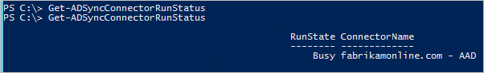

<properties
   pageTitle="Azure AD Connect 同步：计划程序 | Azure"
   description="本主题介绍 Azure AD Connect 同步中的内置计划程序。"
   services="active-directory"
   documentationCenter=""
   authors="AndKjell"
   manager="StevenPo"
   editor=""/>

<tags
   ms.service="active-directory"
   ms.devlang="na"
   ms.topic="article"
   ms.tgt_pltfrm="na"
   ms.workload="identity"
   ms.date="08/04/2016"
   wacn.date="08/29/2016"
   ms.author="billmath"/>

# Azure AD Connect 同步：计划程序
本主题介绍 Azure AD Connect 同步（也称为同步引擎）中的内置计划程序。

此功能是随内部版本 1.1.105.0（于 2016 年 2 月发布）一起推出的。

## 概述
Azure AD Connect 同步会使用计划程序同步本地目录中发生的更改。有两个计划程序进程，一个用于密码同步，另一个用于对象/属性同步和维护任务。本主题将介绍后者。

在早期版本中，用于对象和属性的计划程序在同步引擎的外部，Windows 任务计划程序或单独的 Windows 服务用来触发同步过程。计划程序在同步引擎的内置 1.1 版本中，并允许进行一些自定义。新的默认同步频率为 30 分钟。

计划程序负责执行两项任务：

- **同步周期**。用于导入、同步和导出更改的过程。
- **维护任务**。续订用于密码重置和设备注册服务 (DRS) 的密钥和证书。清除操作日志中的旧条目。

计划程序本身始终运行，但可以将它配置为仅运行其中一个任务或一个任务都不运行。例如，如果需要运行自己的同步周期过程，则可以在计划程序中禁用此任务，但仍运行维护任务。

## 计划程序配置
若要查看当前配置设置，请转到 PowerShell 并运行 `Get-ADSyncScheduler`。它将显示如下：

如果你在运行此 cmdlet 时看到“此同步命令或 cmdlet 不可用”，则 PowerShell 模块未加载。如果你在 PowerShell 限制级别高于默认设置的域控制器或服务器上运行 Azure AD Connect，则可能会发生这种情况。如果你看到此错误，则运行 `Import-Module ADSync` 可使该 cmdlet 可用。

- **AllowedSyncCycleInterval**。Azure AD 允许进行同步的最大频率。你不能比这更频繁地同步，但仍会支持。
- **CurrentlyEffectiveSyncCycleInterval**。当前生效的计划。如果它不比 AllowedSyncInterval 更频繁，它将具有与 CustomizedSyncInterval 相同的值（如果已设置）。如果更改 CustomizedSyncCycleInterval，该值将在下一个同步周期生效。
- **CustomizedSyncCycleInterval**。如果你希望计划程序以默认 30 分钟以外的任何其他频率运行，则可配置此设置。在上图中，计划程序已改为设置为每隔一小时运行一次。如果你将此项设置为低于 AllowedSyncInterval 的值，则将使用后者。
- **NextSyncCyclePolicyType**。Delta 或 Initial。定义下次运行是只应处理增量更改，还是应执行完全导入和同步（这也将重新处理任何新的或已更改的规则）。
- **NextSyncCycleStartTimeInUTC**。计划程序将启动下一个同步周期的时间。
- **PurgeRunHistoryInterval**。操作日志应保留的时间。可以在同步服务管理器中查看这些日志。默认设置是保留这些日志 7 天。
- **SyncCycleEnabled**。指示计划程序是否正在运行导入、同步和导出过程作为其操作的一部分。
- **MaintenanceEnabled**。显示是否启用了维护过程。它将更新证书/密钥，并清除操作日志。
- **IsStagingModeEnabled**。显示是否启用了[暂存模式](/documentation/articles/active-directory-aadconnectsync-operations/)。

你可以使用 `Set-ADSyncScheduler` 更改上述一些设置。可以修改以下参数：

- CustomizedSyncCycleInterval
- NextSyncCyclePolicyType
- PurgeRunHistoryInterval
- SyncCycleEnabled
- MaintenanceEnabled

计划程序配置存储在 Azure AD 中。如果你设有暂存服务器，主服务器上的任何更改还将影响暂存服务器（IsStagingModeEnabled 除外）。

### CustomizedSyncCycleInterval
语法：`Set-ADSyncScheduler -CustomizedSyncCycleInterval d.HH:mm:ss` d - 天，HH - 小时，mm - 分钟，ss - 秒

示例：`Set-ADSyncScheduler -CustomizedSyncCycleInterval 03:00:00` 将计划程序更改为每隔 3 小时运行一次。

示例：`Set-ADSyncScheduler -CustomizedSyncCycleInterval 1.0:0:0` 将计划程序更改为每天运行一次。

## 启动计划程序
默认情况下，计划程序将每 30 分钟运行一次。在某些情况下，你可能想要在已计划的周期之间运行同步周期，或者需要运行不同的类型。

**增量同步周期** 增量同步周期包括以下步骤：

- 在所有连接器上增量导入
- 在所有连接器上增量同步
- 在所有连接器上导出

你可能会有必须立即同步的紧急更改，这就是为什么需要手动运行周期的原因。如果需要手动运行周期，则从 PowerShell 运行 `Start-ADSyncSyncCycle -PolicyType Delta`。

**完全同步周期**  
如果进行了以下任一配置更改，则需要运行完全同步周期（也称为Initial）：

- 从源目录中添加了更多要导入的对象或属性
- 更改了同步规则
- 更改了[筛选设置](/documentation/articles/active-directory-aadconnectsync-configure-filtering)，因此应包含不同的对象数

如果进行了上述某项更改，则需要运行完全同步周期，以便同步引擎有机会重新合并连接器空间。完全同步周期包括以下步骤：

- 在所有连接器上完全导入
- 在所有连接器上完全同步
- 在所有连接器上导出

若要启动完全同步周期，请在 PowerShell 提示符下运行 `Start-ADSyncSyncCycle -PolicyType Initial`。这将启动完全同步周期。

## 停止计划程序
如果计划程序当前正在运行同步周期，可能需要将其停止。例如，如果启动安装向导并收到以下错误：

正在运行同步周期时，不能进行配置更改。你可以等到计划程序已完成该过程，但你也可以停止它，以便可以立即进行更改。停止当前周期没有任何害处，仍未处理的任何更改将在下次运行时处理。

1. 先要使用 PowerShell cmdlet `Stop-ADSyncSyncCycle` 指示计划程序停止其当前周期。
2. 停止计划程序并不会使当前连接器停止执行其当前任务。若要强制停止连接器，请执行以下操作：

    - 从“开始”菜单启动“同步服务”。转到“连接器”，突出显示状态为“正在运行”的连接器，然后从“操作”中选择“停止”。

计划程序仍处于活动状态，并将在下次有机会时重新启动。

## 自定义计划程序
本节中所述的 cmdlet 仅在内部版本 [1\.1.130.0](/documentation/articles/active-directory-aadconnect-version-history/) 及更高版本中提供。

如果内置的计划程序不符合你的要求，则可以使用 PowerShell 计划连接器。

### Invoke-ADSyncRunProfile
可以用这种方式为连接器启动配置文件：

	Invoke-ADSyncRunProfile -ConnectorName "name of connector" -RunProfileName "name of profile"

用于[连接器名称](/documentation/articles/active-directory-aadconnectsync-service-manager-ui-connectors/)和[运行配置文件名称](/documentation/articles/active-directory-aadconnectsync-service-manager-ui-connectors/)的名称可以在[同步服务管理器 UI](/documentation/articles/active-directory-aadconnectsync-service-manager-ui/) 中找到。

`Invoke-ADSyncRunProfile` cmdlet 是同步的，即在连接器完成操作（无论成功还是出错）之前，它不会返回控制。

计划连接器时，建议按以下顺序计划它们：

1. 从本地目录（如 Active Directory）中（完全/增量）导入
2. 从 Azure AD 中（完全/增量）导入
3. 从本地目录（如 Active Directory）（完全/增量）同步
4. 从 Azure AD（完全/增量）同步
5. 导出到 Azure AD
6. 导出到本地目录，如 Active Directory

如果看一下内置的计划程序，会发现这是连接器将运行的顺序。

### Get-ADSyncConnectorRunStatus
还可以监视同步引擎以了解它是忙还是空闲。如果同步引擎处于空闲状态且未运行连接器，则此 cmdlet 将返回一个空结果。如果连接器正在运行，它将返回连接器的名称。

	Get-ADSyncConnectorRunStatus

  
在上图中，第一行来自同步引擎处于空闲的状态。第二行来自 Azure AD 连接器正在运行时。

## 计划程序和安装向导
如果启动安装向导，则计划程序将暂时暂停。这是因为它认为你将进行配置更改，如果同步引擎正处于活动运行状态，将不能应用这些更改。出于此原因，不要让安装向导处于打开状态，因为将使同步引擎停止执行任何同步操作。

## 后续步骤
了解有关 [Azure AD Connect 同步](/documentation/articles/active-directory-aadconnectsync-whatis/)配置的详细信息。

了解有关[将本地标识与 Azure Active Directory 集成](/documentation/articles/active-directory-aadconnect/)的详细信息。

<!---HONumber=Mooncake_0822_2016-->