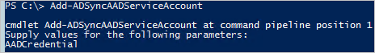

<properties
	pageTitle="Azure AD Connect 同步：如何管理 Azure AD 服务帐户 | Azure"
	description="本主题介绍如何还原 Azure AD 服务帐户。"
	services="active-directory"
    keywords="AADSTS70002、AADSTS50054：如何重置 Azure AD Connect 同步连接器服务帐户的密码"
	documentationCenter=""
	authors="andkjell"
	manager="femila"
	editor=""/>

<tags
	ms.service="active-directory"
	ms.workload="identity"
	ms.tgt_pltfrm="na"
	ms.devlang="na"
	ms.topic="article"
	ms.date="09/01/2016"
	ms.author="andkjell"
	wacn.date="10/11/2016"/>

# Azure AD Connect 同步：如何管理 Azure AD 服务帐户
Azure AD 连接器所使用的服务帐户应该是免费服务。但如果需要重置其凭据，则可以参阅本主题。例如，全局管理员错误地使用 PowerShell 对服务帐户重置了密码。

## 重置凭据
如果 Azure AD 连接器上定义的服务帐户由于身份验证问题无法联系 Azure AD，则可以重置密码。

1. 登录到 Azure AD Connect 同步服务器并启动 PowerShell。
2. 运行 `Add-ADSyncAADServiceAccount`

3. 提供 Azure AD 全局管理员凭据。

此 cmdlet 重置服务帐户的密码，并在 Azure AD 和同步引擎中更新该密码。

## 这些步骤可以解决的已知问题
本部分列出了客户报告的，可以通过重置 Azure AD 服务帐户凭据解决的错误。

-----------
事件 6900:  
服务器在处理密码更改通知时遇到意外的错误:  
AADSTS70002: 验证凭据时出错。AADSTS50054: 使用旧密码进行身份验证。

----------
事件 659:  
检索密码策略同步配置时出错。Microsoft.IdentityModel.Clients.ActiveDirectory.AdalServiceException:  
AADSTS70002: 验证凭据时出错。AADSTS50054: 使用旧密码进行身份验证。

## 后续步骤

**概述主题**

- [Azure AD Connect 同步：理解和自定义同步](/documentation/articles/active-directory-aadconnectsync-whatis/)
- [将本地标识与 Azure Active Directory 集成](/documentation/articles/active-directory-aadconnect/)

<!---HONumber=Mooncake_0926_2016-->
