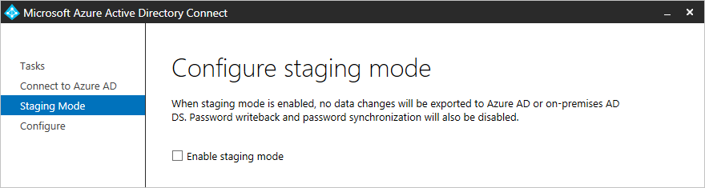

<properties
	pageTitle="Azure AD Connect 同步：第二次运行安装向导 | Azure"
	description="介绍安装向导第二次运行时的工作原理。"
	keywords="Azure AD Connect 安装向导允许你在第二次运行它时配置维护设置"
	services="active-directory"
	documentationCenter=""
	authors="andkjell"
	manager="stevenpo"
	editor=""/>

<tags
	ms.service="active-directory"
	ms.date="05/11/2016"
	wacn.date="07/21/2016"/>

# Azure AD Connect 同步：第二次运行安装向导
第一次运行 Azure AD Connect 安装向导时，它将逐步引导你配置安装。如果你再次运行安装向导，它将提供维护选项。

你可以在“开始”菜单中找到名为 **Azure AD Connect** 的安装向导。

启动安装向导时，将显示包含下列选项的页面：

如果你已使用 Azure AD Connect 安装 ADFS，则会有更多选项。[ADFS 管理](/documentation/articles/active-directory-aadconnect-federation-management/#ad-fs-management)介绍了你拥有的其他 ADFS 选项。

请选择其中一项任务，然后单击“下一步”以继续。

> [AZURE.IMPORTANT] 当你打开安装向导时，同步引擎中的所有操作都会挂起。请确保在完成配置更改后，立即关闭安装向导。

## 查看当前配置
此选项可让你快速查看当前配置的选项。

单击“上一步”返回。如果选择“退出”，将关闭安装向导。

## 自定义同步选项
此选项可用于更改同步配置。你会在自定义配置安装路径中看到一部分选项。即使一开始是使用快速安装也会看到。

- [添加更多目录](/documentation/articles/active-directory-aadconnect-get-started-custom/#connect-your-directories)。若要删除目录，请参阅[删除连接器](/documentation/articles/active-directory-aadconnectsync-service-manager-ui-connectors/#delete)。
- [更改域和 OU 筛选](/documentation/articles/active-directory-aadconnect-get-started-custom/#domain-and-ou-filtering)。
- 删除组筛选。
- [更改可选功能](/documentation/articles/active-directory-aadconnect-get-started-custom/#optional-features/)。

初始安装中的其他选项既无法更改，也不能使用。这包括：

- 更改用于 userPrincipalName 和 sourceAnchor 的属性。
- 更改不同林中对象的联接方法。
- 启用基于组的筛选。

## 刷新目录架构
如果已更改其中一个本地 AD DS 林中的架构，则应使用此选项。例如，你可能已安装 Exchange，或升级到包含设备对象的 Windows Server 2012 架构。在这种情况下，需指示 Azure AD Connect 从 AD DS 再次读取架构并更新其缓存。这也会重新生成同步规则。举例来说，如果你添加 Exchange 架构，配置中就会添加 Exchange 的同步规则。

选择此选项时，将列出配置中的所有目录。可以保留默认设置，并刷新所有林或取消选择其中某些林。

## 配置过渡模式
此选项可让你启用和禁用服务器上的过渡模式。过渡模式及其使用方式的详细信息可在[操作](/documentation/articles/active-directory-aadconnectsync-operations/#staging-mode)中找到。

此选项会显示过渡模式当前是已启用还是已禁用：  

若要更改状态，请选择此选项，并选中或取消选中复选框。  

## 更改用户登录
此选项可让你从密码同步更改为联盟，反之亦然。但不能更改为“不配置”。

有关此选项的详细信息，请参阅[用户登录](/documentation/articles/active-directory-aadconnect-user-signin/#changing-user-sign-in-method)。

## 后续步骤
了解有关 [Azure AD Connect 同步](/documentation/articles/active-directory-aadconnectsync-whatis/)配置的详细信息。

了解有关[将本地标识与 Azure Active Directory 集成](/documentation/articles/active-directory-aadconnect/)的详细信息。

<!---HONumber=Mooncake_0711_2016-->