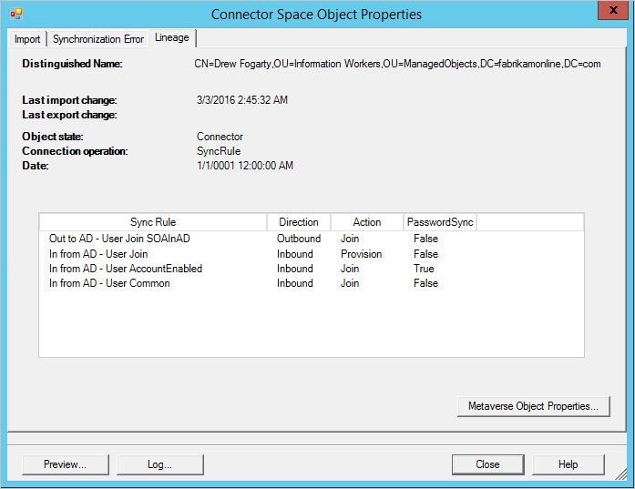
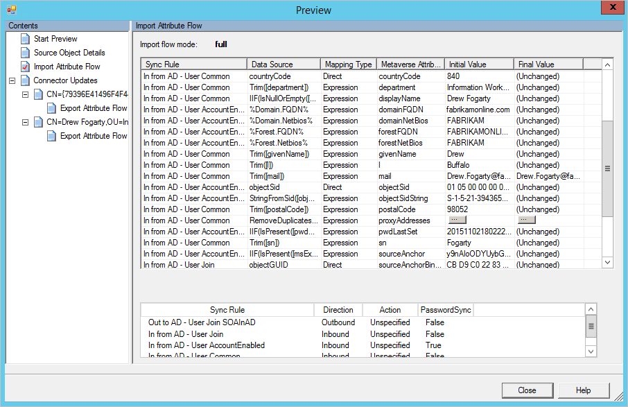

<properties
    pageTitle="Azure AD Connect 同步：Synchronization Service Manager UI | Azure"
    description="了解用于 Azure AD Connect 的 Synchronization Service Manager 中的“连接器”选项卡。"
    services="active-directory"
    documentationcenter=""
    author="andkjell"
    manager="femila"
    editor="" />
<tags
    ms.assetid="60f1d979-8e6d-4460-aaab-747fffedfc1e"
    ms.service="active-directory"
    ms.workload="identity"
    ms.tgt_pltfrm="na"
    ms.devlang="na"
    ms.topic="article"
    ms.date="02/08/2017"
    wacn.date="03/13/2017"
    ms.author="billmath" />

# Azure AD Connect 同步：Synchronization Service Manager

  

“连接器”选项卡可用于管理同步引擎连接的所有系统。

## 连接器操作
| 操作 | 注释 |
| --- | --- |
| 创建 |请勿使用。若要连接到其他 AD 林，请使用安装向导。 |
| 属性 |用于域和 OU 筛选。 |
| [删除](#delete) |用于删除连接器空间中的数据或删除与林的连接。 |
| [配置运行配置文件](#configure-run-profiles) |除了对于域筛选，无需在此进行任何配置。可以通过此操作来查看已配置的运行配置文件。 |
| 运行 |用于启动配置文件的一次性运行。 |
| 停止 |停止当前运行配置文件的连接器。 |
| 导出连接器 |请勿使用。 |
| 导入连接器 |请勿使用。 |
| 更新连接器 |请勿使用。 |
| 刷新架构 |刷新缓存架构。最好改为在安装向导中使用此选项，因为它也会更新同步规则。 |
| [搜索连接器空间](#search-connector-space) |用于查找对象，以及[在整个系统中跟踪对象及其数据](#follow-an-object-and-its-data-through-the-system)。 |

### 删除 
删除操作适用于两种不同的用途。

“仅删除连接器空间”选项会删除所有数据，但保留所有配置。

“删除连接器和连接器空间”选项会删除数据以及所有配置。不想再连接到林时可以使用此选项。

这两个选项都会同步所有对象，并更新 Metaverse 对象。这是一个长时间运行的操作。

### 配置运行配置文件 
此选项可让你查看为连接器配置的运行配置文件。

### 搜索连接器空间 
查找对象和排查数据问题时，搜索连接器空间操作非常有用。

先选择一个“范围”。你可以基于数据（RDN、DN、定位点、子树）或对象状态（所有其他选项）进行搜索。
 
例如，如果进行子树搜索，将获取某个 OU 中的所有对象。
 
可以从此处选择对象，选择“属性”，从源连接器空间到 Metaverse 再到目标连接器空间一直[跟踪对象](#follow-an-object-and-its-data-through-the-system)。

## 在整个系统中跟踪对象及其数据  
当你排查数据问题时，从源连接器空间到 Metaverse 再到目标连接器空间一直跟踪对象是一个关键过程，可从中了解为什么数据没有预期值。

### 连接器空间对象属性 

**导入** 

当你打开 cs 对象时，顶端会出现数个选项卡。“导入”选项卡显示导入后暂存的数据。

“旧值”显示当前存储在系统中的数据，而“新值”显示从源系统收到但尚未应用的数据。在本例中，由于发生同步错误，因此无法应用更改。

**错误** 

对象出现问题时才会显示“错误”页面。有关如何[排查同步错误](/documentation/articles/active-directory-aadconnectsync-service-manager-ui-operations/#troubleshoot-errors-in-operations-tab/)的详细信息，请参阅“操作”页上的详细信息。

**沿袭** 

“沿袭”选项卡显示连接器空间对象与 Metaverse 对象关联的方式。可以看到连接器上次从连接的系统导入更改的时间，以及应用哪些规则以便在 Metaverse 中填充数据。
 
在“操作”列中，可以看到有一个操作为“预配”的“入站”同步规则。这表示只要此连接器空间对象存在，就会保留 Metaverse 对象。如果同步规则列表显示的同步规则方向为“出站”和“预配”，则表示删除 Metaverse 对象时，也将删除此对象。
 在“PasswordSync”列中，还会发现入站连接器空间可进行密码更改，因为有一个同步规则的值为 **True**。此密码接着会通过出站规则发送到 Azure AD。

从“沿袭”选项卡中，可以单击“Metaverse 对象属性”转到 Metaverse。

所有选项卡的底部都有两个按钮：“预览”和“日志”。

**预览** 

“预览”页面可用于同步单个对象。如果你正在对某些客户同步规则进行故障排除，并且想要在单个对象上查看更改的效果，则此页面非常有用。可以在“完全同步”和“增量同步”之间选择。还可以在“生成预览”（仅在内存中保留更改）和“提交预览”（将暂存目标连接器空间的所有更改）之间选择。
 
可以检查对象，以及哪一个规则适用于特定的属性流。

**日志**

“日志”页用于查看密码同步状态和历史记录。

### Metaverse 对象属性 

**属性**

在“属性”选项卡中，可以看到值，以及是由哪一个连接器提供它。
 

**连接器**

“连接器”选项卡显示所有具有对象表示形式的连接器空间。
 
此选项卡也可让你导航到[连接器空间对象](#connector-space-object-properties)。

## 后续步骤
了解有关 [Azure AD Connect 同步](/documentation/articles/active-directory-aadconnectsync-whatis/)配置的详细信息。

了解有关[将本地标识与 Azure Active Directory 集成](/documentation/articles/active-directory-aadconnect/)的详细信息。

<!---HONumber=Mooncake_0306_2017-->
<!--Update_Description: wording update-->