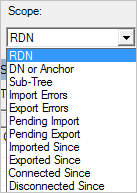
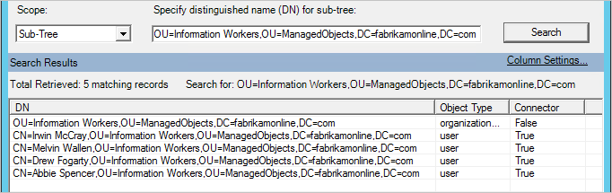

<properties
    pageTitle="Azure AD Synchronization Service Manager UI 中的连接器 | Microsoft 文档"
    description="了解 Azure AD Connect 的 Synchronization Service Manager 中的“连接器”选项卡。"
    services="active-directory"
    documentationcenter=""
    author="andkjell"
    manager="femila"
    editor="" />
<tags
    ms.assetid="60f1d979-8e6d-4460-aaab-747fffedfc1e"
    ms.service="active-directory"
    ms.workload="identity"
    ms.tgt_pltfrm="na"
    ms.devlang="na"
    ms.topic="article"
    ms.date="04/03/2017"
    wacn.date="05/22/2017"
    ms.author="billmath"
    ms.custom="H1Hack27Feb2017"
    ms.translationtype="Human Translation"
    ms.sourcegitcommit="8fd60f0e1095add1bff99de28a0b65a8662ce661"
    ms.openlocfilehash="554e5d29da38ab8d91fa19458c008da37b7a755e"
    ms.contentlocale="zh-cn"
    ms.lasthandoff="05/12/2017" />

# 将连接器与 Azure AD Connect Sync Service Manager 配合使用

“连接器”选项卡可用于管理同步引擎连接的所有系统。

## 连接器操作
| 操作 | 注释 |
| --- | --- |
| 创建 |请勿使用。 若要连接到其他 AD 林，请使用安装向导。 |
| 属性 |用于域和 OU 筛选。 |
| [删除](#delete) |用于删除连接器空间中的数据或删除与林的连接。 |
| [配置运行配置文件](#configure-run-profiles) |除了对于域筛选，无需在此进行任何配置。 可以通过此操作来查看已配置的运行配置文件。 |
| 运行 |用于启动配置文件的一次性运行。 |
| 停止 |停止当前运行配置文件的连接器。 |
| 导出连接器 |请勿使用。 |
| 导入连接器 |请勿使用。 |
| 更新连接器 |请勿使用。 |
| 刷新架构 |刷新缓存架构。 最好改为在安装向导中使用此选项，因为它也会更新同步规则。 |
| [搜索连接器空间](#search-connector-space) |用于查找对象，以及在整个系统中跟踪对象及其数据。 |

### 删除
删除操作适用于两种不同的用途。  

“仅删除连接器空间”选项会删除所有数据，但保留所有配置。

“删除连接器和连接器空间”选项会删除数据以及所有配置。 不想再连接到林时可以使用此选项。

这两个选项都会同步所有对象，并更新 Metaverse 对象。 这是一个长时间运行的操作。

### 配置运行配置文件
此选项可让你查看为连接器配置的运行配置文件。

### 搜索连接器空间
查找对象和排查数据问题时，搜索连接器空间操作非常有用。

先选择一个“范围”。 你可以基于数据（RDN、DN、定位点、子树）或对象状态（所有其他选项）进行搜索。  
  
例如，如果进行子树搜索，将获取某个 OU 中的所有对象。  
  
可以从此网格中选择一个对象，选择“属性”，并从源连接器空间到 Metaverse 再到目标连接器空间一直[跟踪对象](/documentation/articles/active-directory-aadconnectsync-troubleshoot-object-not-syncing/)。

### 更改 AD DS 帐户密码
如果更改帐户密码，Synchronization Service 将不再能将更改导入/导出到本地 AD。   可能会看到如下内容：

- AD 连接器的导入/导出步骤失败，错误为“no-start-credentials”。
- 在 Windows 事件查看器下，应用程序事件日志包含一个错误，事件 ID 为 6000，消息为“管理代理‘contoso.com’未能运行，因为凭据无效”。

若要解决此问题，请使用以下方法更新 AD DS 用户帐户：

1. 启动 Synchronization Service Manager（“开始”→ Synchronization Service）。
 
2. 转到“连接器”选项卡。
3. 选择配置为使用 AD DS 帐户的 AD 连接器。
4. 在“操作”下，选择“属性”。
5. 在弹出对话框中，选择“连接到 Active Directory 林”：
6. 林名称指示相应的本地 AD。
7. 用户名指示用于同步的 AD DS 帐户。
8. 在密码文本框 

	

	中输入 AD DS 帐户的新密码

9. 单击“确定”以保存新密码，并重启 Synchronization Service 以从内存缓存中删除旧密码。

## 后续步骤
了解有关 [Azure AD Connect 同步](/documentation/articles/active-directory-aadconnectsync-whatis/)配置的详细信息。

了解有关 [将本地标识与 Azure Active Directory 集成](/documentation/articles/active-directory-aadconnect/)的详细信息。

<!--Update_Description: wording update-->