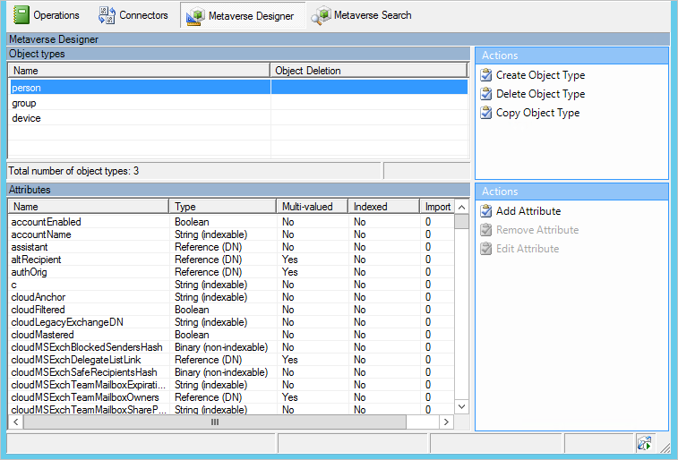

<properties
    pageTitle="Azure AD Connect 同步：Synchronization Service Manager UI | Azure"
    description="了解用于 Azure AD Connect 的 Synchronization Service Manager 中的“Metaverse 设计器”选项卡。"
    services="active-directory"
    documentationcenter=""
    author="andkjell"
    manager="femila"
    editor="" />
<tags
    ms.assetid="abaa9eb2-f105-42d1-b00a-2a63129a8ffb"
    ms.service="active-directory"
    ms.workload="identity"
    ms.tgt_pltfrm="na"
    ms.devlang="na"
    ms.topic="article"
    ms.date="02/08/2017"
    wacn.date="03/13/2017"
    ms.author="billmath" />

# Azure AD Connect 同步：Synchronization Service Manager

  

对大多数客户而言，无需在此处进行任何配置。

## 后续步骤
了解有关 [Azure AD Connect 同步](/documentation/articles/active-directory-aadconnectsync-whatis/)配置的详细信息。

了解有关[将本地标识与 Azure Active Directory 集成](/documentation/articles/active-directory-aadconnect/)的详细信息。

<!---HONumber=Mooncake_0306_2017-->
<!---Update_Description: update meta properties -->