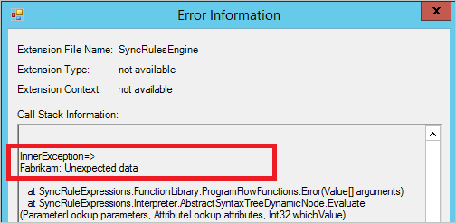

<properties
	pageTitle="Azure AD Connect 同步：Synchronization Service Manager UI | Azure"
	description="了解 Azure AD Connect 的 Synchronization Service Manager 中的"操作"选项卡。"
	services="active-directory"
	documentationCenter=""
	authors="andkjell"
	manager="femila"
	editor=""/>

<tags
	ms.service="active-directory"
	ms.workload="identity"
	ms.tgt_pltfrm="na"
	ms.devlang="na"
	ms.topic="article"
	ms.date="09/07/2016"
	ms.author="andkjell"
   wacn.date="10/11/2016"/>
	wacn.date="10/11/2016"/>

# Azure AD Connect 同步：Synchronization Service Manager

[操作](/documentation/articles/active-directory-aadconnectsync-service-manager-ui-operations/) | [连接器](/documentation/articles/active-directory-aadconnectsync-service-manager-ui-connectors/) | [Metaverse 设计器](/documentation/articles/active-directory-aadconnectsync-service-manager-ui-mvdesigner/) | [Metaverse 搜索](/documentation/articles/active-directory-aadconnectsync-service-manager-ui-mvsearch/)
--- | --- | --- | ---

"操作"选项卡显示最新操作的结果。此选项卡是了解和排查问题的关键所在。

## 了解"操作"选项卡中显示的信息
上半部分按时间顺序显示所有运行。默认情况下，操作日志保留最后七天的相关信息，但可以使用[计划程序](/documentation/articles/active-directory-aadconnectsync-feature-scheduler/)来更改此设置。想要查找所有未显示成功状态的运行。可以单击标题来更改排序。

"状态"列是最重要的信息，并显示最严重的运行问题。下面是按调查优先级顺序显示的最常见状态的快速摘要（其中 * 表示多个可能的错误字符串）。

状态 | 注释
--- | ---
stopped-* | 运行无法完成。例如，如果远程系统已关闭且无法访问。
stopped-error-limit | 有 5,000 个以上的错误。运行因错误数量过多而自动停止。
completed-*-errors | 运行已完成，但发生应调查的错误（数量少于 5,000 个）。
completed-*-warnings | 运行已完成，但某些数据并未处于预期的状态。如果遇到错误，则此消息通常只是一种征兆。在解决错误之前，不应该调查警告。
成功 | 没有问题。

选择某一行时，底部将更新以显示该运行的详细信息。在底部的最左边，可能会有一份显示"步骤编号"的列表。仅当林中有多个域，而且每个域都以一个步骤表示时，才会显示此列表。你可以在"分区"标题下方找到域名。在"同步统计信息"下方，可以找到有关已处理更改次数的详细信息。可以单击链接获取已更改对象的列表。如果有对象发生错误，这些错误将显示在"同步错误"下方。

## 排查"操作"选项卡中的错误
  
遇到错误时，发生错误的对象与错误本身都是链接，这些链接提供更多信息。

首先单击错误字符串（图中的 **sync-rule-error-function-triggered**）。随后会先看到对象概述。若要查看实际的错误，可单击"堆栈跟踪"按钮。此跟踪提供错误的调试级别信息。

**提示：**你可以在"调用堆栈信息"框中单击右键，然后依次选择"全选"、"复制"。接着可以复制堆栈，并在最喜爱的编辑器（例如记事本）中查看此错误。

- 如果错误来自 **SyncRulesEngine**，则调用堆栈信息首先会列出对象上的所有属性。向下滚动，直到你看到 **InnerException =>** 标题为止。  
  
后面的行显示错误。在上图中，错误来自所创建的自定义同步规则 Fabrikam。

如果错误本身未提供足够的信息，则请查看数据本身。可以单击对象标识符的链接，然后[在整个系统中跟踪对象及其数据](/documentation/articles/active-directory-aadconnectsync-service-manager-ui-connectors/#follow-an-object-and-its-data-through-the-system/)。

## 后续步骤
了解有关 [Azure AD Connect 同步](/documentation/articles/active-directory-aadconnectsync-whatis/)配置的详细信息。

了解有关[将本地标识与 Azure Active Directory 集成](/documentation/articles/active-directory-aadconnect/)的详细信息。

<!---HONumber=Mooncake_0926_2016-->
