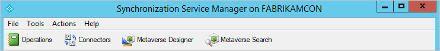
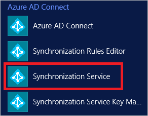

<properties
	pageTitle="Azure AD Connect 同步：Synchronization Service Manager UI | Azure"
	description="了解 Azure AD Connect 的 Synchronization Service Manager。"
	services="active-directory"
	documentationCenter=""
	authors="andkjell"
	manager="femila"
	editor=""/>

<tags
	ms.service="active-directory"
	ms.workload="identity"
	ms.tgt_pltfrm="na"
	ms.devlang="na"
	ms.topic="article"
	ms.date="09/07/2016"
	wacn.date="10/11/2016"
	ms.author="billmath"/>

# Azure AD Connect 同步：Synchronization Service Manager

[操作](/documentation/articles/active-directory-aadconnectsync-service-manager-ui-operations/) | [连接器](/documentation/articles/active-directory-aadconnectsync-service-manager-ui-connectors/) | [Metaverse 设计器](/documentation/articles/active-directory-aadconnectsync-service-manager-ui-mvdesigner/) | [Metaverse 搜索](/documentation/articles/active-directory-aadconnectsync-service-manager-ui-mvsearch/)
--- | --- | --- | ---

**Synchronization Service Manager** UI 用于配置同步引擎的更高级设置，以及查看该服务的运行情况。

可以从开始菜单启动 **Synchronization Service Manager** UI。它名为"同步服务"，可以在 **Azure AD Connect** 组中找到。

单击本主题顶部的链接可以了解有关该 UI 中各个选项卡的详细信息。

## 后续步骤
了解有关 [Azure AD Connect 同步](/documentation/articles/active-directory-aadconnectsync-whatis/)配置的详细信息。

了解有关[将本地标识与 Azure Active Directory 集成](/documentation/articles/active-directory-aadconnect/)的详细信息。

<!---HONumber=Mooncake_0926_2016-->
