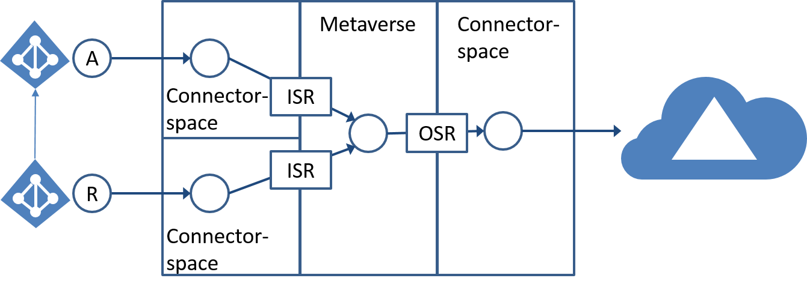

<properties
	pageTitle="Azure AD Connect 同步：技术概念 | Azure"
	description="介绍 Azure AD Connect 同步的技术概念"
	services="active-directory"
	documentationCenter=""
	authors="markusvi"
	manager="stevenpo"
	editor=""/>

<tags
	ms.service="active-directory"
	ms.date="05/03/2016"
	wacn.date="06/14/2016"/>

# Azure AD Connect 同步：技术概念
本文是[了解体系结构](/documentation/articles/active-directory-aadconnectsync-technical-concepts/)主题的总结。

Azure AD Connect 同步构建在稳固的元目录同步平台基础之上。以下部分介绍了元目录同步的概念。Azure Active Directory 同步服务基于 MIIS、ILM 和 FIM 进行构建，它提供了下一个平台，用于连接到数据源、同步数据源之间的数据以及设置标识和取消标识设置。

以下各部分提供有关 FIM 同步服务的以下方面的更多详细信息：

- 连接器
- 属性流
- 连接器空间
- Metaverse
- 设置

## 连接器

用于与连接的目录进行通信的代码模块称为连接器（以前称为管理代理 (MA)）。

这些连接器在运行 Azure AD Connect 同步的计算机上进行安装。连接器通过使用远程系统协议（而不是依靠专用代理部署）提供进行人机对话的无代理功能。这意味着降低了风险和减少了部署时间，尤其是在处理关键应用程序和系统时。

如上图所示，连接器与连接器空间同义，但包含与外部系统的所有通信。

连接器负责到系统的所有导入和导出功能，并且当使用声明性设置自定义数据转换时，使开发人员无需了解如何通过本机连接到每个系统。

导入和导出仅在计划时发生，由于更改不会自动传播到已连接数据源，因此使得能够进一步避免更改发生在系统中。此外，开发人员还可以创建他们自己的连接器，以便用于连接到几乎任何数据源。

## 属性流

metaverse 是相邻连接器空间中的所有已联接标识的合并视图。在上图中，属性流是由带箭头的表示入站和出站流的线条描绘的。属性流是将数据从一个系统复制或转换到另一个系统的过程，并且所有属性流（入站或出站）。

当计划运行同步（完整或增量）操作时，属性流在连接器空间和 metaverse 之间双向发生。

属性流仅在运行这些同步时发生。属性流在同步规则中进行定义。这些属性流可以是入站（上图所示 ISR）或出站（上图所示 OSR）。

## 连接的系统

连接的系统（也称为连接的目录）是指已连接 Azure AD Connect 同步且来回读写标识数据的远程系统。

## 连接器空间

每个已连接数据源都表示为连接器空间中对象和属性的已筛选子集。此特点允许同步服务在本地工作，并且当同步对象时，不需要联系远程系统，此外还将交互仅限制为导入和导出。

当数据源和连接器具有提供更改列表（增量导入）的功能时，则操作效率作为仅有的更改会显著增加，因为最后一个轮询周期进行了交换。连接器空间通过要求连接器计划导入和导出保护已连接数据源免于进行自动传播的更改。当测试、预览或确认下一次更新时，此添加的保护让您高枕无忧。

## Metaverse

metaverse 是相邻连接器空间中的所有已联接标识的合并视图。

标识链接在一起，并且机构通过导入流映射分配给各种属性，中心 metaverse 对象开始聚合来自多个系统的信息。通过此对象属性流，映射将信息携带到出站系统。

当机构系统将对象投入到 metaverse 时创建对象。只要所有连接都已删除，则会删除 metaverse 对象。

不能直接编辑 metaverse 中的对象。该对象中的所有数据都必须通过属性流提供。metaverse 为每个连接器空间维护永久性连接器。这些连接器不要求针对每次同步运行进行重新评估。这意味着 Azure AD Connect 同步不必每次都查找匹配的远程对象。这样就不需要使用开销较高的代理来避免更改通常负责关联对象的属性。

当发现可能具有需要管理的先前存在对象的新数据源时，Azure AD Connect 同步将使用一个称为联接规则的进程来评估要与之建立链路的潜在候选者。一旦建立链接，此评估则不会再次出现，且远程连接的数据源和 metaverse 之间可能发生普通属性流。

## 设置

当机构源将新对象投入到 metaverse 中时，则可能在另一个连接器中创建表示下游连接的数据源的新连接器空间对象。

这本质上会建立链接，并且属性流可以双向继续。

每当某条规则确定需要创建新的连接器空间对象时，它都称为设置。但是，因为此操作只在连接器空间内发生，所以它不会延续到已连接数据源，直到执行导出。

## 其他资源

* [Azure AD Connect Sync：自定义同步选项](/documentation/articles/active-directory-aadconnectsync-whatis/)
* [将本地标识与 Azure Active Directory 集成](/documentation/articles/active-directory-aadconnect/)
 
<!--Image references-->
[1]: ./media/active-directory-aadsync-technical-concepts/ic750598.png

<!---HONumber=Mooncake_0606_2016-->