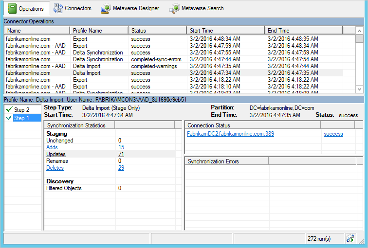
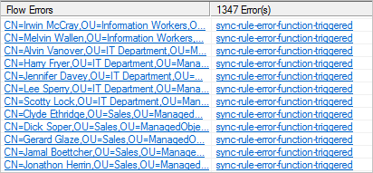

<properties
    pageTitle="对未同步到 Azure AD 的对象进行故障排除 | Azure"
    description="排查对象为何没有同步到 Azure AD。"
    services="active-directory"
    documentationcenter=""
    author="andkjell"
    manager="femila"
    editor="" />
<tags
    ms.assetid=""
    ms.service="active-directory"
    ms.workload="identity"
    ms.tgt_pltfrm="na"
    ms.devlang="na"
    ms.topic="article"
    ms.date="03/02/2017"
    wacn.date="04/05/2017"
    ms.author="billmath" />

# 对未同步到 Azure AD 的对象进行故障排除

如果某个对象没有按预期同步到 Azure AD，则可能有多种原因。如果你从 Azure AD 收到错误电子邮件或者在 Azure AD Connect Health 中看到错误，请改为阅读[排查导出错误](/documentation/articles/active-directory-aadconnect-troubleshoot-sync-errors/)。但如果你是要排查不在 Azure AD 中的对象的问题，则本主题适用于你。它介绍了如何在本地组件 Azure AD Connect 同步中查找错误。

若要查找错误，可以按以下顺序查看几个不同的位置：

1. [操作日志](#operations)，查找由同步引擎在导入和同步期间识别出的错误。
2. [连接器空间](#connector-space-object-properties)，查找缺少的对象和同步错误。
3. [metaverse](#metaverse-object-properties)，查找与数据相关的问题。

在开始这些步骤之前，请启动 [Synchronization Service Manager](/documentation/articles/active-directory-aadconnectsync-service-manager-ui/)。

## 操作
Synchronization Service Manager 中的“操作”选项卡是你应当从中开始故障排除的位置。“操作”选项卡显示最新操作的结果。

上半部分按时间顺序显示所有运行。默认情况下，操作日志保留最后七天的相关信息，但可以使用[计划程序](/documentation/articles/active-directory-aadconnectsync-feature-scheduler/)来更改此设置。想要查找所有未显示成功状态的运行。可以单击标题来更改排序。

“状态”列是最重要的信息，并显示最严重的运行问题。下面是按调查优先级顺序显示的最常见状态的快速摘要（其中 * 表示多个可能的错误字符串）。

| 状态 | 注释 |
| --- | --- |
| stopped-* |运行无法完成。例如，如果远程系统已关闭且无法访问。 |
| stopped-error-limit |有 5,000 个以上的错误。运行因错误数量过多而自动停止。 |
| completed-*-errors |运行已完成，但发生应调查的错误（数量少于 5,000 个）。 |
| completed-*-warnings |运行已完成，但某些数据并未处于预期的状态。如果遇到错误，则此消息通常只是一种征兆。在解决错误之前，不应该调查警告。 |
| success |没有问题。 |

选择某一行时，底部将更新以显示该运行的详细信息。在底部的最左边，可能会有一份显示“步骤编号”的列表。仅当林中有多个域，而且每个域都以一个步骤表示时，才会显示此列表。你可以在“分区”标题下方找到域名。在“同步统计信息”下方，可以找到有关已处理更改次数的详细信息。可以单击链接获取已更改对象的列表。如果有对象发生错误，这些错误将显示在“同步错误”下方。

### 排查“操作”选项卡中的错误
 
遇到错误时，发生错误的对象与错误本身都显示为链接，这些链接提供了更多信息。

首先单击错误字符串（图中的 **sync-rule-error-function-triggered**）。随后会先看到对象概述。若要查看实际的错误，可单击“堆栈跟踪”按钮。此跟踪提供错误的调试级别信息。

你可以在“调用堆栈信息”框中单击右键，然后依次选择“全选”、“复制”。接着可以复制堆栈，并在最喜爱的编辑器（例如记事本）中查看此错误。

- 如果错误来自 **SyncRulesEngine**，则调用堆栈信息首先会列出对象上的所有属性。向下滚动，直到你看到 **InnerException =>** 标题为止。
 后面的行显示错误。在上图中，错误来自所创建的自定义同步规则 Fabrikam。

如果错误本身未提供足够的信息，则请查看数据本身。你可以单击具有对象标识符的链接并继续对[连接器空间导入的对象](#cs-import)进行故障排除。

## 连接器空间对象属性
如果在“操作”选项卡中未发现任何错误，则接下来检查 Active Directory 中的连接器空间对象，然后检查 metaverse，最后检查 Azure AD。在此路径中，你应当会发现问题所在。

### 搜索连接器空间中的对象

在 **Synchronization Service Manager** 中，单击“连接器”，选择 Active Directory 连接器和“搜索连接器空间”。

在“范围”中，选择“RDN”（当希望搜索 CN 属性时）或“DN 或定位标记”（当希望搜索 distinguishedName 属性时）。输入一个值并单击“搜索”。

如果找不到要搜索的对象，则可能通过[基于域的筛选](/documentation/articles/active-directory-aadconnectsync-configure-filtering/#domain-based-filtering/)或[基于 OU 的筛选](/documentation/articles/active-directory-aadconnectsync-configure-filtering/#organizational-unitbased-filtering/)对其进行了筛选。若要验证是否按预期配置了筛选，请阅读[配置筛选](/documentation/articles/active-directory-aadconnectsync-configure-filtering/)主题。

另一种有用的搜索是选择 Azure AD 连接器，在“范围”中选择“挂起的导入”，然后选中“添加”复选框。此搜索会显示 Azure AD 中无法与本地对象关联的所有已同步对象。

 

这些对象是由其他同步引擎或者是由具有不同筛选配置的同步引擎创建的。此视图是不再受管理的**孤立**对象的列表。你应当复查此列表并考虑使用 [Azure AD PowerShell](http://aka.ms/aadposh) cmdlet 删除这些对象。

### 连接器空间导入
当打开连接器空间对象时，顶端会出现数个选项卡。“导入”选项卡显示导入后暂存的数据。

“旧值”显示当前存储在 Connect 中的数据，而“新值”显示从源系统收到但尚未应用的数据。如果对象上没有错误，则不会处理更改。

**错误** 

只有当对象存在问题时才会显示“同步错误”选项卡。有关详细信息，请参阅[排查同步错误](#troubleshoot-errors-in-operations-tab)。

### 连接器空间沿袭
“沿袭”选项卡显示连接器空间对象与 Metaverse 对象有何关联。可以看到连接器上次从连接的系统导入更改的时间，以及应用哪些规则以便在 Metaverse 中填充数据。

 

在“操作”列中，可以看到有一个操作为“预配”的“入站”同步规则。这表示只要此连接器空间对象存在，就会保留 Metaverse 对象。如果同步规则列表显示的同步规则方向为“出站”和“预配”，则表示删除 Metaverse 对象时，也将删除此对象。

 

在“PasswordSync”列中，还会发现入站连接器空间可进行密码更改，因为有一个同步规则的值为 **True**。此密码接着会通过出站规则发送到 Azure AD。

从“沿袭”选项卡中，可以单击“Metaverse 对象属性”转到 Metaverse。

所有选项卡的底部都有两个按钮：“预览”和“日志”。

### 预览
“预览”页用来同步单个对象。如果你正在对某些自定义同步规则进行故障排除，并且想要在单个对象上查看更改效果，则此页面非常有用。可以在“完全同步”和“增量同步”之间选择。还可以在“生成预览”（仅在内存中保留更改）和“提交预览”（将更新 metaverse 并暂存对目标连接器空间的所有更改）之间选择。
 
可以检查对象，以及哪一个规则适用于特定的属性流。

### 日志
“日志”页用来查看密码同步状态和历史记录。有关详细信息，请参阅[排查密码同步问题](/documentation/articles/active-directory-aadconnectsync-troubleshoot-password-synchronization/)。

## Metaverse 对象属性
通常，最好从源 Active Directory [连接器空间](#connector-space)开始搜索。但是也可以从 metaverse 开始搜索。

### 搜索 Metaverse 中的对象
在 **Synchronization Service Manager** 中，单击“Metaverse 搜索”。创建一个用于查找用户的查询。你可以搜索通用属性，例如 accountName (sAMAccountName) 和 userPrincipalName。有关详细信息，请参阅 [Metaverse 搜索](/documentation/articles/active-directory-aadconnectsync-service-manager-ui-mvsearch/)。

在“搜索结果”窗口中，单击对象。

如果未找到对象，则说明它尚未到达 metaverse。继续在 Active Directory [连接器空间](#connector-space-object-properties)中搜索对象。可能是同步期间发生的错误阻止了对象来到 metaverse，也有可能是因为应用了筛选器。

### Metaverse 属性
在“属性”选项卡中，可以看到值，以及是哪个连接器提供了值。

如果对象未同步，请在 metaverse 中查看以下属性：
- 属性 **cloudFiltered** 是否存在并设置为 **true**？ 如果是，则说明它已根据[基于属性的筛选](/documentation/articles/active-directory-aadconnectsync-configure-filtering/#attribute-based-filtering/)中的步骤进行了筛选。
- 属性 **sourceAnchor** 是否存在？ 如果不存在，你是否有帐户资源林拓扑？ 如果对象被识别为链接的邮箱（属性 **msExchRecipientTypeDetails** 的值为 2），则 sourceAnchor 由具有已启用了 Active Directory 帐户的林提供。请确保主帐户已正确导入并同步。主帐户必须列在对象的[连接器](#mv-connectors)中。

### Metaverse 连接器
“连接器”选项卡显示具有对象表示形式的所有连接器空间。
 
你应当具有连接到以下项的连接器：

- 其中表示了用户的每个 Active Directory 林。此表示形式可能包括 foreignSecurityPrincipals 和 Contact 对象。
- Azure AD 中的某个连接器。

如果缺少连接到 Azure AD 的连接器，请阅读 [Metaverse 属性](#MV-attributes)以验证为 Azure AD 预配的条件。

还可以通过此选项卡导航到[连接器空间对象](#connector-space-object-properties)。选择一个行，然后单击“属性”。

## 后续步骤
了解有关 [Azure AD Connect 同步](/documentation/articles/active-directory-aadconnectsync-whatis/)配置的详细信息。

了解有关[将本地标识与 Azure Active Directory 集成](/documentation/articles/active-directory-aadconnect/)的详细信息。

<!---HONumber=Mooncake_0327_2017-->
