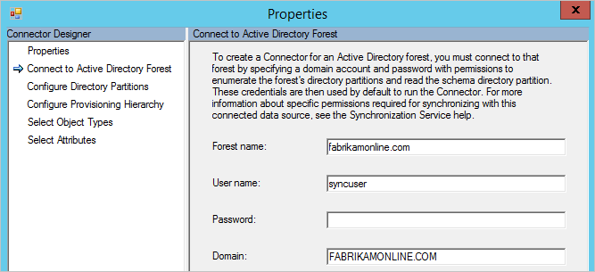
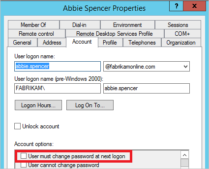
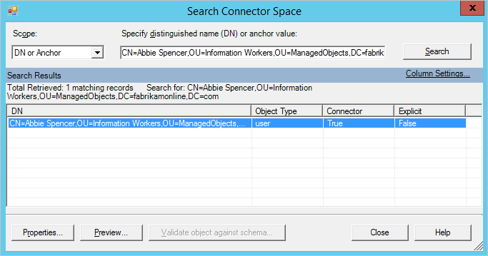
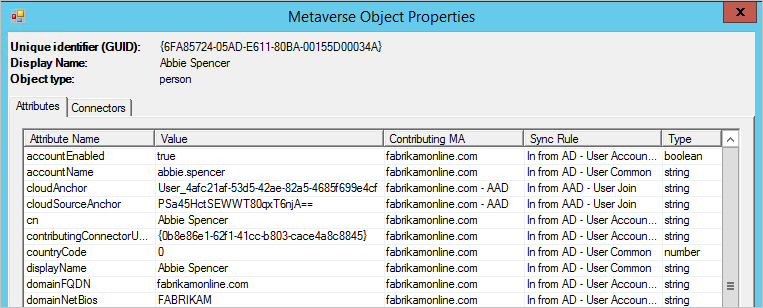
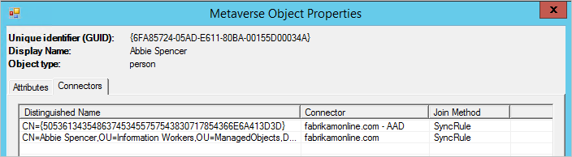
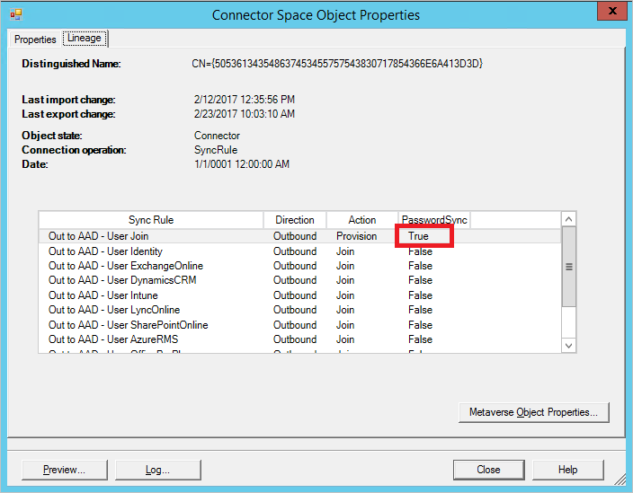

<properties
    pageTitle="排查 Azure AD Connect 同步的密码同步问题 | Azure"
    description="介绍如何排查密码同步问题"
    services="active-directory"
    documentationcenter=""
    author="AndKjell"
    manager="femila"
    editor="" />
<tags
    ms.assetid=""
    ms.service="active-directory"
    ms.workload="identity"
    ms.tgt_pltfrm="na"
    ms.devlang="na"
    ms.topic="article"
    ms.date="02/28/2017"
    wacn.date="04/05/2017"
    ms.author="billmath" />  

# 排查 Azure AD Connect 同步的密码同步问题
本主题提供了排查密码同步问题的步骤。如果密码未按预期同步，请区分该密码是一部分用户的密码还是所有用户的密码。

- 如果遇到密码都未同步的问题，请参阅[排查未同步任何密码的问题](#no-passwords-are-synchronized)。
- 如果单个对象出现问题，请参阅[排查一个对象的密码同步问题](#one-object-is-not-synchronizing-passwords)。

## 没有同步任何密码
请执行下列步骤，确定没有同步任何密码的原因：

1. Connect 服务器是否处于[暂存模式](/documentation/articles/active-directory-aadconnectsync-operations/#staging-mode/)？ 处于暂存模式的服务器不同步任何密码。
2. 运行[获取密码同步设置的状态](#get-the-status-of-password-sync-settings)部分的脚本。这样可以大致了解密码同步配置。
3. 如果未在 Azure AD 中启用该功能，或者未启用同步通道状态，请运行 Connect 安装向导。选择“自定义同步选项”并取消选择密码同步。此项更改会暂时禁用该功能。然后再次运行向导并重新启用密码同步。再次运行脚本，验证配置是否正确。
4. 查看错误的事件日志。查找下述事件，这些事件指示存在问题：
    1. 源：“目录同步”ID：0、611、652、655 如果看到此类信息，则存在连接问题。事件日志消息包含存在问题的林信息。有关详细信息，请参阅[连接问题](#连接问题)
5. 如果看不到检测信号，或者其他方式都没有作用，则可运行[触发所有密码的完全同步](#trigger-a-full-sync-of-all-passwords)。只应运行该脚本一次。
6. 阅读[排查一个不同步密码的对象的问题](#one-object-is-not-synchronizing-passwords)部分。

### 连接问题

1. 是否可以通过 Azure AD 进行连接？
2. 该帐户是否有读取全部域中的密码哈希所需的权限？ 如果是使用“快速”设置安装的 Connect，则权限应该是正确的。如果是使用自定义安装，则需手动设置权限。
    1. 若要查找 Active Directory 连接器使用的帐户，请启动 **Synchronization Service Manager**。转到“连接器”，查找要进行故障排除的本地 Active Directory 林。选择“连接器”，然后单击“属性”。转到“连接到 Active Directory 林”。 记下用户名，以及帐户所在的域。
    2. 启动“Active Directory 用户和计算机”。验证在前述步骤中找到的帐户是否在林中所有域的根设置了以下权限：
        - 复制目录更改
        - 复制所有目录更改
3. 域控制器是否可供 Azure AD Connect 访问？ 如果 Connect 服务器不能连接到所有域控制器，则应配置“只使用首选域控制器”。 返回到 **Synchronization Service Manager** 和“配置目录分区”。在“选择目录分区”中选择域，选中“只使用首选域控制器”复选框，然后单击“配置”。在列表中，输入应该由 Connect 用来进行密码同步的域控制器。同一列表也用于导入和导出。针对所有域执行这些步骤。
4. 如果脚本显示没有检测信号，请运行“触发所有密码的完全同步”中的脚本。

## 一个对象不同步密码
可以通过检查对象的状态，轻松排查密码同步问题。

1. 首先打开“Active Directory 用户和计算机”。找到该用户并检查是否未选择“用户必须在下次登录时更改密码”。如果已选择，请要求该用户登录并更改密码。临时密码不会同步到 Azure AD。
2. 如果 Active Directory 中的设置正确，下一步是在同步引擎中跟踪该用户。从本地 Active Directory 到 Azure AD 的路径中跟踪该用户，可以查看该对象是否出现描述性错误。
    1. 启动**[同步服务管理器](/documentation/articles/active-directory-aadconnectsync-service-manager-ui/)**。
    2. 单击“连接器”。
    3. 选择用户所在的 **Active Directory 连接器**。
    4. 选择“搜索连接器空间”。
    5. 在“范围”中，选择“DN 或定位点”。输入要进行故障排除的用户的完整 DN。
    6. 找到要查找的用户，然后单击“属性”查看所有属性。如果用户不在搜索结果中，则验证[筛选规则](/documentation/articles/active-directory-aadconnectsync-configure-filtering/)，确保运行[应用并验证更改](/documentation/articles/active-directory-aadconnectsync-configure-filtering/#apply-and-verify-changes/)，然后用户就会显示在 Connect 中。
    7. 若要查看对象在过去一周的密码同步详细信息，请单击“日志...”。 如果对象日志为空，则 Azure AD Connect 不能从 Active Directory 读取密码哈希。继续排查[连接错误](#connectivity-errors)。如果看到的值不是 **success**，则请参阅[密码同步日志](#password-sync-log)中的表。
    8. 选择“沿袭”选项卡，确保至少有一个同步规则的“密码同步”显示为 **True**。在默认配置中，同步规则的名称为 **In from AD - User AccountEnabled**。
    9. 单击“Metaverse 对象属性”。此时可以看到用户中的属性列表。 请验证 **cloudFiltered** 属性是否不存在，并确保域属性（domainFQDN 和 domainNetBios）的值正常。
    10. 单击“连接器”选项卡。确保显示可连接到本地 AD 和 Azure AD 的连接器。
    11. 选择代表 Azure AD 的行，然后单击“属性”。单击“沿袭”选项卡。连接器空间对象应存在一个“密码同步”设置为 **True** 的出站规则。在默认配置中，同步规则的名称为 **Out to AAD - User Join**。

### 密码同步日志
状态列可能包含以下值：

| 状态 | 说明 |
| --- | --- |
| Success |已成功同步密码。 |
| FilteredByTarget |密码设置为“用户在下次登录时必须更改密码”。未同步密码。 |
| NoTargetConnection |Metaverse 或 Azure AD 连接器空间中没有任何对象。 |
| SourceConnectorNotPresent |在本地 Active Directory 连接器空间中找不到任何对象。 |
| TargetNotExportedToDirectory |尚未导出 Azure AD 连接器空间中的对象。 |
| MigratedCheckDetailsForMoreInfo |日志条目创建于版本 1.0.9125.0 之前，并且以其旧状态显示。 |

## 用于故障排除的脚本

### 获取密码同步设置的状态

	Import-Module ADSync
	$connectors = Get-ADSyncConnector
	$aadConnectors = $connectors | Where-Object {$_.SubType -eq "Azure Active Directory (Microsoft)"}
	$adConnectors = $connectors | Where-Object {$_.ConnectorTypeName -eq "AD"}
	if ($aadConnectors -ne $null -and $adConnectors -ne $null)
	{
	    if ($aadConnectors.Count -eq 1)
	    {
	        $features = Get-ADSyncAADCompanyFeature -ConnectorName $aadConnectors[0].Name
	        Write-Host
	        Write-Host "Password sync feature enabled in your Azure AD directory: "  $features.PasswordHashSync
	        foreach ($adConnector in $adConnectors)
	        {
	            Write-Host
	            Write-Host "Password sync channel status BEGIN ------------------------------------------------------- "
	            Write-Host
	            Get-ADSyncAADPasswordSyncConfiguration -SourceConnector $adConnector.Name
	            Write-Host
	            $pingEvents =
	                Get-EventLog -LogName "Application" -Source "Directory Synchronization" -InstanceId 654  -After (Get-Date).AddHours(-3) |
	                    Where-Object { $_.Message.ToUpperInvariant().Contains($adConnector.Identifier.ToString("D").ToUpperInvariant()) } |
	                    Sort-Object { $_.Time } -Descending
	            if ($pingEvents -ne $null)
	            {
	                Write-Host "Latest heart beat event (within last 3 hours). Time " $pingEvents[0].TimeWritten
	            }
	            else
	            {
	                Write-Warning "No ping event found within last 3 hours."
	            }
	            Write-Host
	            Write-Host "Password sync channel status END ------------------------------------------------------- "
	            Write-Host
	        }
	    }
	    else
	    {
	        Write-Warning "More than one Azure AD Connectors found. Please update the script to use the appropriate Connector."
	    }
	}
	Write-Host
	if ($aadConnectors -eq $null)
	{
	    Write-Warning "No Azure AD Connector was found."
	}
	if ($adConnectors -eq $null)
	{
	    Write-Warning "No AD DS Connector was found."
	}
	Write-Host
 

#### 触发所有密码的完全同步
> [AZURE.NOTE]
只应运行该脚本一次。如需运行该脚本多次，则属其他问题。请与 Microsoft 支持部门联系，让其帮助你排查问题。

可以使用以下脚本对所有密码触发完全同步：

 
	$adConnector = "<CASE SENSITIVE AD CONNECTOR NAME>"
	$aadConnector = "<CASE SENSITIVE AAD CONNECTOR NAME>"
	Import-Module adsync
	$c = Get-ADSyncConnector -Name $adConnector
	$p = New-Object Microsoft.IdentityManagement.PowerShell.ObjectModel.ConfigurationParameter "Microsoft.Synchronize.ForceFullPasswordSync", String, ConnectorGlobal, $null, $null, $null
	$p.Value = 1
	$c.GlobalParameters.Remove($p.Name)
	$c.GlobalParameters.Add($p)
	$c = Add-ADSyncConnector -Connector $c
	Set-ADSyncAADPasswordSyncConfiguration -SourceConnector $adConnector -TargetConnector $aadConnector -Enable $false
	Set-ADSyncAADPasswordSyncConfiguration -SourceConnector $adConnector -TargetConnector $aadConnector -Enable $true
	 

## 后续步骤
- [使用 Azure AD Connect 同步实现密码同步](/documentation/articles/active-directory-aadconnectsync-implement-password-synchronization/)
- [Azure AD Connect Sync：自定义同步选项](/documentation/articles/active-directory-aadconnectsync-whatis/)
- [将本地标识与 Azure Active Directory 集成](/documentation/articles/active-directory-aadconnect/)

<!---HONumber=Mooncake_0327_2017-->
