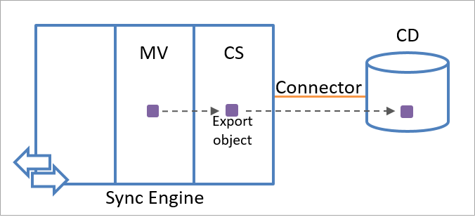

<properties
   pageTitle="Azure AD Connect 同步：了解体系结构 | Azure"
   description="本主题介绍 Azure AD Connect 同步的体系结构，并解释使用的术语。"
   services="active-directory"
   documentationCenter=""
   authors="andkjell"
   manager="stevenpo"
   editor=""/>

<tags
   ms.service="active-directory"
   ms.workload="identity"
   ms.tgt_pltfrm="na"
   ms.devlang="na"
   ms.topic="article"
   ms.date="08/31/2016"
   ms.author="andkjell"
   wacn.date="10/11/2016"/>
   wacn.date="10/11/2016"/>

# Azure AD Connect 同步：了解体系结构
本主题介绍 Azure AD Connect 同步的基本体系结构。在许多方面，它类似于其前身产品 MIIS 2003、ILM 2007 和 FIM 2010。Azure AD Connect 同步是这些技术的演进。如果熟悉上述任何早期技术，则也会熟悉本主题的内容。本主题很适合同步功能的新手。但是，不一定要了解本主题的详细信息才能成功自定义 Azure AD Connect 同步（在本主题中称为"同步引擎"）。

## 体系结构
同步引擎为多个连接的数据源中存储的对象创建集成视图，并管理这些数据源中的标识信息。此集成视图的具体内容取决于从连接的数据源检索的标识信息，以及一组用于确定如何处理此信息的规则。

### 连接的数据源和连接器
同步引擎处理来自不同数据存储库（例如 Active Directory 或 SQL Server 数据库）的标识信息。将数据组织成类似数据库格式并提供标准数据访问方法的每个数据存储库都是同步引擎的潜在数据源候选项。由同步引擎同步的数据存储库称为**连接的数据源**或**连接的目录** (CD)。

同步引擎在名为**连接器**的模块中对连接的数据源的交互进行封装。每种类型的连接数据源都有特定的连接器。连接器将所需的操作转换成连接的数据源识别的格式。

连接器执行 API 调用，以便与连接的数据源交换标识信息（读取和写入）。此外，可以使用可扩展的连接框架来添加自定义连接器。下图演示了连接器如何将连接的数据源连接到同步引擎。

数据可以朝任一方向流动，但无法同时朝两个方向流动。换而言之，可将连接器配置为允许数据从连接的数据源流到同步引擎，或从同步引擎流到连接的数据源，但是，每次对一个对象和属性只能执行其中一项操作。不同的对象和属性的方向可以不同。

若要配置连接器，可以指定要同步的对象类型。指定对象类型可以定义要包含在同步过程中的对象的范围。下一步是选择要同步的属性，即所谓的属性包含列表。可以随时更改这些设置，以响应业务规则的更改。当你使用 Azure AD Connect 安装向导时，向导将为你配置这些设置。

若要将对象导出到连接的数据源，属性包含列表必须至少包含在连接的数据源中创建特定对象类型所需的最少属性。例如，必须将 **sAMAccountName** 属性包含在属性包含列表中才能将用户对象导出到 Active Directory，因为 Active Directory 中的所有用户对象都必须定义 **sAMAccountName** 属性。同样，安装向导会自动完成此配置。

如果连接的数据源使用结构化组件（例如分区或容器）来组织对象，你可以限制连接的数据源中用于给定解决方案的区域。

### 同步引擎命名空间的内部结构
整个同步引擎命名空间由用于存储标识信息的两个命名空间组成。这两个命名空间为：

- 连接器空间 (CS)
- Metaverse (MV)

**连接器空间**是一个暂存区域，其中包含连接的数据源中指定对象的表示形式，以及在属性包含列表中指定的属性。同步引擎使用连接器空间来确定连接的数据源有何更改，以及暂存传入的更改。同步引擎还使用连接器空间来暂存传出的更改，以便导出到连接的数据源。同步引擎维护一个不同的连接器空间作为每个连接器的暂存区域。

使用暂存区域，同步引擎可与连接的数据源保持独立，而不受其可用性和可访问性的影响。因此，你随时可以使用暂存区域中的数据处理标识信息。同步引擎只能请求最后一个通信会话终止后在连接的数据源内所做的更改，或只推送连接的数据源尚未收到的标识信息更改，以减少同步引擎与连接的数据源之间的网络流量。

此外，同步引擎将存储它在连接器空间中暂存的所有对象的相关状态信息。同步引擎在收到新的数据时，始终会评估此数据是否已同步。

**Metaverse** 是一个存储区域，其中包含来自多个连接的数据源的聚合标识信息，并提供所有组合对象的单个全局集成视图。根据从连接的数据源检索的标识信息以及一组用于自定义同步过程的规则来创建 Metaverse 对象。

下图显示了同步引擎内的连接器空间命名空间和 Metaverse 命名空间。

## 同步引擎标识对象
同步引擎中的对象是连接的数据源中任一个对象的表示形式，或同步引擎为这些对象提供的集成视图。每个同步引擎对象必须有一个全局唯一标识符 (GUID)。GUID 提供数据完整性以及对象之间的明确关系。

### 连接器空间对象
当同步引擎与连接的数据源通信时，将读取连接的数据源中的标识信息，并使用该信息在连接器空间中创建标识对象的表示形式。你无法单独创建或删除这些对象。但是，你可以手动删除连接器空间中的所有对象。

连接器空间中的所有对象有两个属性：

- 全局唯一标识符 (GUID)
- 可分辨名称（也称为 DN）

如果连接的数据源将唯一属性分配给对象，则连接器空间中的对象也可以有定位点属性。定位点属性可唯一标识连接的数据源中的对象。同步引擎使用定位点在连接的数据源中查找此对象的对应表示形式。同步引擎假设对象的定位点永远不在对象的生存期内更改。

许多连接器在导入每个对象时使用已知的唯一标识符自动为其生成定位点。例如，Active Directory 连接器使用定位点的 **objectGUID** 属性。如果连接的数据源未提供明确定义的唯一标识符，可以指定在连接器配置期间生成定位点。

在这种情况下，将从对象类型的一个或多个唯一属性（均未更改）构建定位点，而该定位点可唯一标识连接器空间中的对象（例如，员工编号或用户 ID）。

连接器空间对象可以是以下其中一项：

- 暂存对象
- 占位符

### 暂存对象
暂存对象表示连接的数据源中指定的对象类型实例。除了 GUID 和可分辨名称以外，暂存对象始终有一个用于指示对象类型的值。

已导入的暂存对象始终为定位点属性提供值。由同步引擎最近预配的和正在连接的数据源中创建的暂存对象不会为定位点属性提供值。

暂存对象还带有业务属性的当前值，以及同步引擎执行同步过程所需的操作信息。操作信息包括用于指示暂存对象中暂存的更新类型的标志。如果某个暂存对象从连接的数据源收到尚未处理的新标识信息，则该对象将标记为**等待导入**。如果某个暂存对象有新的标识信息尚未导出到连接的数据源，则该对象将标记为**等待导出**。

暂存对象可以是导入对象或导出对象。同步引擎使用从连接的数据源接收的对象信息创建导入对象。当同步引擎收到了与连接器中选择的对象类型之一匹配的新对象的存在状态信息时，将在连接器空间中创建导入对象作为该对象在连接的数据源中的表示形式。

下图显示了一个导入对象，它表示连接的数据源中的对象。

同步引擎使用 Metaverse 中的对象信息创建导出对象。在下一次通信会话期间，导出对象将导出到连接的数据源。从同步引擎的立场来看，导出对象尚不在连接的数据源中存在。因此，无法使用导出对象的定位点属性。从同步引擎接收对象之后，连接的数据源将为对象的定位点属性创建唯一值。

下图显示了如何使用 Metaverse 中的标识信息创建导出对象。

同步引擎从连接的数据源重新导入对象，确认对象的导出。同步引擎在下一次导入期间从该连接的数据源接收对象后，导出对象将变为导入对象。

### 占位符
同步引擎使用平面命名空间来存储对象。但是，有些连接的数据源（例如 Active Directory）使用分层命名空间。为了将分层命名空间中的信息转换为平面命名空间，同步引擎会使用占位符来保留层次结构。

每个占位符代表尚未导入同步引擎、但需要构造分层名称的对象的分层名称的组成部分（例如，组织单位）。占位符填补在连接的数据源中引用不是连接器空间中暂存对象的对象所产生的间距。

同步引擎还使用占位符来存储尚未导入的引用对象。例如，如果已将同步配置为包含 *Abbie Spencer* 对象的管理器属性，并且接收的值是尚未导入的对象（例如 *CN=Lee Sperry,CN=Users,DC=fabrikam,DC=com* ），则管理器信息将存储为连接器空间中的占位符。如果稍后导入管理器对象，则表示此管理器的暂存对象将覆盖占位符对象。

### Metaverse 对象
Metaverse 对象包含同步引擎具有的连接器空间中暂存对象的聚合视图。同步引擎使用导入对象中的信息创建 Metaverse 对象。可将多个连接器空间对象链接到单个 Metaverse 对象，但无法将连接器空间对象链接到多个 Metaverse 对象。

无法手动创建或删除 Metaverse 对象。同步引擎将自动删除连接器空间中没有任何连接器空间对象链接的 Metaverse 对象。

为了将连接的数据源中的对象映射到 Metaverse 中对应的对象类型，同步引擎提供了可扩展的架构，其中包含一组预定义的对象类型和关联的属性。你可以为 Metaverse 对象创建新的对象类型和属性。属性可以是单值或多值属性，属性类型可以是字符串、引用、数字和布尔值。

### 暂存对象与 Metaverse 对象之间的关系
在同步引擎命名空间中，数据流由暂存对象与 Metaverse 对象之间的链接关系来启用。链接到 Metaverse 对象的暂存对象称为**联接的对象**（或**连接器对象**）。未链接到 Metaverse 对象的暂存对象称为**脱离的对象**（或**断开连接器对象**）。之所以偏向于使用术语"联接"和"脱离"，是为了不与负责从连接的目录导入和导出数据的连接器相混淆。

占位符永远不会链接到 Metaverse 对象

联接的对象由暂存对象及其与单个 Metaverse 对象的链接关系构成。联接的对象用于同步连接器空间对象与 Metaverse 对象之间的属性值。

当暂存对象在同步期间变为联接的对象时，属性可以在暂存对象与 Metaverse 对象之间流动。属性流动是双向的，并可以使用导入属性规则和导出属性规则进行配置。

一个连接器空间对象只能链接到一个 Metaverse 对象。但是，每个 Metaverse 对象可以链接到相同或不同连接器空间中的多个连接器空间对象，如下图所示。

暂存对象与 Metaverse 对象之间的链接关系持续存在，只能按照指定的规则删除。

脱离的对象是未链接到任何 Metaverse 对象的暂存对象。在 Metaverse 中，脱离对象的属性值不做进一步的处理。同步引擎不会更新连接的数据源中相应对象的属性值。

使用脱离的对象可以先将标识信息存储在同步引擎中，以后再做处理。将暂存对象保持为连接器空间中的脱离对象有许多好处。由于系统已暂存此对象的所需信息，因此不需要在下一次从连接的数据源导入期间创建此对象的表示形式。这样，即使当前没有与连接的数据源建立连接，同步引擎也始终有连接的数据源的完整快照。根据指定的规则，可将脱离的对象转换为联接的对象，反之亦然。

导入对象将创建为脱离的对象。导出对象必须是联接的对象。系统逻辑强制实施此规则，并删除每个不是联接对象的导出对象。

## 同步引擎标识管理过程
标识管理过程控制在不同的连接数据源之间更新标识信息的方式。标识管理分为三个过程：

- 导入
- 同步
- 导出

在导入过程中，同步引擎评估从连接的数据源传入的标识信息。检测到更改时，它将在连接器空间中创建新的暂存对象或更新现有暂存对象以进行同步。

在同步过程中，同步引擎更新 Metaverse 以反映连接器空间中发生的更改，并更新连接器空间以反映 Metaverse 中发生的更改。

在导出过程中，同步引擎推送暂存对象中暂存的更改以及标记为等待导出的更改。

下图显示了当标识信息在两个连接的数据源之间流动时，发生每个过程的位置。

### 导入过程
在导入过程中，同步引擎评估标识信息的更新。同步引擎比较从连接的数据源收到的标识信息与暂存对象的标识信息，以确定暂存对象是否需要更新。如果需要使用新数据更新暂存对象，则暂存对象将标记为等待导入。

同步引擎在同步之前准备连接器空间中的对象，只能处理已更改的标识信息。此过程具有以下优点：

- **高效的同步**。将同步期间处理的数据量减到最少。
- **高效的重新同步**。你可以更改同步引擎处理标识信息的方式，而不需要将同步引擎重新连接到数据源。
- **有机会预览同步**。可以预览同步，以验证对于标识管理过程所做的假设是否正确。

对于连接器中指定的每个对象，同步引擎先尝试在连接器的连接器空间中查找该对象的表示形式。同步引擎检查连接器空间中所有的暂存对象，尝试查找具有匹配定位点属性的对应暂存对象。如果现有暂存对象没有匹配的定位点属性，则同步引擎尝试查找具有相同可分辨名称的对应暂存对象。

当同步引擎找到可分辨名称匹配但定位点不匹配的暂存对象时，将发生以下特殊行为：

- 如果连接器空间中找到的对象没有定位点，则同步引擎将从连接器空间中删除此对象，并将其链接到的 Metaverse 对象标记为**在下一次运行同步时重试预配**。然后创建新的导入对象。
- 如果连接器空间中找到的对象具有定位点，则同步引擎将假设此对象已在连接的目录中重命名或已删除。它将为连接器空间对象分配新的临时可分辨名称，以便暂存传入的对象。旧对象将变成**暂时性**对象，等待连接器导入重命名或删除内容以解决这种情况。

如果同步引擎找到的暂存对象对应于连接器中指定的对象，它将确定要应用哪一种更改。例如，同步引擎可能会在连接的数据源中重命名或删除该对象，或者只更新该对象的属性值。

具有更新数据的暂存对象将标记为等待导入。可以使用不同类型的等待导入。根据导入过程的结果，连接器空间中的暂存对象具有以下等待导入类型之一：

- **无**。暂存对象的所有属性都没有更改。同步引擎不将此类型标记为等待导入。
- **添加**。暂存对象是连接器空间中新的导入对象。同步引擎将此类型标记为等待导入，以便在 Metaverse 中进行其他处理。
- **更新**。同步引擎在连接器空间中查找相应的暂存对象并将此类型标记为等待导入，以便在 Metaverse 中处理属性更新。更新包括对象重命名。
- **删除**。同步引擎在连接器空间中查找相应的暂存对象并将此类型标记为等待导入，以便删除联接的对象。
- **删除/添加**。同步引擎在连接器空间中找到了对应的暂存对象，但对象类型不匹配。在此情况下，将暂存删除-添加修改。删除-添加修改向同步引擎表示必须对此对象进行完全重新同步，因为对象类型更改时，会将不同的规则集应用到此对象。

设置暂存对象的等待导入状态可以大幅减少同步期间处理的数据量，因为这样可让系统只处理已更新了数据的对象。

### 同步过程
同步由两个相关的过程组成：

- 入站同步：在使用连接器空间中的数据更新 Metaverse 的内容时发生。
- 出站同步：在使用 Metaverse 中的数据更新连接器空间的内容时发生。

入站同步过程使用连接器空间中暂存的信息在 Metaverse 中为存储在连接的数据源中的数据创建集成视图。将根据规则的配置方式，聚合所有暂存对象或只是具有等待导入信息的对象。

出站同步过程在 Metaverse 对象更改时更新导出对象。

入站同步在 Metaverse 中为从连接的数据源接收的标识信息创建集成视图。同步引擎随时可以使用连接的数据源中最新的标识信息处理标识信息。

**入站同步**

入站同步包括以下过程：

- **预配**（也称为**投影**，如果一定要将此过程与出站同步预配进行区分的话）。同步引擎根据暂存对象创建新的 Metaverse 对象并链接它们。预配是对象级的操作。
- **联接**。同步引擎将暂存对象链接到现有的 Metaverse 对象。联接是对象级的操作。
- **导入属性流**。同步引擎更新 Metaverse 中对象的属性值（称为属性流）。导入属性流是需要暂存对象与 Metaverse 对象之间的链接的属性级操作。

预配是唯一可在 Metaverse 中创建对象的过程。预配只影响属于脱离对象的导入对象。在预配期间，同步引擎将创建 Metaverse 对象（其对应于导入对象的对象类型），并创建这两个对象间的链接，从而创建联接的对象。

联接过程还将创建导入对象与 Metaverse 对象之间的链接。联接与预配的差异在于联接过程要求导入对象链接到现有的 Metaverse 对象，而预配过程会创建新的 Metaverse 对象。

同步引擎使用同步规则配置中指定的条件尝试将导入对象联接到 Metaverse 对象。

在预配或联接过程中，同步引擎将分离对象链接到 Metaverse 对象，使它们联接在一起。在完成这些对象级操作之后，同步引擎可以更新关联 Metaverse 对象的属性值。此过程称为导入属性流。

导入属性流发生于携带新数据并链接到 Metaverse 对象的所有导入对象上。

**出站同步**

出站同步在 Metaverse 对象已更改但未删除时更新导出对象。出站同步的目标是评估更改 Metaverse 对象是否需要更新连接器空间中的暂存对象。在某些情况下，更改可能要求更新所有连接器空间中的暂存对象。更改的暂存对象标记为等待导出，并使其成为导出对象。然后，这些对象将在导出过程中推送到连接的数据源。

出站同步有三个过程：

- **设置**
- **取消预配**
- **导出属性流**。

预配和取消预配都是对象级的操作。取消预配依赖于预配，因为只有预配可以启始它。当预配删除了 Metaverse 对象与导出对象之间的链接时，将触发取消预配。

将更改应用到 Metaverse 中的对象时，始终会触发预配。对 Metaverse 对象进行更改时，同步引擎可以在预配过程中执行以下任一任务：

- 创建联接的对象，其中 Metaverse 对象已链接到新建的导出对象。
- 重命名联接的对象。
- 断开 Metaverse 对象与暂存对象之间的链接，从而创建脱离的对象。

如果预配要求同步引擎创建新的连接器对象，则 Metaverse 对象链接到的暂存对象始终为导出对象，因为该对象尚不在连接的数据源中存在。

如果预配要求同步引擎分离已联接的对象以便创建脱离的对象，则会触发取消预配。取消预配过程将删除该对象。

在取消预配期间，删除导出对象并不实际删除该对象。该对象将标记为**已删除**，表示已在该对象上暂存删除操作。

类似于导入属性流发生在入站同步过程中，导出属性流发生在出站同步过程中。导出属性流只发生在联接的 Metaverse 与导出对象之间。

### 导出过程
在导出过程中，同步引擎将检查连接器空间中所有标记为等待导出的导出对象，然后将更新发送到连接的数据源。

同步引擎可以确定导出是否成功，但无法充分确定标识管理过程是否已完成。其他过程始终可以更改连接的数据源中的对象。由于同步引擎对于连接的数据源没有持续连接，因此无法只根据成功导出通知对连接的数据源中的对象属性进行假设。

例如，连接的数据源中的过程可以将对象的属性变回其原始值（也就是说，连接的数据源可以在同步引擎推送数据并成功应用于连接的数据源之后立即覆盖这些值）。

同步引擎存储有关每个暂存对象的导出和导入状态的信息。自从上次导出以后，如果在属性包含列表中指定的属性值已更改，则存储导入和导出状态可以相应地让同步引擎做出反应。同步引擎使用导入过程来确认已导出到连接的数据源的属性值。将在导入和导出的信息之间进行比较（如下图所示），使同步引擎能够确定导出是否成功或者是否需要重复导出。

例如，如果同步引擎将值为 5 的属性 C 导出到连接的数据源，则在导出状态内存中存储 C=5。此对象的每次额外导出都会导致尝试再度将 C=5 导出到连接的数据源，因为同步引擎假设此值尚未持续应用到对象（也就是说，除非最近从连接的数据源导入了不同的值）。在对象导入操作期间收到 C=5 时，将清除导出内存。

## 后续步骤
了解有关 [Azure AD Connect 同步](/documentation/articles/active-directory-aadconnectsync-whatis/)配置的详细信息。

了解有关[将本地标识与 Azure Active Directory 集成](/documentation/articles/active-directory-aadconnect/)的详细信息。

<!---HONumber=Mooncake_0926_2016-->
