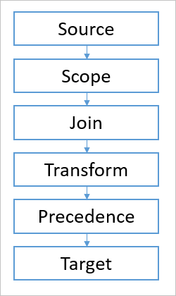
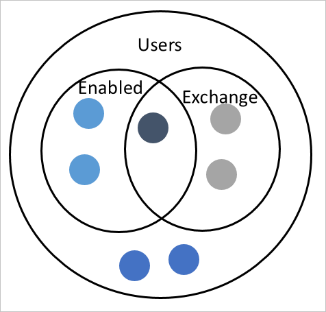
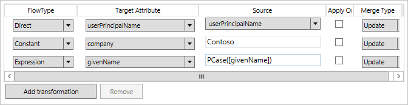
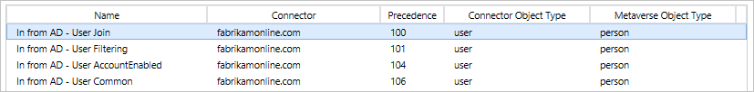
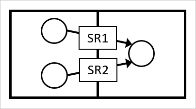

<properties
    pageTitle="Azure AD Connect：了解声明性预配 | Azure"
    description="介绍 Azure AD Connect 中的声明性预配配置模型。"
    services="active-directory"
    documentationcenter=""
    author="andkjell"
    manager="femila"
    editor="" />
<tags
    ms.assetid="cfbb870d-be7d-47b3-ba01-9e78121f0067"
    ms.service="active-directory"
    ms.workload="identity"
    ms.tgt_pltfrm="na"
    ms.devlang="na"
    ms.topic="article"
    ms.date="02/08/2017"
    wacn.date="03/13/2017"
    ms.author="billmath" />  

# Azure AD Connect 同步：了解声明性预配
本主题介绍 Azure AD Connect 中的配置模型。该模型称为声明性预配，让用户能够轻松地更改配置。本主题介绍的许多内容都是高级内容，在大部分客户方案中并非必要。

## 概述
声明性预配处理源连接目录传入的对象，并确定如何将对象和属性从源转换到目标。对象在同步管道中进行处理，入站和出站规则的管道相同。入站规则是从连接器空间到 metaverse，而出站规则是从 metaverse 到连接器空间。

  

管道有多个不同的模块。每个模块负责对象同步中的一个概念。

  

- 源：源对象
- [范围](#scope)：查找范围内的所有同步规则
- [联接](#join)：确定连接器空间与 metaverse 之间的关系
- [转换](#transform)：计算属性应如何转换和流动
- [优先级](#precedence)：解决冲突的属性提供问题
- 目标：目标对象

## 范围 
范围模块会计算对象，并确定在范围内且应纳入处理的规则。根据对象的属性值，不同同步规则的计算结果都是在范围内。例如，没有 Exchange 邮箱的已禁用用户拥有与具有邮箱的已启用用户不同的规则。

范围可定义为组和子句。子句位于组内。逻辑 AND 用于组中的所有子句之间。例如，(department =IT AND country = Denmark)。逻辑 OR 用于组之间。

此图中的范围应理解为 (department = IT AND country = Denmark) OR (country=Sweden)。如果组 1 或组 2 的计算结果为 true，则该规则在范围内。

范围模块支持以下运算。

| 操作 | 说明 |
| --- | --- |
| EQUAL、NOTEQUAL |计算某个值是否等于属性值的字符串比较。对于多值属性，请参阅 ISIN 和 ISNOTIN。 |
| LESSTHAN、LESSTHAN\_OR\_EQUAL |计算某个值是否小于属性值的字符串比较。 |
| CONTAINS、NOTCONTAINS |计算是否可以在属性值中找到某个值的字符串比较。 |
| STARTSWITH、NOTSTARTSWITH |计算某个值是否在属性值开头的字符串比较。 |
| ENDSWITH、NOTENDSWITH |计算某个值是否在属性值末尾的字符串比较。 |
| GREATERTHAN、GREATERTHAN\_OR\_EQUAL |计算某个值是否大于属性值的字符串比较。 |
| ISNULL、ISNOTNULL |计算对象中是否不存在该属性。如果该属性不存在，则为 null，那么规则在范围内。 |
| ISIN、ISNOTIN |计算定义的属性中是否存在某个值。此运算是 EQUAL 和 NOTEQUAL 的多值变化形式。该属性应该是多值属性，且如果可以在任何属性值中找到该值，那么规则在范围内。 |
| ISBITSET、ISNOTBITSET |计算是否已设置特定的位。例如，可用于计算 userAccountControl 中的位，查看用户是处于启用状态还是禁用状态。 |
| ISMEMBEROF、ISNOTMEMBEROF |值应该包含连接器空间中组的 DN。如果对象是指定组的成员，则规则在范围内。 |

## Join 
同步管道中的联接模块负责查找源中的对象和目标中的对象之间的关系。在入站规则中，此关系是指连接器空间中的对象找到与 metaverse 中对象的关系。

目标在于查看 metaverse 中是否已经有应该与之关联的对象（由另一个连接器创建）。例如，在帐户-资源林中，帐户林中的用户应与资源林中的用户联接。

联接主要用于入站规则，以将连接器空间对象与同一 metaverse 对象联接在一起。

联接定义为一个或多个组。在组内，用户拥有子句。逻辑 AND 用于组中的所有子句之间。逻辑 OR 用于组之间。组的处理顺序为从上到下。一个组在目标中恰好找到一个对象匹配项时，不会计算任何其他联接规则。如果找到零个或多个对象，则会继续处理下一组规则。出于此原因，应首先创建最明确的规则，最后创建比较模糊的规则。此图中的联接会从上到下进行处理。同步管道首先查看是否有 employeeID 的匹配项。如果没有，第二个规则会查看是否可以使用帐户名来将对象联接在一起。如果也不是匹配项，则第三个（最后一个）规则会使用用户名查找更模糊的匹配项。

如果已对所有联接规则进行计算，但没有完全相符的匹配项，则会使用“说明”页上的“链接类型”。如果此选项设置为“预配”，则会在目标中创建新对象。

一个对象应该只有一个同步规则具有在范围内的联接规则。如果有多个同步规则定义了联接，那么会出错。优先级不用于解决联接冲突。对象必须具有在范围内的联接规则，属性才能以相同的入站/出站方向流动。如果需要让属性以入站和出站方式流动到同一对象，则联接必须具有入站和出站同步规则。

出站联接尝试将对象预配到目标连接器空间时，会有特殊行为。DN 属性用于先尝试使用反向联接。如果目标连接器空间中已存在具有同一 DN 的对象，对象会联接起来。

新的同步规则进入范围时，只会计算联接模块一次。如果对象已联接，即使不再满足联接条件，也不会取消联接。如果想要取消对象的联接，则联接对象的同步规则必须超出范围。

### Metaverse 删除
只要有一个在范围内的入站同步规则，metaverse 对象的“链接类型”就会维持设置为“预配”或“StickyJoin”。StickyJoin 用于不允许连接器将新对象预配到 metaverse 的情况，但如果已联接，则必须先在源中删除该对象，然后才能删除 metaverse 对象。

删除 metaverse 对象后，所有与标记为“预配”的出站同步规则关联的对象都将标记为要删除。

## 转换 
转换用于定义属性应该如何从源流动到目标。流可以是以下**流类型**之一：直接、常数或表达式。直接流会按原样流动属性值，而不进行其他转换。常数值会设置指定的值。表达式会使用声明性预配表达式语言来表达应该如何转换。有关表达式语言的详细信息，请参阅[了解声明性预配表达式语言](/documentation/articles/active-directory-aadconnectsync-understanding-declarative-provisioning-expressions/)主题。

  

“应用一次”复选框定义只应在最初创建对象时设置的属性。例如，此配置可用于设置新用户对象的初始密码。

### 合并属性值
在属性流中，有一个设置可用于确定是否应从多个不同的连接器合并多值属性。默认值为“Update”，表示应采用具有最高优先级的同步规则。

  

此外，还有“Merge”和“MergeCaseInsensitive”。这些选项让用户能够合并来自不同源的值。例如，它可用于合并来自多个不同林的成员或 proxyAddresses 属性。使用此选项时，对象范围内的所有同步规则都必须使用相同的合并类型。不能定义从一个连接器“Update”，从另一个连接器“Merge”。如果尝试此操作，将收到错误。

“Merge”和“MergeCaseInsensitive”之间的差异在于处理重复属性值的方式。同步引擎可确保不会将重复的值插入目标属性。使用“MergeCaseInsensitive”可防止出现只有大小写差异的重复值。例如，不应该在目标属性中同时看到“SMTP:bob@contoso.com”和“smtp:bob@contoso.com”。“Merge”只会查看仅可能存在大小写差异的确切值和多个值。

“Replace”选项与“Update”选项相同，但未使用该选项。

### 控制属性流动过程
多个入站同步规则配置为向同一 metaverse 属性提供值时，会使用优先级确定获得采用的规则。具有最高优先级（最小数值）的同步规则会提供值。出站规则的情况一样。具有最高优先级的同步规则会获得采用，并向已连接的目录提供值。

在某些情况下，同步规则应确定其他规则的行为方式，而不是提供值。在这种情况下会使用一些特殊文本。

对于入站同步规则，文本 **NULL** 可用于表示流没有要提供的值。具有较低优先级的其他规则可以提供一个值。如果没有规则提供值，则会删除 metaverse 属性。对于出站规则，如果 **NULL** 是处理完所有同步规则后的最终值，则会在已连接的目录中删除该值。

文本 **AuthoritativeNull** 与 **NULL** 类似，但差异在于具有较低优先级的规则不可以提供值。

属性流还可使用 **IgnoreThisFlow**。就表示没有要提供的内容而言，它与 NULL 类似。差异在于它不会删除目标中已经存在的值。就像属性流从未出现一样。

下面是一个示例：

在 *Out to AD - User Exchange hybrid* 中可找到下列流：
`IIF([cloudSOAExchMailbox] = True,[cloudMSExchSafeSendersHash],IgnoreThisFlow)` 
此表达式的意思是：如果用户邮箱位于 Azure AD 中，则将属性从 Azure AD 流动到 AD。如果并非如此，则不将任何内容流回 Active Directory。在此情况下，会在 AD 中保留现有值。

### ImportedValue
函数 ImportedValue 不同于其他所有函数，因为其属性名称必须放在引号内，而不是放在方括号中：`ImportedValue("proxyAddresses")`。

在同步期间，即使尚未导出或在导出过程中收到错误（“top of the tower”），属性通常也会使用预期值。入站同步会假定尚未到达已连接目录的属性最终会到达该目录。在某些情况下，仅同步由已连接目录确认的值很重要（“hologram and delta import tower”）。

在现成同步规则“In from AD - User Common from Exchange”中可找到此函数的示例。在混合 Exchange 中，只应在确认已成功导出由 Exchange Online 添加的值的情况下才能对其进行同步：`proxyAddresses` <- `RemoveDuplicates(Trim(ImportedValue("proxyAddresses")))`

## 优先级 
多个同步规则尝试向目标提供相同的属性值时，会使用优先级值来确定获得采用的规则。具有最高优先级（最小数值）的规则将会在冲突中提供属性。

  

此排序可用于针对小部分对象定义更精确的属性流。例如，现成规则可确保已启用帐户 (**User AccountEnabled**) 的属性优先于其他帐户的属性。

可定义连接器之间的优先级。这样一来，具有更好的数据的连接器可以先提供值。

### 相同连接器空间中的多个对象
如果在联接到同一 metaverse 对象的同一连接器空间中有多个对象，则必须调整优先级。如果多个对象都在同一同步规则的范围内，则同步引擎无法确定优先级。应该向 metaverse 提供值的源对象不明确。即使源中的属性具有相同的值，此配置仍会报告为不明确。

对于此方案，需要更改同步规则的范围，让源对象在范围内具有不同的同步规则。这样可以定义不同的优先级。

## 后续步骤
- 在 [Understanding Declarative Provisioning Expressions](/documentation/articles/active-directory-aadconnectsync-understanding-declarative-provisioning-expressions/)（了解声明性预配表达式）中了解有关表达式语言的详细信息。
- 以 [Understanding the default configuration](/documentation/articles/active-directory-aadconnectsync-understanding-default-configuration/)（了解默认配置）中了解如何现成地使用声明式预配。
- 在 [How to make a change to the default configuration](/documentation/articles/active-directory-aadconnectsync-change-the-configuration/)（如何对默认配置进行更改）中了解如何使用声明性预配进行实际更改。
- 如需了解用户和联系人如何协同工作，请继续阅读[了解用户和联系人](/documentation/articles/active-directory-aadconnectsync-understanding-users-and-contacts/)。

**概述主题**

- [Azure AD Connect 同步：理解和自定义同步](/documentation/articles/active-directory-aadconnectsync-whatis/)
- [将本地标识与 Azure Active Directory 集成](/documentation/articles/active-directory-aadconnect/)

**参考主题**

- [Azure AD Connect 同步：函数参考](/documentation/articles/active-directory-aadconnectsync-functions-reference/)

<!---HONumber=Mooncake_0306_2017-->
<!---Update_Description: wording update -->