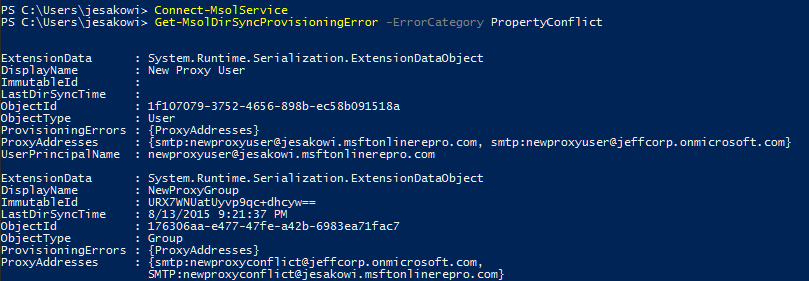
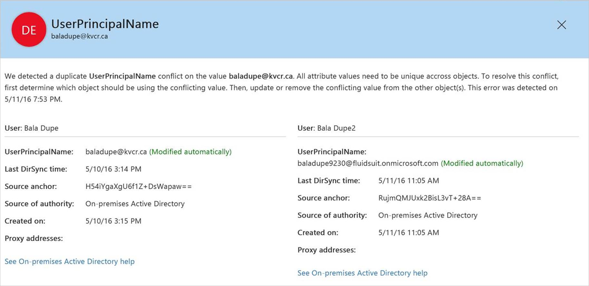

<properties
	pageTitle="标识同步和重复属性复原 | Azure"
	description="介绍如何借助一种新的行为，在目录同步期间使用 Azure AD Connect 处理具有 UPN 或 ProxyAddress 冲突的对象。"
	services="active-directory"
	documentationCenter=""
	authors="markusvi"
	manager="femila"
	editor=""/>  

<tags
	ms.service="active-directory"
	ms.workload="identity"
	ms.tgt_pltfrm="na"
	ms.devlang="na"
	ms.topic="article"
	ms.date="09/29/2016"
	wacn.date="10/31/2016"
	ms.author="markusvi"/>

# 标识同步和重复属性复原
重复属性复原是 Azure Active Directory 的一项功能，可在运行 Microsoft 的同步工具之一时，用于消除 **UserPrincipalName** 和 **ProxyAddress** 冲突所造成的不便。

在给定 Azure Active Directory 租户的所有“用户”、“组”或“联系人”对象中，这两个属性通常必须是唯一的。

> [AZURE.NOTE] 只有用户可以拥有 UPN。

此功能实现的新行为是同步管道的云部分，因此，此功能不区分客户端，而是与任何 Microsoft 同步产品（包括 Azure AD Connect、DirSync 和 MIM + 连接器）相关。本文档中使用的概括术语“同步客户端”用于表示上述任一产品。

## 当前行为
如果尝试预配的新对象具有违反此唯一性约束的 UPN 或 ProxyAddress 值，则 Azure Active Directory 会阻止创建该对象。同样地，如果以非唯一的 UPN 或 ProxyAddress 更新对象，则更新会失败。同步客户端在每个导出周期重试预配尝试或更新，在冲突解决前继续失败。每次尝试时都会生成错误报告电子邮件，并由同步客户端记录一个错误。

## 重复属性复原的行为
Azure Active Directory 并不是完全无法预配或更新具有重复属性的对象，而是“隔离”违反唯一性约束的重复属性。如果预配时需要此属性（例如 UserPrincipalName），则服务将分配占位符值。这些临时值的格式为“***<原始前缀>+<4 位数>@<初始租户域>.partner.onmschina.cn***”。如果不需要此属性（例如 **ProxyAddress**），则 Azure Active Directory 只隔离冲突属性并继续创建或更新对象。

隔离属性后，有关冲突的信息将以旧行为中使用的相同错误报告电子邮件发送。但是，此信息只出现在错误报告中一次，发生隔离时，将不继续记录在以后的电子邮件中。此外，由于此对象已成功导出，因此同步客户端不会记录错误，并且不会在后续的同步周期中重试创建/更新操作。

为了支持此行为，已将 User、Group 和 Contact 对象类添加新属性：
**DirSyncProvisioningErrors**

这是一个多值属性，用于存储正常添加时违反唯一性约束的冲突属性。Azure Active Directory 中已启用后台计时器任务，该任务每小时运行以查找已解决的重复属性冲突，并自动从隔离区中删除有问题的属性。

### 启用重复属性复原
在所有 Azure Active Directory 租户中，重复属性复原将是新的默认行为。对于所有在 2016 年 8 月 22 日或以后第一次启用同步的租户，该行为将默认启用。在此日期之前启用同步的租户将通过批处理方式启用此功能。此部署将在 2016 年 9 月开始，我们会向每个租户的技术通知联系人发送电子邮件通知，告知启用此功能的具体日期。

重复属性复原在启用后无法禁用。

若要查看是否为租户启用了此功能，可以下载最新版 Azure Active Directory PowerShell 模块，然后运行以下命令：

`Get-MsolDirSyncFeatures -Feature DuplicateUPNResiliency`  

`Get-MsolDirSyncFeatures -Feature DuplicateProxyAddressResiliency`  

若要在为租户启用此功能之前以前摄方式启用此功能，可以下载最新版 Azure Active Directory PowerShell 模块，然后运行以下命令：

`Set-MsolDirSyncFeature -Feature DuplicateUPNResiliency -Enable $true`  

`Set-MsolDirSyncFeature -Feature DuplicateProxyAddressResiliency -Enable $true`  

## 识别具有 DirSyncProvisioningErrors 的对象
目前有两种方法可识别因为重复属性冲突而发生错误的对象：Azure Active Directory PowerShell 和 Office 365 管理门户。我们已计划将来扩展到其他基于门户的报告。

### Azure Active Directory PowerShell
本主题中的 PowerShell cmdlet 具有以下特点：

- 以下所有 cmdlet 都区分大小写。
- 始终必须包含 **-ErrorCategory PropertyConflict**。目前没有其他类型的 **ErrorCategory**，但将来可能会扩展。

首先，应运行 **Connect-MsolService** 并输入租户管理员的凭据。

然后，使用以下 cmdlet 和运算符以不同的方式查看错误：

1. [查看全部](#see-all)

2. [按属性类型](#by-property-type)

3. [按冲突值](#by-conflicting-value)

4. [使用字符串搜索](#using-a-string-search)

5. [已排序](#sorted)

6. [以有限的数量或全部](#in-a-limited-quantity-or-all)

#### 查看全部
连接后，若要查看租户中属性预配错误的常规列表，请运行：

`Get-MsolDirSyncProvisioningError -ErrorCategory PropertyConflict`

随后将生成如下所示的结果：

#### 按属性类型
若要按属性类型查看错误，请添加带有 **UserPrincipalName** 或 **ProxyAddresses** 参数的 **-PropertyName** 标志：

`Get-MsolDirSyncProvisioningError -ErrorCategory PropertyConflict -PropertyName UserPrincipalName`

或

`Get-MsolDirSyncProvisioningError -ErrorCategory PropertyConflict -PropertyName ProxyAddresses`

#### 按冲突值
若要查看与特定属性相关的错误，请添加 **-PropertyValue** 标志（添加此标志时也必须使用 **-PropertyName**）：

`Get-MsolDirSyncProvisioningError -ErrorCategory PropertyConflict -PropertyValue User@domain.com -PropertyName UserPrincipalName`

#### 使用字符串搜索
若要进行广泛的字符串搜索，请使用 **-SearchString** 标志。此标志可以独立于上述所有标志使用，但 **-ErrorCategory PropertyConflict** 除外（此标志始终是必需的）：

`Get-MsolDirSyncProvisioningError -ErrorCategory PropertyConflict -SearchString User`  

#### 以有限的数量或全部
1. **MaxResults <Int>** 可用于将查询限制为特定数目的值。

2. **All** 可用于确保在有大量错误的情况下检索所有结果。

`Get-MsolDirSyncProvisioningError -ErrorCategory PropertyConflict -MaxResults 5`

## Office 365 管理门户

可以在 Office 365 管理中心查看目录同步错误。Office 365 门户中的报告只显示存在这些错误的 **User** 对象。它不显示 **Groups** 和 **Contacts**之间的冲突信息。

  

有关如何在 Office 365 管理中心查看目录同步错误的说明，请参阅 [Identify directory synchronization errors in Office 365](https://support.office.com/zh-cn/article/Identify-directory-synchronization-errors-in-Office-365-b4fc07a5-97ea-4ca6-9692-108acab74067)（识别 Office 365 中的目录同步错误）。

### 标识同步错误报告
使用此新行为处理具有重复属性冲突的对象时，通知将包含在标准标识同步错误报告电子邮件中，而该电子邮件将发送给租户的技术通知联系人。但是，此行为有一项重大变化。在过去，有关重复属性冲突的信息包含在每个后续错误报告中，直到解决冲突为止。使用此新行为，给定冲突的错误通知只出现一次 - 在冲突属性被隔离时。

ProxyAddress 冲突的电子邮件通知示例如下所示：
    

## 解决冲突
针对这些错误的故障排除策略和解决技巧不应与过去处理重复属性错误的方式不同。唯一的差别在于，计时器任务将扫描服务端的租户，以便在冲突解决后，自动将有问题的属性添加到适当的对象。

以下文章概述了各种故障排除和解决策略：[Duplicate or invalid attributes prevent directory synchronization in Office 365](https://support.microsoft.com/zh-cn/kb/2647098)（重复或无效的属性阻止 Office 365 中的目录同步）。

## 已知问题
没有任何已知问题导致数据丢失或服务降级。其中有些问题是外观问题，有些问题将导致引发标准的“*复原前*”重复属性错误，而不是隔离冲突属性，还有一些问题导致特定错误需要额外的手动修复。

**核心行为：**

1. 具有特定属性配置的对象将不断收到导出错误，而不是重复属性被隔离。例如：

    a.新用户在 AD 中创建，其 UPN 为 **Joe@contoso.com**，ProxyAddress 为 **smtp:Joe@contoso.com**。

    b.此对象的属性与现有组发生冲突，其中 ProxyAddress 为 **SMTP:Joe@contoso.com**。

    c.导出时，将引发 **ProxyAddress 冲突**错误，而非隔离冲突属性。此操作在每个后续的同步周期中重试，就如同在启用复原之前一样。

2. 如果在本地创建两个具有相同 SMTP 地址的组，则其中一个组在首次尝试预配时会失败并返回标准的重复 **ProxyAddress** 错误。但是，重复值将在下一个同步周期被适当隔离。

**Office 门户报告**：

1. UPN 冲突集中两个对象的详细错误消息是相同的。这意味着，它们的 UPN 都已更改/隔离，此时，实际上只有其中一个对象的数据发生更改。

2. UPN 冲突的详细错误消息对已更改/隔离其 UPN 的用户显示不正确的 displayName。例如：

    a.**用户 A** 首先使用 **UPN = User@contoso.com** 同步。

    b.然后，尝试使用 **UPN = User@contoso.com** 同步 **User B**。

    c.**用户 B** 的 UPN 已更改为 **User1234@contoso.partner.onmschina.cn**，**User@contoso.com** 已添加到 **DirSyncProvisioningErrors**。

    d.**用户 B** 的错误消息应指出 **User A** 已有用作 UPN 的 **User@contoso.com**，但却显示 **User B** 自己的 displayName。

**标识同步错误报告**：

*解决此问题的步骤*链接不正确：
    

该链接应指向 [https://aka.ms/duplicateattributeresiliency](https://aka.ms/duplicateattributeresiliency)。

## 另请参阅

- [Azure AD Connect 同步](/documentation/articles/active-directory-aadconnectsync-whatis/)

- [将本地标识与 Azure Active Directory 集成](/documentation/articles/active-directory-aadconnect/)

- [Identify directory synchronization errors in Office 365（识别 Office 365 中的目录同步错误）](https://support.office.com/zh-cn/article/Identify-directory-synchronization-errors-in-Office-365-b4fc07a5-97ea-4ca6-9692-108acab74067)

<!---HONumber=Mooncake_1024_2016-->
