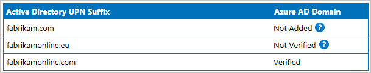

<properties
    pageTitle="Azure AD Connect 同步服务影子属性 | Azure"
    description="介绍影子属性在 Azure AD Connect 同步服务中的工作方式。"
    services="active-directory"
    documentationcenter=""
    author="andkjell"
    manager="femila"
    editor=""
    translationtype="Human Translation" />
<tags
    ms.assetid=""
    ms.service="active-directory"
    ms.workload="identity"
    ms.tgt_pltfrm="na"
    ms.devlang="na"
    ms.topic="article"
    ms.date="03/17/2017"
    wacn.date="05/02/2017"
    ms.author="billmath"
    ms.sourcegitcommit="78da854d58905bc82228bcbff1de0fcfbc12d5ac"
    ms.openlocfilehash="cae433df8e26aece5790ef9449aecb26411ea347"
    ms.lasthandoff="04/22/2017" />

# Azure AD Connect 同步服务影子属性
大多数属性在 Azure AD 中的表示方式与其在本地 Active Directory 中的表示方式相同。 但是，一些属性有一些特殊的处理方式，而且 Azure AD 中的属性值可能不同于 Azure AD Connect 所同步的属性值。

## 影子属性简介
在 Azure AD 中，某些属性有两种表示形式。 本地值和计算所得的值都会进行存储。 这些额外的属性称为影子属性。 表示此行为的两个最常用属性是 **userPrincipalName** 和 **proxyAddress**。 当这些属性中有表示非已验证域的值时，属性值将发生更改。 但是，Connect 中的同步引擎会读取影子属性中的值，因此从该引擎的角度来看，属性是经过 Azure AD 确认的。

无法使用 Azure 门户或 PowerShell 查看影子属性。 但是，了解这些概念有助于排查某些情况下本地属性值不同于云中属性值的问题。

为了更好地了解该行为，请看下述来自 Fabrikam 的示例：  
  
其本地 Active Directory 中存在多个 UPN 后缀，但只验证了一个。

### userPrincipalName
用户在非验证域中具有下列属性值：

| 属性 | 值 |
| --- | --- |
| 本地 userPrincipalName | lee.sperry@fabrikam.com |
| Azure AD shadowUserPrincipalName | lee.sperry@fabrikam.com |
| Azure AD userPrincipalName | lee.sperry@fabrikam.partner.onmschina.cn |

userPrincipalName 属性是在使用 PowerShell 时看到的值。

由于真实的本地属性值存储在 Azure AD 中，因此在验证 fabrikam.com 域时，Azure AD 会使用 shadowUserPrincipalName 的值更新 userPrincipalName 属性。 不需同步 Azure AD Connect 中的任何更改即可更新这些值。

### proxyAddresses
proxyAddress 也会发生这个只包括验证域的相同过程，但有一些额外的逻辑。 仅对邮箱用户检查验证域。 启用邮件的用户或联系人代表其他 Exchange 组织中的用户，你可以将 proxyAddress 中的任何值添加到这些对象。

对于邮箱用户（不管是在本地还是在 Exchange Online 中），仅显示验证域的值。 它看起来可能如下所示：

| 属性 | 值 |
| --- | --- |
| 本地 proxyAddress | SMTP:abbie.spencer@fabrikamonline.com smtp:abbie.spencer@fabrikam.com smtp:abbie@fabrikamonline.com |
| Exchange Online proxyAddress | SMTP:abbie.spencer@fabrikamonline.com smtp:abbie@fabrikamonline.com SIP:abbie.spencer@fabrikamonline.com |

在本示例中删除了 **smtp:abbie.spencer@fabrikam.com** ，因为该域尚未验证。 不过，Exchange 也添加了 **SIP:abbie.spencer@fabrikamonline.com**。 Fabrikam 尚未使用本地 Lync/Skype，但 Azure AD 和 Exchange Online 为其做了准备。

这个针对 proxyAddress 的逻辑称为 **ProxyCalc**。 每当出现以下情况，导致用户出现变化时，就会调用 ProxyCalc：

- 已为用户分配包含 Exchange Online 的服务计划，即使用户没有获得 Exchange 的许可。 例如，需要为用户分配 Office E3 SKU，但只为其分配了 SharePoint Online。 即使你的邮箱仍在本地，情况也是如此。
- 属性 msExchRecipientTypeDetails 有一个值。
- 你对 proxyAddress 或 userPrincipalName 进行更改。

ProxyCalc 可能需要一些时间才能处理对用户的更改，并且不与 Azure AD Connect 导出过程同步。

> [AZURE.NOTE]
> 对于本主题未记录的高级方案，ProxyCalc 逻辑有一些其他的行为。 本主题的目的是方便你了解相关行为，不会记录所有内部逻辑。

### 隔离的属性值
存在重复的属性值时，也会使用影子属性。 有关详细信息，请参阅[重复属性复原](/documentation/articles/active-directory-aadconnectsyncservice-duplicate-attribute-resiliency/)。

## 另请参阅
- [Azure AD Connect 同步](/documentation/articles/active-directory-aadconnectsync-whatis/)
- [将本地标识与 Azure Active Directory 集成](/documentation/articles/active-directory-aadconnect/)。

<!--Update_Description: wording properties -->