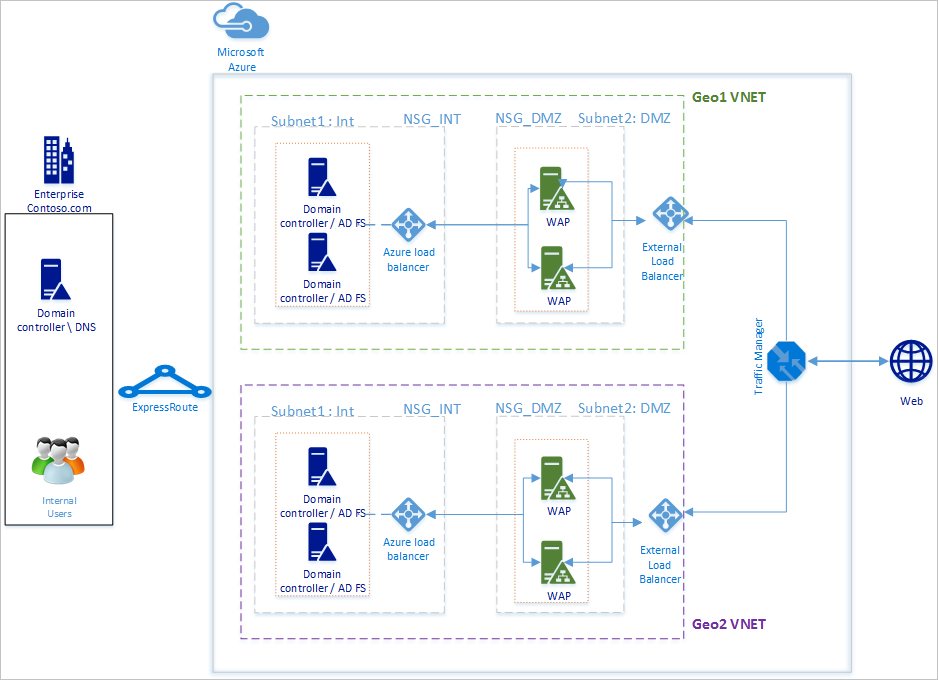
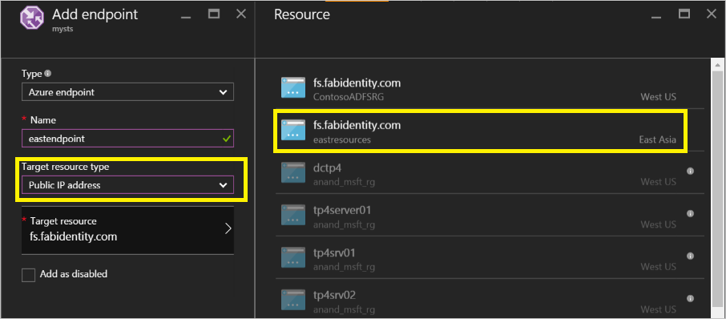
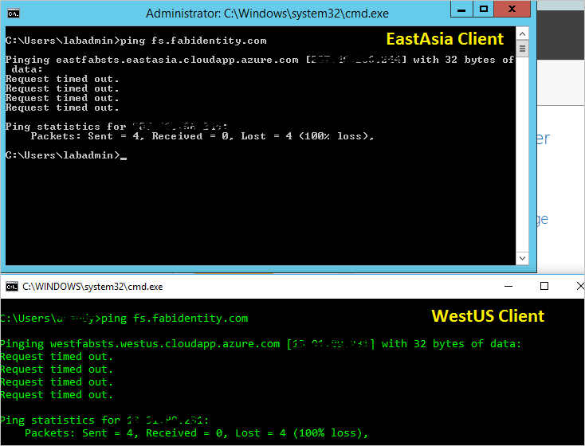
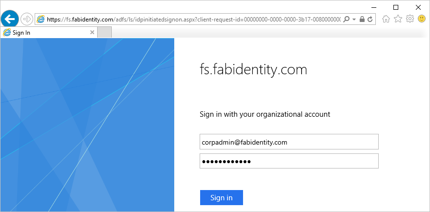

<properties
	pageTitle="使用 Azure 流量管理器在 Azure 中部署高可用性跨地域 AD FS | Azure"
	description="在本文档中，你将学习如何在 Azure 中部署 AD FS 以实现高可用性。"
	keywords="Ad fs 与 Azure 流量管理器, adfs 与 Azure 流量管理器, 地域, 多个数据中心, 地域数据中心, 多个地域数据中心, 在 azure 中部署 AD FS, 部署 azure adfs, azure adfs, azure ad fs,部署 adfs, 部署 ad fs, azure 中的 adfs, 在 azure 中部署 adfs, 在 azure 中部署 AD FS, adfs azure, AD FS 简介, Azure, Azure 中的 AD FS, iaas, ADFS, 将 adfs 移到 azure"
	services="active-directory"
	documentationCenter=""
	authors="anandyadavmsft"
	manager="femila"
	editor=""/>

<tags
	ms.service="active-directory"
	ms.workload="identity"
	ms.tgt_pltfrm="na"
	ms.devlang="na"
	ms.topic="get-started-article"
	ms.date="09/01/2016"
	ms.author="anandy;billmath"
	wacn.date="10/25/2016"/>  

    
#使用 Azure 流量管理器在 Azure 中部署高可用性跨地域 AD FS

[Azure 中的 AD FS 部署](/documentation/articles/active-directory-aadconnect-azure-adfs/)提供有关如何在 Azure 中为组织部署简单 AD FS 基础结构的分步指南。本文提供如何使用 [Azure 流量管理器](/documentation/articles/traffic-manager-overview/)在 Azure 中创建 AD FS 的跨地域部署的后续步骤。Azure 流量管理器会使用各种可用的路由方法来适应基础结构的不同需求，帮助为组织创建在地理上分散的高可用性和高性能 AD FS 基础结构。

高度可用的跨地域 AD FS 基础结构能够：

* **消除单点故障：**借助 Azure 流量管理器的故障转移功能，即使全球任意位置的任一数据中心发生故障，也可实现高度可用的 AD FS 基础结构
* **提高性能：**可以使用本文中建议的部署提供高性能的 AD FS 基础结构，它能够帮助用户更快地进行身份验证。

##设计原理

  

基本设计原理与《Azure 中的 AD FS 部署》一文中列出的设计原理相同。上图显示基本部署到其他地理区域的简单扩展。下文介绍将部署扩展到新地理区域时需要考虑的一些要点

* **虚拟网络：**应该在想要部署其他 AD FS 基础结构的地理区域中创建新的虚拟网络。在上图中，可以看到 Geo1 VNET 和 Geo2 VNET 显示为每个地理区域中的两个虚拟网络。

* **新地域虚拟网络中的域控制器和 AD FS 服务器：**建议在新地理区域中部署域控制器，这样一来，新区域中的 AD FS 服务器无需联系其他遥远网络中的域控制器即可完成身份验证，因而可以提高性能。

* **存储帐户：**存储帐户与某个区域关联。因为会在新地理区域中部署计算机，所以必须创建要在此区域中使用的新存储帐户。

* **网络安全组：**和存储帐户一样，在某个区域中创建的网络安全组不能在其他地理区域中使用。因此，需要为新地理区域中的 INT 和 DMZ 子网创建类似于第一个地理区域中的网络安全组的新网络安全组。

* **公共 IP 地址的 DNS 标签：**Azure 流量管理器仅可通过 DNS 标签参考终结点。因此，必须为外部负载均衡器的公共 IP 地址创建 DNS 标签。

* **Azure 流量管理器：**使用 Azure 流量管理器可以控制用户流量的分布，将用户流量分布到在全球不同数据中心运行的服务终结点。Azure 流量管理器在 DNS 级别工作。它使用 DNS 响应将最终用户流量定向到全球分布的终结点。然后，客户端直接连接到这些终结点。借助性能、加权和优先级各有不同的路由选项，可以轻松地选择最适合组织需求的路由选项。

* **两个区域之间的虚拟网络到虚拟网络连接：**不需要具备虚拟网络本身之间的连接。因为每个虚拟网络都有权访问域控制器，并且本身具有 AD FS 和 WAP 服务器，所以不同区域中的虚拟网络之间不需要任何连接也可工作。

##集成 Azure 流量管理器的步骤

###在新地理区域中部署 AD FS
请按照 [Azure 中的 AD FS 部署](/documentation/articles/active-directory-aadconnect-azure-adfs/)中的步骤和指南，在新地理区域中部署同一拓扑。

###面向 Internet 的（公共）负载均衡器中公共 IP 地址的 DNS 标签
如上所述，Azure 流量管理器仅可将 DNS 标签用作终结点的参考，因此必须为外部负载均衡器的公共 IP 地址创建 DNS 标签。以下屏幕快照显示如何配置公共 IP 地址的 DNS 标签。

  

###部署 Azure 流量管理器

按照以下步骤创建流量管理器配置文件。有关详细信息，还可参考[管理 Azure 流量管理器配置文件](/documentation/articles/traffic-manager-manage-profiles/)。

1. **创建流量管理器配置文件：**为流量管理器配置文件指定唯一名称。配置文件的此名称是 DNS 名称的一部分，并可充当流量管理器域名标签的前缀。系统会将该名称/前缀添加到 .trafficmanager.cn，以创建流量管理器的 DNS 标签。以下屏幕快照显示设置为 mysts 的流量管理器 DNS 前缀，生成的 DNS 标签将为 mysts.trafficmanager.cn。

      

 
2. **流量路由方法：**流量管理器提供三个路由选项：

    * 优先级
    * 性能
    * 加权
    
    **性能**是用于实现高响应 AD FS 基础结构的建议选项。但是，可以选择最适合部署需求的任何路由方法。AD FS 功能不受所选路由选项的影响。有关详细信息，请参阅[流量管理器流量路由方法](/documentation/articles/traffic-manager-routing-methods/)。在上面的示例屏幕快照中，可以看到已选择“性能”方法。
   
3.	**配置终结点：**在流量管理器页中，单击终结点，然后选择“添加”。这将打开类似于以下屏幕快照的“添加终结点”页
 
      

 
    对于不同的输入，请遵循以下指南：

    **类型：**选择 Azure 终结点，因为将指向 Azure 公共 IP 地址。

    **名称：**创建想要与该终结点关联的名称。这不是 DNS 名称，因此与 DNS 记录没有关联。

    **目标资源类型：**选择公共 IP 地址作为此属性的值。

    **目标资源：**此输入提供选择订阅下可用的不同 DNS 标签的选项。选择 DNS 标签。

    针对想要 Azure 流量管理器将流量路由到其中的每个地理区域，添加终结点。
    有关详细信息和如何在流量管理器中添加/配置终结点的详细步骤，请参阅[添加、禁用、启用或删除终结点](/documentation/articles/traffic-manager-endpoints/)
    
4. **配置探测：**在流量管理器页中，单击“配置”。在配置页中，需要更改监视设置，以在 HTTP 端口 80 和相对路径 /adfs/probe 探测

      

    >[AZURE.NOTE] **确保完成配置时，终结点的状态为“联机”**。如果所有终结点都处于“降级”状态，Azure 流量管理器会尽量尝试路由流量，但前提是诊断不正确，并且所有终结点都可访问。

5. **修改 Azure 流量管理器的 DNS 记录：**联合身份验证服务应该是 Azure 流量管理器 DNS 名称的 CNAME。在公共 DNS 记录中创建 CNAME，以使尝试访问联合身份验证服务的人员实际访问 Azure 流量管理器。

    例如，若要将联合身份验证服务 fs.fabidentity.com 指向流量管理器，需要将 DNS 资源记录更新为以下内容：

    <code>fs.fabidentity.com IN CNAME mysts.trafficmanager.cn</code>

##测试路由和 AD FS 登录   

###路由测试

对路由的基本测试包括尝试从每个地理区域中的计算机对联合身份验证服务 DNS 名称进行 ping 操作。根据选择的路由方法，实际 ping 的终结点将在 ping 显示内容中反映出来。例如，如果选择性能路由，则会访问最接近客户端区域的终结点。以下是来自两个不同区域客户端计算机的两个 ping 操作的快照。

  

###AD FS 登录测试

若要测试 AD FS，最简单的方法是使用 IdpInitiatedSignon.aspx 页。若要执行此操作，必须在 AD FS 属性中启用 IdpInitiatedSignOn。请遵循以下步骤来验证你的 AD FS 设置
 
1. 使用 PowerShell 在 AD FS 服务器上运行以下 cmdlet，以将它设置为启用。
	
	Set-AdfsProperties -EnableIdPInitiatedSignonPage $true
	
2. 从任何外部计算机访问 https://<yourfederationservicedns>/adfs/ls/IdpInitiatedSignon.aspx

3. 你应会看到如下所示的 AD FS 页：

      

    成功登录后，会提供如下所示的成功消息：

      

 
##相关链接
* [Azure 中的基本 AD FS 部署](/documentation/articles/active-directory-aadconnect-azure-adfs/)
* [Azure 流量管理器](/documentation/articles/traffic-manager-overview/)
* [流量管理器流量路由方法](/documentation/articles/traffic-manager-routing-methods/)

##后续步骤
* [管理 Azure 流量管理器配置文件](/documentation/articles/traffic-manager-manage-profiles/)
* [添加、禁用、启用或删除终结点](/documentation/articles/traffic-manager-endpoints/)

<!---HONumber=Mooncake_1017_2016-->
