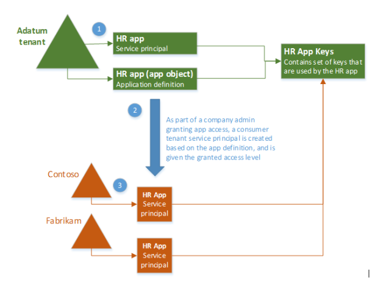

<properties
    pageTitle="Azure Active Directory 应用程序对象和服务主体对象 | Azure"
    description="介绍 Azure Active Directory 中应用程序对象与服务主体对象之间的关系"
    documentationcenter="dev-center-name"
    author="bryanla"
    manager="mbaldwin"
    services="active-directory"
    editor="" />  

<tags
    ms.assetid="adfc0569-dc91-48fe-92c3-b5b4833703de"
    ms.service="active-directory"
    ms.devlang="na"
    ms.topic="article"
    ms.tgt_pltfrm="na"
    ms.workload="identity"
    ms.date="11/15/2016"
    ms.author="bryanla;mbaldwin" 
    wacn.date="12/09/2016"/>

# Azure Active Directory 中的应用程序对象和服务主体对象
Azure Active Directory (Azure AD) 中的术语“应用程序”有时很容易造成误解，尤其是缺少支持上下文时。本文旨在更加明确地阐明其含义，澄清 Azure AD 应用程序集成的概念和具体层面，然后演示如何注册和同意[多租户应用程序](/documentation/articles/active-directory-dev-glossary/#multi-tenant-application/)。

## 概述
Azure AD 应用程序远远不只是一套软件。它是一个概念性的术语，指的不只是应用程序软件，还包括它在 Azure AD 上的注册（也称为标识配置），这可以让它在运行时参与身份验证和授权“对话”。根据定义，应用程序能够以[客户端](/documentation/articles/active-directory-dev-glossary/#client-application/)角色（使用资源）和/或[资源服务器](/documentation/articles/active-directory-dev-glossary/#resource-server/)角色（向客户端公开 API）运行。对话协议由 [OAuth 2.0 授权流](/documentation/articles/active-directory-dev-glossary/#authorization-grant/)定义，目标是要让客户端/资源能够各自访问/保护资源的数据。现在让我们再深入一点，看看 Azure AD 应用程序模型在内部如何代表应用程序。

## 应用程序注册
在 [Azure 经典管理门户][AZURE-Classic-Portal]中注册应用程序时，将在 Azure AD 租户中创建两个对象：应用程序对象和服务主体对象。

#### 应用程序对象
Azure AD 应用程序由其唯一一个应用程序对象来 *定义*，该对象位于应用程序注册到的 Azure AD 租户（称为应用程序的“宿主”租户）中。应用程序对象为应用程序提供标识相关信息，并且是 *派生* 其对应服务主体对象（在运行时使用）的模板。

可以将应用程序对象视为应用程序的 *全局* 表示形式（供所有租户使用），将服务主体视为*本地*表示形式（在特定租户中使用）。Azure AD Graph [Application 实体][AAD-Graph-App-Entity]定义应用程序对象的架构。因此，应用程序对象与软件应用程序之间存在 1:1 的关系，而与其对应的  *n* 个服务主体对象存在 1: *n* 的关系。

#### 服务主体对象
服务主体对象定义应用程序的策略和权限，为安全主体提供了基础，使其能够在运行时访问资源时代表应用程序。Azure AD Graph [ServicePrincipal 实体][AAD-Graph-Sp-Entity]定义服务主体对象的架构。

在应用程序的用法实例必须代表的每个租户中，必须存在一个服务主体，这样才能安全访问该租户中的用户拥有的资源。单租户应用程序只有一个服务主体（在其宿主租户中）。多租户 [Web 应用程序](/documentation/articles/active-directory-dev-glossary/#web-client/)的每个租户中也有一个服务主体，但另外在租户的管理员或用户已同意该应用程序的每个租户上，拥有一个用于访问其资源的服务主体。在同意之后，将来的授权请求将参考服务主体对象。

> [AZURE.NOTE] 对应用程序对象所做的任何更改也只反映在该对象在应用程序宿主租户（其注册所在的租户）的服务主体对象中。对于多租户应用程序，在使用者租户删除该访问权限并重新授予访问权限之前，对应用程序对象所做的更改不会反映在任何使用者租户的服务主体对象中。

## 示例
下图演示了应用程序的应用程序对象和对应的服务主体对象之间的关系，其上下文是在名为 **HR 应用**的示例多租户应用程序中。此方案中有三个 Azure AD 租户：

- **Adatum** - 开发 **HR 应用**的公司使用的租户
- **Contoso** - Contoso 组织使用的租户，即 **HR 应用**的使用者
- **Fabrikam** - Fabrikam 组织使用的租户，它也使用 **HR 应用**

在上图中，步骤 1 是在应用程序的宿主租户中创建应用程序对象和服务主体对象的过程。

在步骤 2 中，当 Contoso 和 Fabrikam 的管理员完成同意并向应用程序授予访问权限时，将在其公司的 Azure AD 租户中创建服务主体对象，并向其分配管理员所授予的权限。另请注意，HR 应用可能配置/设计为允许由用户同意以供个人使用。

在步骤 3 中，HR 应用程序的使用者租户（例如 Contoso 和 Fabrikam）各有自己的服务主体对象。每个对象代表其在运行时使用的应用程序实例，该实例受相关管理员同意的权限控制。

## 后续步骤
可以通过 Azure AD 图形 API 访问应用程序的应用程序对象（由其 OData [Application 实体][AAD-Graph-App-Entity]表示）

可以通过 Azure AD 图形 API 访问应用程序的服务主体对象（由其 OData [ServicePrincipal 实体][AAD-Graph-Sp-Entity]表示）

<!--Image references-->

<!--Reference style links -->
[AAD-Graph-App-Entity]: https://msdn.microsoft.com/Library/Azure/Ad/Graph/api/entity-and-complex-type-reference#application-entity
[AAD-Graph-Sp-Entity]: https://msdn.microsoft.com/Library/Azure/Ad/Graph/api/entity-and-complex-type-reference#serviceprincipal-entity
[AZURE-Classic-Portal]: https://manage.windowsazure.cn

<!---HONumber=Mooncake_1128_2016-->
