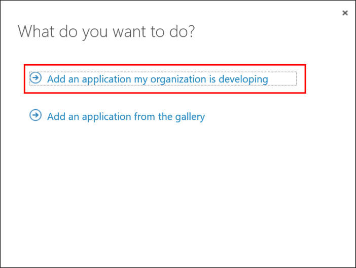
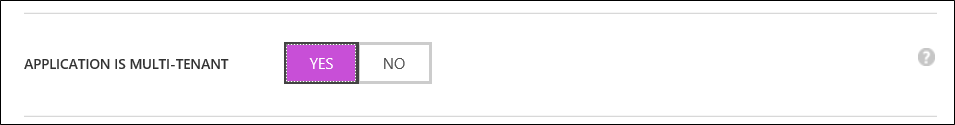
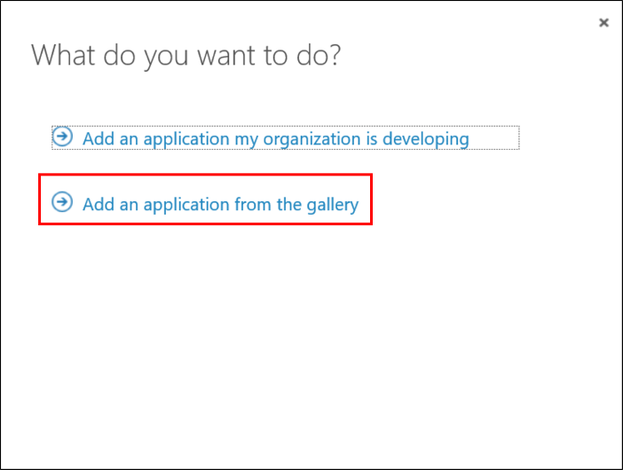
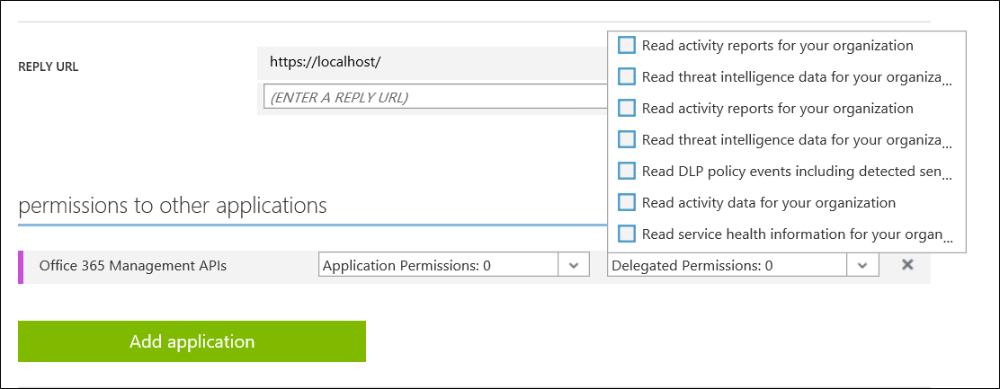
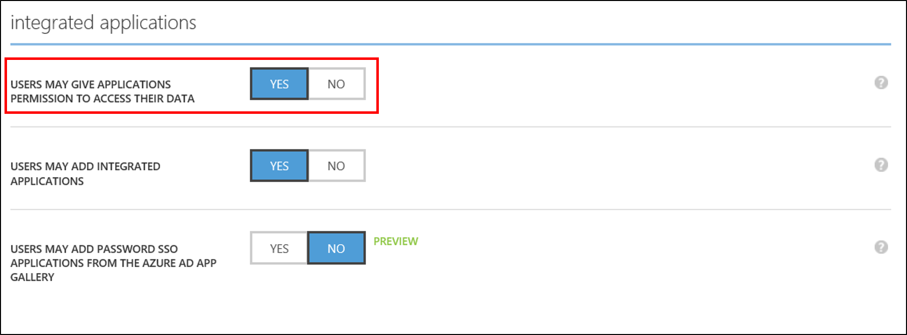
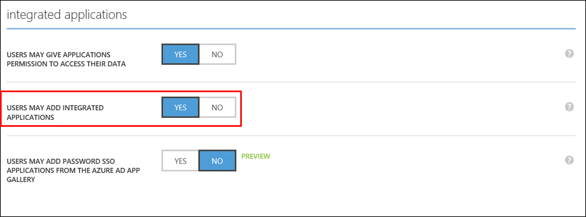
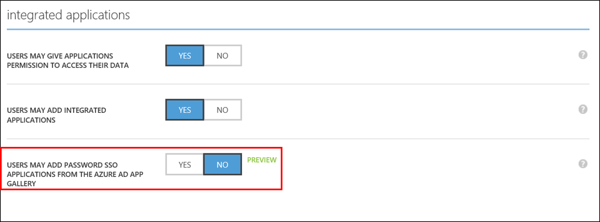
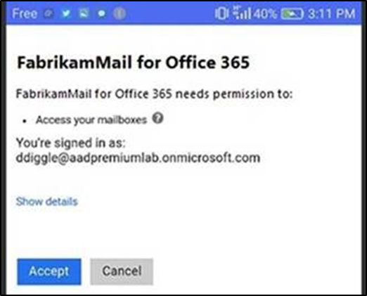

<properties
    pageTitle="Azure Active Directory 中的应用、权限和同意 | Azure"
    description="Azure AD Connect 会将本地目录与 Azure Active Directory 集成。这样便可以为集成到 Azure AD 的 Office 365、Azure 和 SaaS 应用程序提供一个通用标识。"
    keywords="Azure AD 介绍, 应用, 什么是 Azure AD Connect, 安装 active directory"
    services="active-directory"
    documentationcenter=""
    author="billmath"
    manager="femila"
    editor=""/>  

    
<tags    
    ms.assetid="25897cc4-7687-49b6-b0d5-71f51302b6b1"
    ms.service="active-directory"
    ms.workload="identity"
    ms.tgt_pltfrm="na"
    ms.devlang="na"
    ms.topic="get-started-article"
    ms.date="11/17/2016"
    ms.author="billmath" 
    wacn.date="01/05/2017"/>  

# Azure Active Directory 中的应用、权限和同意
在 Azure Active Directory 内，可以向目录添加应用程序。可以添加的应用程序因应用程序的类型而异。若要在经典管理门户中查看应用程序，请选择一个目录，然后选择应用程序。

  

## 应用类型

1. **单租户应用** 
	- **单租户应用**：通常称为业务线 (LOB) 应用。这是指组织内的人员开发自己的应用，并希望组织中的用户能够登录该应用的情况。
	
	- **应用程序代理应用**：使用 Azure AD 应用程序代理公开本地应用程序时，会在租户（除应用程序代理服务外）中注册单租户应用。此应用代表本地应用程序进行所有云交互（例如，身份验证）。（应用程序代理要求使用 Azure AD Basic 或更高版本。）

2. **多租户应用**
	- **其他用户可以同意的多租户应用**：类似“组织开发的单租户应用”。主要区别（除应用本身的逻辑外）在于，来自其他租户的用户也可以同意并登录该应用。 
	
	- **其他用户开发的、Contoso 可以同意的多租户应用**。（简称“同意的应用”。） 这是“组织开发的多租户应用”的另外一面。其他组织开发多租户应用时，本组织的用户可以同意并登录该应用。
	- **Microsoft 第一方应用**：代表 Microsoft 服务的应用。同意以注册服务这一事实为依据。有时候，在建立应用访问策略时，会使用针对特定第一方应用的特殊用户体验和逻辑。 
	
	- **预先集成的应用**：Azure AD 应用库中提供的应用。可将这些应用添加到目录中，为常用 SaaS 应用提供单一登录功能（以及在某些情况下提供预配功能）。
	- **Azure AD 单一登录**：用于可与 Azure AD 集成的应用的“真实”SSO，通过 SAML 2.0 或 OpenID Connect 等受支持的登录协议提供。向导会引导完成设置过程。
	- **密码单一登录**：Azure AD 可安全存储应用的用户凭据，以及由 Azure AD 应用访问浏览器扩展“注入”登录表单的凭据。也称为“密码存储”。

## 权限

注册应用时，执行应用注册的用户（即开发人员）定义应用需要访问的权限和资源。（资源本身以其他应用的形式定义。） 例如，生成邮件阅读器应用的人员会表明，其应用需要“Office 365 Exchange Online”资源中的“以登录用户身份访问邮箱”权限：
	
  

为了让一个应用（客户端）向另一应用（资源）请求特定权限，资源应用的开发人员会定义存在的权限。在我们的示例中，“Office 365 Exchange Online”资源应用的所有者 Microsoft 已定义名为“以登录用户身份访问邮箱”的权限。

定义权限时，应用开发人员必须定义用户是否可以同意该权限，或是否需要管理员同意。这样一来，开发人员能够允许用户自行同意仅请求低敏感度权限的应用，但需要管理员才能同意更敏感的权限。例如，“Azure Active Directory”资源应用已经过定义，因此，用户可以同意请求有限只读权限的应用。但是，需要管理员同意才能获取完整的读取权限和所有写入权限。

本机客户端未经过身份验证，因此，定义为本机客户端应用的应用仅可请求委托的权限。这意味着获取令牌时，必须始终有实际用户的参与。Web 应用和 Web API（保密客户端）在获取访问令牌时，必须始终使用 Azure AD 进行身份验证。这意味着，它们还有可能请求仅限应用的权限。例如，一个后端服务需要向另一个后端服务进行身份验证。请求仅限应用的权限的应用程序始终需要管理员同意。

总结：

- 应用（客户端）表明所需的其他应用（资源）的权限。
- 应用（资源）表明向其他应用（客户端）公开的权限。
- 权限可以是仅限应用的权限，也可以是委托的权限。
- 委托的权限可以标记为“允许用户同意”或“需要管理员同意”。
- 应用可以具有客户端的行为（通过声明需要资源的权限），也可以具有资源的行为（通过声明公开哪些权限），还可以同时具有两者的行为。

## 控制

下面是可用于所有这些行为的不同管理员控件的列表。可在经典管理门户中，从目录下的“配置”中访问管理员控件。

  

在经典管理门户中，选择“用户可向应用程序授予访问数据的权限”。

- 可控制用户是否可以注册自己的单租户 LOB 应用：在经典管理门户中选择“用户可添加集成应用程序”。

>[AZURE.NOTE]
即使允许用户注册单租户 LOB 应用，对于注册对象也存在限制。例如，不是目录管理员的开发人员。
>
>- 用户不能让单租户应用成为多租户应用。
>- 注册单租户 LOB 应用时，用户不能向其他应用请求仅限应用的权限。
>- 注册单租户 LOB 应用时，如果委托的权限需要管理员同意，则用户不能向其他应用请求这些权限。
>- 用户不能对自己不是所有者的应用进行更改。

- 可控制用户是否可以自行添加使用密码 SSO（又称“密码存储”）的预先集成的应用

- 可控制可以在哪些条件下访问应用程序（即条件访问）。请注意，这同时适用于客户端应用和资源应用。因此，假设设置的条件访问策略是：仅可从合规的计算机访问“Office 365 Exchange Online”应用。此策略还适用于用户尝试使用向 Exchange Online 请求权限的客户端应用的情况。

- 可看到已同意哪些应用以及正在使用哪些应用。

1. 	用户同意应用时，会在租户中创建一个 ServicePrincipal 对象。ServicePrincipal 的创建包含在审核报告中。
2. 	可通过用户登录活动报告查看用户登录的应用。

## 示例

举个例子，让我们以租户中的用户已登录的“FabrikamMail for Office 365”应用为例。“FabrikamMail”是 Android 邮件阅读器应用，由“Fabrikam, Inc.”发布。这属于“其他用户开发的、Contoso 可以同意的多租户应用”。

如果允许用户同意，则用户在首次登录时会看到同意提示信息：

“访问邮箱”是“Office 365 Exchange Online”（即 Exchange）公开的“以登录用户身份访问邮箱”权限的面向用户的同意字符串。

可通过查找 Exchange（资源）的 ServicePrincipal 对象来查看该权限，该权限在注册 Office 365 时已添加。可将 ServicePrincipal 对象视为租户中应用的“实例”，其用于记录不同的选项和配置。可使用 PowerShell 中的 `Get-AzureADServicePrincipal` 进行查看。

	PS C:\> Get-AzureADServicePrincipal -ObjectId 383f7b97-6754-4d3d-9474-3908ebcba1c6 | fl *
	
	DeletionTimeStamp         : 
	ObjectId                  : 383f7b97-6754-4d3d-9474-3908ebcba1c6
	ObjectType                : ServicePrincipal
	AccountEnabled            : True
	AppDisplayName            : Office 365 Exchange Online
	AppId                     : 00000002-0000-0ff1-ce00-000000000000
	AppOwnerTenantId          : 
	AppRoleAssignmentRequired : False
	AppRoles                  : {...}
	DisplayName               : Microsoft.Exchange
	ErrorUrl                  : 
	Homepage                  : 
	KeyCredentials            : {}
	LogoutUrl                 : 
	Oauth2Permissions         : {...
	                            , class OAuth2Permission {
	                              AdminConsentDescription : Allows the app to have the same access to mailboxes as the signed-in user via Exchange Web Services.
	                              AdminConsentDisplayName : Access mailboxes as the signed-in user via Exchange Web Services
	                              Id                      : 3b5f3d61-589b-4a3c-a359-5dd4b5ee5bd5
	                              IsEnabled               : True
	                              Type                    : User
	                              UserConsentDescription  : Allows the app full access to your mailboxes on your behalf.
	                              UserConsentDisplayName  : Access your mailboxes
	                              Value                   : full_access_as_user
	                            },
	                            ...}
	PasswordCredentials       : {}
	PublisherName             : 
	ReplyUrl                  : 
	SamlMetadataUrl           : 
	ServicePrincipalNames     : {00000002-0000-0ff1-ce00-000000000000/outlook.office365.com, 00000002-0000-0ff1-ce00-000000000000/mail.office365.com, 00000002-0000-0ff1-ce00-000000000000/outlook.com, 
	                            00000002-0000-0ff1-ce00-000000000000/*.outlook.com...}
	Tags                      : {}

用户单击“接受”时，会启动同意。首先，会在租户中创建“FabrikamMail for Office 365”的 ServicePrincipal 对象。ServicePrincipal 类似如下所示内容：

	PS C:\> Get-AzureADServicePrincipal -SearchString "FabrikamMail for Office 365" | fl *
	
	DeletionTimeStamp         : 
	ObjectId                  : a8b16333-851d-42e8-acd2-eac155849b37
	ObjectType                : ServicePrincipal
	AccountEnabled            : True
	AppDisplayName            : FabrikamMail for Office 365
	AppId                     : aba7c072-2267-4031-8960-e7a2db6e0590
	AppOwnerTenantId          : 4a4076e0-a70f-41c6-b819-6f9c4a86df89
	AppRoleAssignmentRequired : False
	AppRoles                  : {}
	DisplayName               : FabrikamMail for Office 365
	ErrorUrl                  : 
	Homepage                  : 
	KeyCredentials            : {}
	LogoutUrl                 : 
	Oauth2Permissions         : {}
	PasswordCredentials       : {}
	PublisherName             : Fabrikam, Inc.
	ReplyUrl                  : 
	SamlMetadataUrl           : 
	ServicePrincipalNames     : {aba7c072-2267-4031-8960-e7a2db6e0590}
	Tags                      : {WindowsAzureActiveDirectoryIntegratedApp}

同意应用会在以下对象之间创建 Oauth2PermissionGrant 链接：
  
- 用户对象
- 客户端应用 ServicePrincipalName (SPN)
- 资源应用 ServicePrincipalName (SPN)
- 资源应用中的权限。

对于 FabrikamMail，其类似如下所示内容：

	PS C:\> Get-AzureADUserOAuth2PermissionGrant -ObjectId ddiggle@aadpremiumlab.partner.onmschina.cn | fl *
	
	ClientId    : a8b16333-851d-42e8-acd2-eac155849b37
	ConsentType : Principal
	ExpiryTime  : 05/15/2017 07:02:39 AM
	ObjectId    : M2OxqB2F6EKs0urBVYSbN5d7PzhUZz1NlH25COvLocbJjoxkUFfRQauryBKwBWet
	PrincipalId : 648c8ec9-5750-41d1-abab-c812b00567ad
	ResourceId  : 383f7b97-6754-4d3d-9474-3908ebcba1c6
	Scope       : full_access_as_user
	StartTime   : 01/01/0001 12:00:00 AM

（**ClientId** 是 FabrikamMail 的服务主体对象 ID（刚才创建的对象），**PrincipalId** 是（同意的用户的）用户对象 ID，**ResourceId** 是 Exchange 的服务主体对象 ID，Scope 是 Exchange 中同意的权限）。

如果不允许用户同意，他们会看到指示需要权限的屏幕。

<!---HONumber=Mooncake_1226_2016-->
