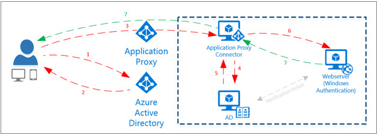

<properties
	pageTitle="使用应用代理启用混合访问 | Azure"
	description="通过 Azure Active Directory 从网络外部实现对专用网络内部运行的应用的访问。"
	services="active-directory"
	documentationCenter=""
	keywords="应用程序访问,应用代理,混合访问"
	authors="femila"
	manager="stevenpo"
	editor=""/>

<tags
	ms.service="active-directory"
	ms.date="02/10/2016"
	wacn.date="06/24/2016"/>

# 使用应用代理启用混合访问
使用 Microsoft Azure Active Directory (AD) 应用程序代理，可以从任何位置和任何设备安全访问专用网络中的应用程序。在环境中安装应用程序代理连接器后，可以使用 Azure AD 轻松配置该连接器。

启用对 Web 应用程序的访问只有一个要求：安装连接器的服务器必须可以访问该 Web 应用程序。换句话说，可以在应用程序服务器本身或环境中的任何其他服务器上安装连接器，只要连接器能访问该 Web 应用程序即可。

##工作原理
### 快速概述
1. 连接器已部署在本地网络上。（可部署多个连接器以实现冗余与缩放性）。
2. 该连接器连接到云服务。
3. 连接器和云服务将用户流量路由到应用程序。

 

### 细节
1. 用户通过应用程序代理访问应用程序，然后被定向到 Azure AD 登录页进行身份验证。
2. 成功登录之后，系统将生成令牌并发送给用户。
3. 用户将令牌发送到应用程序代理，应用程序代理检索令牌的用户主体名称 (UPN) 和安全主体名称 (SPN)，然后将请求定向到连接器。
4. 连接器代表用户请求可用于内部 (Windows) 身份验证的 Kerberos 票证。这称为 Kerberos 约束委派。
5. Kerberos 票证是从 Active Directory 检索的。
6. 票证将发送到应用程序服务器并进行验证。
7. 响应通过应用程序代理发送到用户。

## 相关文章
- [有关 Azure Active Directory 中应用程序管理的文章索引](/documentation/articles/active-directory-apps-index/)

<!---HONumber=Mooncake_0411_2016-->