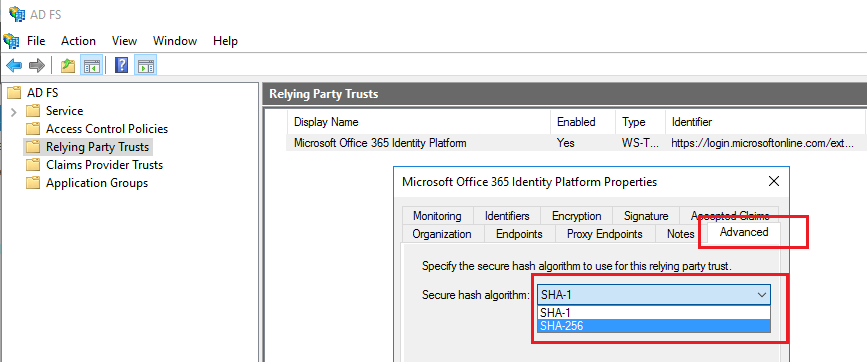

<properties
    pageTitle="更改 Office 365 信赖方信任的签名哈希算法 | Azure"
    description="本页面提供有关更改 Office 365 联合身份验证信任 SHA 算法的指导"
    keywords="SHA1,SHA256,O365,联合,aadconnect,adfs,ad fs,更改 sha,联合身份验证信任,信赖方信任"
    services="active-directory"
    documentationcenter=""
    author="anandyadavmsft"
    manager="samueld"
    editor="" />  

<tags
    ms.assetid="cf6880e2-af78-4cc9-91bc-b64de4428bbd"
    ms.service="active-directory"
    ms.workload="identity"
    ms.tgt_pltfrm="na"
    ms.devlang="na"
    ms.topic="article"
    ms.date="10/31/2016"
    ms.author="anandy" 
    wacn.date="12/09/2016"/>

# 更改 Office 365 信赖方信任的签名哈希算法
## 概述
Azure Active Directory 联合身份验证服务 (AD FS) 将在 Azure Active Directory 中签名其令牌，确保这些令牌不会遭到篡改。这种签名可以基于 SHA1 或 SHA256。Azure Active Directory 现在支持使用 SHA256 算法签名的令牌，我们建议将令牌签名算法设置为 SHA256 以获得最高安全级别。本指南介绍将令牌签名算法设置为更安全的 SHA256 级别所要执行的步骤。

## 更改令牌签名算法
使用下面两个过程之一设置签名算法后，AD FS 将使用 SHA256 为 Office 365 信赖方信任令牌签名。你无需进行任何额外的配置更改，并且这种更改不影响你访问 Office 365 或其他 Azure AD 应用程序的能力。

### AD FS 管理控制台
1. 在 AD FS 主服务器上打开 AD FS 管理控制台。
2. 展开 AD FS 节点，然后单击“信赖方信任”。
3. 右键单击 Office 365/Azure 信赖方信任并选择“属性”。
4. 选择“高级”选项卡，然后选择安全哈希算法 SHA256。
5. 单击**“确定”**。

  

### AD FS PowerShell cmdlet
1. 在任何 AD FS 服务器上，以管理员权限打开 PowerShell。
2. 使用 **Set-AdfsRelyingPartyTrust** cmdlet 设置安全哈希算法。
   
   <code>Set-AdfsRelyingPartyTrust -TargetName 'Microsoft Office 365 Identity Platform' -SignatureAlgorithm 'http://www.w3.org/2001/04/xmldsig-more#rsa-sha256'</code>

## 另请参阅
- [Repair Office 365 trust with Azure AD Connect（使用 Azure AD Connect 修复 Office 365 信任）](/documentation/articles/active-directory-aadconnect-federation-management/#repairthetrust/)

<!---HONumber=Mooncake_1128_2016-->
