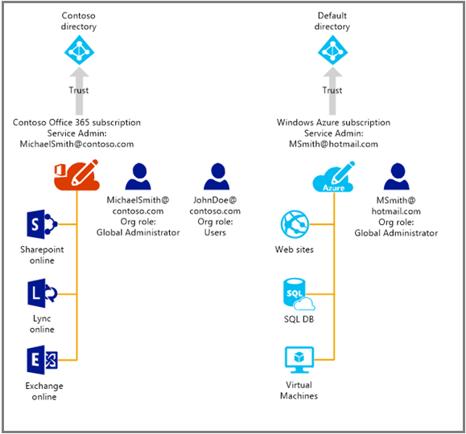

<properties
   pageTitle="在 Azure 中管理 Office 365 订阅的目录 | Azure"
   description="使用 Azure Active Directory 和 Azure 经典管理门户来管理 Office 365 订阅目录"
   services="active-directory"
   documentationCenter=""
   authors="curtand"
   manager="femila"
   editor=""/>

<tags
   ms.service="active-directory"
   ms.devlang="na"
   ms.topic="get-started-article"
   ms.tgt_pltfrm="na"
   ms.workload="identity"
   ms.date="08/23/2016"
   wacn.date="10/17/2016"
   ms.author="curtand"/>

# 在 Azure 中管理 Office 365 订阅的目录

本文介绍如何使用 Azure 经典管理门户管理为 Office 365 订阅创建的目录。必须是 Azure 订阅的服务管理员或共同管理员才能登录 Azure 经典管理门户。如果没有 Azure 订阅，现在可以使用此链接注册 [试用版](/pricing/1rmb-trial)，然后在 5 分钟内部署第一个云解决方案。请务必使用登录 Office 365 时所用的工作或学校帐户。

完成 Azure 订阅后，即可登录 Azure 经典管理门户并访问 Azure 服务。若要管理对 Office 365 用户进行身份验证所用的同一目录，请单击 Active Directory 扩展。

如果你已有 Azure 订阅，则管理其他目录的过程也很简单明了。例如，Michael Smith 可能有一个用于 Contoso.com 的 Office 365 订阅。另外，他还有一个使用其 Microsoft 帐户 msmith@hotmail.com 注册的 Azure 订阅。在这种情况下，他管理着两个目录。

 订阅 | Office 365 | Azure
  -------------- | ------------- | -------------------------------
 显示名称 | Contoso | 默认的 Azure Active Directory (Azure AD) 目录
 域名 | contoso.com | msmithhotmail.partner.onmschina.cn

他希望在使用 Microsoft 帐户登录到 Azure 时管理 Contoso 目录中的用户身份，以便启用 Azure AD 功能，如多重身份验证。下图可帮助你了解该过程。

在这种情况下，这两个目录是相互独立的。

## 管理两个独立的目录
若要在以 msmith@hotmail.com 身份登录到 Azure 时管理这两个目录，Michael Smith 必须完成以下步骤：

> [AZURE.NOTE]
仅当用户使用 Microsoft 帐户登录时才能完成这些步骤。如果用户是使用工作或学校帐户登录的，则“使用现有目录”选项不可用。工作或学校帐户只能通过其主目录（即存储工作或学校帐户的目录，该目录由工作单位或学校拥有）进行身份验证。

1.	以 msmith@hotmail.com 的身份登录 [Azure 经典管理门户](https://manage.windowsazure.cn)。
2.	单击“新建”>“应用程序服务”>“Active Directory”>“目录”>“自定义创建”。
3.	单击“使用现有目录”，然后选中“已准备好立即注销”。
4.	以 Contoso.partner.onmschina.cn 的全局管理员的身份（例如，msmith@contoso.com）登录 Azure 经典管理门户。
5.	当系统提示“是否要将 Contoso 目录用于 Azure?”时，单击“继续”。
6.	单击“立即注销”。
7.	以 msmith@hotmail.com 的身份登录 Azure 经典管理门户。Contoso 目录和默认目录将显示在 Active Directory 扩展中。

完成这些步骤之后，msmith@hotmail.com 将成为 Contoso 目录的全局管理员。

## 以全局管理员身份管理资源
现在，让我们假设 Jane Doe 需要管理与 msmith@hotmail.com 的 Azure 订阅关联的网站和数据库资源。在执行该操作之前，Michael Smith 需要完成以下附加步骤：

1.	使用 Azure 订阅的服务管理员帐户（在本示例中为 msmith@hotmail.com）登录 [Azure 经典管理门户](https://manage.windowsazure.cn)。
2.	将订阅传输到 Contoso 目录：单击“设置”>“订阅”> 选择订阅 >“编辑目录”> 选择“Contoso (Contoso.com)”。在传输过程中，将删除作为订阅协同管理员的所有工作或学校帐户。
3.	将 Jane Doe 添加为订阅的共同管理员：单击“设置”>“管理员”> 选择订阅 >“添加”> 键入 **JohnDoe@Contoso.com**。

## 后续步骤
有关订阅与目录之间关系的详细信息，请参阅[订阅如何与目录关联](/documentation/articles/active-directory-how-subscriptions-associated-directory/)。

<!---HONumber=Mooncake_1010_2016-->
