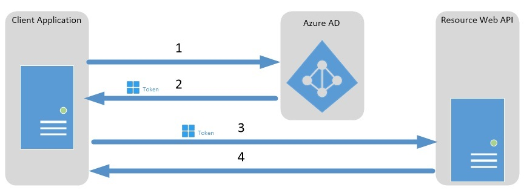

<properties
	pageTitle="使用 OAuth2.0 进行 Azure AD 服务到服务身份验证 | Azure"
	description="本文介绍如何使用 OAuth2.0 客户端凭据授权流通过 HTTP 消息实现服务到服务身份验证。"
	services="active-directory"
	documentationCenter=".net"
	authors="priyamohanram"
	manager="mbaldwin"
	editor=""/>  

<tags
	ms.service="active-directory"
	ms.workload="identity"
	ms.tgt_pltfrm="na"
	ms.devlang="na"
	ms.topic="article"
	ms.date="10/03/2016"
	wacn.date="11/08/2016"
	ms.author="priyamo"/>

# 使用客户端凭据进行服务到服务调用

OAuth 2.0 客户端凭据授权流允许 Web 服务（*机密客户端*）在调用其他 Web 服务时使用它自己的凭据进行身份验证，而不是模拟用户。在这种情况下，客户端通常是中间层 Web 服务、后台程序服务或网站。

## 客户端凭据授权流关系图

下图说明了客户端凭据授权流在 Azure Active Directory (Azure AD) 中的工作原理。

1. 客户端应用程序向 Azure AD 令牌颁发终结点进行身份验证，并请求访问令牌。
2. Azure AD 令牌颁发终结点颁发访问令牌。
3. 使用访问令牌向受保护资源进行身份验证。
4. 受保护资源中的数据返回到 Web 应用程序。

## 在 Azure AD 中注册服务

在 Azure Active Directory (Azure AD) 中注册调用服务和接收服务。有关详细说明，请参阅[添加、更新和删除应用](/documentation/articles/active-directory-integrating-applications/#BKMK_Native/)

##  请求访问令牌

若要请求访问令牌，对特定于租户的 Azure AD 终结点使用 HTTP POST。

	https://login.microsoftonline.com/<tenant id>/oauth2/token

## 服务到服务访问令牌请求

服务到服务访问令牌请求包含以下参数。

| 参数 | | 说明 |
|-----------|------|------------|
| response\_type | 必填 | 指定请求的响应类型。客户端凭据授权流中的值必须是 **client\_credentials**。|
| client\_id | 必填 | 指定调用 Web 服务的 Azure AD 客户端 ID。若要查找调用应用程序的客户端 ID，请在 Azure 管理门户中依次单击“Active Directory”、该目录、该应用程序、“配置”。|
| client\_secret | 必填 | 在 Azure AD 中输入为调用 Web 服务注册的密钥。若要创建密钥，请在 Azure 管理门户中依次单击“Active Directory”、该目录、该应用程序、“配置”。 |
| resource | 必填 | 输入接收 Web 服务的应用 ID URI。若要查找应用 ID URI，请在 Azure 管理门户中依次单击“Active Directory”、该目录、该应用程序、“配置”。 |

## 示例

以下 HTTP POST 请求 https://service.contoso.com/ Web 服务的访问令牌。`client_id` 标识请求访问令牌的 Web 服务。

	POST contoso.com/oauth2/token HTTP/1.1
	Host: login.microsoftonline.com
	Content-Type: application/x-www-form-urlencoded

	grant_type=client_credentials&client_id=625bc9f6-3bf6-4b6d-94ba-e97cf07a22de&client_secret=qkDwDJlDfig2IpeuUZYKH1Wb8q1V0ju6sILxQQqhJ+s=&resource=https%3A%2F%2Fservice.contoso.com%2F

## 服务到服务访问令牌响应

成功响应包含具有以下参数的 JSON OAuth 2.0 响应。

| 参数 | 说明 |
|-------------|-------------|
|access\_token |请求的访问令牌。调用 Web 服务可以使用此令牌向接收 Web 服务进行身份验证。 |
|access\_type | 指示令牌类型值。Azure AD 唯一支持的类型是 Bearer。有关持有者令牌的详细信息，请参阅 [OAuth 2.0 Authorization Framework: Bearer Token Usage (RFC 6750)](http://www.rfc-editor.org/rfc/rfc6750.txt)（OAuth2.0 授权框架：持有者令牌用法 (RFC 6750)）。
|expires\_in | 访问令牌的有效期（以秒为单位）。|
|expires\_on |访问令牌的过期时间。该日期表示为自 1970-01-01T0:0:0Z UTC 至过期时间的秒数。此值用于确定缓存令牌的生存期。 |
|resource | 接收 Web 服务的应用 ID URI。 |

## 示例

下面的示例演示对 Web 服务的访问令牌请求的成功响应。

	{
	"access_token":"eyJhbGciOiJSUzI1NiIsIng1dCI6IjdkRC1nZWNOZ1gxWmY3R0xrT3ZwT0IyZGNWQSIsInR5cCI6IkpXVCJ9.eyJhdWQiOiJodHRwczovL3NlcnZpY2UuY29udG9zby5jb20vIiwiaXNzIjoiaHR0cHM6Ly9zdHMud2luZG93cy5uZXQvN2ZlODE0NDctZGE1Ny00Mzg1LWJlY2ItNmRlNTdmMjE0NzdlLyIsImlhdCI6MTM4ODQ0ODI2NywibmJmIjoxMzg4NDQ4MjY3LCJleHAiOjEzODg0NTIxNjcsInZlciI6IjEuMCIsInRpZCI6IjdmZTgxNDQ3LWRhNTctNDM4NS1iZWNiLTZkZTU3ZjIxNDc3ZSIsIm9pZCI6ImE5OTE5MTYyLTkyMTctNDlkYS1hZTIyLWYxMTM3YzI1Y2RlYSIsInN1YiI6ImE5OTE5MTYyLTkyMTctNDlkYS1hZTIyLWYxMTM3YzI1Y2RlYSIsImlkcCI6Imh0dHBzOi8vc3RzLndpbmRvd3MubmV0LzdmZTgxNDQ3LWRhNTctNDM4NS1iZWNiLTZkZTU3ZjIxNDc3ZS8iLCJhcHBpZCI6ImQxN2QxNWJjLWM1NzYtNDFlNS05MjdmLWRiNWYzMGRkNThmMSIsImFwcGlkYWNyIjoiMSJ9.aqtfJ7G37CpKV901Vm9sGiQhde0WMg6luYJR4wuNR2ffaQsVPPpKirM5rbc6o5CmW1OtmaAIdwDcL6i9ZT9ooIIicSRrjCYMYWHX08ip-tj-uWUihGztI02xKdWiycItpWiHxapQm0a8Ti1CWRjJghORC1B1-fah_yWx6Cjuf4QE8xJcu-ZHX0pVZNPX22PHYV5Km-vPTq2HtIqdboKyZy3Y4y3geOrRIFElZYoqjqSv5q9Jgtj5ERsNQIjefpyxW3EwPtFqMcDm4ebiAEpoEWRN4QYOMxnC9OUBeG9oLA0lTfmhgHLAtvJogJcYFzwngTsVo6HznsvPWy7UP3MINA",
	"token_type":"Bearer",
	"expires_in":"3599",
	"expires_on":"1388452167",
	"resource":"https://service.contoso.com/"
	}

## 另请参阅

* [Azure AD 中的 OAuth 2.0](/documentation/articles/active-directory-protocols-oauth-code/)

<!---HONumber=Mooncake_1031_2016-->
