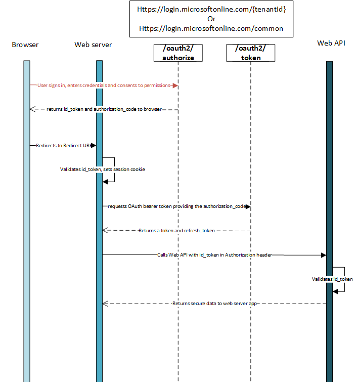

<properties
	pageTitle="Azure AD .NET 协议概述 | Azure"
	description="本文介绍如何使用 Azure Active Directory 和 OpenID Connect，通过 HTTP 消息来授权访问租户中的 Web 应用程序和 Web API。"
	services="active-directory"
	documentationCenter=".net"
	authors="priyamohanram"
	manager="mbaldwin"
	editor=""/>  

<tags
	ms.service="active-directory"
	ms.workload="identity"
	ms.tgt_pltfrm="na"
	ms.devlang="na"
	ms.topic="article"
	ms.date="10/03/2016"
	wacn.date="11/08/2016"
	ms.author="priyamo"/>  

# 使用 OpenID Connect 和 Azure Active Directory 来授权访问 Web 应用程序

[OpenID Connect](http://openid.net/specs/openid-connect-core-1_0.html) 是构建在 OAuth 2.0 协议顶层的简单标识层。OAuth 2.0 定义了一些机制用于获取和使用**访问令牌**来访问受保护资源，但未定义用于提供标识信息的标准方法。OpenID Connect 以 OAuth 2.0 授权过程的扩展形式实现身份验证，以 `id_token` 的形式（验证用户的标识）提供有关用户的信息，并提供有关用户的基本配置文件信息。

如果要构建的 Web 应用程序托管在服务器中并通过浏览器访问，我们建议使用 OpenID Connect。

## 使用 OpenID Connect 的身份验证流

最基本的登录流包含以下步骤 - 下面详细描述了每个步骤。

## 发送登录请求

当 Web 应用程序需要对用户进行身份验证时，必须将用户定向到 `/authorize` 终结点。此请求类似于 [OAuth 2.0 授权代码流](/documentation/articles/active-directory-protocols-oauth-code/)的第一个阶段，不过有几个重要的区别：

- 请求必须在 `scope` 参数中包含范围 `openid`。
- `response_type` 参数必须包含 `id_token`。
- 请求必须包含 `nonce` 参数。

下面是一个示例请求：

	// Line breaks for legibility only

	GET https://login.microsoftonline.com/{tenant}/oauth2/authorize?
	client_id=6731de76-14a6-49ae-97bc-6eba6914391e
	&response_type=id_token
	&redirect_uri=http%3A%2F%2Flocalhost%2Fmyapp%2F
	&response_mode=form_post
	&scope=openid
	&state=12345
	&nonce=7362CAEA-9CA5-4B43-9BA3-34D7C303EBA7

| 参数 | | 说明 |
| ----------------------- | ------------------------------- | --------------- |
| tenant | 必填 | 请求路径中的 `{tenant}` 值可用于控制哪些用户可以登录应用程序。独立于租户的令牌的允许值为租户标识符，例如 `8eaef023-2b34-4da1-9baa-8bc8c9d6a490`、`contoso.partner.onmschina.cn` 或 `common` |
| client\_id | 必填 | 将应用注册到 Azure AD 时，分配给应用的应用程序 ID。可在 Azure 经典管理门户中找到此 ID。单击“Active Directory”，单击目录，单击应用程序，然后单击“配置” |
| response\_type | 必填 | 必须包含 OpenID Connect 登录的 `id_token`。还可以包含其他 response\_type，例如 `code`。 |
| 作用域 | 必填 | 范围的空格分隔列表。针对 OpenID Connect，即必须包含范围 `openid`，其在同意 UI 中转换为“将你登录”权限。也可以在此请求中包含其他范围，以请求同意。 |
| nonce | 必填 | 由应用程序生成且包含在请求中的值，以声明方式包含在生成的 `id_token` 中。应用程序接着便可确认此值，以减少令牌重新执行攻击。此值通常是随机的唯一字符串或 GUID，可用以识别请求的来源。 |
| redirect\_uri | 建议 | 应用程序的 redirect\_uri，应用程序可在此发送及接收身份验证响应。其必须完全符合在门户中注册的其中一个 redirect\_uris，否则必须是编码的 url。 |
| response\_mode | 建议 | 指定将生成的 authorization\_code 送回到应用程序所应该使用的方法。*HTTP 窗体发布*支持的值为 `form_post`，*URL 片段*支持的值为 `fragment`。对于 Web 应用程序，建议使用 `response_mode=form_post`，确保以最安全的方式将令牌传输到你的应用程序。  
| state | 建议 | 同样随令牌响应返回的请求中所包含的值。其可以是你想要的任何内容的字符串。随机生成的唯一值通常用于[防止跨站点请求伪造攻击](http://tools.ietf.org/html/rfc6749#section-10.12)。该状态也用于在身份验证请求出现之前，于应用程序中编码用户的状态信息，例如之前所在的网页或视图。 |
| prompt | 可选 | 表示需要的用户交互类型。目前唯一的有效值为“login”、“none”和“consent”。`prompt=login` 强制用户在该请求上输入凭据，否定单一登录。`prompt=none` 则相反 - 它确保不对用户显示任何交互式提示。如果请求无法通过单一登录以无消息方式完成，终结点将返回错误。`prompt=consent` 在用户登录之后触发 OAuth 同意对话框，询问用户是否要授予权限给应用程序。 |
| login\_hint | 可选 | 如果事先知道其用户名称，可用于预先填充用户登录页面的用户名称/电子邮件地址字段。通常应用在重新身份验证期间使用此参数，已经使用 `preferred_username` 声明从上一个登录撷使用者户名称。 |

此时，请求用户输入其凭据并完成身份验证。

### 示例响应

下面是在对用户进行身份验证后的示例响应：

	POST /myapp/ HTTP/1.1
	Host: localhost
	Content-Type: application/x-www-form-urlencoded

	id_token=eyJ0eXAiOiJKV1QiLCJhbGciOiJSUzI1NiIsIng1dCI6Ik1uQ19WWmNB...&state=12345

| 参数 | 说明 |
| ----------------------- | ------------------------------- |
| id\_token | 应用请求的 `id_token`。可以使用 `id_token` 验证用户的标识，并以用户身份开始会话。 |
| state | 同样随令牌响应返回的请求中所包含的值。随机生成的唯一值通常用于[防止跨站点请求伪造攻击](http://tools.ietf.org/html/rfc6749#section-10.12)。该状态也用于在身份验证请求出现之前，于应用程序中编码用户的状态信息，例如之前所在的网页或视图。 |

### 错误响应
错误响应可能也发送到 `redirect_uri`，让应用可以适当地处理：

	POST /myapp/ HTTP/1.1
	Host: localhost
	Content-Type: application/x-www-form-urlencoded

	error=access_denied&error_description=the+user+canceled+the+authentication

| 参数 | 说明 |
| ----------------------- | ------------------------------- |
| error | 用于分类发生的错误类型与响应错误的错误码字符串。 |
| error\_description | 帮助开发人员识别身份验证错误根本原因的特定错误消息。 |

#### 授权终结点错误的错误代码

下表描述了可在错误响应的 `error` 参数中返回的各个错误代码。

| 错误代码 | 说明 | 客户端操作 |
|------------|-------------|---------------|
| invalid\_request | 协议错误，例如，缺少必需的参数。 | 修复并重新提交请求。这通常是在初始测试期间捕获的开发错误。|
| unauthorized\_client | 不允许客户端应用程序请求授权代码。 | 客户端应用程序未注册到 Azure AD 中或者未添加到用户的 Azure AD 租户时，通常会出现这种情况。应用程序可以提示用户，并说明如何安装应用程序并将其添加到 Azure AD。 |
| access\_denied | 资源所有者拒绝了许可 | 客户端应用程序可以通知用户除非用户许可，否则无法继续。 |
| unsupported\_response\_type | 授权服务器不支持请求中的响应类型。 | 修复并重新提交请求。这通常是在初始测试期间捕获的开发错误。|
|server\_error | 服务器遇到意外的错误。 | 重试请求。这些错误可能是临时状态导致的。客户端应用程序可以向用户说明，其响应由于临时错误而延迟。 |
| temporarily\_unavailable | 服务器暂时繁忙，无法处理请求。 | 重试请求。客户端应用程序可以向用户说明，其响应由于临时状态而延迟。 |
| invalid\_resource |目标资源无效，原因是它不存在，Azure AD 找不到它，或者未正确配置。| 这表示未在租户中配置该资源（如果存在）。应用程序可以提示用户，并说明如何安装应用程序并将其添加到 Azure AD。 |

## 验证 id\_token

仅接收 `id_token` 不足以对用户进行身份验证，必须验证签名，并按照应用的要求验证 `id_token` 中的声明。Azure AD 终结点使用 JSON Web 令牌 (JWT) 和公钥加密对令牌进行签名并验证其是否有效。

可以选择验证客户端代码中的 `id_token`，但是常见的做法是将 `id_token` 发送到后端服务器，并在那里执行验证。验证 `id_token` 的签名后，需要验证一些声明。

你可能还希望根据自己的方案验证其他声明。一些常见的验证包括：

- 确保用户/组织已注册应用。
- 确保用户拥有正确的授权/权限
- 确保身份验证具有一定的强度，例如多重身份验证。

完全验证 `id_token` 后，即可开始与用户的会话，并使用 `id_token` 中的声明来获取应用中的用户相关信息。此信息可以用于显示、记录和授权，等等。有关令牌类型和声明的详细信息，请阅读[支持的令牌和声明类型](/documentation/articles/active-directory-token-and-claims/)。

## 发送注销请求

如果你希望用户从应用中注销，仅仅是清除应用的 Cookie 或结束用户会话并不足够。还必须将用户重定向到 `end_session_endpoint` 才能注销。如果不这样做，用户可能不需要再次输入凭据就能重新通过应用的身份验证，因为他们与 Azure AD 终结点之间仍然存在有效的单一登录会话。

你只需将用户重定向到 OpenID Connect 元数据文档中所列的 `end_session_endpoint`：

	GET https://login.microsoftonline.com/common/oauth2/logout?
	post_logout_redirect_uri=http%3A%2F%2Flocalhost%2Fmyapp%2F

| 参数 | | 说明 |
| ----------------------- | ------------------------------- | ------------ |
| post\_logout\_redirect\_uri | 建议 | 用户在成功注销后应重定向到的 URL。如果未包含此参数，系统会向用户显示一条常规消息。 |

## 令牌获取

许多 Web 应用不仅需要将用户登录，而且还要代表该用户使用 OAuth 来访问 Web 服务。此方案合并了用于对用户进行身份验证的 OpenID Connect，同时将获取 `authorization_code`，用于通过 OAuth 授权代码流来获取 `access_tokens`。

## 获取访问令牌

若要获取访问令牌，需要修改上述登录请求：

	// Line breaks for legibility only

	GET https://login.microsoftonline.com/{tenant}/oauth2/authorize?
	client_id=6731de76-14a6-49ae-97bc-6eba6914391e		// Your registered Application Id
	&response_type=id_token+code
	&redirect_uri=http%3A%2F%2Flocalhost%2Fmyapp%2F 	  // Your registered Redirect Uri, url encoded
	&response_mode=form_post						      // form_post', or 'fragment'
	&scope=openid
	&resource=https%3A%2F%2Fservice.contoso.com%2F									 
	&state=12345						 				 // Any value, provided by your app
	&nonce=678910										 // Any value, provided by your app

通过在请求中包含权限范围并使用 `response_type=code+id_token`，`authorize` 终结点可确保用户已经同意 `scope` 查询参数中指示的权限，并且将授权代码返回到应用以交换访问令牌。

### 成功响应

使用 `response_mode=form_post` 的成功响应如下所示：

	POST /myapp/ HTTP/1.1
	Host: localhost
	Content-Type: application/x-www-form-urlencoded

	id_token=eyJ0eXAiOiJKV1QiLCJhbGciOiJSUzI1NiIsIng1dCI6Ik1uQ19WWmNB...&code=AwABAAAAvPM1KaPlrEqdFSBzjqfTGBCmLdgfSTLEMPGYuNHSUYBrq...&state=12345

| 参数 | 说明 |
| ----------------------- | ------------------------------- |
| id\_token | 应用请求的 `id_token`。可以使用 `id_token` 验证用户的标识，并以用户身份开始会话。 |
| 代码 | 应用程序请求的 authorization\_code。应用程序可以使用授权代码请求目标资源的访问令牌。Authorization\_codes 的生存期很短，通常约 10 分钟后即过期。 |
| state | 如果请求中包含状态参数，响应中就应该出现相同的值。应用程序应该验证请求和响应中的状态值是否完全相同。 |

### 错误响应

错误响应可能也发送到 `redirect_uri`，让应用可以适当地处理：

	POST /myapp/ HTTP/1.1
	Host: localhost
	Content-Type: application/x-www-form-urlencoded

	error=access_denied&error_description=the+user+canceled+the+authentication

| 参数 | 说明 |
| ----------------------- | ------------------------------- |
| error | 用于分类发生的错误类型与响应错误的错误码字符串。 |
| error\_description | 帮助开发人员识别身份验证错误根本原因的特定错误消息。 |

有关可能的错误代码的描述及其建议的客户端操作，请参阅[授权终结点错误的错误代码](#error-codes-for-authorization-endpoint-errors)。

获取授权 `code` 和 `id_token` 之后，可以将用户登录，并代表他们获取访问令牌。若要将用户登录，必须确切地按上面所述验证 `id_token`。若要获取访问令牌，可以遵循 [OAuth 协议文档](/documentation/articles/active-directory-protocols-oauth-code/#Use-the-Authorization-Code-to-Request-an-Access-Token/)中所述的步骤。

<!---HONumber=Mooncake_1031_2016-->
