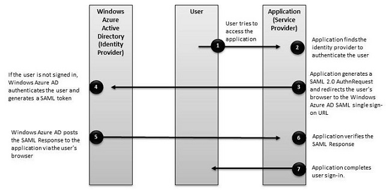

<properties
	pageTitle="Azure 单一登录 SAML 协议 | Azure"
	description="本文介绍 Azure Active Directory 中的单一登录 SAML 协议"
	services="active-directory"
	documentationCenter=".net"
	authors="priyamohanram"
	manager="mbaldwin"
	editor=""/>

<tags
	ms.service="active-directory"
	ms.date="06/23/2016"
	wacn.date="08/22/2016"/>

# 单一登录 SAML 协议

[AZURE.INCLUDE [active-directory-protocols](../../includes/active-directory-protocols.md)]

在本文中，我们将了解 Azure Active Directory (Azure AD) 针对单一登录支持的 SAML 2.0 身份验证请求和响应。

下面的协议流程图描述了单一登录序列。云服务（服务提供者）使用 HTTP 重定向绑定将 `AuthnRequest`（身份验证请求）元素传递给 Azure AD（标识提供者）。然后，Azure AD 使用 HTTP POST 绑定将 `Response` 元素发布到云服务。

## AuthnRequest

为了请求用户身份验证，云服务将 `AuthnRequest` 元素发送到 Azure AD。下面显示了一个示例 SAML 2.0 `AuthnRequest`：
	
	
	<samlp:AuthnRequest
	xmlns="urn:oasis:names:tc:SAML:2.0:metadata"
	ID="id6c1c178c166d486687be4aaf5e482730"
	Version="2.0" IssueInstant="2013-03-18T03:28:54.1839884Z"
	xmlns:samlp="urn:oasis:names:tc:SAML:2.0:protocol">
	<Issuer xmlns="urn:oasis:names:tc:SAML:2.0:assertion">https://www.contoso.com</Issuer>
	</samlp:AuthnRequest>

| 参数 | | 说明 |
| ----------------------- | ------------------------------- | --------------- |
| ID | 必填 | Azure AD 使用此属性来填充返回的响应的 `InResponseTo` 属性。ID 的开头不能是数字，因此常见的策略是在 GUID 的字符串表示法前面加上类似于“id”的字符串。例如，`id6c1c178c166d486687be4aaf5e482730` 是有效的 ID。 |
| 版本 | 必填 | 应为 **2.0**。|
| IssueInstant | 必填 | 这是具有 UTC 值和[往返格式（“o”）](https://msdn.microsoft.com/library/az4se3k1.aspx)的日期时间字符串。Azure AD 需要这种类型的日期时间值，但不评估或使用该值。 |
| AssertionConsumerServiceUrl | 可选 | 如果提供，它必须与 Azure AD 中云服务的 `RedirectUri` 匹配。 |
| ForceAuthn | 可选 | 如果提供，应为 false。其他任何值会导致错误。|
| IsPassive | 可选 | 如果提供，应为 false。其他任何值会导致错误。 |  

其他所有 `AuthnRequest` 属性（例如 Consent、Destination、AssertionConsumerServiceIndex、AttributeConsumerServiceIndex 和 ProviderName）将被**忽略**。

Azure AD 还会忽略 `AuthnRequest` 中的 `Conditions` 元素。

### 颁发者

`AuthnRequest` 中的 `Issuer` 元素必须与 Azure AD 中云服务的 **ServicePrincipalNames** 之一完全匹配。通常，此参数设置为应用程序注册期间指定的**应用 ID URI**。

下面是一段包含 `Issuer` 元素的示例 SAML 摘录：

	<Issuer xmlns="urn:oasis:names:tc:SAML:2.0:assertion">https://www.contoso.com</Issuer>

### NameIDPolicy

此元素请求在响应中使用特定名称 ID 格式，在发送到 Azure AD 的 `AuthnRequest` 元素中是可选的。

下面是一个示例 `NameIdPolicy` 元素：

	<NameIDPolicy Format="urn:oasis:names:tc:SAML:2.0:nameid-format:persistent"/>

如果提供 `NameIDPolicy`，可以包含其可选的 `Format` 属性。`Format` 属性只能使用以下值之一；其他任何值将导致错误。

-  `urn:oasis:names:tc:SAML:2.0:nameid-format:persistent`：Azure Active Directory 以成对标识符形式发出 NameID 声明。
- `urn:oasis:names:tc:SAML:1.1:nameid-format:emailAddress`：Azure Active Directory 发出电子邮件地址格式的 NameID 声明。
- `urn:oasis:names:tc:SAML:1.1:nameid-format:unspecified`：此值允许 Azure Active Directory 选择声明格式。Azure Active Directory 以成对标识符形式发出 NameID。

请不要包含 `SPNameQualifer` 属性。Azure AD 将忽略 `AllowCreate` 属性。

### RequestAuthnContext

`RequestedAuthnContext` 元素指定所需的身份验证方法。在发送到 Azure AD 的 `AuthnRequest` 元素中是可选的。Azure AD 只支持一个 `AuthnContextClassRef` 值：`urn:oasis:names:tc:SAML:2.0:ac:classes:Password`

### Scoping

包含标识提供者列表的 `Scoping` 元素在发送到 Azure AD 的 `AuthnRequest` 元素中是可选的。

如果提供，请不要包含 `ProxyCount` 属性、`IDPListOption` 或 `RequesterID` 元素，因为它们不受支持。

### 签名

请不要在 `AuthnRequest` 元素中包含 `Signature` 元素，因为 Azure AD 不支持签名的身份验证请求。

### 使用者

Azure AD 将忽略 `AuthnRequest` 元素的 `Subject` 元素。

## 响应

当请求的登录成功完成时，Azure AD 会将响应发布到云服务。下面是登录尝试成功的响应示例：

	
	<samlp:Response ID="_a4958bfd-e107-4e67-b06d-0d85ade2e76a" Version="2.0" IssueInstant="2013-03-18T07:38:15.144Z" Destination="https://contoso.com/identity/inboundsso.aspx" InResponseTo="id758d0ef385634593a77bdf7e632984b6" xmlns:samlp="urn:oasis:names:tc:SAML:2.0:protocol">
	  <Issuer xmlns="urn:oasis:names:tc:SAML:2.0:assertion"> https://login.microsoftonline.com/82869000-6ad1-48f0-8171-272ed18796e9/</Issuer>
	  <ds:Signature xmlns:ds="http://www.w3.org/2000/09/xmldsig#">
	    ...
	  </ds:Signature>
	  <samlp:Status>
	    <samlp:StatusCode Value="urn:oasis:names:tc:SAML:2.0:status:Success" />
	  </samlp:Status>
	  <Assertion ID="_bf9c623d-cc20-407a-9a59-c2d0aee84d12" IssueInstant="2013-03-18T07:38:15.144Z" Version="2.0" xmlns="urn:oasis:names:tc:SAML:2.0:assertion">
	    <Issuer>https://login.microsoftonline.com/82869000-6ad1-48f0-8171-272ed18796e9/</Issuer>
	    <ds:Signature xmlns:ds="http://www.w3.org/2000/09/xmldsig#">
	      ...
	    </ds:Signature>
	    <Subject>
	      <NameID>Uz2Pqz1X7pxe4XLWxV9KJQ+n59d573SepSAkuYKSde8=</NameID>
	      <SubjectConfirmation Method="urn:oasis:names:tc:SAML:2.0:cm:bearer">
	        <SubjectConfirmationData InResponseTo="id758d0ef385634593a77bdf7e632984b6" NotOnOrAfter="2013-03-18T07:43:15.144Z" Recipient="https://contoso.com/identity/inboundsso.aspx" />
	      </SubjectConfirmation>
	    </Subject>
	    <Conditions NotBefore="2013-03-18T07:38:15.128Z" NotOnOrAfter="2013-03-18T08:48:15.128Z">
	      <AudienceRestriction>
	        <Audience>https://www.contoso.com</Audience>
	      </AudienceRestriction>
	    </Conditions>
	    <AttributeStatement>
	      <Attribute Name="http://schemas.xmlsoap.org/ws/2005/05/identity/claims/name">
	        <AttributeValue>testuser@contoso.com</AttributeValue>
	      </Attribute>
	      <Attribute Name="http://schemas.microsoft.com/identity/claims/objectidentifier">
	        <AttributeValue>3F2504E0-4F89-11D3-9A0C-0305E82C3301</AttributeValue>
	      </Attribute>
	      ...
	    </AttributeStatement>
	    <AuthnStatement AuthnInstant="2013-03-18T07:33:56.000Z" SessionIndex="_bf9c623d-cc20-407a-9a59-c2d0aee84d12">
	      <AuthnContext>
	        <AuthnContextClassRef> urn:oasis:names:tc:SAML:2.0:ac:classes:Password</AuthnContextClassRef>
	      </AuthnContext>
	    </AuthnStatement>
	  </Assertion>
	</samlp:Response>

### 响应

`Response` 元素包含授权请求的结果。Azure AD 将设置 `Response` 元素中的 `ID`、`Version` 和 `IssueInstant` 值。它还设置以下属性：

- `Destination`：登录成功完成时，此属性将设置为服务提供者（云服务）的 `RedirectUri`。
- `InResponseTo`：设置为发起响应的 `AuthnRequest` 元素的 `ID` 属性。

### 颁发者

Azure AD 将 `Issuer` 元素设置为 `https://login.microsoftonline.com/<TenantIDGUID>/`，其中，<TenantIDGUID> 是 Azure AD 租户的租户 ID。

例如，具有 Issuer 元素的示例响应看起来类似于这样：
		
		
		<Issuer xmlns="urn:oasis:names:tc:SAML:2.0:assertion"> https://login.microsoftonline.com/82869000-6ad1-48f0-8171-272ed18796e9/</Issuer>

### 签名

Azure AD 在成功登录之后为 `Response` 元素签名。`Signature` 元素包含数字签名，可供应用程序用来对源进行身份验证以及验证响应的完整性。

Azure AD 使用其元数据文档的 `IDPSSODescriptor` 元素中指定的签名密钥。有关详细信息，请参阅 [Federation Metadata Document（联合元数据文档）](active-directory-federation-metadata.md)。

Azure AD 还为 `Assertion` 元素签名，但这两个 Signature 元素各自独立。

下面是响应中的示例 `Signature` 元素：

	
	<ds:Signature xmlns:ds="http://www.w3.org/2000/09/xmldsig#">
	    ...
	  </ds:Signature>

### 状态

`Status` 元素传递登录的成功或失败状态。它包含 `StatusCode` 元素，此元素包含用于表示请求状态的一个代码或一组嵌套代码。它还包含 `StatusMessage` 元素，此元素包含登录过程中生成的自定义错误消息。

<!-- TODO: Add a authentication protocol error reference -->

下面是登录尝试失败的 SAML 响应。

	<samlp:Response ID="_f0961a83-d071-4be5-a18c-9ae7b22987a4" Version="2.0" IssueInstant="2013-03-18T08:49:24.405Z" InResponseTo="iddce91f96e56747b5ace6d2e2aa9d4f8c" xmlns:samlp="urn:oasis:names:tc:SAML:2.0:protocol">
	  <Issuer xmlns="urn:oasis:names:tc:SAML:2.0:assertion">https://sts.chinacloudapi.cn/82869000-6ad1-48f0-8171-272ed18796e9/</Issuer>
	  <samlp:Status>
	    <samlp:StatusCode Value="urn:oasis:names:tc:SAML:2.0:status:Requester">
	      <samlp:StatusCode Value="urn:oasis:names:tc:SAML:2.0:status:RequestUnsupported" />
	    </samlp:StatusCode>
	    <samlp:StatusMessage>AADSTS75006: An error occurred while processing a SAML2 Authentication request. AADSTS90011: The SAML authentication request property 'NameIdentifierPolicy/SPNameQualifier' is not supported.
	Trace ID: 66febed4-e737-49ff-ac23-464ba090d57c
	Timestamp: 2013-03-18 08:49:24Z</samlp:StatusMessage>
	  </samlp:Status>

### Assertion

除了 `ID`、`IssueInstant` 和 `Version` 以外，Azure AD 还在响应的 `Assertion` 元素中设置以下元素。

#### 颁发者

此元素设置为 `https://sts.chinacloudapi.cn/<TenantIDGUID>/`，其中，<TenantIDGUID> 是 Azure AD 租户的租户 ID。

	<Issuer>https://login.microsoftonline.com/82869000-6ad1-48f0-8171-272ed18796e9/</Issuer>

#### 签名

Azure AD 为断言签名以响应成功登录。`Signature` 元素包含数字签名，可供云服务用来对源进行身份验证，以验证断言的完整性。

为了生成此数字签名，Azure AD 将在其元数据文档的 `IDPSSODescriptor` 元素中使用签名密钥。

	
	<ds:Signature xmlns:ds="http://www.w3.org/2000/09/xmldsig#">
	      digital_signature_here
	    </ds:Signature>

#### 使用者

指定断言中语句主题的主体。它包含 `NameID` 元素，用于表示经过身份验证的用户。`NameID` 值是一个目标标识符，它只定向到作为令牌受众的服务提供者。它是持久性的 - 可吊销，但永远不可重新分配。它也是不透明的，因为它不会透露有关用户的信息，也不能用作属性查询的标识符。

`SubjectConfirmation` 元素的 `Method` 属性始终设置为 `urn:oasis:names:tc:SAML:2.0:cm:bearer`。

	
	<Subject>
	      <NameID>Uz2Pqz1X7pxe4XLWxV9KJQ+n59d573SepSAkuYKSde8=</NameID>
	      <SubjectConfirmation Method="urn:oasis:names:tc:SAML:2.0:cm:bearer">
	        <SubjectConfirmationData InResponseTo="id758d0ef385634593a77bdf7e632984b6" NotOnOrAfter="2013-03-18T07:43:15.144Z" Recipient="https://contoso.com/identity/inboundsso.aspx" />
	      </SubjectConfirmation>
	</Subject>

#### 条件

此元素指定用于定义 SAML 断言可接受用法的条件。

	<Conditions NotBefore="2013-03-18T07:38:15.128Z" NotOnOrAfter="2013-03-18T08:48:15.128Z">
	      <AudienceRestriction>
	        <Audience>https://www.contoso.com</Audience>
	      </AudienceRestriction>
	</Conditions>

`NotBefore` 和 `NotOnOrAfter` 属性指定断言生效的间隔期限。

- `NotBefore` 属性值等于或略晚于（不到一秒）`Assertion` 元素的 `IssueInstant` 属性值。Azure AD 不考虑自身与云服务（服务提供者）之间的任何时间差，并且不对此时间添加任何缓冲。
- `NotOnOrAfter` 属性值比 `NotBefore` 属性值晚 70 分钟。

#### 目标受众

包含用于标识目标受众的 URI。Azure AD 将此元素的值设置为发起登录的 `AuthnRequest` 的 `Issuer` 元素值。若要评估 `Audience` 值，请使用应用程序注册期间指定的 `App ID URI` 值。

		
	<AudienceRestriction>
		  <Audience>https://www.contoso.com</Audience>
	</AudienceRestriction>

与 `Issuer` 值一样，`Audience` 值必须与表示 Azure AD 中云服务的服务主体名称之一完全匹配。但是，如果 `Issuer` 元素值不是 URI 值，响应中的 `Audience` 值是带有 `spn:` 前缀的 `Issuer` 值。

#### AttributeStatement

包含有关使用者或用户的声明。以下摘录包含一个示例 `AttributeStatement` 元素。省略号表示该元素可以包含多个属性和属性值。

	<AttributeStatement>
	      <Attribute Name="http://schemas.xmlsoap.org/ws/2005/05/identity/claims/name">
	        <AttributeValue>testuser@contoso.com</AttributeValue>
	      </Attribute>
	      <Attribute Name="http://schemas.microsoft.com/identity/claims/objectidentifier">
	        <AttributeValue>3F2504E0-4F89-11D3-9A0C-0305E82C3301</AttributeValue>
	      </Attribute>
	      ...
	</AttributeStatement>
	

- **Name 声明**：`Name` 属性值 (`http://schemas.xmlsoap.org/ws/2005/05/identity/claims/name`) 是经过身份验证的用户的用户主体名称，例如 `testuser@managedtenant.com`。
- **ObjectIdentifier 声明**：`ObjectIdentifier` 属性值 (`http://schemas.microsoft.com/identity/claims/objectidentifier`) 是表示 Azure AD 中已经过身份验证用户的目录对象的 `ObjectId`。`ObjectId` 是已经过身份验证的不可变、全局唯一且可重复使用的安全标识符。

#### AuthnStatement

此元素断言在特定时间以特定方式对断言使用者进行身份验证。

- `AuthnInstant` 属性指定在 Azure AD 上对用户进行身份验证的时间。
- `AuthnContext` 元素指定用于对用户进行身份验证的身份验证上下文。

	<AuthnStatement AuthnInstant="2013-03-18T07:33:56.000Z" SessionIndex="_bf9c623d-cc20-407a-9a59-c2d0aee84d12">
	      <AuthnContext>
	        <AuthnContextClassRef> urn:oasis:names:tc:SAML:2.0:ac:classes:Password</AuthnContextClassRef>
	      </AuthnContext>
	</AuthnStatement>

<!---HONumber=Mooncake_0815_2016-->