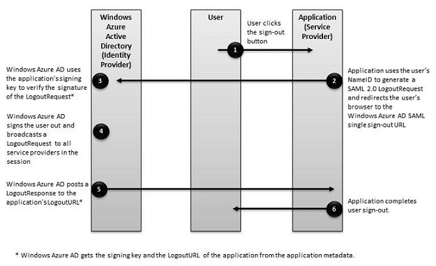

<properties
    pageTitle="Azure 单一注销 SAML 协议 | Azure"
    description="本文介绍 Azure Active Directory 中的单一注销 SAML 协议"
    services="active-directory"
    documentationcenter=".net"
    author="priyamohanram"
    manager="mbaldwin"
    editor="" />
<tags
    ms.assetid="0e4aa75d-d1ad-4bde-a94c-d8a41fb0abe6"
    ms.service="active-directory"
    ms.workload="identity"
    ms.tgt_pltfrm="na"
    ms.devlang="na"
    ms.topic="article"
    ms.date="02/08/2017"
    wacn.date="03/13/2017"
    ms.author="priyamo" />  

# 单一注销 SAML 协议
Azure Active Directory (Azure AD) 支持 SAML 2.0 Web 浏览器单一注销配置文件。若要使单一注销功能正常运行，必须在注册应用程序时在 Azure AD 中显式注册应用程序的 **LogoutURL**。Azure AD 使用 LogoutURL 在用户注销后对用户进行重定向。

下图显示了 Azure AD 单一注销过程的工作流。

## LogoutRequest
云服务将 `LogoutRequest` 消息发送到 Azure AD，以指示会话已终止。以下摘录显示了一个示例 `LogoutRequest` 元素。

	<samlp:LogoutRequest xmlns="urn:oasis:names:tc:SAML:2.0:metadata" ID="idaa6ebe6839094fe4abc4ebd5281ec780" Version="2.0" IssueInstant="2013-03-28T07:10:49.6004822Z" xmlns:samlp="urn:oasis:names:tc:SAML:2.0:protocol">
	  <Issuer xmlns="urn:oasis:names:tc:SAML:2.0:assertion">https://www.workaad.com</Issuer>
	  <NameID xmlns="urn:oasis:names:tc:SAML:2.0:assertion"> Uz2Pqz1X7pxe4XLWxV9KJQ+n59d573SepSAkuYKSde8=</NameID>
	</samlp:LogoutRequest>

### LogoutRequest
发送到 Azure AD 的 `LogoutRequest` 元素需要以下属性：

- `ID`：标识注销请求。`ID` 的值不能以数字开头。典型的做法是在 GUID 的字符串表示形式前面追加 **id**。
- `Version`：将此元素的值设置为 **2.0**。此值是必需的。
- `IssueInstant`：这是一个 `DateTime` 字符串，包含协调世界时 (UTC) 值并采用[往返格式（“o”）](https://msdn.microsoft.com/zh-cn/library/az4se3k1.aspx)。Azure AD 需要此类型的值，但这不是强制要求。

### 颁发者
`LogoutRequest` 中的 `Issuer` 元素必须与 Azure AD 中云服务的 **ServicePrincipalNames** 之一完全匹配。通常，此参数设置为应用程序注册期间指定的**应用 ID URI**。

### NameID
`NameID` 元素的值必须与要注销的用户的 `NameID` 完全匹配。

## LogoutResponse
Azure AD 在响应 `LogoutRequest` 元素时发送 `LogoutResponse`。以下摘录显示了一个示例 `LogoutResponse`。

	<samlp:LogoutResponse ID="_f0961a83-d071-4be5-a18c-9ae7b22987a4" Version="2.0" IssueInstant="2013-03-18T08:49:24.405Z" InResponseTo="iddce91f96e56747b5ace6d2e2aa9d4f8c" xmlns:samlp="urn:oasis:names:tc:SAML:2.0:protocol">
	  <Issuer xmlns="urn:oasis:names:tc:SAML:2.0:assertion">https://sts.chinacloudapi.cn/82869000-6ad1-48f0-8171-272ed18796e9/</Issuer>
	  <samlp:Status>
	    <samlp:StatusCode Value="urn:oasis:names:tc:SAML:2.0:status:Success" />
	  </samlp:Status>
	</samlp:LogoutResponse>

### LogoutResponse
Azure AD 会设置 `LogoutResponse` 元素中的 `ID`、`Version` 和 `IssueInstant` 值。它还会将 `InResponseTo` 元素设置为获取响应的 `LogoutRequest` 的 `ID` 属性值。

### Issuer
Azure AD 将此值设置为 `https://login.microsoftonline.com/<TenantIdGUID>/`，其中，<TenantIdGUID> 是 Azure AD 租户的租户 ID。

若要评估 `Issuer` 元素的值，请使用应用程序注册期间提供的**应用 ID URI** 值。

### Status
Azure AD 使用 `Status` 元素中的 `StatusCode` 元素指示注销的成功或失败状态。如果注销尝试失败，`StatusCode` 元素还可能包含自定义错误消息。

<!---HONumber=Mooncake_0306_2017-->
<!---Update_Description: wording update -->