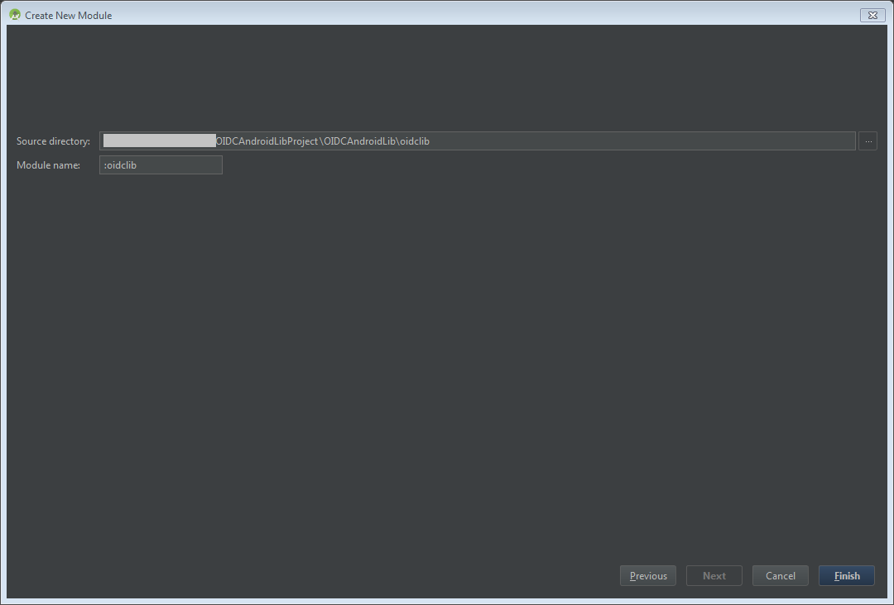
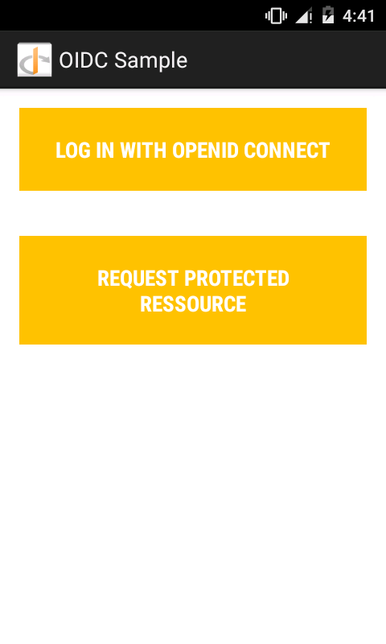
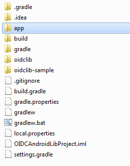
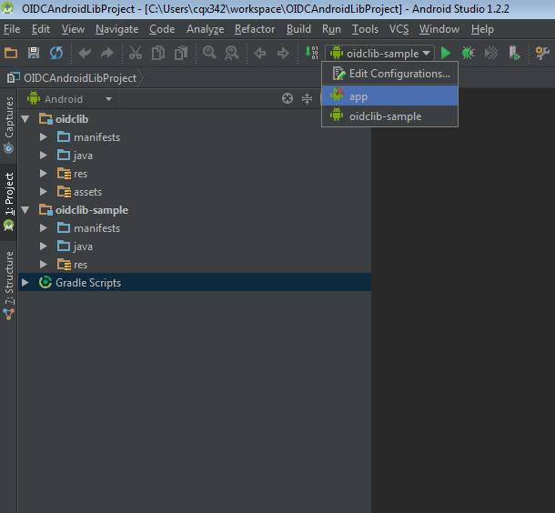

<properties
	pageTitle="Azure Active Directory v2.0 Android 应用 | Azure"
	description="如何生成一个使用 Microsoft 个人帐户和工作或学校帐户让用户登录并通过第三方库调用图形 API 的 Android 应用。"
	services="active-directory"
	documentationCenter=""
	authors="brandwe"
	manager="mbaldwin"
	editor=""/>  

<tags
	ms.service="active-directory"
	ms.workload="identity"
	ms.tgt_pltfrm="na"
	ms.devlang="na"
	ms.topic="article"
	ms.date="09/16/2016"
	wacn.date="10/25/2016"
	ms.author="brandwe"/>  

#  使用 v2.0 终结点，通过图形 API 将登录添加到使用第三方库的 Android 应用

Microsoft 标识平台使用开放式标准，例如 OAuth2 和 OpenID Connect。开发人员可以使用任何想要的库来与我们的服务集成。为了帮助开发人员将我们的平台与其他库结合使用，我们撰写了数篇演练（例如本演练），演示如何配置第三方库，使其连接到 Microsoft 标识平台。大部分实施 [RFC6749 OAuth2 规范](https://tools.ietf.org/html/rfc6749)的库都能连接到 Microsoft 标识平台。

借助本演练创建的应用程序，用户可以使用图形 API 登录到其组织，然后在组织中搜索他们自己。

如果你是 OAuth2 或 OpenID Connect 新手，此示例配置可能不太适合你。建议阅读 [2\.0 协议 — OAuth 2.0 授权代码流](/documentation/articles/active-directory-v2-protocols-oauth-code/)了解背景信息。

> [AZURE.NOTE] 我们平台中的有些功能（例如条件访问和 Intune 策略管理）采用 OAuth2 或 OpenID Connect 标准中的表达式，所以会要求使用开放源代码 Azure 标识库。

v2.0 终结点并不支持所有 Azure Active Directory 方案和功能。

> [AZURE.NOTE] 若要确定是否应使用 v2.0 终结点，请阅读 [v2.0 限制](/documentation/articles/active-directory-v2-limitations/)。

## 从 GitHub 下载代码。
本教程的代码[在 GitHub 上](https://github.com/azure-samples/active-directory-android-native-oidcandroidlib-v2)维护。若要遵照该代码，你可以[下载 .zip 格式应用骨架](git@github.com:Azure-Samples/active-directory-android-native-oidcandroidlib-v2.git/archive/skeleton.zip)，或克隆该骨架：

	git clone --branch skeleton git@github.com:Azure-Samples/active-directory-android-native-oidcandroidlib-v2.git

你也可以下载以下示例，并立即开始使用：

	git@github.com:Azure-Samples/active-directory-android-native-oidcandroidlib-v2.git

## 注册应用程序
在[应用程序注册门户](https://apps.dev.microsoft.com)创建新的应用，或按照[如何使用 v2.0 终结点注册应用](/documentation/articles/active-directory-v2-app-registration/)中的详细步骤操作。请确保：

- 复制分配给应用的“应用程序 ID”，因为稍后将要用到。
- 为应用添加**移动**平台。

> 注：应用程序注册门户提供**重定向 URI** 值。但是，在此示例中，必须使用 `https://login.microsoftonline.com/common/oauth2/nativeclient` 的默认值。

## 下载 NXOAuth2 第三方库并创建工作区

在本演练中，你将使用来自 GitHub 的 OIDCAndroidLib，这是基于 Google 的 OpenID Connect 代码 OAuth2 库。它将实现本机应用程序配置文件，并支持用户的授权终结点。这些是需要与 Microsoft 标识平台集成的所有项目。

将 OIDCAndroidLib 副本克隆到你的计算机。

	git@github.com:kalemontes/OIDCAndroidLib.git

  

## 设置 Android Studio 环境

1. 创建一个新的 Android Studio 项目并接受向导中的默认值。

	

	

	  

2. 若要设置项目模块，请将克隆的副本移到项目位置。你还可以创建项目，然后将其直接克隆到项目位置。

	  

3. 使用上下文菜单或使用 Ctrl + Alt + Maj + S 快捷键打开项目模块设置。

	  

4. 删除默认的应用程序模块，因为你只要项目容器设置。

	

5. 将克隆的副本中的模块导入当前项目。

	 
	

6. 针对 `oidlib-sample` 模块重复上述步骤。

7. 检查 `oidlib-sample` 模块上的 oidclib 依赖项。

	  

8. 单击“确定”并等待 gradle 同步。

	你的 settings.gradle 内容应如下所示：

	  

9. 生成示例应用程序，以确保示例正常运行。

	你目前无法将此示例应用程序与 Azure Active Directory 配合使用。我们需要首先配置一些终结点。这是为了确保开始自定义示例应用程序之前没有 Android Studio 问题。

10. 生成 `oidlib-sample` 并将其作为 Android Studio 中的目标运行。

	  

11. 删除从项目中删除模块时留下的 `app ` 目录，因为出于安全性的考虑，Android Studio 不会删除该目录。

	  

12. 打开“编辑配置”菜单，删除从项目中删除模块时还留下的运行配置。

	 
	

## 配置示例的终结点

现在 `oidlib-sample` 已成功运行，让我们编辑一些终结点，使其与 Azure Active Directory 配合使用。

### 通过编辑 oidc\_clientconf.xml 文件来配置你的客户端

1. 由于你只使用 OAuth2 流来获得令牌并调用图形 API，因此将客户端设置为只使用 OAuth2。在后面的示例中将使用 OIDC。

	xml

	    <bool name="oidc_oauth2only">true</bool>
	

2. 配置从注册门户收到的客户端 ID。

	xml

	    <string name="oidc_clientId">86172f9d-a1ae-4348-aafa-7b3e5d1b36f5</string>
	    <string name="oidc_clientSecret"></string>
	

3. 使用下面的文本配置重定向 URI。

	xml

	    <string name="oidc_redirectUrl">https://login.microsoftonline.com/common/oauth2/nativeclient</string>
	

4. 配置访问图形 API 所需的范围。

	xml

	    <string-array name="oidc_scopes">
	        <item>openid</item>
	        <item>https://graph.microsoft.com/User.Read</item>
	        <item>offline_access</item>
	    </string-array>
	

`oidc_scopes` 中的 `User.Read` 值允许读取已登录用户的基本配置文件。
你可以在 [Microsoft Graph 权限范围](https://graph.microsoft.io/docs/authorization/permission_scopes)中了解有关所有可用范围的详细信息。

如果你想要了解有关作为 OpenID Connect 中的范围的 `openid` 或 `offline_access` 的解释，请参阅 [2\.0 协议 - OAuth 2.0 授权代码流](/documentation/articles/active-directory-v2-protocols-oauth-code/)。

### 通过编辑 oidc\_endpoints.xml 文件配置客户端终结点

- 打开 `oidc_endpoints.xml` 文件并进行以下更改：

xml

	<!-- Stores OpenID Connect provider endpoints. -->
	<resources>
	    <string name="op_authorizationEnpoint">https://login.microsoftonline.com/common/oauth2/v2.0/authorize</string>
	    <string name="op_tokenEndpoint">https://login.microsoftonline.com/common/oauth2/v2.0/token</string>
	    <string name="op_userInfoEndpoint">https://www.example.com/oauth2/userinfo</string>
	    <string name="op_revocationEndpoint">https://www.example.com/oauth2/revoketoken</string>
	</resources>
	

如果你使用 OAuth2 作为你的协议，应始终不更改这些终结点。

> [AZURE.NOTE]
目前 Azure Active Directory 不支持 `userInfoEndpoint` 和 `revocationEndpoint` 的终结点。如果保留这些终结点的默认值 example.com，那么将提示你这些终结点不可用于该示例中:-)

## 配置图形 API 调用

- 打开 `HomeActivity.java` 文件并进行以下更改：

Java

	   //TODO: set your protected resource url
	    private static final String protectedResUrl = "https://graph.microsoft.com/v1.0/me/";
	

此处简单的图形 API 调用将返回我们的信息。

这些是你需要执行的所有更改。运行 `oidlib-sample` 应用程序，然后单击“登录”。

身份验证成功后，请选择“请求受保护资源”按钮测试对图形 API 的调用。

## 获取产品的安全更新

我们建议你通过访问[安全技术中心](https://technet.microsoft.com/security/dd252948)并订阅“安全公告”来获取有关安全事件的通知。

<!---HONumber=Mooncake_1017_2016-->
