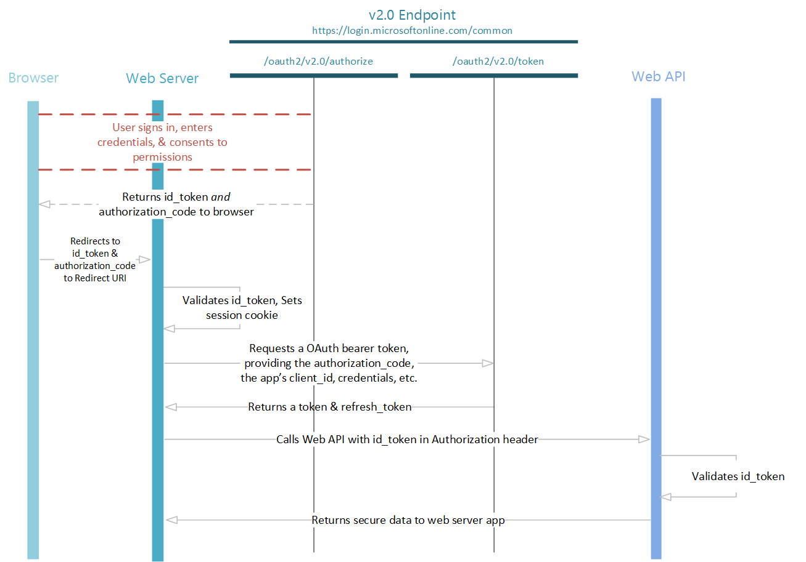

<properties
    pageTitle="Azure Active Directory v2.0 和 OpenID Connect 协议 | Azure"
    description="使用 OpenID Connect 身份验证协议的 Azure AD v2.0 实现构建 Web 应用程序。"
    services="active-directory"
    documentationcenter=""
    author="dstrockis"
    manager="mbaldwin"
    editor="" />
<tags
    ms.assetid="a4875997-3aac-4e4c-b7fe-2b4b829151ce"
    ms.service="active-directory"
    ms.workload="identity"
    ms.tgt_pltfrm="na"
    ms.devlang="na"
    ms.topic="article"
    ms.date="01/07/2017"
    wacn.date="02/13/2017"
    ms.author="dastrock" />  

# Azure Active Directory v2.0 和 OpenID Connect 协议
OpenID Connect 是构建在 OAuth 2.0 基础之上的身份验证协议，可用于将用户安全登录到 Web 应用程序。使用 v2.0 终结点的 OpenID Connect 实现时，可将登录功能和 API 访问权限添加到基于 Web 的应用中。本文说明如何在各种语言中执行此操作。其中将会介绍如何在不使用任何 Microsoft 开源库的情况下发送和接收 HTTP 消息。

> [AZURE.NOTE]
v2.0 终结点并不支持所有 Azure Active Directory 方案和功能。若要确定是否应使用 v2.0 终结点，请阅读 [v2.0 限制](/documentation/articles/active-directory-v2-limitations/)。
> 
> 

[OpenID Connect](http://openid.net/specs/openid-connect-core-1_0.html) 扩展了 OAuth 2.0 *授权*协议，可用作*身份验证*协议，让你使用 OAuth 执行单一登录。OpenID Connect 引入了 *ID 令牌*的概念，这是一种安全令牌，可让客户端验证用户的标识。ID 令牌还可获取有关用户的基本配置文件信息。由于 OpenID Connect 扩展了 OAuth 2.0，因此应用可以安全获取*访问令牌*，而这些令牌又可用于访问[授权服务器](/documentation/articles/active-directory-v2-protocols/#the-basics/)保护的资源。如果要构建的 [Web 应用程序](/documentation/articles/active-directory-v2-flows/#web-apps/)托管在服务器中并通过浏览器访问，我们建议使用 OpenID Connect。

## 协议图：登录
最基本的登录流包含下图中所示的步骤。本文将详细描述每个步骤。

  

## 提取 OpenID Connect 元数据文档
OpenID Connect 描述了元数据文档，该文档包含了应用执行登录所需的大部分信息。这些信息包括要使用的 URL 以及服务公共签名密钥的位置。对于 v2.0 终结点，应使用的 OpenID Connect 的元数据文档为：

	https://login.microsoftonline.com/{tenant}/v2.0/.well-known/openid-configuration

`{tenant}` 可取以下四个值之一：

| 值 | 说明 |
| --- | --- |
| `common` |在 Azure Active Directory (Azure AD) 中具有个人 Microsoft 帐户和工作或学校帐户的用户可以登录到应用程序。 |
| `organizations` |只有在 Azure AD 中具有工作或学校帐户的用户才能登录到应用程序。 |
| `consumers` |只有具有个人 Microsoft 帐户的用户才能登录到应用程序。 |
| `8eaef023-2b34-4da1-9baa-8bc8c9d6a490` 或 `contoso.partner.onmschina.cn` |只有在特定 Azure AD 租户中具有工作或学校帐户的用户才能登录到应用程序。可以使用 Azure AD 租户的友好域名或租户的 GUID 标识符。 |

元数据是一个简单的 JavaScript 对象表示法 (JSON) 文档。有关示例，请参阅以下代码片段。[OpenID Connect 规范](https://openid.net)中完整介绍了该代码片段的内容。

	{
	  "authorization_endpoint": "https:\/\/login.microsoftonline.com\/common\/oauth2\/v2.0\/authorize",
	  "token_endpoint": "https:\/\/login.microsoftonline.com\/common\/oauth2\/v2.0\/token",
	  "token_endpoint_auth_methods_supported": [
	    "client_secret_post",
	    "private_key_jwt"
	  ],
	  "jwks_uri": "https:\/\/login.microsoftonline.com\/common\/discovery\/v2.0\/keys",
  
	  ...
  
	}

通常，使用此元数据文档来配置 OpenID Connect 库或 SDK；该库使用元数据来完成其工作。但是，如果不使用预生成的 OpenID Connect 库，则可以按照本文剩余部分的步骤来使用 v2.0 终结点执行 Web 应用中的登录。

## 发送登录请求
当 Web 应用需要对用户进行身份验证时，可以将用户定向到 `/authorize` 终结点。此请求类似于 [OAuth 2.0 授权代码流](/documentation/articles/active-directory-v2-protocols-oauth-code/)的第一个阶段，不过存在以下重要区别：

- 请求必须在 `scope` 参数中包含范围 `openid`。
- `response_type` 参数必须包含 `id_token`。
- 请求必须包含 `nonce` 参数。

例如：

	// Line breaks for legibility only
	
	GET https://login.microsoftonline.com/{tenant}/oauth2/v2.0/authorize?
	client_id=6731de76-14a6-49ae-97bc-6eba6914391e
	&response_type=id_token
	&redirect_uri=http%3A%2F%2Flocalhost%2Fmyapp%2F
	&response_mode=form_post
	&scope=openid
	&state=12345
	&nonce=678910
	

> [AZURE.TIP]
> 单击以下链接执行此请求！登录后，浏览器将重定向到 https://localhost/myapp/，地址栏中会包含一个 ID 令牌。请注意，此请求使用 `response_mode=query`（仅用于演示）。建议使用 `response_mode=form_post`。
> <a href="https://login.microsoftonline.com/common/oauth2/v2.0/authorize?client_id=6731de76-14a6-49ae-97bc-6eba6914391e&response_type=id_token&redirect_uri=http%3A%2F%2Flocalhost%2Fmyapp%2F&scope=openid&response_mode=query&state=12345&nonce=678910" target="_blank">https://login.microsoftonline.com/common/oauth2/v2.0/authorize...</a>
> 
> 

| 参数 | 条件 | 说明 |
| --- | --- | --- |
| tenant |必选 |可以在请求路径中使用 `{tenant}` 值来控制谁可以登录到应用程序。允许的值为 `common`、`organizations`、`consumers` 和租户标识符。有关详细信息，请参阅[协议基础知识](/documentation/articles/active-directory-v2-protocols/#endpoints/)。 |
| client\_id |必选 |[应用程序注册门户](https://apps.dev.microsoft.com/?referrer=/documentation/articles&deeplink=/appList)为应用分配的应用程序 ID。 |
| response\_type |必选 |必须包含 OpenID Connect 登录的 `id_token`。还可以包含其他 `response_types` 值，例如 `code`。 |
| redirect\_uri |建议 |应用的重定向 URI，应用可在其中发送和接收身份验证响应。必须完全符合在门户中注册的重定向 URI 之一，否则必须是编码的 URL。 |
| scope |必选 |范围的空格分隔列表。针对 OpenID Connect，即必须包含范围 `openid`，其在许可 UI 中转换为“将你登录”权限。也可以在此请求中包含其他范围来请求许可。 |
| nonce |必选 |由应用生成且包含在请求中的值，以声明方式包含在生成的 id\_token 值中。应用可以验证此值，以缓解令牌重放攻击。该值通常是随机化的唯一字符串，可用于标识请求的来源。 |
| response\_mode |建议 |指定将生成的授权代码发回给应用时应该使用的方法。可以是 `query`、`form_post` 或 `fragment` 之一。对于 Web 应用程序，建议使用 `response_mode=form_post`，确保以最安全的方式将令牌传输到应用程序。 |
| state |建议 |同样随令牌响应返回的请求中所包含的值。可以是所需的任何内容的字符串。随机生成的唯一值通常用于[防范跨站点请求伪造攻击](http://tools.ietf.org/html/rfc6749#section-10.12)。该状态还用于在身份验证请求出现之前，在应用中编码用户的状态信息，例如用户过去所在的页面或视图。 |
| prompt |可选 |表示需要的用户交互类型。目前，唯一有效的值为 `login`、`none` 和 `consent`。`prompt=login` 声明强制用户针对该请求输入凭据，否定单一登录。`prompt=none` 声明则相反。此声明确保不对用户显示任何交互式提示如果请求无法通过单一登录以静默方式完成，v2.0 终结点将返回错误。`prompt=consent` 声明在用户登录之后触发 OAuth 许可对话。该对话询问用户是否要向应用授予权限。 |
| login\_hint |可选 |如果事先知道用户名，可以使用此参数预先填充用户登录页的用户名/电子邮件地址字段。通常，应用在重新身份验证期间已使用 `preferred_username` 声明从前次登录提取用户名之后，会使用此参数。 |
| domain\_hint |可选 |此值可为 `consumers` 或 `organizations`。如果包含，用户将跳过 v2.0 登录页上基于电子邮件的发现过程，这可以稍微提升用户体验的流畅度。通常，应用在重新身份验证期间通过从 ID 令牌提取 `tid` 声明来使用此参数。如果 `tid` 声明值为 `9188040d-6c67-4c5b-b112-36a304b66dad`，则使用 `domain_hint=consumers`，否则使用 `domain_hint=organizations`。 |

此时，系统会提示用户输入凭据并完成身份验证。v2.0 终结点将验证用户是否已许可 `scope` 查询参数中指定的权限。如果用户未许可其中的任何权限，v2.0 终结点将提示用户许可所需的权限。阅读有关[权限、许可与多租户应用](/documentation/articles/active-directory-v2-scopes/)的详细信息。

用户经过身份验证并许可后，v2.0 终结点将使用 `response_mode` 参数中指定的方法，将响应返回到位于指定重定向 URI 处的应用。

### 成功的响应
使用 `response_mode=form_post` 时的成功响应如下所示：

	POST /myapp/ HTTP/1.1
	Host: localhost
	Content-Type: application/x-www-form-urlencoded
	
	id_token=eyJ0eXAiOiJKV1QiLCJhbGciOiJSUzI1NiIsIng1dCI6Ik1uQ19WWmNB...&state=12345
	

| 参数 | 说明 |
| --- | --- |
| id\_token |应用请求的 ID 令牌。可以使用 `id_token` 参数验证用户的标识，开始与用户建立会话。有关 ID 令牌及其内容的更多详细信息，请参阅 [v2.0 终结点令牌参考](/documentation/articles/active-directory-v2-tokens/)。 |
| state |如果请求中包含 `state` 参数，响应中就应该出现相同的值。应用应该验证请求和响应中的 state 值是否完全相同。 |

### 错误响应
也可以将错误响应发送到重定向 URI，使应用能够处理这些响应。错误响应如下所示：

	POST /myapp/ HTTP/1.1
	Host: localhost
	Content-Type: application/x-www-form-urlencoded
	
	error=access_denied&error_description=the+user+canceled+the+authentication
	

| 参数 | 说明 |
| --- | --- |
| error |可用于对发生的错误分类以及对错误做出反应的错误代码字符串。 |
| error\_description |帮助识别身份验证错误根本原因的特定错误消息。 |

### 授权终结点错误的错误代码 
下表描述了可在错误响应的 `error` 参数中返回的错误代码：

| 错误代码 | 说明 | 客户端操作 |
| --- | --- | --- |
| invalid\_request |协议错误，例如，缺少必需的参数。 |修复并重新提交请求。这通常是在初始测试期间捕获的开发错误。 |
| unauthorized\_client |客户端应用程序无法请求授权代码。 |客户端应用程序未注册到 Azure AD 中或者未添加到用户的 Azure AD 租户时，通常会出现这种情况。应用程序可以提示用户，说明如何安装应用程序并将其添加到 Azure AD。 |
| access\_denied |资源所有者拒绝许可。 |客户端应用程序可以通知用户，除非用户许可，否则无法继续。 |
| unsupported\_response\_type |授权服务器不支持请求中的响应类型。 |修复并重新提交请求。这通常是在初始测试期间捕获的开发错误。 |
| server\_error |服务器遇到意外的错误。 |重试请求。这些错误可能是临时状况导致的。客户端应用程序可向用户说明，其响应由于临时错误而延迟。 |
| temporarily\_unavailable |服务器暂时繁忙，无法处理请求。 |重试请求。客户端应用程序可向用户说明，其响应由于临时状况而延迟。 |
| invalid\_resource |目标资源无效，原因是它不存在，Azure AD 找不到它，或者未正确配置。 |这表示未在租户中配置该资源（如果存在）。应用程序可以提示用户，说明如何安装应用程序并将其添加到 Azure AD。 |

## 验证 ID 令牌 
仅接收 ID 令牌并不足以验证用户的身份。还必须验证 ID 令牌的签名，并根据应用的要求验证令牌中的声明。v2.0 终结点使用 [JSON Web 令牌 (JWT)](http://self-issued.info/docs/draft-ietf-oauth-json-web-token.html) 和公钥加密对令牌进行签名并验证其是否有效。

可以选择验证客户端代码中的 ID 令牌，但是常见的做法是将 ID 令牌发送到后端服务器，在那里执行验证。验证 ID 令牌的签名后，需要验证一些声明。有关详细信息，包括有关[验证令牌](/documentation/articles/active-directory-v2-tokens/#validating-tokens/)的详细信息和[有关签名密钥滚动更新的重要信息](/documentation/articles/active-directory-v2-tokens/#validating-tokens/)，请参阅 [v2.0 令牌参考](/documentation/articles/active-directory-v2-tokens/)。我们建议使用库来分析和验证令牌。大多数语言和平台都至少有一个可用的库。
<!--TODO: Improve the information on this-->

你可能还希望根据自己的方案验证其他声明。一些常见的验证包括：

- 确保用户或组织已注册应用。
- 确保用户拥有所需的授权或权限。
- 确保身份验证具有一定的强度，例如多重身份验证。

有关 ID 令牌中的声明的详细信息，请参阅 [v2.0 终结点令牌参考](/documentation/articles/active-directory-v2-tokens/)。

完全验证 ID 令牌后，即可开始与用户建立会话。使用 ID 令牌中的声明来获取有关应用中的用户的信息。可将此信息用于显示、记录、授权，等等。

## 发送注销请求
目前，v2.0 终结点不支持 OpenID Connect `end_session_endpoint`。这意味着应用无法向 v2.0 终结点发送请求，因而无法结束用户会话并清除 v2.0 终结点设置的 Cookie。若要将用户注销，应用只需结束自身的用户会话，在 v2.0 终结点中将用户的会话保留不变。下次用户尝试登录时，将看到列出其有效登录帐户的“选择帐户”页。在该页上，用户可以选择注销任一帐户，结束 v2.0 终结点中的会话。

<!--

When you want to sign out the user from your app, it isn't sufficient to clear your app's cookies or otherwise end the user's session. You must also redirect the user to the v2.0 endpoint to sign out. If you don't do this, the user re-authenticates to your app without entering their credentials again, because they will have a valid single sign-in session with the v2.0 endpoint.

You can redirect the user to the `end_session_endpoint` listed in the OpenID Connect metadata document:

	GET https://login.microsoftonline.com/common/oauth2/v2.0/logout?
	post_logout_redirect_uri=http%3A%2F%2Flocalhost%2Fmyapp%2F

| Parameter | Condition | Description |
| ----------------------- | ------------------------------- | ------------ |
| post_logout_redirect_uri | Recommended | The URL that the user is redirected to after successfully signing out. If the parameter is not included, the user is shown a generic message that's generated by the v2.0 endpoint. |

-->

## 协议图：令牌获取
许多 Web 应用不仅需要将用户登录，而且还要代表该用户使用 OAuth 来访问 Web 服务。此方案合并了用于对用户进行身份验证的 OpenID Connect，同时将获取授权代码，用于通过 OAuth 授权代码流来获取访问令牌。

完整的 OpenID Connect 登录和令牌获取流如下图所示。本文的后续部分将详细介绍每个步骤。

  

## 获取访问令牌
若要获取访问令牌，请修改登录请求：

	// Line breaks are for legibility only.

	GET https://login.microsoftonline.com/{tenant}/oauth2/v2.0/authorize?
	client_id=6731de76-14a6-49ae-97bc-6eba6914391e        // Your registered Application ID
	&response_type=id_token%20code
	&redirect_uri=http%3A%2F%2Flocalhost%2Fmyapp%2F       // Your registered redirect URI, URL encoded
	&response_mode=form_post                              // 'query', 'form_post', or 'fragment'
	&scope=openid%20                                      // Include both 'openid' and scopes that your app needs  
	offline_access%20                                         
	https%3A%2F%2Fgraph.microsoft.com%2Fmail.read
	&state=12345                                          // Any value, provided by your app
	&nonce=678910                                         // Any value, provided by your app

> [AZURE.TIP]
单击以下链接执行此请求！登录后，浏览器将重定向到 https://localhost/myapp/，地址栏中会包含一个 ID 令牌和一个代码。请注意，此请求使用 `response_mode=query`（仅用于演示）。建议使用 `response_mode=form_post`。<a href="https://login.microsoftonline.com/common/oauth2/v2.0/authorize?client_id=6731de76-14a6-49ae-97bc-6eba6914391e&response_type=id_token%20code&redirect_uri=http%3A%2F%2Flocalhost%2Fmyapp%2F&response_mode=query&scope=openid%20offline_access%20https%3A%2F%2Fgraph.microsoft.com%2Fmail.read&state=12345&nonce=678910" target="_blank">https://login.microsoftonline.com/common/oauth2/v2.0/authorize...</a>
> 
> 

通过在请求中包含权限范围并使用 `response_type=id_token code`，v2.0 终结点可确定用户已许可 `scope` 查询参数中指定的权限。v2.0 终结点会将授权代码返回给应用，以交换访问令牌。

### 成功的响应
使用 `response_mode=form_post` 后的成功响应如下所示：

	POST /myapp/ HTTP/1.1
	Host: localhost
	Content-Type: application/x-www-form-urlencoded

	id_token=eyJ0eXAiOiJKV1QiLCJhbGciOiJSUzI1NiIsIng1dCI6Ik1uQ19WWmNB...&code=AwABAAAAvPM1KaPlrEqdFSBzjqfTGBCmLdgfSTLEMPGYuNHSUYBrq...&state=12345

| 参数 | 说明 |
| --- | --- |
| id\_token |应用请求的 ID 令牌。可以使用 ID 令牌验证用户的标识，开始与用户建立会话。在 [v2.0 终结点令牌参考](/documentation/articles/active-directory-v2-tokens/)中可以找到有关 ID 令牌及其内容的更多详细信息。 |
| code |应用请求的授权代码。应用可以使用授权代码请求目标资源的访问令牌。授权代码的生存期很短。通常，授权代码在大约 10 分钟后即会过期。 |
| state |如果请求中包含 state 参数，响应中就应该出现相同的值。应用应该验证请求和响应中的 state 值是否完全相同。 |

### 错误响应
也可以将错误响应发送到重定向 URI，使应用能够适当地处理这些响应。错误响应如下所示：

	POST /myapp/ HTTP/1.1
	Host: localhost
	Content-Type: application/x-www-form-urlencoded

	error=access_denied&error_description=the+user+canceled+the+authentication

| 参数 | 说明 |
| --- | --- |
| error |可用于对发生的错误分类以及对错误做出反应的错误代码字符串。 |
| error\_description |帮助识别身份验证错误根本原因的特定错误消息。 |

有关可能的错误代码和建议的客户端操作的说明，请参阅[授权终结点错误的错误代码](#error-codes-for-authorization-endpoint-errors)。

获取授权代码和 ID 令牌之后，可将用户登录，并代表用户获取访问令牌。若要将用户登录，必须[完全根据说明](#validate-the-id-token)验证 ID 令牌。若要获取访问令牌，请遵循 [OAuth 协议文档](/documentation/articles/active-directory-v2-protocols-oauth-code/#request-an-access-token/)中所述的步骤。

<!---HONumber=Mooncake_0206_2017-->
<!--Update_Description: wording update-->