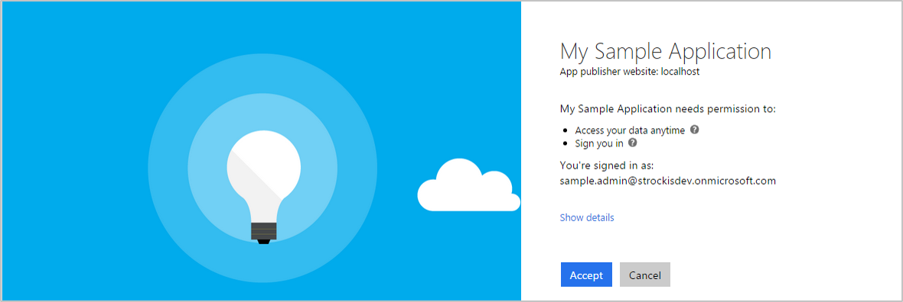

<properties
	pageTitle="Azure AD v2.0 的范围、权限和同意 | Azure"
	description="介绍 Azure AD v2.0 终结点中的授权，包括范围、权限和同意。"
	services="active-directory"
	documentationCenter=""
	authors="dstrockis"
	manager="mbaldwin"
	editor=""/>  

<tags
	ms.service="active-directory"
	ms.workload="identity"
	ms.tgt_pltfrm="na"
	ms.devlang="na"
	ms.topic="article"
	ms.date="09/30/2016"
	wacn.date="11/08/2016"
	ms.author="dastrock"/>  

# v2.0 终结点中的范围、权限和同意

与 Azure AD 集成的应用程序遵循可让用户控制应用程序如何访问其数据的特定授权模型。此授权模型的 v2.0 实现已更新，其中更改了应用程序必须与 Azure AD 交互的方式。本主题涵盖此授权模型的基本概念，包括范围、权限和同意。

> [AZURE.NOTE]
	v2.0 终结点并不支持所有 Azure Active Directory 方案和功能。若要确定是否应使用 v2.0 终结点，请阅读 [v2.0 限制](/documentation/articles/active-directory-v2-limitations/)。

## 范围和权限

Azure AD 实施 [OAuth 2.0](/documentation/articles/active-directory-v2-protocols/) 授权协议，此方法允许第三方应用代表用户访问 Web 托管的资源。任何与 Azure AD 集成的 Web 托管资源都有资源标识符或**应用程序 ID URI**。例如，Microsoft 的某些 Web 托管资源包括：

- Office 365 统一邮件 API：`https://outlook.office.com`
- Azure AD 图形 API：`https://graph.chinacloudapi.cn`
- Microsoft Graph：`https://graph.microsoft.com`

这也适用于已与 Azure AD 集成的任何第三方资源。这些资源还可以定义一组可用于将该资源的功能分区成较小区块的权限。例如，Microsoft Graph 定义了以下几个权限：

- 读取用户的日历
- 写入用户的日历
- 以用户身份发送邮件
- [更多](https://graph.microsoft.io)

通过定义这些权限，资源可以更细微地掌控其数据及如何对外界公开数据的方式。第三方应用程序接着可以向最终用户请求这些权限，而最终用户必须先批准这些权限，应用程序才可以代表他们执行操作。将资源的功能切割成较小的权限集，即可将第三方应用程序构建为只请求他们所需的特定权限，以便执行其职责。它还可让用户完全知道应用程序将如何使用其数据，如此他们才对应用程序的行为不受恶意攻击影响更具信心。

在 Azure AD 和 OAuth 中，这些权限也称为**范围**。你还可能看到它们被称为 **oAuth2Permissions**。在 Azure AD 中范围以字符串值表示。仍以 Microsoft Graph 为例，每个权限的范围值如下：

- 读取用户的日历：`Calendar.Read`
- 写入用户的日历：`Mail.ReadWrite`
- 以用户身份发送邮件：`Mail.Send`

如下所述，在对 v2.0 终结点的请求中指定范围，应用程序即可请求这些权限。

## OpenId Connect 范围

OpenID Connect 的 v2.0 实现有一些明确定义但未应用到任何特定资源的范围 - `openid`、`email`、`profile` 和 `offline_access`。

#### OpenId

如果应用使用 [OpenID Connect](/documentation/articles/active-directory-v2-protocols/) 执行登录，则必须请求 `openid` 范围。`openid` 范围在工作帐户同意屏幕上显示为“登录”权限，而在个人 Microsoft 帐户同意屏幕上显示为“查看你的配置文件并使用你的 Microsoft 帐户连接到应用程序和服务”权限。此权限使应用能够以 `sub` 声明的形式接收用户的唯一标识符。它还会向应用提供对用户信息终结点的访问权限。`openid` 范围还可用于在 v2.0 令牌终结点获取 id\_token，该令牌可用于保护应用不同组件之间的 HTTP 调用。

#### 电子邮件

`email` 范围可以连同 `openid` 范围和任何其他范围一起包含。它以 `email` 声明的形式向应用提供对用户主要电子邮件地址的访问权限。如果电子邮件地址与用户帐户关联（并非总是如此），则 `email` 声明只包含在令牌中。如果使用 `email` 范围，应用应该准备好处理 `email` 声明不存在于令牌中的情况。

#### 配置文件

`profile` 范围可以连同 `openid` 范围和任何其他范围一起包含。它提供大量用户信息的应用程序访问权限。这包括但不限于用户的名字、姓氏、首选用户名、对象 ID 等等。有关给定用户的 id\_token 中可用的配置文件声明的完整列表，请参阅 [v2.0 令牌参考](/documentation/articles/active-directory-v2-tokens/)。

#### Offline\_access

[`offline_access` 范围](http://openid.net/specs/openid-connect-core-1_0.html#OfflineAccess)允许应用在较长时间内代表用户访问资源。在公司帐户同意屏幕上，此范围显示为“随时访问你的数据”权限。在个人 Microsoft 帐户同意屏幕上，则显示为“随时访问你的信息”权限。用户批准 `offline_access` 范围后，应用将能够接收来自 v2.0 令牌终结点的刷新令牌。刷新令牌属于长效令牌，可让应用程序在旧的访问令牌过期时获取新的访问令牌。

如果应用未请求 `offline_access` 范围，则收不到 refresh\_tokens。这意味着，当在 [OAuth 2.0 授权代码流](/documentation/articles/active-directory-v2-protocols/)中兑换 authorization\_code 时，只从 `/token` 终结点接收 access\_token。该 access\_token 短时间维持有效（通常是一小时），但最后终将过期。到时，应用必须将用户重定向回到 `/authorize` 终结点以检索新的 authorization\_code。在此重定向期间，根据应用程序的类型，用户或许无需再次输入其凭据或重新同意权限。

有关如何获取及使用刷新令牌的详细信息，请参阅 [v2.0 协议参考](/documentation/articles/active-directory-v2-protocols/)。

## 请求单个用户的同意

在 [OpenID Connect 或 OAuth 2.0](/documentation/articles/active-directory-v2-protocols/) 授权请求中，应用可以使用 `scope` 查询参数来请求它所需的权限。例如，当用户登录应用程序时，应用程序发送如下所示的请求（包含换行符以便于阅读）：

	GET https://login.microsoftonline.com/common/oauth2/v2.0/authorize?
	client_id=6731de76-14a6-49ae-97bc-6eba6914391e
	&response_type=code
	&redirect_uri=http%3A%2F%2Flocalhost%2Fmyapp%2F
	&response_mode=query
	&scope=
	https%3A%2F%2Fgraph.microsoft.com%2Fcalendar.read%20
	https%3A%2F%2Fgraph.microsoft.com%2Fmail.send
	&state=12345

`scope` 参数是应用程序所请求的范围列表（以空格分隔）。将范围值附加到资源的标识符（应用程序 ID URI）可指示每个范围。上述请求表示应用程序需要相应的权限来读取用户的邮箱，以及以用户身分发送邮件。

在用户输入其凭据之后，v2.0 终结点将检查是否有匹配的**用户同意**记录。如果用户未曾同意所请求权限的任何一项，v2.0 终结点将请求用户授予请求的权限。

当用户批准权限时，则记录同意，用户在后续登录时无需重新同意。

## 请求整个租户的同意

组织购买应用程序的许可证或订阅时，通常想要为其员工进行完全预配。在此过程中，公司管理员可以代表任何员工授予对该应用程序的同意。授予整个租户的同意后，该组织的员工不会看到该应用程序的同意屏幕。

若要请求租户中所有用户的同意，应用可使用**管理员同意终结点**，如下所述。

## 受管理员限制的范围

Microsoft 生态系统中的某些高特权权限可以标记为**受管理员限制**。此类范围的示例包括：

- 读取组织的目录数据：`Directory.Read`
- 将数据写入组织的目录：`Directory.ReadWrite`
- 读取组织目录中的安全组：`Groups.Read.All`

虽然使用者用户可以授予应用程序对此类数据的访问权限，但组织用户会受到限制，无法授予对同一敏感公司数据集的访问权限。如果应用程序向组织用户请求访问以下权限之一，用户会收到错误消息，指明他们未经授权，无法同意应用的权限。

如果应用需要访问组织的这些受管理员限制的范围，同样应该使用**管理员同意终结点**直接向公司管理员请求相关权限，如下所述。

管理员通过管理员同意终结点授予这些权限时，会代表租户中的所有用户授予同意，如上所述。

## 使用管理员同意终结点

执行以下步骤后，应用就能够收集给定租户中所有用户的权限，包括受管理员限制的范围。若要查看实现下述步骤的代码示例，请参阅[受管理员限制的范围示例](https://github.com/Azure-Samples/active-directory-dotnet-admin-restricted-scopes-v2)。

#### 在应用注册门户中请求权限

- 在 [apps.dev.microsoft.com](https://apps.dev.microsoft.com/?referrer=/documentation/articles&deeplink=/appList) 中导航到你的应用程序，或[创建一个应用](/documentation/articles/active-directory-v2-app-registration/)（如果没有）。
- 找到“Microsoft Graph 权限”部分并添加应用所需的权限。
- 请务必**保存**应用注册

#### 建议：让用户登录到该应用

在构建使用管理员同意终结点的应用程序时，应用通常需要一个页面/视图，使管理员能够批准应用的权限。此页面可以是应用注册流的一部分、应用设置的一部分，或专用“连接”流的一部分。在许多情况下，合理的结果是应用只在用户使用工作或学校 Microsoft 帐户登录之后才显示此“连接”视图。

将用户登录到应用后，可以识别管理员所属的组织，然后要求他们批准必要的权限。尽管在严格意义上不需要这样做，但有助于为组织用户带来更直观的体验。若要让用户登录，请遵循 [v2.0 协议教程](/documentation/articles/active-directory-v2-protocols/)。

#### 向目录管理员请求权限

准备向公司管理员请求权限时，可以将用户重定向到 v2.0 **管理员许可终结点**。

	// Line breaks for legibility only

	GET https://login.microsoftonline.com/{tenant}/adminconsent?
	client_id=6731de76-14a6-49ae-97bc-6eba6914391e
	&state=12345
	&redirect_uri=http://localhost/myapp/permissions

	// Pro Tip: Try pasting the below request in a browser!

	https://login.microsoftonline.com/common/adminconsent?client_id=6731de76-14a6-49ae-97bc-6eba6914391e&state=12345&redirect_uri=http://localhost/myapp/permissions

| 参数 | | 说明 |
| ----------------------- | ------------------------------- | --------------- |
| tenant | 必填 | 要向其请求权限的目录租户。可以使用 guid 或友好名称格式提供。 |
| client\_id | 必填 | 注册门户 ([apps.dev.microsoft.com](https://apps.dev.microsoft.com/?referrer=/documentation/articles&deeplink=/appList)) 分配给应用的应用程序 ID。 |
| redirect\_uri | 必填 | 要向其发送响应，供应用处理的 redirect\_uri。其必须完全符合在门户中注册的其中一个 redirect\_uris。 |
| state | 建议 | 同样随令牌响应返回的请求中所包含的值。其可以是你想要的任何内容的字符串。该状态用于对发出身份验证请求出现之前，有关用户在应用中的状态的信息（例如前面所在的页面或视图）编码。 |

此时，Azure AD 将强制要求只有租户管理员可以登录来完成请求。系统将要求管理员批准在注册门户中针对应用请求的所有权限。

##### 成功的响应
如果管理员批准了应用程序的权限，成功响应如下：

	GET http://localhost/myapp/permissions?tenant=a8990e1f-ff32-408a-9f8e-78d3b9139b95&state=state=12345&admin_consent=True

| 参数 | 说明 |
| ----------------------- | ------------------------------- | --------------- |
| tenant | 向应用程序授予所请求权限的目录租户（采用 guid 格式）。 |
| state | 同样随令牌响应返回的请求中所包含的值。其可以是你想要的任何内容的字符串。该状态用于对发出身份验证请求出现之前，有关用户在应用中的状态的信息（例如前面所在的页面或视图）编码。 |
| admin\_consent | 将设置为 `True`。 |

##### 错误响应
如果管理员未批准了应用程序的权限，失败响应如下：

	GET http://localhost/myapp/permissions?error=permission_denied&error_description=The+admin+canceled+the+request

| 参数 | 说明 |
| ----------------------- | ------------------------------- | --------------- |
| error | 用于分类发生的错误类型与响应错误的错误码字符串。 |
| error\_description | 帮助开发人员识别错误根本原因的具体错误消息。 |

从管理员同意终结点收到成功响应后，应用便已获得所请求的权限。现在可以继续请求所需资源的令牌，如下所述。

## 使用权限

在用户同意应用程序的权限之后，应用程序即可获取访问令牌，而这些令牌表示应用程序访问资源的权限。给定的访问令牌只能用于单个资源，但其内部编码是应用程序已获得该资源的特有权限。若要获取访问令牌，应用程序可以对 v2.0 令牌终结点发出请求：

	POST common/oauth2/v2.0/token HTTP/1.1
	Host: https://login.microsoftonline.com
	Content-Type: application/json

	{
		"grant_type": "authorization_code",
		"client_id": "6731de76-14a6-49ae-97bc-6eba6914391e",
		"scope": "https://outlook.office.com/mail.read https://outlook.office.com/mail.send",
		"code": "AwABAAAAvPM1KaPlrEqdFSBzjqfTGBCmLdgfSTLEMPGYuNHSUYBrq..."
		"redirect_uri": "https://localhost/myapp",
		"client_secret": "zc53fwe80980293klaj9823"  // NOTE: Only required for web apps
	}

然后，生成的访问令牌可用于资源的 HTTP 请求 - 它可靠地指示应用程序具有适当权限可执行给定任务的资源。

有关 OAuth 2.0 协议以及如何获取访问令牌的详细信息，请参阅 [v2.0 终结点协议参考](/documentation/articles/active-directory-v2-protocols/)。

<!---HONumber=Mooncake_1031_2016-->
