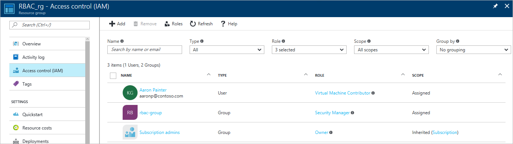

<properties
    pageTitle="Azure 门户中基于角色的访问控制 | Azure"
    description="在 Azure 门户中使用基于角色的访问控制开始进行访问权限管理。 角色分配用于将权限分配给你的资源。"
    services="active-directory"
    documentationcenter=""
    author="kgremban"
    manager="femila"
    editor=""
    translationtype="Human Translation" />
<tags
    ms.assetid="8078f366-a2c4-4fbb-a44b-fc39fd89df81"
    ms.service="active-directory"
    ms.devlang="na"
    ms.topic="get-started-article"
    ms.tgt_pltfrm="na"
    ms.workload="identity"
    ms.date="03/27/2017"
    wacn.date="05/08/2017"
    ms.author="kgremban"
    ms.sourcegitcommit="2c4ee90387d280f15b2f2ed656f7d4862ad80901"
    ms.openlocfilehash="d8ed9d89e2aaaf6a0c8a40d420391a6f6c27a338"
    ms.lasthandoff="04/28/2017" />

# 使用基于角色的访问控制管理 Azure 订阅资源的访问权限

Azure 基于角色的访问控制 (RBAC) 可用于对 Azure 进行细致的访问管理。 使用 RBAC，你可以仅授予用户执行其作业所需的访问次数。 本文可帮助你在 Azure 门户中启动并运行 RBAC。 如果想要解有关 RBAC 如何帮助你管理访问权限的详细信息，请参阅 [什么是基于角色的访问控制](/documentation/articles/role-based-access-control-what-is/)。

在每个订阅中，你最多可以授予 2000 个角色分配。 

## 查看访问权限
你可以在 [Azure 门户](https://portal.azure.cn)中的主边栏选项卡上查看谁有权访问资源、资源组或订阅。 例如，我们想要查看谁有权访问其中一个资源组：

1. 在左侧的导航栏中选择“资源组”  。  
    
2. 在“资源组”  边栏选项卡上，选择资源组的名称。
3. 从左侧菜单中选择“访问控制 (IAM)”。  
4. “访问控制”边栏选项卡列出了授予该资源组访问权限的所有用户、组和应用程序。  
   
    

请注意，某些用户为**已分配**的访问权限，而其他人为**继承**的访问权限。 特定于资源组分配访问权限，或者从父订阅的分配继承访问权限。

> [AZURE.NOTE]
> 经典订阅管理员和共同管理员被视为新 RBAC 模型中的订阅所有者。

## 添加访问权限
从资源、资源组或在该角色分配范围内的订阅中授予访问权限。

1. 在“访问控制”边栏选项卡上选择“添加”  。  
2. 从“选择角色”  边栏选项卡中选择你想要分配的角色。
3. 在你想要授予访问权限的目录中选择用户、组或应用程序。 你可以通过显示名称、电子邮件地址和对象标识符搜索该目录。  
   
    
4. 选择“确定”  以创建分配。 “添加用户”  弹出窗口跟踪进度。  
    

成功添加角色分配后，该角色分配将出现在“用户”  边栏选项卡上。

## 删除访问权限
1. 使用“访问控制”边栏选项卡上的复选框选择一个或多个角色分配。
2. 选择“删除” 。  
3. 将弹出一个对话框，要求你确认该操作。 选择“是”  以删除这些角色分配。

不能删除继承的分配。 如果需要删除继承的分配，则需要在创建角色分配的作用域上进行操作。 在“作用域”列的“继承”旁，有一条链接指向分配了此角色的资源。 请转到该处列出的资源以删除角色分配。

## 管理访问权限的其他工具
可以使用 Azure 门户以外的工具中的 Azure RBAC 命令分配角色和管理访问权限。  依照该链接以了解有关先决条件和 Azure RBAC 命令入门的详细信息。

- [Azure PowerShell](/documentation/articles/role-based-access-control-manage-access-powershell/)
- [Azure 命令行界面](/documentation/articles/role-based-access-control-manage-access-azure-cli/)
- [REST API](/documentation/articles/role-based-access-control-manage-access-rest/)

## 后续步骤
- [创建访问变更历史记录报表](/documentation/articles/role-based-access-control-access-change-history-report/)
- 请参阅 [RBAC 内置角色](/documentation/articles/role-based-access-built-in-roles/)
- 定义自己在 [Azure RBAC 中的自定义角色](/documentation/articles/role-based-access-control-custom-roles/)

<!---Update_Description: wording update -->