<properties
    pageTitle="在 Azure 中创建自定义的基于角色的访问控制角色并将其分配给内部和外部用户 | Azure"
    description="为内部和外部用户分配使用 PowerShell 与 CLI 创建的自定义 RBAC 角色"
    services="active-directory"
    documentationcenter=""
    author="andreicradu"
    manager="catadinu"
    editor="kgremban" />
<tags
    ms.assetid=""
    ms.service="active-directory"
    ms.devlang="na"
    ms.topic="article"
    ms.tgt_pltfrm="na"
    ms.workload="identity"
    ms.date="05/10/2017"
    ms.author="a-crradu"
    wacn.date="06/12/2017"
    ms.translationtype="Human Translation"
    ms.sourcegitcommit="08618ee31568db24eba7a7d9a5fc3b079cf34577"
    ms.openlocfilehash="49638f9269ca6b9a0dc970680fd3943fbc32babd"
    ms.contentlocale="zh-cn"
    ms.lasthandoff="05/26/2017" />

## 基于角色的访问控制简介

基于角色的访问控制是只能在 Azure 门户中使用的功能，可让订阅所有者将具体的角色分配到可在环境中管理特定资源范围的其他用户。

对于需要访问你环境中的特定资源，但不一定要访问整个基础结构或任何计费相关范围的大型组织以及与外部协作者、供应商或自由职业者合作的中小型企业而言，RBAC 可以改善安全管理。 RBAC 允许灵活拥有管理员帐户（订阅级别的服务管理员角色）管理的 Azure 订阅，并邀请多个用户在同一个订阅下工作，但不为他们分配任何管理权限。 从管理和计费角度看，RBAC 功能经证实是各种 Azure 使用方案中的省时且能提高管理效率的选项。

## 先决条件
在 Azure 环境中使用 RBAC 需要满足以下要求：

- 向所有者用户分配独立的 Azure 订阅（订阅角色）
- 获取 Azure 订阅的所有者角色
- 有权访问 [Azure 门户](https://portal.azure.cn)
- 确保为用户订阅注册以下资源提供程序：**Microsoft.Authorization**。 有关如何注册资源提供程序的详细信息，请参阅 [资源管理器提供程序、区域、API 版本和架构](/documentation/articles/resource-manager-supported-services/)。

> [AZURE.NOTE]
> 从 O365 门户预配的 Office 365 订阅或 Azure Active Directory 许可证（例如：Azure Active Directory 访问权限）不符合 RBAC 的使用条件。

## 如何使用 RBAC
可在 Azure 中的三个不同范围应用 RBAC。 这些范围从最高到最低的顺序为：

- 订阅（最高）
- 资源组
- 资源范围（最低访问级别，提供对单个 Azure 资源范围的所需权限）

## 在订阅范围分配 RBAC 角色
使用 RBAC 时，有两个（但不限于）常见的示例：

- 邀请组织外部的用户（不属于管理员用户的 Azure Active Directory 租户）管理特定的资源或整个订阅
- 与组织内部的、但属于不同团队或组的用户（属于用户的 Azure Active Directory 租户）合作，这些团队或组需要对环境中的整个订阅或者特定资源组或资源范围拥有精细访问权限

## 为 Azure Active Directory 外部的用户授予订阅级访问权限
RBAC 角色只能由订阅的“所有者”授予，因此管理员用户必须使用已预先分配有此角色或已创建 Azure 订阅的用户名登录。

在 Azure 门户中以管理员身份登录后，选择“订阅”，然后选择所需的订阅。
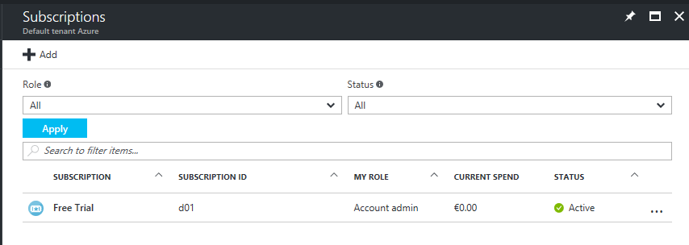默认情况下，如果管理员用户购买了 Azure 订阅，则该用户将显示为“帐户管理员”，即订阅角色。 

在此示例中，用户“alflanigan@outlook.com”是 AAD 租户“默认租户 Azure”中“1 元试用”订阅的“所有者”。 由于此用户是最初使用 Microsoft 帐户“Outlook”（Microsoft 帐户 = Outlook、Live 等等）创建 Azure 订阅的用户，因此，添加到此租户的其他所有用户的默认域名将是 **“@alflaniganuoutlook.partner.onmschina.cn”**。 根据设计，新域的语法格式是将创建租户的用户的用户名和域名组合在一起，并加上扩展 **.partner.onmschina.cn**。
此外，在为新租户添加并验证自定义域名后，用户可以在租户中使用该域名登录。 有关如何在 Azure Active Directory 租户中验证自定义域名的详细信息，请参阅[将自定义域名添加到目录](/documentation/articles/active-directory-add-domain/)。

在此示例中，“默认租户 Azure”目录仅包含域名为“@alflanigan.partner.onmschina.cn”的用户。

选择订阅后，管理员用户必须单击“访问控制(IAM)”，然后单击“添加新角色”。

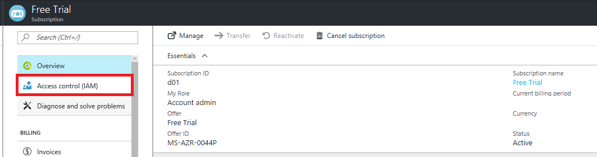

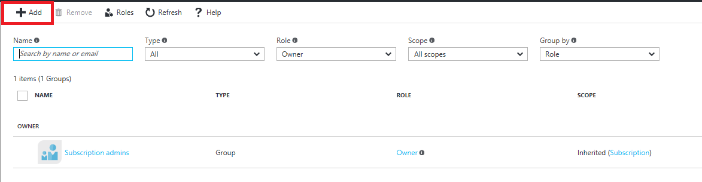

下一步是选择要分配的角色，以及要将 RBAC 角色分配到的用户。 在“角色”下拉菜单中，管理员用户只会看到 Azure 中提供的内置 RBAC 角色。 有关每个角色及其可分配范围的详细说明，请参阅[用于 Azure 基于角色的访问控制的内置角色](/documentation/articles/role-based-access-built-in-roles/)。

然后，管理员用户需要添加外部用户的电子邮件地址。 预期的行为不在现有租户中显示外部用户。 邀请外部用户后，“订阅”>“访问控制(IAM)”下面会显示该用户，以及当前在订阅范围分配有 RBAC 角色的所有当前用户。

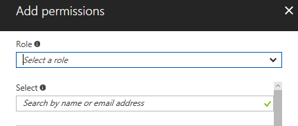

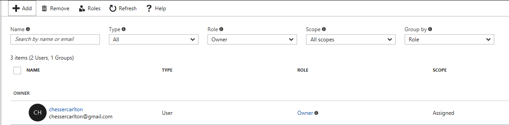

已邀请用户“chessercarlton@gmail.com”成为“1 元试用”订阅的“所有者”。 发送邀请后，外部用户将收到包含激活链接的电子邮件确认。
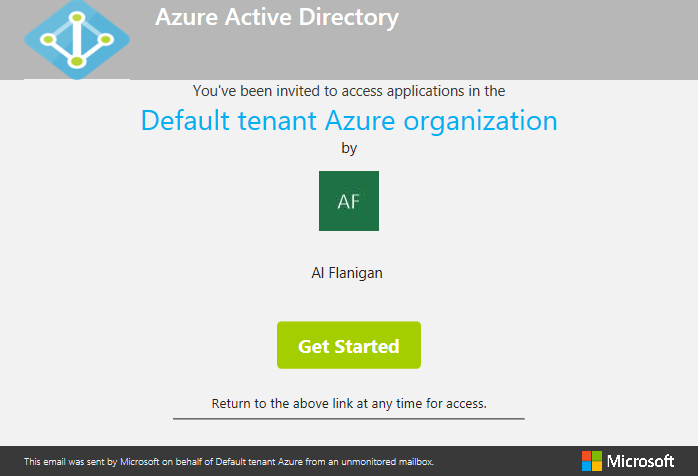

由于在组织外部，新用户在“默认租户 Azure”目录中没有任何现有的属性。 同意在与外部用户分配有角色的订阅相关联的目录中记录该用户后，将会创建这些属性。

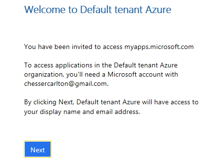

从现在开始，该外部用户将显示在 Azure Active Directory 租户中，可以在 Azure 经典管理门户中查看该用户。

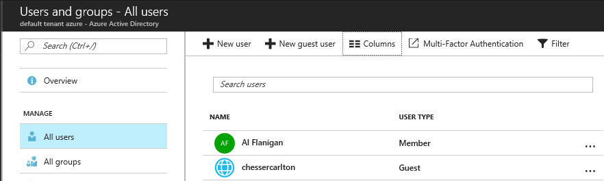

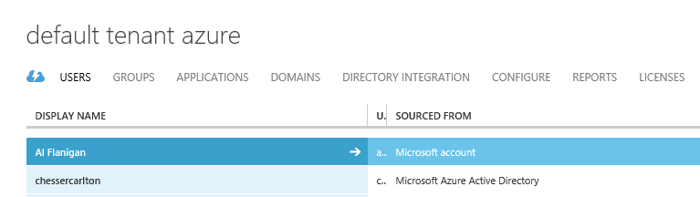

在这两个门户的“用户”视图中，可根据以下特征识别外部用户：

- Azure 门户中的不同图标类型
- 经典管理门户中的不同来源点

但是，在“订阅”范围向外部用户授予“所有者”或“参与者”访问权限并不允许他们访问管理员用户的目录，除非“全局管理员”允许访问。 在用户属性中，可以看到包含“成员”和“来宾”这两个通用参数的“用户类型”。 成员是已在目录中注册的用户，而来宾是来自外部源的、受邀加入目录的用户。

> [AZURE.NOTE]
> 请确保在门户中输入凭据后，外部用户选择要登录到的正确目录。 同一个用户可以访问多个目录，并且可以选择其中的一个目录：在 Azure 门户中单击右上角的用户名，然后从下拉列表中选择相应的目录。

成为目录中的来宾后，外部用户可以管理 Azure 订阅的所有资源，但无法访问该目录。

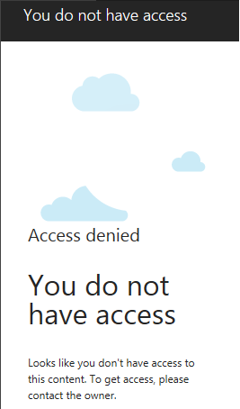

Azure Active Directory 与 Azure 订阅之间不像其他 Azure 资源（例如：虚拟机、虚拟网络、Web 应用、存储等）与 Azure 订阅之间一样存在子-父关系。 后者都是在 Azure 订阅下创建、管理和计费的，同时，Azure 订阅用于管理对 Azure 目录的访问。 有关详细信息，请参阅 [Azure 订阅与 Azure AD 的关系](/documentation/articles/active-directory-how-subscriptions-associated-directory/)。 

在所有内置 RBAC 角色中，“所有者”和“参与者”提供对环境中所有资源的完全管理访问权限，两者的区别在于，“参与者”无法创建和删除新的 RBAC 角色。 其他内置角色（例如“虚拟机参与者”）只提供对按名称指定的资源的完全管理访问权限，不管这些角色是在哪个**资源组**中创建的。

在订阅级别分配“虚拟机参与者”内置 RBAC 角色意味着分配有该角色的用户：

- 可以查看所有虚拟机，不管这些虚拟机的部署日期及其所属的资源组是什么
- 对订阅中的虚拟机拥有完全管理访问权限
- 无法查看订阅中的其他任何资源类型
- 从计费角度无法操作任何更改

> [AZURE.NOTE]
> RBAC 是只能在 Azure 门户中使用的功能，不授予对经典管理门户的访问权限。

## 将内置的 RBAC 角色分配到外部用户
针对此项测试中的不同方案，外部用户“alflanigan@gmail.com”将添加为“虚拟机参与者”。

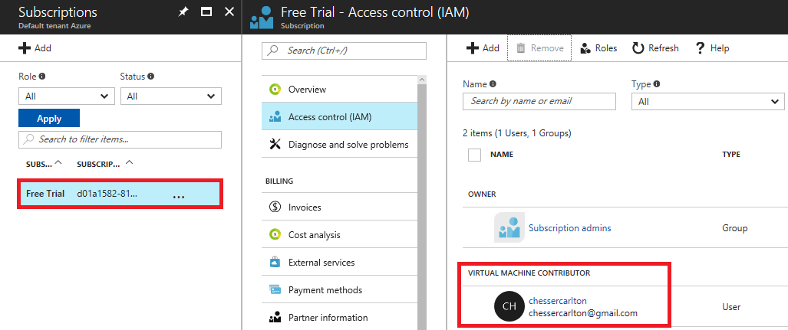

使用此内置角色的此外部用户的正常行为是仅查看和管理虚拟机，以及部署时所需的仅限资源管理器的相邻资源。 根据设计，这些受限角色只提供对在 Azure 门户中创建的相应资源的访问权限，不管是否仍可在经典管理门户中部署其他某些资源（例如：虚拟机）。

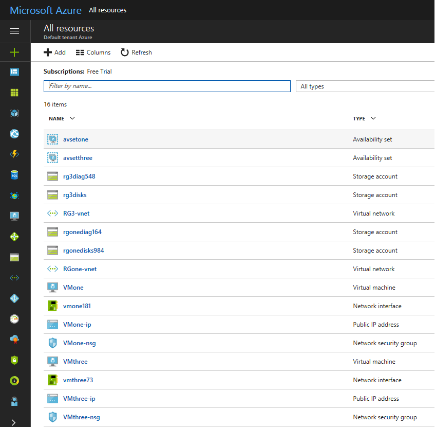

## 为同一目录中的用户授予订阅级访问权限
无论是从授予 RBAC 角色的管理角度，还是将授予用户对角色的访问权限的角度来看，流程都与添加外部用户相同。 此处的差别在于，受邀用户不会收到任何电子邮件邀请，因为订阅中的所有资源范围只有在登录后才会显示在仪表板中。

## 在资源组范围分配 RBAC 角色
对于外部和内部（属于同一个目录）这两种用户类型，在**资源组**范围分配 RBAC 角色的过程与在订阅级别分配角色的过程相同。 分配有 RBAC 角色的用户只能通过 Azure 门户中的“资源组”图标查看其环境中有权访问的资源组。

## 在资源范围分配 RBAC 角色
在 Azure 中的资源范围分配 RBAC 角色的过程，与在订阅级别或资源组级别分配该角色的过程相同，这两种方案都遵循相同的工作流。 同样，分配有 RBAC 角色的用户只能在“所有资源”选项卡或直接在仪表板中查看他们有权访问的项。

对于资源组范围或资源范围的 RBAC，一个重要的方面是，用户必须确保登录到正确的目录。

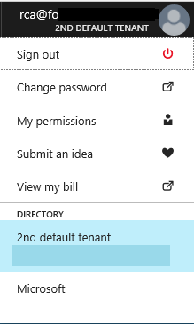

## 使用 PowerShell 创建自定义 RBAC 角色以提出支持请求
Azure 中提供的内置 RBAC 角色可确保根据环境中可用的资源授予特定的权限级别。 但是，如果这些角色都不符合管理员用户的需求，可以使用相应的选项，通过创建自定义 RBAC 角色来进一步限制访问权限。

创建自定义 RBAC 角色需要使用某个内置角色，对其进行编辑，然后将它导入回到环境中。 角色的下载和上传是使用 PowerShell 或 CLI 管理的。

必须了解创建可在订阅级别授予精细访问权限，并允许受邀用户灵活提出支持请求的自定义角色的相关先决条件。

在此示例中，允许用户查看所有资源范围，但不允许编辑这些范围或者创建新范围的内置角色“读取者”已经过自定义，允许用户使用相应的选项提出支持请求。

第一个操作（导出“读取者”角色）需要在使用提升的权限以管理员身份运行的 PowerShell 中完成。

    Login-AzureRMAccount -environmentName AzureChinaCloud

    Get-AzureRMRoleDefinition -Name "Reader"

    Get-AzureRMRoleDefinition -Name "Reader" | ConvertTo-Json | Out-File C:\rbacrole2.json

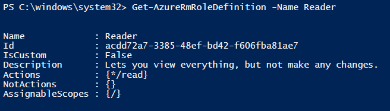

然后，需要提取该角色的 JSON 模板。

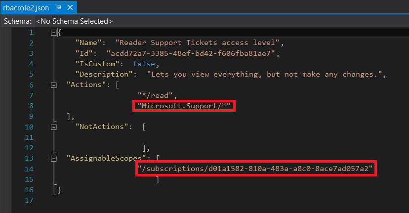

典型的 RBAC 角色由三个主要节组成：**Actions**、**NotActions** 和 **AssignableScopes**。

**Actions** 节列出了允许此角色执行的所有操作。 必须知道，每个操作是从资源提供程序分配的。 在本例中，若要创建支持票证，必须已列出 **Microsoft.Support** 资源提供程序。

若要查看订阅中可用且注册的所有资源提供程序，可以使用 PowerShell。

    Get-AzureRMResourceProvider

此外，可以查看可用于管理资源提供程序的所有 PowerShell cmdlet。
    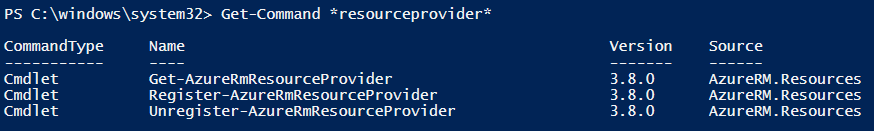

为了限制特定 RBAC 角色可执行的所有操作，**NotActions** 节下面列出了资源提供程序。
最后，RBAC 角色必须包含它所应用到的显式订阅 ID。 订阅 ID 必须列在 **AssignableScopes** 下面，否则，你无法在订阅中导入角色。

创建并自定义 RBAC 角色后，需要将它导入回到环境中。

    New-AzureRMRoleDefinition -InputFile "C:\rbacrole2.json"

在本示例中，此 RBAC 角色的自定义名称为“读取者支持票证访问级别”，允许用户查看订阅中的所有内容以及提出支持请求。

> [AZURE.NOTE]
> 允许提出支持请求操作的仅有的两个内置 RBAC 角色是“所有者”和“参与者”。 若使某个用户能够提出支持请求，只能在订阅范围为该用户分配 RBAC 角色，因为所有支持请求都是基于 Azure 订阅创建的。

已向同一目录中的某个用户分配此新的自定义角色。

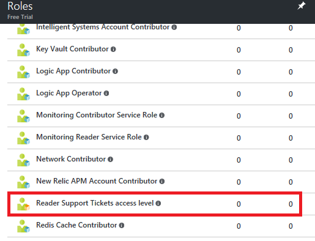

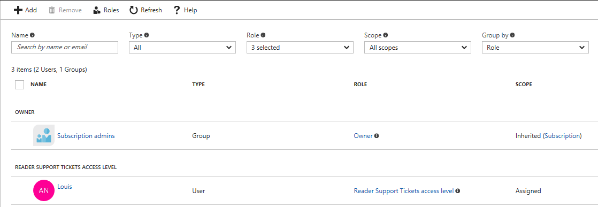

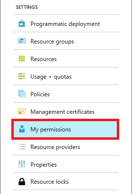

该示例经过进一步的具体化，突出此自定义 RBAC 角色的限制，如下所述：
- 可以创建新的支持请求
- 无法创建新的资源范围（例如：虚拟机）
- 无法创建新的资源组

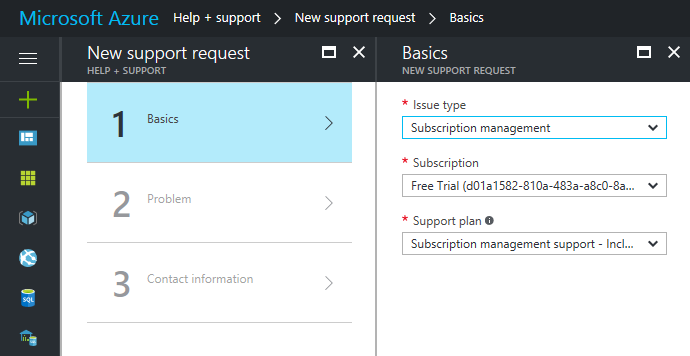

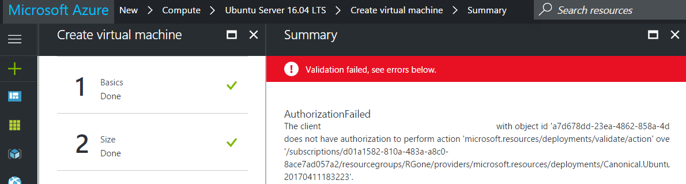

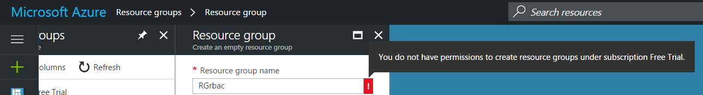

## 使用 Azure CLI 创建自定义 RBAC 角色以提出支持请求
如果在 Mac 上运行，因此无法访问 PowerShell，则可以改用 Azure CLI。

创建自定义角色的步骤与前面所述相同，唯一的差别在于，使用 CLI 时，无法在 JSON 模板中下载角色，但可以在 CLI 中查看角色。

对于本示例，我已选择内置角色“备份读取者”。

    azure role show "backup reader" --json

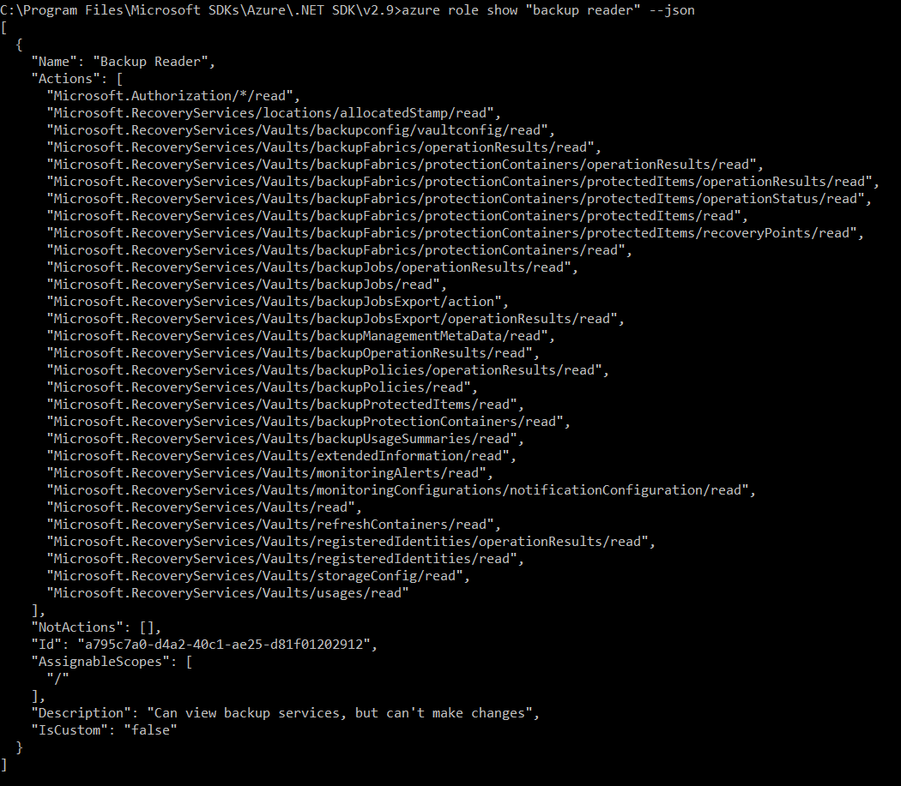

在 JSON 模板中复制属性后在 Visual Studio 中编辑角色时，**Microsoft.Support** 资源提供程序已添加到 **Actions** 节，因此，此用户可以提出支持请求，同时继续充当备份保管库的读取者。 同样，必须在 **AssignableScopes** 节中添加此角色将要应用到的订阅 ID。

    azure role create --inputfile <path>

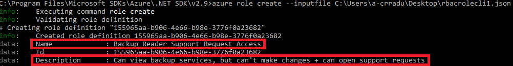

现在，新角色可在 Azure 门户中使用，分配过程与前面的示例相同。

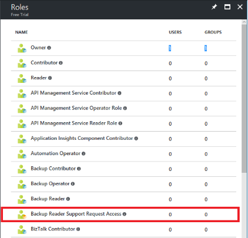

从最新的 Build 2017 开始，Azure Cloud Shell 已推出正式版。 Azure Cloud Shell 是对 IDE 和 Azure 门户的补充。 使用此服务可以获取在 Azure 中进行身份验证和托管的基于浏览器的 shell，并且可以使用它来取代计算机上安装的 CLI。

