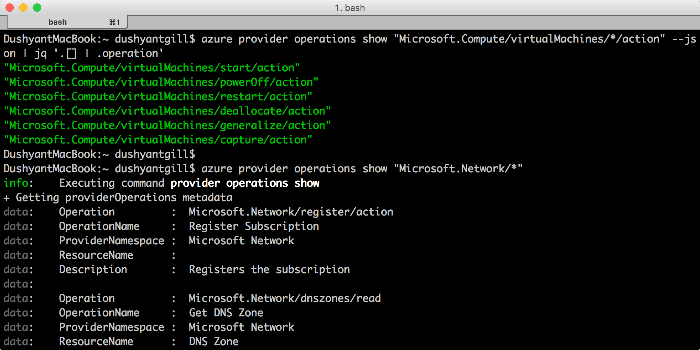

<properties
	pageTitle="Azure RBAC 中的自定义角色 | Azure"
	description="了解如何通过 Azure 基于角色的访问控制来定义自定义角色，以便在 Azure 订阅中进行更精确的身份管理。"
	services="active-directory"
	documentationCenter=""
	authors="kgremban"
	manager="stevenpo"
	editor=""/>

<tags
	ms.service="active-directory"
	ms.date="04/28/2016"
	wacn.date="07/05/2016"/>

# Azure RBAC 中的自定义角色

如果没有符合你特定访问需求的内置角色，可在 Azure 基于角色的访问控制 (RBAC) 中创建自定义角色。可以使用 [Azure PowerShell](/documentation/articles/role-based-access-control-manage-access-powershell/)、[Azure 命令行接口](/documentation/articles/role-based-access-control-manage-access-azure-cli/) (CLI) 和 [REST API](/documentation/articles/role-based-access-control-manage-access-rest/) 创建自定义角色。与内置角色一样，可以将自定义角色分配到订阅、资源组和资源范围内的用户、组和应用程序。自定义角色存储在 Azure AD 租户中，并且可以在将该租户用作其 Azure AD 目录的所有订阅之间共享。

下面是用于监视和重新启动虚拟机的自定义角色的一个示例：

		{
		  "Name": "Virtual Machine Operator",
		  "Id": "cadb4a5a-4e7a-47be-84db-05cad13b6769",
		  "IsCustom": true,
		  "Description": "Can monitor and restart virtual machines.",
		  "Actions": [
		    "Microsoft.Storage/*/read",
		    "Microsoft.Network/*/read",
		    "Microsoft.Compute/*/read",
		    "Microsoft.Compute/virtualMachines/start/action",
		    "Microsoft.Compute/virtualMachines/restart/action",
		    "Microsoft.Authorization/*/read",
		    "Microsoft.Resources/subscriptions/resourceGroups/read",
		    "Microsoft.Insights/alertRules/*",
		    "Microsoft.Insights/diagnosticSettings/*",
		    "Microsoft.Support/*"
		  ],
		  "NotActions": [
		
		  ],
		  "AssignableScopes": [
		    "/subscriptions/c276fc76-9cd4-44c9-99a7-4fd71546436e",
		    "/subscriptions/e91d47c4-76f3-4271-a796-21b4ecfe3624",
		    "/subscriptions/34370e90-ac4a-4bf9-821f-85eeedeae1a2"
		  ]
		}

## 操作
自定义角色的 **Actions** 属性指定该角色向其授予访问权限的 Azure 操作。它是操作字符串的集合，可标识 Azure 资源提供程序的安全对象操作。包含通配符 (*) 的操作字符串可以授权访问与该操作字符串相匹配的所有操作。例如：

-	`*/read` 向所有 Azure 资源提供程序的所有资源类型的读取操作授予访问权限。
-	`Microsoft.Network/*/read` 向 Azure 的 Microsoft.Network 资源提供程序中的所有资源类型的读取操作授予访问权限。
-	`Microsoft.Compute/virtualMachines/*` 向虚拟机及其子资源类型的所有操作授予访问权限。
-	`Microsoft.Web/sites/restart/Action` 授予重新启动网站的访问权限。

使用 `Get-AzureRmProviderOperation`（在 PowerShell 中）或 `azure provider operations show`（在 Azure CLI 中）列出 Azure 资源提供程序的操作。还可以使用这些命令来验证操作字符串是否有效，并展开通配符操作字符串。

## NotActions
如果排除受限制的操作可以更方便地定义你希望允许的操作集，则使用 **NotActions** 属性。通过用 **Actions** 操作减去 **NotActions** 操作可以计算出自定义角色授予的访问权限。

> [AZURE.NOTE] 如果用户分配到的角色排除 **NotActions** 中的一个操作，而又分配了第二个角色向同一操作授予了访问权限，则用户可以执行该操作。**NotActions** 不是拒绝规则 - 只是一个在需要排除特定操作时创建一组允许的操作的简便方法。

## AssignableScopes
自定义角色的 **AssignableScopes** 属性指定了可以分配该自定义角色的范围（订阅、资源组或资源）。可以让自定义角色只在需要它的订阅或资源组中进行分配，而不影响其他订阅或资源组的用户体验。

有效的可分配范围的示例包括：

-	“/subscriptions/c276fc76-9cd4-44c9-99a7-4fd71546436e”, “/subscriptions/e91d47c4-76f3-4271-a796-21b4ecfe3624” - 可让角色在两个订阅中进行分配。
-	“/subscriptions/c276fc76-9cd4-44c9-99a7-4fd71546436e” - 可让角色在单个订阅中进行分配。
-  “/subscriptions/c276fc76-9cd4-44c9-99a7-4fd71546436e/resourceGroups/Network” - 可让角色只在网络资源组中进行分配。

> [AZURE.NOTE] 必须使用至少一个订阅、资源组或资源 ID。

## 自定义角色的访问控制
自定义角色的 **AssignableScopes** 属性还能控制谁可以查看、修改和删除角色。

- 谁可以创建自定义角色？ 
	订阅、资源组和资源的所有者（和用户访问管理员）可以创建能在这些范围中使用的自定义角色。
	创建角色的用户需要能够执行角色的所有 **AssignableScopes** 上的 `Microsoft.Authorization/roleDefinition/write` 操作。

- 谁可以修改自定义角色？ 
	订阅、资源组和资源的所有者（和用户访问管理员）可以修改这些范围中的自定义角色。用户需要能够执行自定义角色的所有 **AssignableScopes** 上的 `Microsoft.Authorization/roleDefinition/write` 操作。

- 谁可以查看自定义角色？ 
	Azure RBAC 中的所有内置角色都允许查看可以进行分配的角色。范围中能够执行 `Microsoft.Authorization/roleDefinition/read` 操作的用户可以查看能在该范围中进行分配的 RBAC 角色。

## 另请参阅
- [基于角色的访问控制](/documentation/articles/role-based-access-control-configure/)：Azure 门户中的 RBAC 入门。
- 了解如何通过以下方式管理访问权限：
	- [PowerShell](/documentation/articles/role-based-access-control-manage-access-powershell/)
	- [Azure CLI](/documentation/articles/role-based-access-control-manage-access-azure-cli/)
	- [REST API](/documentation/articles/role-based-access-control-manage-access-rest/)
- [内置角色](/documentation/articles/role-based-access-built-in-roles/)：获取有关 RBAC 中的标准角色的详细信息。

<!---HONumber=Mooncake_0627_2016-->