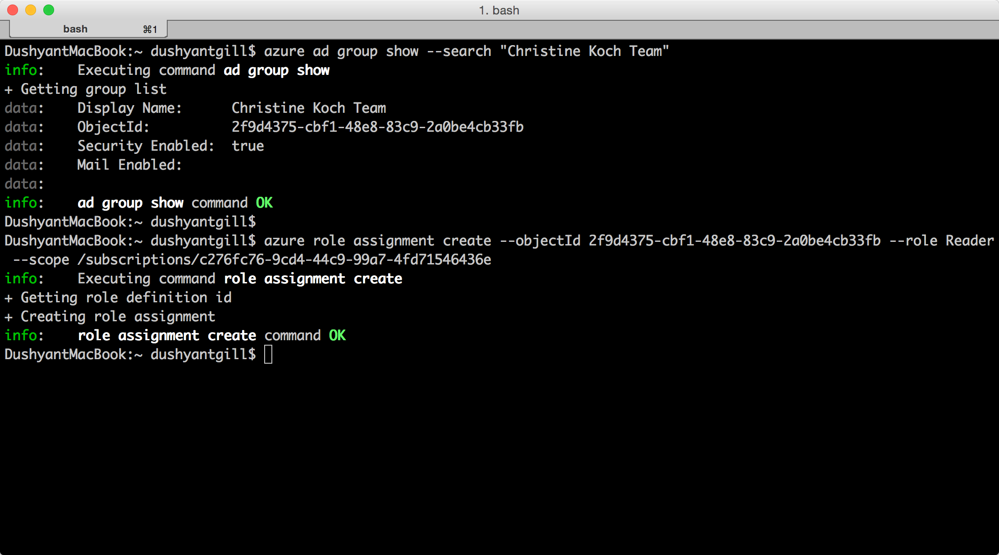
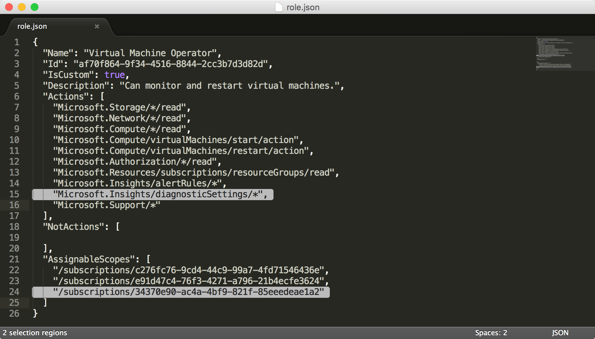

<properties
    pageTitle="使用 Azure CLI 管理基于角色的访问控制 (RBAC) | Azure"
    description="通过列出角色和角色操作、将角色分配到订阅和应用程序范围来了解如何使用 Azure 命令行界面管理基于角色的访问控制 (RBAC)。"
    services="active-directory"
    documentationcenter=""
    author="kgremban"
    manager="femila"
    editor="" />
<tags
    ms.assetid="3483ee01-8177-49e7-b337-4d5cb14f5e32"
    ms.service="active-directory"
    ms.devlang="na"
    ms.topic="article"
    ms.tgt_pltfrm="na"
    ms.workload="identity"
    ms.date="02/22/2017"
    wacn.date="04/05/2017"
    ms.author="kgremban" />  

# 使用 Azure 命令行接口管理基于角色的访问控制
> [AZURE.SELECTOR]
- [PowerShell](/documentation/articles/role-based-access-control-manage-access-powershell/)
- [Azure CLI](/documentation/articles/role-based-access-control-manage-access-azure-cli/)
- [REST API](/documentation/articles/role-based-access-control-manage-access-rest/)

使用 Azure 门户中基于角色的访问控制 (RBAC) 和 Azure资源管理器 API 可以精细地管理对订阅和资源的访问。使用此功能，可以通过在特定范围内为 Active Directory 用户、组或服务主体分配某些角色来向其授予访问权限。

在使用 Azure 命令行界面 (CLI) 管理 RBAC 之前，必须具备以下先决条件：

- Azure CLI 0.8.8 版或更高。若要安装最新版本并将其与 Azure 订阅相关联，请参阅[安装和配置 Azure CLI](/documentation/articles/cli-install-nodejs/)。
- Azure CLI 中的 Azure 资源管理器。转到[将 Azure CLI 用于资源管理器](/documentation/articles/xplat-cli-azure-resource-manager/)了解详细信息。

## 列出角色
### 列出所有可用的角色
若要列出所有可用的角色，请使用：

	azure role list

以下示例显示了“所有可用的角色”的列表。

	azure role list --json | jq '.[] | {"roleName":.properties.roleName, "description":.properties.description}'

### 列出角色的操作
若要列出角色的操作，请使用：

    azure role show "<role name>"

以下示例显示了“参与者”和“虚拟机参与者”角色的操作。

	azure role show "contributor" --json | jq '.[] | {"Actions":.properties.permissions[0].actions,"NotActions":properties.permissions[0].notActions}'

	azure role show "virtual machine contributor" --json | jq '.[] | .properties.permissions[0].actions'

## 列出访问权限
### 列出资源组上有效的角色分配
若要列出资源组中存在的角色分配，请使用：

    azure role assignment list --resource-group <resource group name>

以下示例显示了 *pharma-sales-projecforcast* 组中的角色分配。

	azure role assignment list --resource-group pharma-sales-projecforcast --json | jq '.[] | {"DisplayName":.properties.aADObject.displayName,"RoleDefinitionName":.properties.roleName,"Scope":.properties.scope}'

  

### 列出用户的角色分配
若要列出特定用户的角色分配以及用户组的分配，请使用：

    azure role assignment list --signInName <user email>

还可通过修改命令查看从组继承的角色分配：

    azure role assignment list --expandPrincipalGroups --signInName <user email>

以下示例显示了授予用户 *sameert@aaddemo.com* 的角色分配。这包括直接分配到用户的角色，以及从组中继承的角色。

	azure role assignment list --signInName sameert@aaddemo.com --json | jq '.[] | {"DisplayName":.properties.aADObject.DisplayName,"RoleDefinitionName":.properties.roleName,"Scope":.properties.scope}'

	azure role assignment list --expandPrincipalGroups --signInName sameert@aaddemo.com --json | jq '.[] | {"DisplayName":.properties.aADObject.DisplayName,"RoleDefinitionName":.properties.roleName,"Scope":.properties.scope}'

  

## 授予访问权限
标识出想分配的角色后，若要授予访问权限，请使用：

    azure role assignment create

### 将角色分配给订阅范围内的组
若要将角色分配给订阅范围内的组，请使用：

    azure role assignment create --objectId  <group object id> --roleName <name of role> --subscription <subscription> --scope <subscription/subscription id>

以下示例在*订阅*范围内将*读者*角色分配给*Christine Koch 的团队*。

  

### 将角色分配给订阅范围内的应用程序
若要将角色分配给订阅范围内的应用程序，请使用：

    azure role assignment create --objectId  <applications object id> --roleName <name of role> --subscription <subscription> --scope <subscription/subscription id>

以下示例在所选订阅上将*参与者*角色授予 *Azure AD* 应用程序。

   

### 将角色分配给资源组范围内的用户
若要将角色分配给资源组范围内的用户，请使用：

    azure role assignment create --signInName  <user email address> --roleName "<name of role>" --resourceGroup <resource group name>

以下示例在 *Pharma-Sales-ProjectForcast* 资源组范围内将*虚拟机参与者*角色授予用户 *samert@aaddemo.com*。

  

### 将角色分配给资源范围内的组
若要将角色分配给资源范围内的组，请使用：

    azure role assignment create --objectId <group id> --role "<name of role>" --resource-name <resource group name> --resource-type <resource group type> --parent <resource group parent> --resource-group <resource group>

以下示例在*子网*上将*虚拟机参与者*角色授予 *Azure AD* 组。

  

## 删除访问权限
若要删除角色分配，请使用：

    azure role assignment delete --objectId <object id to from which to remove role> --roleName "<role name>"

以下示例在 *Pharma-Sales-ProjectForcast* 资源组上从 *sammert@aaddemo.com* 用户删除*虚拟机参与者*角色分配。然后，该示例从订阅上的组中删除角色分配。

  

## 创建自定义角色
若要创建自定义角色，请使用：

    azure role create --inputfile <file path>

以下示例创建名为“虚拟机操作员”的自定义角色。该自定义角色授权用户访问 *Microsoft.Compute*、*Microsoft.Storage* 和 *Microsoft.Network* 资源提供程序的所有读取操作，并授予用户启动、重新启动和监视虚拟机所需的访问权限。该自定义角色可以在两个订阅中使用。此示例使用 JSON 文件作为输入。

  

  

## 修改自定义角色
若要修改自定义角色，请先使用 `azure role show` 命令检索角色定义。然后，对角色定义文件做出所需更改。最后，使用 `azure role set` 保存修改后的角色定义。

    azure role set --inputfile <file path>

以下示例将 *Microsoft.Insights/diagnosticSettings/* 操作添加到 **Actions**，并且向虚拟机操作员自定义角色的 **AssignableScopes** 添加了一个 Azure 订阅。

  

  

## 删除自定义角色
若要删除自定义角色，请先使用 `azure role show` 命令确定角色的 **ID**。然后，使用 `azure role delete` 命令通过指定 **ID** 来删除该角色。

以下示例删除了*虚拟机操作员*自定义角色。

  

## 列出自定义角色
若要列出可在某范围内进行分配的角色，请使用 `azure role list` 命令。

以下命令列出了可在所选订阅中进行分配的所有角色。

	azure role list --json | jq '.[] | {"name":.properties.roleName, type:.properties.type}'

  

在下面的示例中，*虚拟机操作员*自定义角色在 *Production4* 订阅中不可用，因为该订阅不在角色的 **AssignableScopes** 中。

	azure role list --json | jq '.[] | if .properties.type == "CustomRole" then .properties.roleName else empty end'
  

## RBAC 主题
[AZURE.INCLUDE [role-based-access-control-toc.md](../../includes/role-based-access-control-toc.md)]

<!---HONumber=Mooncake_0327_2017-->
<!---Update_Description: wording update -->