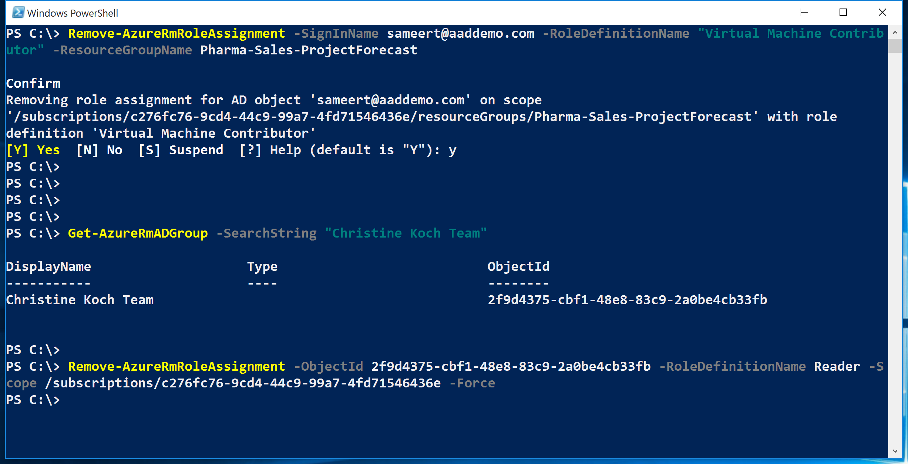
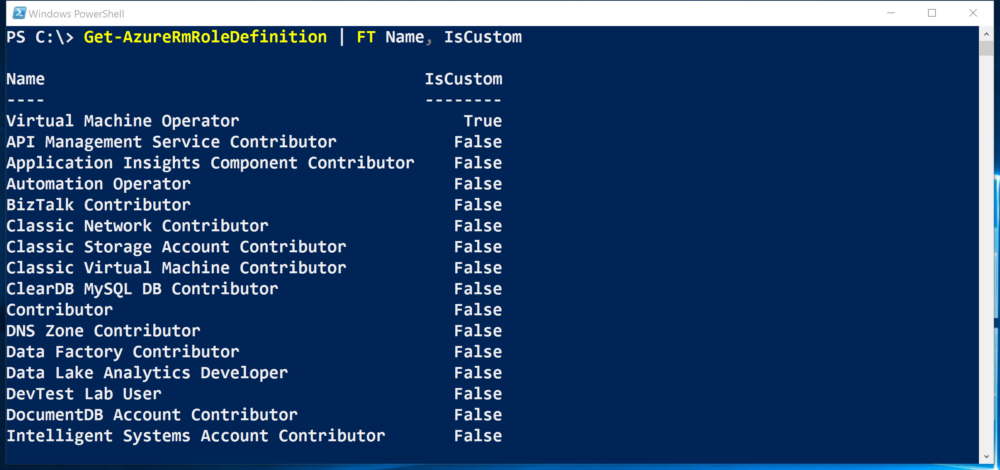

<properties
	pageTitle="使用 Azure PowerShell 管理基于角色的访问控制 (RBAC) | Azure"
	description="如何使用 Azure PowerShell 管理 RBAC，包括列举角色、分配角色和删除角色分配。"
	services="active-directory"
	documentationCenter=""
	authors="kgremban"
	manager="stevenpo"
	editor=""/>

<tags
	ms.service="active-directory"
	ms.date="04/12/2016"
	wacn.date="07/04/2016"/>

# 使用 Azure PowerShell 管理基于角色的访问控制

> [AZURE.SELECTOR]
- [PowerShell](/documentation/articles/role-based-access-control-manage-access-powershell/)
- [Azure CLI](/documentation/articles/role-based-access-control-manage-access-azure-cli/)
- [REST API](/documentation/articles/role-based-access-control-manage-access-rest/)

Azure 门户中基于角色的访问控制 (RBAC) 和 Azure 资源管理 API 可精细管理对订阅的访问。使用此功能，可以通过在特定范围内为 Active Directory 用户、组或服务主体分配某些角色来向其授予访问权限。

在使用 PowerShell 管理 RBAC 之前，必须具备以下条件：

- Azure PowerShell 0.8.8 版或更高版本。若要安装最新版本并将其与 Azure 订阅相关联，请参阅[如何安装和配置 Azure PowerShell](/documentation/articles/powershell-install-configure/)。

- Azure Resource Manager cmdlets。在 PowerShell 中安装 [Azure Resource Manager cmdlets](https://msdn.microsoft.com/library/mt125356.aspx)。

## 列出角色

### 列出所有可用的角色
若要列举可以进行分配的 RBAC 角色，并检查其授权访问的操作，请使用：

		Get-AzureRmRoleDefinition

### 列出角色的操作
若要列举特定角色的操作，请使用：

    Get-AzureRmRoleDefinition <role name>

## 查看谁具有访问权限
若要列举 RBAC 访问权限分配，请使用：

    Get-AzureRmRoleAssignment

###	列举特定范围内的角色分配
可以查看指定订阅、资源组或资源的所有访问权限分配。例如，若要查看资源组的所有活动的分配，请使用：

    Get-AzureRmRoleAssignment -ResourceGroupName <resource group name>

### 列举分配到用户的角色
若要列举分配到指定用户的所有角色，包括分配到其所属组的角色，请使用：

    Get-AzureRmRoleAssignment -SignInName <User email> -ExpandPrincipalGroups

### 列举经典服务管理员和共同管理员角色分配
若要列举经典订阅管理员和共同管理员的访问权限分配，请使用：

    Get-AzureRmRoleAssignment -IncludeClassicAdministrators

## 授予访问权限
### 搜索对象 ID
若要分配角色，需要标识对象（用户、组或应用程序）和范围。

如果不知道订阅 ID，可以在 Azure 门户的“订阅”边栏选项卡中查找。或者也可以在 MSDN 上通过 [Get-AzureSubscription](https://msdn.microsoft.com/library/dn495302.aspx) 了解如何查询。

若要获取 Azure AD 组的对象 ID，请使用：

    Get-AzureRmADGroup -SearchString <group name in quotes>

若要获取 Azure AD 服务主体或应用程序的对象 ID，请使用：

    Get-AzureRmADServicePrincipal -SearchString <service name in quotes>

### 将角色分配给订阅范围内的应用程序
若要授权访问订阅范围内的应用程序，请使用：

    New-AzureRmRoleAssignment -ObjectId <application id> -RoleDefinitionName <role name in quotes> -Scope <subscription id>

### 将角色分配给资源组范围内的用户
若要授权访问资源组范围内的用户，请使用：

    New-AzureRmRoleAssignment -SignInName <email of user> -RoleDefinitionName <role name in quotes> -ResourceGroupName <resource group name>

### 将角色分配给资源范围内的组
若要授权访问资源组范围内的组，请使用：

    New-AzureRmRoleAssignment -ObjectId <object id> -RoleDefinitionName <role name in quotes> -ResourceName <resource name> -ResourceType <resource type> -ParentResource <parent resource> -ResourceGroupName <resource group name>

## 删除访问权限
若要删除用户、组和应用程序的访问权限，请使用：

    Remove-AzureRmRoleAssignment -ObjectId <object id> -RoleDefinitionName <role name> -Scope <scope such as subscription id>

## 创建自定义角色
若要创建自定义角色，请使用 `New-AzureRmRoleDefinition` 命令。

以下示例创建了一个名为“虚拟机运算符”的自定义角色。该角色授权访问 Microsoft.Compute、Microsoft.Storage 和 Microsoft.Network 资源提供程序的所有读取操作，并授权访问启动、重启和监视虚拟机。该自定义角色可以在两个订阅中使用。

## 修改自定义角色
若要修改自定义角色，请先使用 `Get-AzureRmRoleDefinition` 命令检索角色定义。然后，对该角色定义作出所需更改。最后，使用 `Set-AzureRmRoleDefinition` 命令保存修改后的角色定义。

以下示例将 `Microsoft.Insights/diagnosticSettings/*` 操作添加到“虚拟机运算符”自定义角色。

以下示例将 Azure 订阅添加到虚拟机运算符自定义角色的可分配范围。

## 删除自定义角色

若要删除自定义角色，请使用 `Remove-AzureRmRoleDefinition` 命令。

以下示例删除了“虚拟机运算符”自定义角色。

## 列出自定义角色
若要列出可在某范围内进行分配的角色，请使用 `Get-AzureRmRoleDefinition` 命令。

以下示例列出了可在所选订阅中进行分配的所有角色。

在下面的示例中，“虚拟机运算符”自定义角色在 Production4 订阅中不可用，因为该订阅不在角色的 **AssignableScopes** 中。

## 另请参阅
- [将 Azure PowerShell 与 Azure 资源管理器配合使用](/documentation/articles/powershell-azure-resource-manager/) [AZURE.INCLUDE [role-based-access-control-toc.md](../includes/role-based-access-control-toc.md)]

<!---HONumber=Mooncake_0627_2016-->