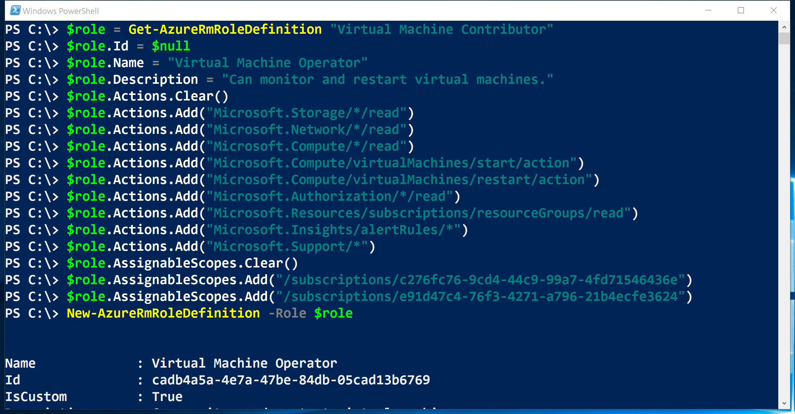

<properties
    pageTitle="使用 Azure PowerShell 管理基于角色的访问控制 (RBAC) | Azure"
    description="如何使用 Azure PowerShell 管理 RBAC，包括列出角色、分配角色和删除角色分配。"
    services="active-directory"
    documentationcenter=""
    author="kgremban"
    manager="femila"
    editor="" />
<tags
    ms.assetid="9e225dba-9044-4b13-b573-2f30d77925a9"
    ms.service="active-directory"
    ms.devlang="na"
    ms.topic="article"
    ms.tgt_pltfrm="na"
    ms.workload="identity"
    ms.date="03/02/2017"
    wacn.date="04/05/2017"
    ms.author="kgremban" />  


# 使用 Azure PowerShell 管理基于角色的访问控制
> [AZURE.SELECTOR]
- [PowerShell](/documentation/articles/role-based-access-control-manage-access-powershell/)
- [Azure CLI](/documentation/articles/role-based-access-control-manage-access-azure-cli/)
- [REST API](/documentation/articles/role-based-access-control-manage-access-rest/)

可以使用 Azure 门户预览中基于角色的访问控制 (RBAC) 和 Azure 资源管理 API 精细管理对订阅的访问。使用此功能，可以通过在特定范围内为 Active Directory 用户、组或服务主体分配某些角色来向其授予访问权限。

在使用 PowerShell 管理 RBAC 之前，需具备以下先决条件：

- Azure PowerShell 0.8.8 版或更高版本。若要安装最新版本并将其与 Azure 订阅相关联，请参阅[如何安装和配置 Azure PowerShell](/documentation/articles/powershell-install-configure/)。
- Azure 资源管理器 cmdlets。在 PowerShell 中安装 [Azure 资源管理器cmdlets](https://msdn.microsoft.com/zh-cn/library/mt125356.aspx)。

## 列出角色
### 列出所有可用的角色
若要列出可以进行分配的 RBAC 角色，并检查其授权访问的操作，请使用 `Get-AzureRmRoleDefinition`。

	Get-AzureRmRoleDefinition | FT Name, Description

  


### 列出角色的操作
若要列出特定角色的操作，请使用 `Get-AzureRmRoleDefinition <role name>`。


	Get-AzureRmRoleDefinition Contributor | FL Actions, NotActions

	(Get-AzureRmRoleDefinition "Virtual Machine Contributor").Actions


  


## 查看谁具有访问权限
若要列出 RBAC 访问权限分配，请使用 `Get-AzureRmRoleAssignment`。

### 列举特定范围内的角色分配
可以查看指定订阅、资源组或资源的所有访问权限分配。例如，若要查看资源组的所有活动分配，请使用 `Get-AzureRmRoleAssignment -ResourceGroupName <resource group name>`。

	Get-AzureRmRoleAssignment -ResourceGroupName Pharma-Sales-ProjectForcast | FL DisplayName, RoleDefinitionName, Scope

  


### 列举分配到用户的角色
若要列出分配给特定用户的所有角色以及分配给用户所属组的角色，请使用 `Get-AzureRmRoleAssignment -SignInName <User email> -ExpandPrincipalGroups`。

	Get-AzureRmRoleAssignment -SignInName sameert@aaddemo.com | FL DisplayName, RoleDefinitionName, Scope
	Get-AzureRmRoleAssignment -SignInName sameert@aaddemo.com -ExpandPrincipalGroups | FL DisplayName, RoleDefinitionName, Scope

  


### 列出经典服务管理员和共同管理员角色分配
若要列出经典订阅管理员和共同管理员的访问权限分配，请使用：

	Get-AzureRmRoleAssignment -IncludeClassicAdministrators

## 授予访问权限
### 搜索对象 ID
若要分配角色，需要标识对象（用户、组或应用程序）和范围。

如果不知道订阅 ID，可以在 Azure 门户预览的“订阅”边栏选项卡中查找。若要了解如何通过查询获取订阅 ID，请参阅 MSDN 上的 [Get-AzureSubscription](https://msdn.microsoft.com/zh-cn/library/dn495302.aspx)。

若要获取 Azure AD 组的对象 ID，请使用：

    Get-AzureRmADGroup -SearchString <group name in quotes>

若要获取 Azure AD 服务主体或应用程序的对象 ID，请使用：

    Get-AzureRmADServicePrincipal -SearchString <service name in quotes>

### 将角色分配给订阅范围内的应用程序
若要授权访问订阅范围内的应用程序，请使用：

    New-AzureRmRoleAssignment -ObjectId <application id> -RoleDefinitionName <role name> -Scope <subscription id>

  


### 将角色分配给资源组范围内的用户
若要授权访问资源组范围内的用户，请使用：

    New-AzureRmRoleAssignment -SignInName <email of user> -RoleDefinitionName <role name in quotes> -ResourceGroupName <resource group name>

  


### 将角色分配给资源范围内的组
若要授权访问资源范围内的组，请使用：

    New-AzureRmRoleAssignment -ObjectId <object id> -RoleDefinitionName <role name in quotes> -ResourceName <resource name> -ResourceType <resource type> -ParentResource <parent resource> -ResourceGroupName <resource group name>

  


## 删除访问权限
若要删除用户、组和应用程序的访问权限，请使用：

    Remove-AzureRmRoleAssignment -ObjectId <object id> -RoleDefinitionName <role name> -Scope <scope such as subscription id>

  


## 创建自定义角色
若要创建自定义角色，请使用 ```New-AzureRmRoleDefinition``` 命令。可以通过两种方法来构造角色，即使用 PSRoleDefinitionObject 或 JSON 模板。

## 从特定的资源提供程序获取 Actions
从头开始创建自定义角色时，必须了解资源提供程序提供的所有可能的操作。请使用 ```Get-AzureRMProviderOperation``` 命令获取该信息。例如，若要查看虚拟机的所有可用操作，请使用以下命令：


	Get-AzureRMProviderOperation "Microsoft.Compute/virtualMachines/*" | FT OperationName, Operation , Description -AutoSize


### 使用 PSRoleDefinitionObject 创建角色
通过 PowerShell 创建自定义角色时，可以从头开始，也可以在一开始时使用某个[内置角色](/documentation/articles/role-based-access-built-in-roles/)。本部分的示例在一开始时使用某个内置角色，然后使用更多的特权对其进行自定义。编辑属性以添加所需的 *Actions*、*notActions* 或*作用域*，然后将所做的更改另存为新角色。

以下示例从“虚拟机参与者”角色开始，使用该角色创建名为“虚拟机操作员”的自定义角色。该新角色授权用户访问 *Microsoft.Compute*、*Microsoft.Storage* 和 *Microsoft.Network* 资源提供程序的所有读取操作，并授予用户启动、重新启动和监视虚拟机所需的访问权限。该自定义角色可以在两个订阅中使用。


	$role = Get-AzureRmRoleDefinition "Virtual Machine Contributor"
	$role.Id = $null
	$role.Name = "Virtual Machine Operator"
	$role.Description = "Can monitor and restart virtual machines."
	$role.Actions.Clear()
	$role.Actions.Add("Microsoft.Storage/*/read")
	$role.Actions.Add("Microsoft.Network/*/read")
	$role.Actions.Add("Microsoft.Compute/*/read")
	$role.Actions.Add("Microsoft.Compute/virtualMachines/start/action")
	$role.Actions.Add("Microsoft.Compute/virtualMachines/restart/action")
	$role.Actions.Add("Microsoft.Authorization/*/read")
	$role.Actions.Add("Microsoft.Resources/subscriptions/resourceGroups/read")
	$role.Actions.Add("Microsoft.Insights/alertRules/*")
	$role.Actions.Add("Microsoft.Support/*")
	$role.AssignableScopes.Clear()
	$role.AssignableScopes.Add("/subscriptions/c276fc76-9cd4-44c9-99a7-4fd71546436e")
	$role.AssignableScopes.Add("/subscriptions/e91d47c4-76f3-4271-a796-21b4ecfe3624")
	New-AzureRmRoleDefinition -Role $role


  


### 使用 JSON 模板创建角色
JSON 模板可以用作自定义角色的源定义。以下示例创建一个可以对存储和计算资源进行读取访问以及获取支持的自定义角色，并将该角色添加到两个订阅。创建包含以下内容的新文件 `C:\CustomRoles\customrole1.json`。在开始创建角色时，应将 ID 设置为 `null`，因为新 ID 是自动生成的。


	{
	  "Name": "Custom Role 1",
	  "Id": null,
	  "IsCustom": true,
	  "Description": "Allows for read access to Azure storage and compute resources and access to support",
	  "Actions": [
	    "Microsoft.Compute/*/read",
	    "Microsoft.Storage/*/read",
	    "Microsoft.Support/*"
	  ],
	  "NotActions": [
	  ],
	  "AssignableScopes": [
	    "/subscriptions/c276fc76-9cd4-44c9-99a7-4fd71546436e",
	    "/subscriptions/e91d47c4-76f3-4271-a796-21b4ecfe3624"
	  ]
	}

若要将角色添加到订阅，请运行以下 PowerShell 命令：

	New-AzureRmRoleDefinition -InputFile "C:\CustomRoles\customrole1.json"


## 修改自定义角色
可以使用 PSRoleDefinitionObject 或 JSON 模板修改现有的自定义角色，这与创建自定义角色类似。

### 使用 PSRoleDefinitionObject 修改角色
若要修改自定义角色，首先，请使用 `Get-AzureRmRoleDefinition` 命令检索角色定义。然后，对角色定义做出所需更改。最后，使用 `Set-AzureRmRoleDefinition` 命令保存修改后的角色定义。

以下示例将 `Microsoft.Insights/diagnosticSettings/*` 操作添加到*虚拟机操作员*自定义角色。

	$role = Get-AzureRmRoleDefinition "Virtual Machine Operator"
	$role.Actions.Add("Microsoft.Insights/diagnosticSettings/*")
	Set-AzureRmRoleDefinition -Role $role
  


以下示例将 Azure 订阅添加到“虚拟机操作员”自定义角色的可分配范围。


	Get-AzureRmSubscription - SubscriptionName Production3

	$role = Get-AzureRmRoleDefinition "Virtual Machine Operator"
	$role.AssignableScopes.Add("/subscriptions/34370e90-ac4a-4bf9-821f-85eeedead1a2")
	Set-AzureRmRoleDefinition -Role $role


  


### 使用 JSON 模板修改角色
使用以前的 JSON 模板可以轻松修改现有的自定义角色，以便添加或删除 Actions。更新 JSON 模板，为网络添加读取操作，如以下示例所示。模板中列出的定义不是以累积方式应用到现有定义的，这意味着角色的显示方式完全符合模板中的指定。还需使用角色的 ID 更新“ID”字段。如果不确定该值是什么，可以使用 `Get-AzureRmRoleDefinition` cmdlet 获取相关信息。


	{
	  "Name": "Custom Role 1",
	  "Id": "acce7ded-2559-449d-bcd5-e9604e50bad1",
	  "IsCustom": true,
	  "Description": "Allows for read access to Azure storage and compute resources and access to support",
	  "Actions": [
	    "Microsoft.Compute/*/read",
	    "Microsoft.Storage/*/read",
	    "Microsoft.Network/*/read",
	    "Microsoft.Support/*"
	  ],
	  "NotActions": [
	  ],
	  "AssignableScopes": [
	    "/subscriptions/c276fc76-9cd4-44c9-99a7-4fd71546436e",
	    "/subscriptions/e91d47c4-76f3-4271-a796-21b4ecfe3624"
	  ]
	}


若要更新现有角色，请运行以下 PowerShell 命令：

	Set-AzureRmRoleDefinition -InputFile "C:\CustomRoles\customrole1.json"


## 删除自定义角色
若要删除自定义角色，请使用 `Remove-AzureRmRoleDefinition` 命令。

以下示例删除了*虚拟机操作员*自定义角色。

	Get-AzureRmRoleDefinition "Virtual Machine Operator"

	Get-AzureRmRoleDefinition "Virtual Machine Operator" | Remove-AzureRmRoleDefinition

  


## 列出自定义角色
若要列出可在某范围内进行分配的角色，请使用 `Get-AzureRmRoleDefinition` 命令。

以下示例列出了可在所选订阅中进行分配的所有角色。

	Get-AzureRmRoleDefinition | FT Name, IsCustom
	
  


在下面的示例中，*虚拟机操作员*自定义角色在 *Production4* 订阅中不可用，因为该订阅不在角色的 **AssignableScopes** 中。


## 另请参阅
- [将 Azure PowerShell 与 Azure 资源管理器配合使用](/documentation/articles/powershell-azure-resource-manager/) [AZURE.INCLUDE [role-based-access-control-toc.md](../../includes/role-based-access-control-toc.md)]

<!---HONumber=Mooncake_0327_2017-->
<!---Update_Description: wording update -->