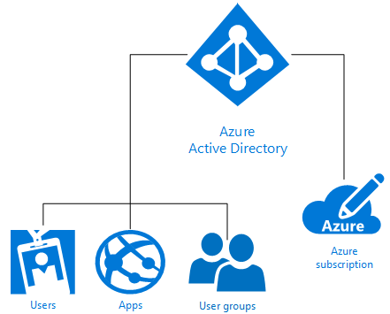

<properties
    pageTitle="了解 Azure 标识 | Azure"
    description="大致了解 Azure 标识解决方案的术语、概念和建议，以便为组织做出最明智的标识监管决策。"
    keywords=""
    author="jeffgilb"
    manager="femila" />
<tags
    ms.date="5/12/2017"
    ms.topic="article"
    ms.prod=""
    ms.service="azure"
    ms.technology=""
    ms.assetid=""
    ms.reviewer="jsnow"
    ms.custom="it-pro"
    wacn.date="06/12/2017"
    ms.translationtype="Human Translation"
    ms.sourcegitcommit="08618ee31568db24eba7a7d9a5fc3b079cf34577"
    ms.openlocfilehash="1c5347bdcac1a9e0bcdee87e0c67b88257b0b453"
    ms.contentlocale="zh-cn"
    ms.lasthandoff="05/26/2017" />

# 了解 Azure 标识解决方案
Azure Active Directory (Azure AD) 是一个综合性的、高度可用的标识和访问管理云解决方案，它将核心目录服务、高级标识监管和应用程序访问管理结合起来。 Azure AD 能够快速地为 [Azure AD 应用程序库](https://azure.microsoft.com/marketplace/active-directory/all/)中数千个预先集成的商用和自定义应用（包括日常使用的应用，例如 Office 365、Salesforce.com、Box、ServiceNow 和 Workday）启用单一登录 (SSO)。

最简单形式的 Azure 标识由创建时自动与 Azure 订阅关联的单个 Azure AD 目录提供。 作为 Azure 中的标识服务，Azure AD 针对基于云的资源（例如用户、应用和组）以及单个租户（组织）提供所有标识管理和访问控制功能，如下图所示：

Azure 根据每个组织的需求提供复杂程度不一的多种方式来利用标识即服务 (IDaaS)。 本文的余下部分将会帮助你理解重要的术语和概念，并提供建议来帮助你从可用的 Azure 标识选项中做出最佳的选择。

## 要理解的术语

在为组织做出 Azure 标识服务解决方案方面的决策之前，需要大致了解有关 Azure 标识服务的常用术语。

|要理解的术语| 说明|
|-----|-----|
|Azure 订阅 |订阅用于支付 Azure 云服务的费用，通常与信用卡相链接。 可以注册多个订阅，但可能难以在订阅之间共享资源。|
|Azure 租户 | 一个 Azure AD 租户代表一家组织。 它是组织在注册 Azure、Intune 或 Office 365 等 Microsoft 云服务订阅时接收并拥有的专用受信任 Azure AD 实例。 租户可以访问专用环境（单租户）中的服务，或者与其他组织共享的环境（多租户）中的服务。|
|Azure AD 目录 | 每个 Azure 租户都有一个专用的受信任 Azure AD 目录，其中包含该租户的用户、组和应用程序。 该目录用于针对租户资源执行标识和访问管理功能。 由于注册 Azure、Microsoft Intune 或 Office 365 等 Microsoft 云服务时会自动预配一个唯一的 Azure AD 目录来代表组织，因此，术语“租户”、“Azure AD”和“Azure AD 目录”有时会换用。 |
|自定义域 | 当你首次注册 Microsoft 云服务订阅时，你的租户（组织）将会创建 *.partner.onmschina.cn* 域名。 但是，大多数组织有一个或多个用于执行业务以及由最终用户用来访问公司资源的域名。 可以将自定义域名添加到 Azure AD，使用户能够轻松记住该域名，例如，使用 *alice@contoso.com* 而不要使用 *alice@contoso.partner.onmschina.cn*。 |
|Azure AD 帐户 | 这是使用 Azure AD 或其他 Microsoft 云服务（例如 Office 365）创建的标识。 它们存储在租户的 Azure AD 中，可供组织的任何云服务订阅访问。 |
|Azure 订阅管理员| 帐户管理员是注册或购买 Azure 订阅的人员。 他们有权访问 [帐户中心](https://account.windowsazure.cn/Home/Index) 并执行各种管理任务，例如创建订阅、取消订阅、更改订阅的计费信息，或者更改服务管理员。 |
|Azure AD 全局管理员 | Azure AD 全局管理员对所有 Azure AD 管理功能拥有完全访问权限。 默认情况下，注册 Microsoft 云服务订阅的人员将成为自动全局管理员。 可以分配多个全局管理员 |
|Microsoft 帐户 | Microsoft 帐户（由你创建以供个人使用）提供对所有面向使用者的 Microsoft 产品和云服务（例如 Outlook (Hotmail)、Messenger、OneDrive、MSN、Xbox LIVE 或 Office 365）的访问。 这些标识在 Microsoft 运行的 Microsoft 使用者标识帐户系统中创建和存储。|
|工作或学校帐户 | 工作或学校帐户（由管理员针对商业/学术用途颁发）提供对企业级 Microsoft 云服务（例如 Azure、Intune 或 Office 365）的访问。|

## 要理解的概念

理解基本标识术语后，应该理解以下核心概念，以帮助自己在 Azure 标识服务方面做出明智的决策。

|要理解的概念 |说明|
|-----|-----|
|[Azure 订阅与 Azure Active Directory 的关联方式](/documentation/articles/active-directory-how-subscriptions-associated-directory/) |每个 Azure 订阅都与 Azure AD 目录建立了信任关系，以便对用户、服务和设备进行身份验证。 *多个订阅可以信任同一个 Azure AD 目录，但订阅始终都只会信任单个 Azure AD 目录*。 这种信任关系不同于订阅与其他 Azure 资源（网站、数据库等）之间的信任关系，在后一种关系中，这些资源更像是订阅的子资源。 如果某个订阅过期，则对该订阅关联的非 Azure AD 资源的访问权限也将终止。 但是，Azure AD 目录将保留在 Azure 中，并且你可以将另一个订阅与该目录相关联，然后继续管理租户资源。|
|[Azure 门户中基于角色的访问控制](/documentation/articles/role-based-access-control-what-is/)|Azure 基于角色的访问控制 (RBAC) 可帮助为 Azure 资源提供精细的访问管理。 权限过多，可能会向攻击者公开帐户。 权限太少，员工无法有效完成其工作。 使用 RBAC，可以根据应用到所有资源组的以下三个基本角色为员工分配所需的确切权限：所有者、参与者、读取者。 此外，还可以根据具体的需求，最多创建 2,000 个自己的[自定义 RBAC 角色](/documentation/articles/role-based-access-control-custom-roles/)。 |

### Windows Server AD DS 与 Azure AD 之间的差别
如果你已熟悉 Windows 2000 Server 中最先引入的本地 Windows Server Active Directory 域服务 (AD DS) 的话，则可能已了解标识服务的基本概念。 但是，还要了解的一个要点是，Azure AD 不仅仅是在云中的域控制器；它是在 Azure 中提供标识即服务 (IDaaS) 的一种全新方式，让我们以完全不同的思路考虑如何全面融入基于云的功能，以及帮助组织抵御新型威胁。 多年以来，IT 部门一直在使用 AD DS 保护其安全外设，但需要为员工、客户与合作伙伴提供标识支持的无外设企业需要一个全新的控制平面。 Azure AD 就是这样一个标识控制平面。

安全保护已从企业防火墙延伸到云中，Azure AD 可在其中通过为用户提供一个通用标识来保护公司资源和访问（在本地或云中）。 这样，用户几乎可以在任何设备上灵活安全地访问完成工作所需的应用，并无缝提供以机器学习功能和深度报告为后盾的，IT 部门为保护数据安全而需要的基于风险的数据保护控制机制。

### 扩展 Office 365 管理和安全功能
已在使用 Office 365？ 使用 Azure AD 扩展内置的 Office 365 管理和安全功能来保护对所有资源的访问，使整个工作队伍能够顺利安全地工作，可以加速数字转换。 使用 Azure AD 功能时，除了 Office 365 提供的功能以外，还可以使用一个实现所有应用的单一登录的标识保护整个应用程序产品组合。 不仅可以根据设备状态，而且可以根据用户、位置、应用程序和风险扩展条件访问功能。 在需要时，多重身份验证 (MFA) 功能将提供更大的保护。 可以获取用户特权的其他见解，并提供按需、适时的管理访问。 得益于 Azure AD 提供的自助服务功能，例如重置忘记的密码、应用程序访问请求，以及创建和管理组，用户的工作效率将会提高，创建的技术支持票证将会减少。

> [AZURE.TIP]
> 想要详细了解如何在 Office 365 中使用 Azure AD 标识管理？ [获取电子书](https://info.microsoft.com/Extend-Office-365-security-with-EMS.html)。

## Microsoft 标识解决方案

Azure 允许以多种方式管理用户的标识，不管这些标识是完全在本地维护、只在云中维护，还是在两者之间的某个位置维护。 这些选项包括：Azure 中的自制 (DIY) AD DS、Azure Active Directory (Azure AD)、混合标识和 Azure AD 域服务。

对于不经常使用云的公司，可以使用 Azure 中的**自制 (DIY) AD DS**。 此选项支持许多非常适合 Azure 中虚拟机 (VM) 形式的部署的 Windows Server AD DS 方案。 例如，可以创建域控制器形式的、在与远程网络连接的远地数据中心运行的 Azure VM。 VM 可通过该数据中心支持来自远程用户的身份验证请求，并提高身份验证性能。 此选项还可以在 Azure 上托管少量的域控制器和单个虚拟网络，因此适合用作一种相对经济节省的方案来取代其他成本不菲的灾难恢复站点。 最后，可能要在 Azure 上部署需要 Windows Server AD DS、但不依赖本地网络或企业 Windows Server Active Directory 的应用程序，如 SharePoint。 在这种情况下，可以在 Azure 上部署一个独立的林以满足 SharePoint 服务器场的要求。 同样，也支持部署需要连接到本地网络和本地 Active Directory 的网络应用程序。

**Azure Active Directory (Azure AD)** 独立版是完全基于云的标识和访问管理即服务 (IDaaS) 解决方案。 Azure AD 提供一组可靠的功能用于管理用户和组。 它可帮助保护对本地和云应用程序的访问，这些程序包括 Office 365 之类的 Microsoft Web 服务以及很多非 Microsoft 服务型软件 (SaaS) 应用程序。 Azure AD 提供三个版本：免费版、基本版和高级版。 Azure AD 可大幅提升组织的效率，将安全性从外围防火墙扩展到受 Azure 机器学习和其他高级安全功能保护的新控制平面。

已开始思考公司长远方向的前瞻性 CIO 和企业不是在本地或基于云的标识解决方案之间进行选择，而是通过**混合标识**解决方案将其本地目录扩展到云中。 使用混合标识，现在和今后都能够获得一个真正的全局标识和访问管理解决方案，为应用程序用户提供安全且高效率的访问，让他们完成工作。

> [AZURE.TIP]
> 若要详细了解 CIO 如何将 Azure Active Directory 制定为 IT 策略的核心部分，请下载 [CIO’s Guide to Azure Active Directory](https://aka.ms/AzureADCIOGuide)（Azure Active Directory CIO 指南）。

最后，**Azure AD 域服务**提供基于云的选项来利用 AD DS 进行极为精简的 Azure VM 配置控制，满足网络应用程序开发和测试的本地标识要求。 Azure AD 域服务并不旨在将本地 AD DS 基础结构即时转移到 Azure AD 域服务管理的 Azure VM。 应该使用托管域中的 Azure VM 来开发、测试需要 AD DS 身份验证方法的本地应用程序并将其转移到云中。

## 常见方案和建议

下面是一些常见的标识和访问方案，其中每个方案都包含有关最适合的 Azure 标识选项的建议。

  |标识方案| 建议|
  |-----|-----|
  |我需要在 Azure 中支持少量的虚拟机，但公司仍在本地 Active Directory (AD DS) 方面做了大量投资。|需要支持少量的虚拟机并在本地 AD DS 方面做了大笔投资时，可以通过 [DIY AD DS](https://msdn.microsoft.com/zh-cn/library/azure/jj156090.aspx) 来使用 Azure VM。 |
  |我的业务立足于云，我们未投资购置任何本地标识解决方案。| 对于只在云中开展业务，对本地解决方案未做任何投资的企业而言，[Azure Active Directory](/documentation/articles/active-directory-whatis/) 是最佳选择。|
  |我的组织在本地 Windows Server Active Directory 方面做了大量投资，但我们想要将标识扩展到云中。| 使用最广泛的 Azure 标识解决方案是混合标识。 如果已投资购置本地 AD DS，可以使用 Azure AD Connect 将标识轻松扩展到云中。|
  |我需要使用极其精简的 Azure VM 配置和控制方案来满足应用开发和测试的本地标识要求。|如果需要利用 AD DS 进行极其精简的 Azure VM 配置控制，或者想要开发传统的目录感知本地应用程序或将其迁移到云中，[Azure AD 域服务](https://docs.microsoft.com/azure/active-directory-domain-services/active-directory-ds-overview)是个不错的选择。|

## 后续步骤

了解 Azure 标识的概念以及可用的选项后，可以使用以下资源开始实现所选的选项：

[测试对 Azure 标识解决方案的了解](https://aka.ms/aad-understand-quiz)

[详细了解 Azure 概念证明环境](https://aka.ms/aad-poc)

[在生产环境中部署 Azure AD](https://aka.ms/aad-onboard)

