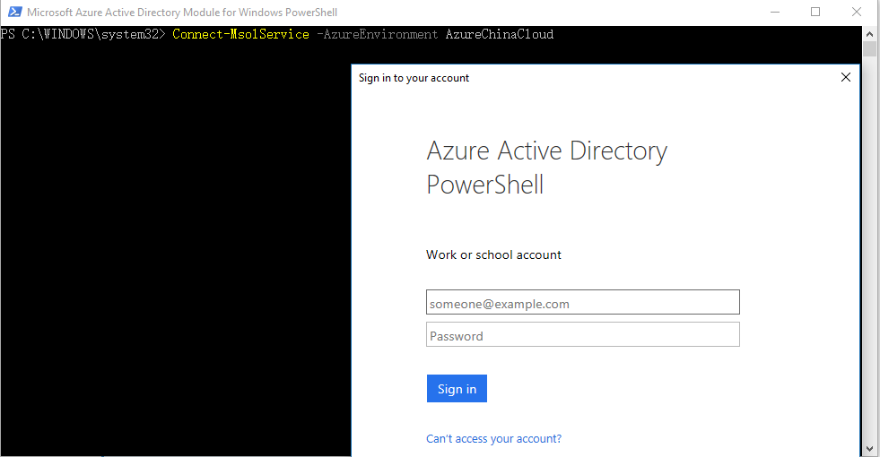
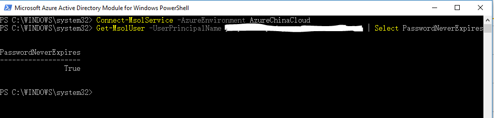
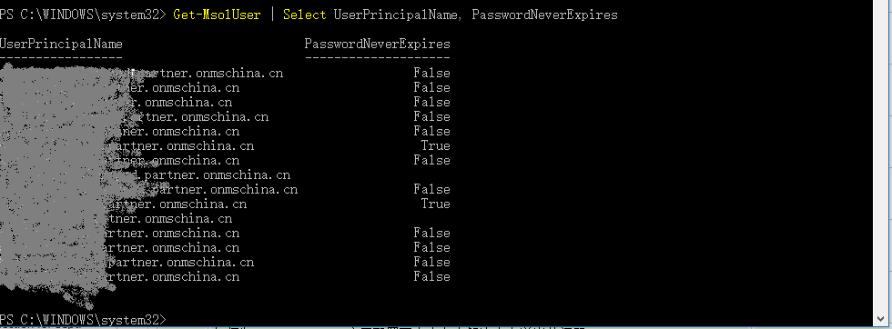

<properties 
	pageTitle="如何配置 Azure Active Directory 账户密码永不过期" 
	description="本文适用于未将本地活动目录与 Azure AD 集成的账号。如果需要对集成后的账号配置密码用户过期，请在本地活动目录内对账号进行配置，并使用同步工具将配置同步至 Azure AD。" 
	services="Active Directory" 
	documentationCenter="" 
	authors=""
	manager="" 
	editor=""/>
<tags 
	ms.service="active-directory-aog"
	ms.date="" 
	wacn.date="10/28/2016"/>
# 如何配置 Azure Active Directory 账户密码永不过期 #

本文适用于未将本地活动目录与 Azure AD 集成的账号。如果需要对集成后的账号配置密码用户过期，请在本地活动目录内对账号进行配置，并使用同步工具将配置同步至 Azure AD。关于更多集成的信息，请参考将[本地标识与 Azure Active Directory 集成](/documentation/articles/active-directory-aadconnect/ "https://www.azure.cn/documentation/articles/active-directory-aadconnect/")。

我们建议您不要将用户帐户的密码设置为永不过期。我们建议将服务帐户（如用于 Active Directory 同步的帐户）的密码设置为永不过期。

**安装 PowerShell 模块**

Azure AD 模块支持安装了默认版本的微软 .Net Framework 与 Windows PowerShell 工具的以下操作系统：Windows 8.1，Windows 8，Windows 7，Windows Server 2012 R2，Windows Server 2012 或 Windows Server 2008 R2。

下载并安装[适用于 IT 专业人员 RTW 的 Microsoft Online Services 登录助手](https://www.microsoft.com/zh-cn/download/details.aspx?id=41950 "https://www.microsoft.com/zh-cn/download/details.aspx?id=41950")，然后下载并安装 [Windows PowerShell Azure AD 模块（x64 版本）](http://go.microsoft.com/fwlink/p/?linkid=236297 "http://go.microsoft.com/fwlink/p/?linkid=236297")。

**连接至 Azure AD**

以管理员模式运行桌面的 Windows Azure Active Directory Module for Windows PowerShell 快捷方式。使用 `Connect-MsolService -AzureEnvironment AzureChinaCloud` 命令连接至 Azure AD，然后输入你的账户与密码（例如：example@domain.partner.onmschina.cn)。你也可以使用以下命令提前输入账户凭据并连接： 

	$msolcred = Get-Credential
	Connect-MsolService -Credential $msolcred -AzureEnvironment AzureChinaCloud

**将密码设置为永不过期**

若要将某位用户的密码设置为永不过期，请使用用户主体名称 (UPN) 或用户的用户 ID 运行以下命令：

	Set-MsolUser -UserPrincipalName <user ID> -PasswordNeverExpires $true

若要为组织中的所有用户将密码设置为从不过期，请运行以下命令：

	Get-MsolUser | Set-MsolUser -PasswordNeverExpires $true

**查看密码是否设置为永不过期**

若要查看某位用户的密码是否设置为永不过期，请使用用户主体名称 (UPN)（例如，aprilr@contoso.onmicrosoft.com）或要检查的用户的用户 ID 运行以下命令：

	Get-MsolUser -UserPrincipalName <user ID> | Select PasswordNeverExpires

**查看所有用户的密码永不过期**

若要查看所有用户的密码永不过期设置，请运行以下命令：

	Get-MsolUser | Select UserPrincipalName, PasswordNeverExpires

 

**更多信息**

[将本地标识与 Azure Active Directory 集成](/documentation/articles/active-directory-aadconnect/ "https://www.azure.cn/documentation/articles/active-directory-aadconnect/")
