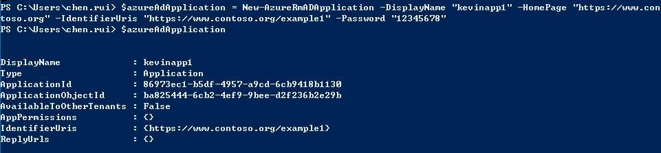

<properties
	pageTitle="如何通过 PHP 获取 Azure Active Directory 令牌"
	description="通过 PHP 获取 调用 Azure Rest API 所需的 Azure Active Directory 令牌"
	service="microsoft.activedirectory"
	resource="activedirectory"
	authors=""
	displayOrder=""
	selfHelpType=""
	supportTopicIds=""
	productPesIds=""
	resourceTags="Azure AD, PowerShell, PHP, OAuth"​
	cloudEnvironments="MoonCake" />
<tags 
	ms.service="active-directory-aog"
	ms.date=""
	wacn.date="01/12/2017" />
# 如何通过 PHP 获取 Azure Active Directory 令牌

在调用 Azure Rest API 时，如果是属于 Azure Resource Manager 的 API，则需要使用 Azure Active Directory (Azure AD)认证获取令牌（Token),然后才能够进行访问。
                                                                                      
>[AZURE.NOTE]以下认证方式，只适用于 Azure Resource Manager 的 API。 即 endpoint 为 `management.chinacloudapi.cn` 的 API，不适用于 Azure Service Manager 的 API（endpoint 为 `management.core.chinacloudapi.cn` 的 API）。

以下是创建 Azure AD 应用，并授权其可以访问管理 Azure 的资源的步骤：

## 登录 Azure 账户（PowerShell）

记录获取到的 TenantID 以供后续程序使用。
 
## 选择当前订阅 ID

设置当前订阅，多订阅环境下需要执行该步骤 :

	Set-AzureRmContext -SubscriptionId <subscription ID>
 
## 创建 AD 应用

查看新创建的应用对象，属性 ApplicationId,在后续会用来创建服务凭证，角色设置和 Access Token。

	$azureAdApplication = New-AzureRmADApplication -DisplayName "exampleapp" -HomePage "https://www.contoso.org" -IdentifierUris "https://www.contoso.org/example" -Password "<Your_Password>"

## 创建服务凭证

Azure AD 应用创建服务凭证:

	New-AzureRmADServicePrincipal -ApplicationId $azureAdApplication.ApplicationId

当创建完成服务凭证后，初始是没有任何权限的，我们需要为其设置权限范围。
 
## 授权

为您的服务凭证添加角色设置，在该例中，为您的服务凭证设置访问您订阅下所有资源的读权限。 如果想了解更多内容，请参考：[Azure Role-based Access Control](https://azure.microsoft.com/en-us/documentation/articles/role-based-access-control-what-is/)。

	New-AzureRmRoleAssignment -RoleDefinitionName Contributor -ServicePrincipalName $azureAdApplication.ApplicationId

其中 `RoleDefinitionName` 有三种权限设置：

1. Reader      对Azure资源有读取权限。
2. Contributor 对Azure资源有管理权限，但无法授权他人。
3. Owner       对Azure资源拥有管理权限，也可以授权他人管理。

## 调用 Oauth2 API 获取 Token

这样 Azure AD Application 就创建完成了，我们可以使用以下三个信息，来获取认证的 Token。

1. telent-id      对应订阅信息上使用的 telentID。
2. application-id 创建应用返回的 ApplicationID。
3. app password   创建应用时填写的密码。

获取 Token 的方式，使用 Azure login oauth2 的认证接口，如果想了解更多，请参考此文档：[Using the Azure Resource Manager REST API](https://blogs.msdn.microsoft.com/cloud_solution_architect/2016/02/20/using-the-azure-resource-manager-rest-api/)。

请参考以下代码：

	$tenlent_id = 'Your Sub Tenlent ID';
	$client_id = 'Application ID';
	$client_secret = 'Application Password';
	 
	$auth_url = 'https://login.chinacloudapi.cn/'.$tenlent_id.'/oauth2/token?api-version=1.0';
	$auth = curl_init($auth_url);
	$post_data= 'grant_type=client_credentials&resource=https://management.chinacloudapi.cn/&client_id='.$client_id.'&client_secret='.urlencode($client_secret);
	 
	curl_setopt_array($auth, array(
	CURLOPT_VERBOSE => 1,
	CURLOPT_POST => 1,
	CURLOPT_POSTFIELDS => $post_data,
	CURLOPT_SSL_VERIFYPEER => false,
	CURLOPT_SSL_VERIFYHOST => false,
	CURLOPT_HTTPHEADER => array(
	'Content-Type: application/x-www-form-urlencoded'
	)
	));
	curl_exec($atuh);
	echo "\n";
 
执行查询后会得到 Token 数据， access_token 即为访问 Token。

	{
	"token_type": "Bearer",
	"expires_in": "3600",
	"expires_on": "1455680701",
	"not_before": "1455676801",
	"resource": "https://management.azure.com/",
	"access_token": "eyJ0eXAiOi…"
	}
 
然后将您要访问的 API 请求头上加上 Authorization 的 Header 设置，并将其值设置为：
 

>[AZURE.NOTE]Token 之前要加上 Bearer。
 
调用示例：

	$token = 'eyJ0eXA…';
	$host = 'management.chinacloudapi.cn';
	$version = '2015-09-01';
	$url = 'https://'.$host.'/subscriptions/5bbf0cbb-647d-4bd8-b4e6-26629f109bd7/resourceGroups/Default-MySql-ChinaNorth/providers/Microsoft.MySql/servers/poddbtest/databases/kevintest?api-version='.$version;
	$ch = curl_init($url);
	$data = array(
	'properties' => array(
	'charset' => 'utf8',
	'collation' => 'utf8_general_ci'
	),
	);
	$json = json_encode($data);
	 
	curl_setopt_array($ch, array(
	CURLOPT_VERBOSE => 1,
	CURLOPT_CUSTOMREQUEST => 'PUT',
	CURLOPT_POSTFIELDS => $json,
	CURLOPT_SSL_VERIFYPEER => false,
	CURLOPT_SSL_VERIFYHOST => false,
	CURLOPT_HTTPHEADER => array(
	'Content-type:application/json',
	'Authorization:Bearer '.$token
	)
	));
	 
	$ret =curl_exec($ch);
	if (empty($ret)) {
	    // some kind of an error happened
	    echo 'Curl error: ' . curl_error($ch);
	} else {
	    $info = curl_getinfo($ch);
	}
	echo "\n";