<properties
    pageTitle="如何创建一个使用 Azure AD 调用 Web API 的多租户 SaaS Web 应用程序"
    description="如何创建一个使用 Azure AD 调用 Web API 的多租户 SaaS Web 应用程序"
    service=""
    resource="activedirectory"
    authors="Miley Chen"
    displayOrder=""
    selfHelpType=""
    supportTopicIds=""
    productPesIds=""
    resourceTags="Azure Active Directory, Web Apps, Portal, ASP.NET"
    cloudEnvironments="MoonCake" />
<tags
    ms.service="active-directory-aog"
    ms.date=""
    wacn.date="04/27/2017" />

# 如何创建一个使用 Azure AD 调用 Web API 的多租户 SaaS Web 应用程序

这篇文章主要讲述如何创建一个可以通过 Azure AD 做用户 Sign up/Sign in 的多租户 Web 本地应用程序。

## 准备工作

- Visual Studio 2013/2015/2017
- Azure Active Directory 租户
- AD 租户中的**用户**账户

## 创建应用

### 管理门户部分

1. 登录 [Azure 经典管理门户](https://manage.windowsazure.cn/)，在 ACTIVE DIRECTORY 下创建一个 Azure AD 租户并添加相关用户。

    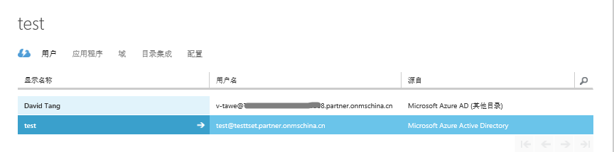

2. 使用 Azure AD 租户注册应用。

    1. 进入新注册的 Azure AD 租户，选择**应用程序**选项页。

        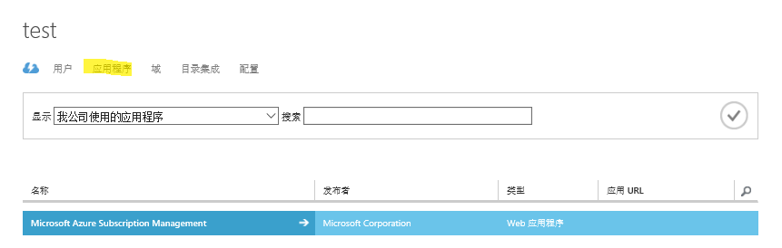

    2. 点击下方的**添加**按钮注册一个应用程序，输入一个有效的名称如 'TodoListWebApp_MT'，同时在类型选项中选择 **Web 应用程序和/或 Web API** 作为该应用程序的类型，点击下一步。

        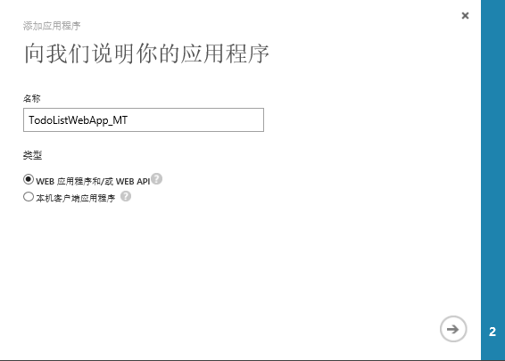

    3. 输入**登录 URL**，可以输入默认值 `https://localhost:44302/`；输入**应用程序 ID URI**，例如 `https://<your_tenant_domain>/TodoListWebApp_MT`,将对应的`<your_tenant_domain>` 部分用自己的 Azure AD 租户的 domain 名称代替。最后点击完成创建应用程序。

        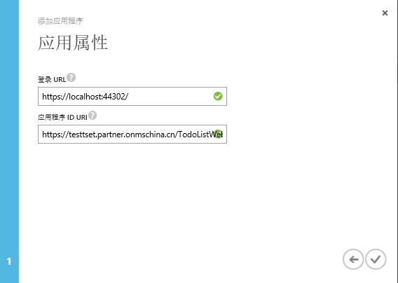

    4. 创建完成后找到你刚才创建的应用程序，选择**配置**选项页找到**客户端  ID**，将其复制并保存在安全的位置，稍后将会在 Visual Studio 中配置该值。

        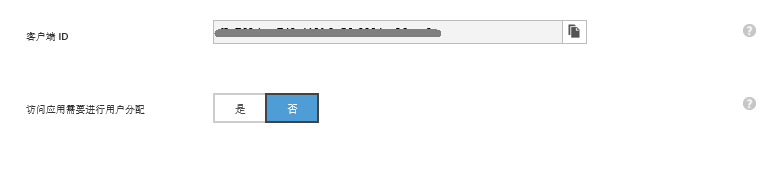

3. 为您的 Azure AD 租户创建应用程序密钥。

    点击刚才第二步中创建好的应用程序，选择**配置**选项页，找到**密钥**选项，为该应用程序创建有效期为 1 年或者 2 年的密钥，点击下方的**保存**按钮来创建密钥。

    [AZURE.NOTE]当你保存此页面时，将显示密钥值，将其复制并保存在安全的位置，稍后将会在 Visual Studio 中配置该值，另外此键值不会再次显示，所以创建完成后尽快保存。

    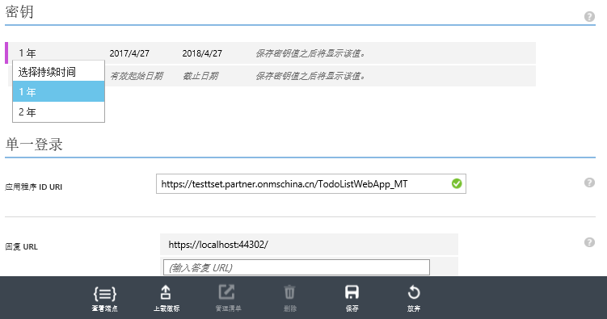

4. 同样在**配置**选项页下，将您的应用程序配置为多租户的并点击保存按钮。

    [AZURE.IMPORTANT]在将某个应用程序设为多租户之前，Azure AD 要求该应用程序的应用 ID URI 全局唯一。应用 ID URI 是在协议消息中标识应用程序的方式之一，就单租户应用而言，应用 ID URI 在该租户中保持唯一便已足够。但是就多租户应用程序而言，该 URI 必须全局唯一，以便 Azure AD 能够在所有租户中找到该应用程序。

    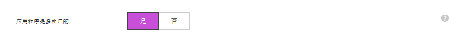

5. 为你的应用程序配置权限。

    1. 在**配置**选项页最下方找到**针对其他应用程序的权限**，点击**添加应用程序**按钮.

        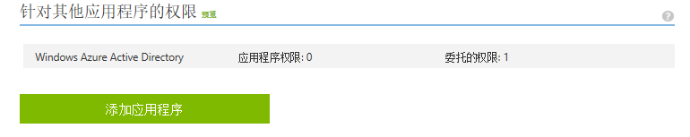

    2. 选择添加 **Microsoft graph** 权限，点击右下角**完成**.

        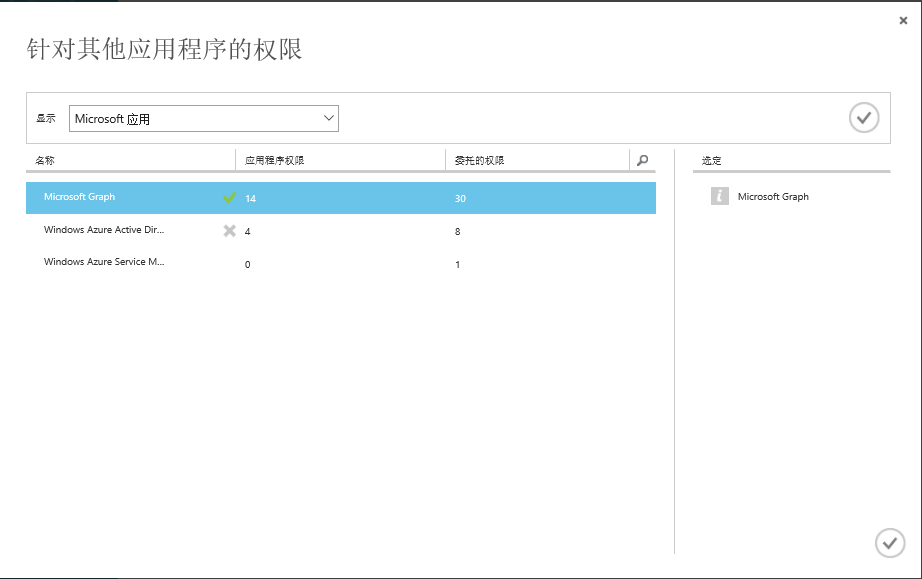

    3. 找到刚才添加的 Microsoft Graph 权限，勾选 **Sign in and read user profile** 权限并保存。

        这将允许你的应用程序接收委托的权限，以便为给定的用户帐户验证和读取用户配置文件数据。

        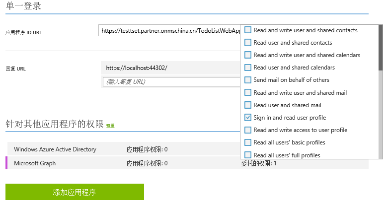

到目前为止，在 Azure 管理门户上做的配置工作已经全部完成，接下来，你需要通过在 Visual studio 中运行示例应用代码来体验多租户 Sign up 和 Sign in.

- 运行示例代码：

    1. 从[这里](https://github.com/wacn/AOG-CodeSample/tree/master/ActiveDirectory/CSharp/active-directory)下载示例代码。

    2. 在 Visual Studio 中打开示例应用项目。

    3. 打开 web.config 文件。

        1. 将 `ida:ClientID` 的值用刚才创建应用程序时生成的**客户端 ID** 替换。

        2. 将 `ida:Password` 的值用刚才创建应用程序时生成的**密钥**替换。

        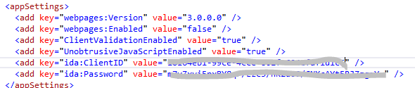

- 测试结果

    1. 运行该应用程序，会显示如下界面：
    
        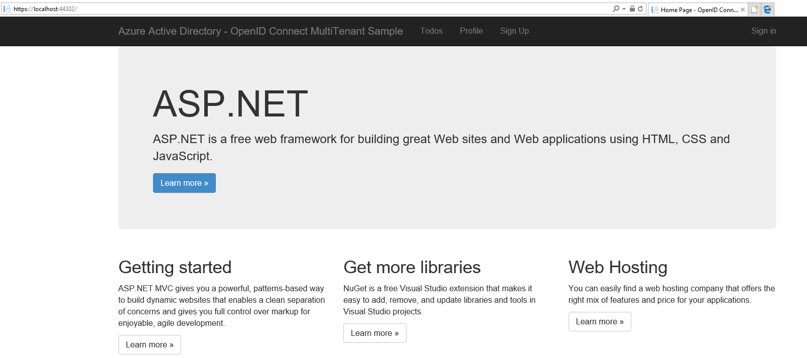

    2. Sign up:

        点击 Sign up，你可以选择是否要遵循**管理员同意**模式或**普通用户同意**模式。

        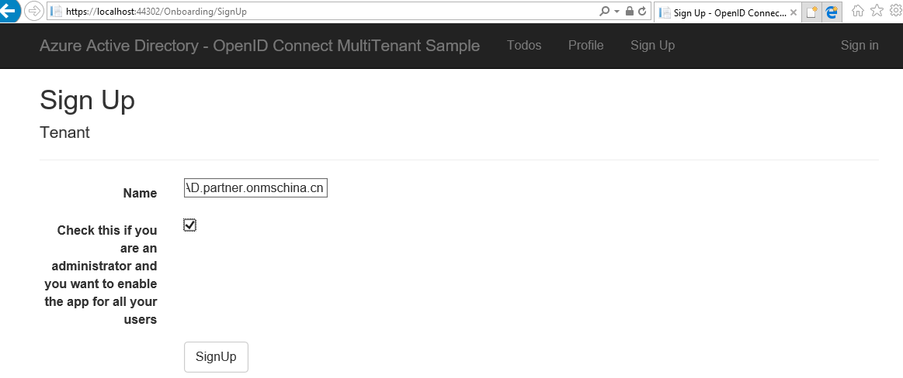

        然后您将被跳转到 Azure AD 登录界面，用你想要登录的用户名和密码登录，如果你用其他 Azure AD 租户（同一订阅非该应用程序注册的租户）下的用户登录，将会有同意页面出现，点击 **AcceptA** 会有提示信息提示登录成功。

        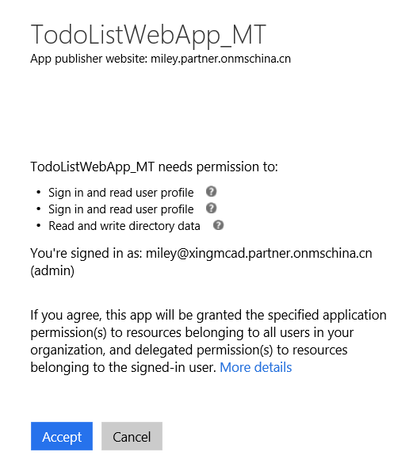

    3. Sign in
    
        一旦 Sign up 成功，就可以用刚才的用户名信息点击 Sign in 登录到应用中。

        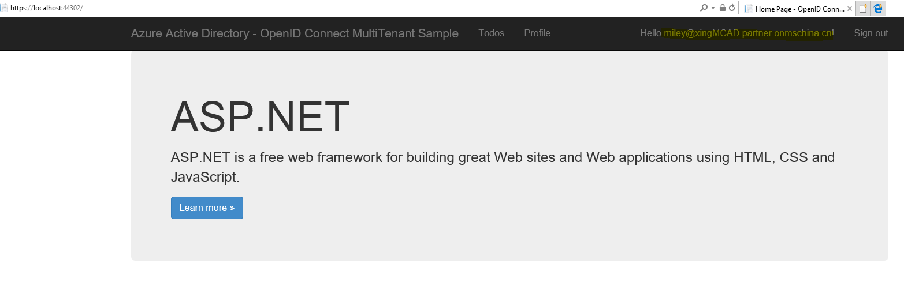

## 参考链接

[如何使用多租户应用程序模式将任何 Azure Active Directory (AD) 用户登录](/documentation/articles/active-directory-devhowto-multi-tenant-overview/)