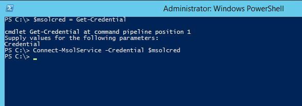
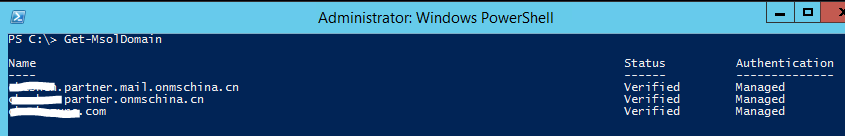
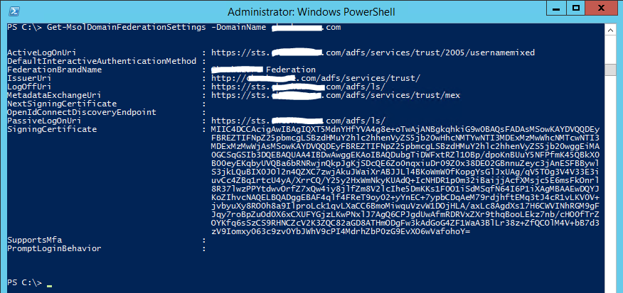
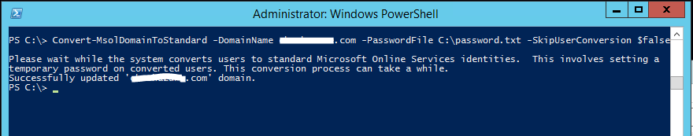
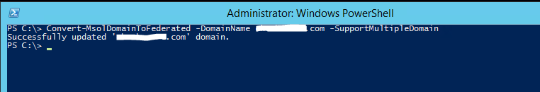
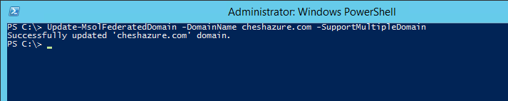

<properties 
	pageTitle="使用 PowerShell 在 Azure Active Directory 中管理域的集成方式" 
	description="使用 PowerShell 在 Azure Active Directory 中管理域的集成方式" 
	services="Active Directory" 
	documentationCenter="" 
	authors=""
	manager="" 
	editor=""/>
<tags 
	ms.service="active-directory-aog"
	ms.date="" 
	wacn.date="08/31/2016"/>
#使用 PowerShell 在 Azure Active Directory 中管理域的集成方式

本文适用于已安装 Azure AD Connect 集成工具，将本地用户与 Azure AD 集成，并配置了基于密码同步的登录或基于 ADFS 联合身份验证服务的联合登陆的客户。关于如何安装并配置 Azure AD Connect，请参考[将本地标识与 Azure Active Directory 集成](/documentation/articles/active-directory-aadconnect/)。

##常见场景

客户可能会因为安全策略需求，需要将已配置了密码同步登录的 Azure 环境转换为基于 ADFS 联合身份验证服务的联合登陆。或者因为某些业务需求，需要弃用基于 ADFS 联合身份验证服务的联合登陆，将 Azure 的登录方式转换为基于密码同步的登录方式。

##前提条件

- 有效的 Azure 或 Office 365 订阅
- Azure AD 或 Office 365 订阅中[已被验证的自定义域名](/documentation/articles/active-directory-add-domain/)
- 本地域内已安装并部署完成的 [Azure AD Connect 集成工具](/documentation/articles/active-directory-aadconnect/)
- 本地域内已安装并部署完成的 ADFS 联合身份验证服务
- 本地域的域管理员账号
- 加入本地域，并拥有 internet 连接的电脑

## 安装 PowerShell 模块

Azure AD 模块支持安装了默认版本的微软 .Net Framework 与 Windows PowerShell 工具的以下操作系统：Windows 8.1，Windows 8，Windows 7，Windows Server 2012 R2，Windows Server 2012 或 Windows Server 2008 R2。

以域管理员账号登陆电脑，下载并安装[适用于 IT 专业人员 RTW 的 Microsoft Online Services 登录助手](https://www.microsoft.com/zh-cn/download/details.aspx?id=41950)，然后下载并安装 [Windows PowerShell Azure AD 模块（x64 版本）](http://go.microsoft.com/fwlink/p/?linkid=236297)。

## 连接至 Azure AD

以管理员模式运行桌面的 Windows Azure Active Directory Module for Windows PowerShell 快捷方式，或在普通 PowerShell 窗口中输入 `Import-Module MSOnline` 以加载模块指令。

在运行本文介绍的 PowerShell 指令之前，您必须使用 `Connect-MsolService` 命令连接至 Azure AD，然后输入您的账户与密码（例如：example@domain.partner.onmschina.cn)。您也可以使用以下命令提前输入账户凭据并连接：

	$msolcred = get-credential
	connect-msolservice -credential $msolcred

## 查看 Azure AD 中域的联合设置

在连接至 Azure AD 之后，您可以使用以下命令得到当前域名的联合设置信息(将 domain.com 替换成您的订阅中已被验证的自定义域名)：

	Get-MsolDomain
	Get-MsolDomainFederationSettings -DomainName (domain.com)

## 连接至本地域内的 ADFS 联合身份验证服务

在连接至 Azure AD 之后，您需要使用以下命令来使 PowerShell 能够连接至本地域内的 ADFS 服务，使得 PowerShell 能够读取或更改 ADFS 服务的信息(将 adfs.domain.com 替换成您的本地域中 ADFS 服务器的机器名)：

	Set-MsolAdfsContext -Computer (adfs.domain.com)

## 将 Azure AD 中的域从联合登陆模式转换至密码同步登陆模式

当 Azure AD 里域的用户使用联合登陆时，他/她使用本地域的用户凭据登陆 Azure/Office 365，Azure AD 本身不会存有用户的密码哈希。
在域从联合登陆转换模式至密码同步登陆模式时，PowerShell 会删除 ADFS 服务中关于 Azure AD 的依赖方( Relying Party) 设置，并给该域内的每个被同步的用户提供一个临时的密码。以下是转换命令(将 domain.com 替换成您的订阅中已被验证的自定义域名)：

	Convert-MsolDomainToStandard -DomainName (domain.com) -PasswordFile C:\password.txt -SkipUserConversion $false

临时密码会被储存在 C:\password.txt 文件中，管理员需要将临时密码分配给每个用户，以便他们登陆 Azure/Office 365。

如果管理员希望用户可以沿用之前的密码，可以用 Azure AD Connect 工具触发一次密码全同步操作，该操作会将被同步用户的密码哈希同步至 Azure AD 中。关于如何触发密码全同步，请参阅[使用 Azure AD Connect 同步实现密码同步](/documentation/articles/active-directory-aadconnectsync-implement-password-synchronization/)。

## 将 Azure AD 中的域从密码同步登陆模式转换至联合登陆模式

您可以使用以下命令将 Azure AD 的域从密码同步登陆模式转换至联合登陆模式(将 domain.com 替换成您的订阅中已被验证的自定义域名)：

	Convert-MsolDomainToFederated -DomainName (domain.com) -SupportMultipleDomain

PowerShell 将在本地域的 ADFS 服务中注册 Azure AD 的依赖方 (Relying Party) 设置，并在 Azure AD 中更新域的联合登陆设置。

## 更新 Azure AD 中域的联合登陆配置信息

在某些情况下，您需要更新域的联合登陆配置信息，例如：

- 本地域中 ADFS 服务的签名证书被更新
- 本地域中 ADFS 服务中 Azure AD 的依赖方设置 (Relying Party) 被误改或误删
- Azure AD 的签名证书被更新等

使用以下命令来更新域的联合登陆配置信息(将 domain.com 替换成您的订阅中已被验证的自定义域名)：

	Update-MsolFederatedDomain -DomainName (domain.com) -SupportMultipleDomain

## 更多信息

- [将自定义域名添加到 Azure Active Directory](/documentation/articles/active-directory-add-domain/)
- [将本地标识与 Azure Active Directory 集成](/documentation/articles/active-directory-aadconnect/)

