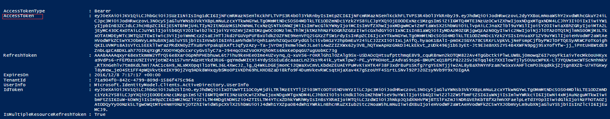

<properties
                pageTitle="如何在不添加应用程序的前提下使用 PowerShell 获取 Azure Active Directory 令牌"
                description="使用 PowerShell 在不添加应用程序的前提下获取 Azure Active Directory 令牌"
                services="active-directory"
                documentationCenter=""
                authors=""
                manager=""
                editor=""
                tags="PowerShell,azure AD,token"/>

<tags
                ms.service="active-directory-aog"
                ms.date="12/16/2016"
                wacn.date="12/16/2016"/>

# 如何在不添加应用程序的前提下使用 PowerShell 获取 Azure Active Directory 令牌

Azure Active Directory (AD) 令牌(Token) 是一种轻型安全令牌，它对受保护的资源授予一定的访问权限。以下讲述一种通过使用 Azure AD Graph API 在不添加应用程序的前提下快速获取 Azure AD Token 的方法。

## Azure AD Graph API 

Azure AD Graph API 通过 OData REST API 终结点提供对 Azure AD 的编程访问权限。 应用程序可以使用 Graph API 对目录数据和对象执行创建、读取、更新和删除 (CRUD) 操作。 例如，可以使用 Graph API 来创建新用户、查看或更新用户的属性、更改用户的密码、检查基于角色的访问的组成员身份、禁用或删除用户。若要访问 Azure AD Graph API，客户端首先需要进行 ADAL (Active Directory Authentication Library)身份验证，该验证通过 PowerShell 的 `Invoke-RestMethod` 命令实现，而该命令需要 Json 格式的 Azure AD Token 作为参数。  
通常要获取 Azure AD Token 时，需要添加应用程序并且需要相应的 `clienID` 返回 URL 等信息来获取 Token，本文讲述一种更为简便的方法：可以使用 PowerShell 脚本获取 Azure AD 的 Token 并且不需要在 Azure AD 中添加应用程序。

## 操作步骤：
1. 登录到 Azure 管理门户。
2. 在左侧的导航栏中单击 "Active Directory"。
3. 新建 Azure AD，如已有 Azure AD，则跳过该步骤。
4. 将以下代码保存为 .ps1 的后缀名，运行该脚本程序。  

**Powershell 代码：**  

	function GetAuthToken
	{
			param
			(
			      [Parameter(Mandatory=$true)]
			      $TenantName
			)
		
			# Load Active Directory Authentication Library (ADAL) Assemblies
			$adal = "${env:ProgramFiles(x86)}\Microsoft SDKs\Azure\PowerShell\ServiceManagement\Azure\Services\Microsoft.IdentityModel.Clients.ActiveDirectory.dll"
		
			$adalforms = "${env:ProgramFiles(x86)}\Microsoft SDKs\Azure\PowerShell\ServiceManagement\Azure\Services\Microsoft.IdentityModel.Clients.ActiveDirectory.WindowsForms.dll"
		
			[System.Reflection.Assembly]::LoadFrom($adal) | Out-Null
		
			[System.Reflection.Assembly]::LoadFrom($adalforms) | Out-Null
		
			# Set well-known client ID for Azure PowerShell
			$clientId = "1950a258-227b-4e31-a9cf-717495945fc2" 
		
			# Set redirect URI for Azure PowerShell
			$redirectUri = "urn:ietf:wg:oauth:2.0:oob"
		
			# Set Resource URI to Azure Active Directory Graph API
			$resourceAppIdURI = "https://graph.chinacloudapi.cn"
		
			# Set Authority to Azure AD Tenant
			$authority = "https://login.chinacloudapi.cn/$TenantName"
		
			# Create AuthenticationContext tied to Azure AD Tenant
			$authContext = New-Object "Microsoft.IdentityModel.Clients.ActiveDirectory.AuthenticationContext" -ArgumentList $authority
		
			# Acquire token
			$authResult = $authContext.AcquireToken($resourceAppIdURI, $clientId,$redirectUri, "Auto")
		
			return $authResult
	}

通过以下方式调用上述脚本中的方法：

	$token = GetAuthToken -TenantName "<your Azure AD tenant>.partner.onmschina.cn"

例如：

	$token = GetAuthToken -TenantName "xuhuadd.partner.onmschina.cn"  
	$token 

**结果截图：**  

