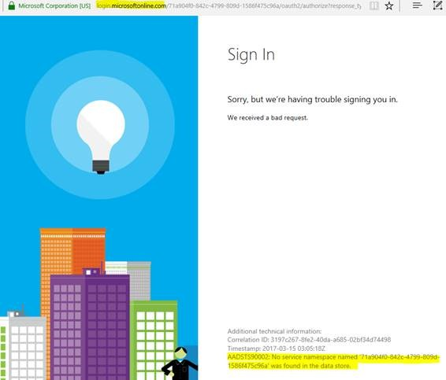

<properties
    pageTitle="无法使用 Azure AD 连接到 Service Fabric 安全群集"
    description="无法使用 Azure AD 连接到 Service Fabric 安全群集"
    service=""
    resource="activedirectory"
    authors="Miley Chen"
    displayOrder=""
    selfHelpType=""
    supportTopicIds=""
    productPesIds=""
    resourceTags="Azure Active Directory, Service Fabric, PowerShell"
    cloudEnvironments="MoonCake" />
<tags
    ms.service="active-directory-aog"
    ms.date=""
    wacn.date="03/28/2017" />

# 无法使用 Azure AD 连接到 Service Fabric 安全群集

安全的群集是防止未经授权的访问和执行管理操作的群集，这些操作包括部署、升级和删除应用程序、服务及其包含的数据。

我们可以使用 Azure Resource Manager 在 Azure 中设置安全的 Azure Service Fabric 群集，在众多安全集群实现机制中，AAD (Azure Active Directory) 通过让组织(称为租户)管理和控制用户对应用程序的访问从而实现安全的身份验证。

我们今天主要讨论使用 Azure AD 去连接安全群集过程中遇到的问题。

## **问题描述**

当我们根据参考[文档](/documentation/articles/service-fabric-cluster-creation-via-arm/)成功创建完使用 AAD 的安全集群后， 通过 PowerShell 或者 service fabric explore 去连接集群时会遇到以下问题：

1. PowerShell连接失败，提示指定的凭证无效。

        Connect-ServiceFabricCluster -ConnectionEndpoint $ClusterConnectionEndpoint -serverCertThumbprint $PrimaryClusterKVThumbprint -AzureActiveDirectory -SecurityToken $accessToken
        Connect-ServiceFabricCluster : The specified credentials are invalid.
        At line:1 char:1
        + Connect-ServiceFabricCluster -ConnectionEndpoint $ClusterConnectionEndpoint -ser ...
        + ~~~~~~~~~~~~~~~~~~~~~~~~~~~~~~~~~~~~~~~~~~~~~~~~~~~~~~~~~~~~~~~~~~~~~~~~~~~~~~~~
            + CategoryInfo          : InvalidOperation: (:) [Connect-ServiceFabricCluster], FabricException
            + FullyQualifiedErrorId :

2. 通过管理门户使用 Service Fabric Explore 访问时提示 `AADSTS90002` 错误，并且注意到跳转的 url 指向了 login.microsoftonline.com。

    

## **问题分析**

正如前面提到的，由于 AAD 认证将中国的用户重定向到 global 的服务，而不是中国的服务（https://login.partner.microsoftonline.cn/）， 所以出现以上问题。

## **解决方法**

目前中国用户可以通过在 ARM 的部署模板中加入以下内容来指定中国 AAD 服务，从而解决该问题（在添加以下内容的过程中请注意 JSON 格式的验证）。

    "fabricSettings": [
        {
            "parameters": [
                {
                    "name": "ClusterProtectionLevel",
                    "value": "EncryptAndSign"
                },
                {
                    "name": "AADLoginEndpoint",
                    "value": "https://login.partner.microsoftonline.cn"
                },
                {
                    "name": "AADTokenEndpointFormat",
                    "value": "https://login.partner.microsoftonline.cn/{0}"
                },
                {
                    "name": "AADCertEndpointFormat",
                    "value": "https://login.partner.microsoftonline.cn/{0}/federationmetadata/2007-06/federationmetadata.xml"
                }
            ],
            "name": "Security"
        }
    ]

另外该问题已经在 global 版本的 5.4 CU3 及以上版本修复，中国也将会在后续上线修复后的版本 ，届时问题将会得到根本解决。