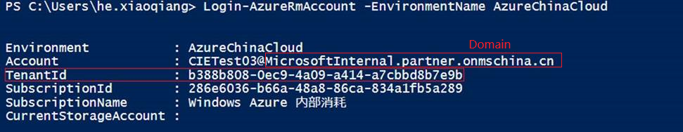
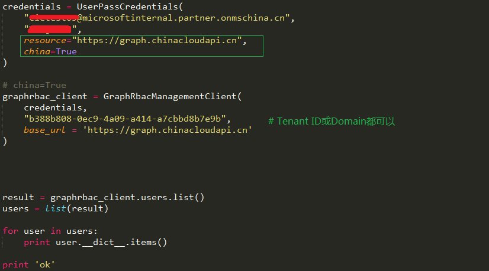
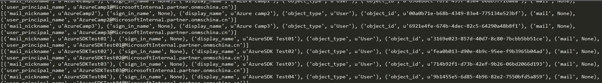

<properties
    pageTitle="Python 调用 Graph API 认证出错"
    description="如何解决 Python 调用 Graph API 认证出错的问题"
    service=""
    resource="activedirectory"
    authors="Chen Rui"
    displayOrder=""
    selfHelpType=""
    supportTopicIds=""
    productPesIds=""
    resourceTags="Active Directory, Python, Graph API"
    cloudEnvironments="MoonCake" />
<tags
    ms.service="active-directory-aog"
    ms.date=""
    wacn.date="03/16/2017" />
# Python 调用 Graph API 认证出错

## **问题描述**

使用 python 调用 Graph API 获取 AD 用户列表，认证过程报错：

    credentials = UserPassCredentials(my_user, my_password )
    InvalidClientIdError: (invalid_request) AADSTS50059: No tenant-identifying information found in either the request or implied by any provided credentials.

## **问题分析**

由于世纪互联运营的 Azure 与国际版 Azure 在资源端点映射上存在区别，所以在调用世纪互联运营的 Azure 的 Graph API 时，需要指定特定的 resouce 终结点以及 china 属性， 如下所示：

    credentials = UserPassCredentials(my_user, my_password, resouce="https://graph.chinacloudapi.cn", china=True)

## **解决方法**

通过以下步骤进行设置及测试：

1. 获取 Tenant ID 或者直接用账户的 Domain（二者皆可）:

    

2. 构建凭据和 Graph Client 及测试：

    

3. 测试结果：

    