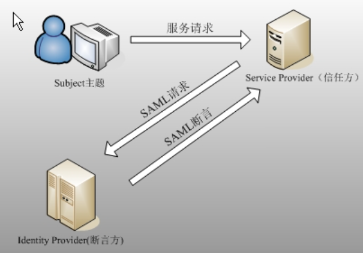

<properties
	pageTitle="通过 Azure AD SAML 协议登录应用报错相关解决方案"
	description="通过 Azure AD SAML 协议登录应用报错相关解决方案。"
	services="active-directory"
	documentationCenter=""
	authors=""
	manager=""
	editor=""
	tags=""/>

<tags
	ms.service="active-directory-aog"
	ms.date="10/27/2016"
	wacn.date="11/10/2016"/>

#通过 Azure AD SAML 协议登录应用报错相关解决方案

###问题描述：

客户搭建了应用是需要使用 azure 的 SAML 协议进行单点登录的，在使用 office365 账户登录应用时遇到以下问题：

假如某个用户所使用的浏览器在之前的一段时间使用过 azure 的 SSO 功能或者登录过 office365 并且最后没有成功注销，并且相当长的一段时间这个浏览器没有再与 azure 交互过的话那么再次使用 SAML SSO 登录这个应用会报错，错误信息如下：

	2016-11-05 16:47:05,653 ERROR [http-nio-443-exec-20] [bitium.saml.servlet.SsoLoginServlet] redirectToLoginWithSAMLError saml plugin error + Response doesn't have any valid assertion which would pass subject validation

通常遇到这个报错的解决办法为将浏览器 COOKIES 全部删除，然后就可以恢复正常了，这篇文章主要对该问题进行深入分析，从而得到更为彻底的解决方法。

###问题分析：

首先，让我们先理解一下 SAML Web SSO 的过程：

1.       用户通过浏览器访问服务提供方（SP）
2.       SP 将请求（带上相应 SAML请求）转向配置的身份信息提供方（IP）
3.       用户提供正确的登录凭据给 IP
4.       IP 验证成功后，通过浏览器返回 SAML 响应（包含 SAML Assertion ）给 SP，并设置浏览器端 cookie
5.       SP 验证 SAML 响应，并额外设置浏览器端 cookie 表明已经验证成功，用户后续访问此 SP 就会带上该cookie 

这样的工作方式使得后续用户重新访问该服务或者其他也基于该 IP 的服务就不需要再次登录，而是直接使用该 cookie。
根据以上分析，如果是我们问题描述的场景（使用 azure AD SSO 功能），AAD 就是 IP，O365 和 Azure 以及客户自己的应用都是 SP，理论上来说，只要 Cookie 不清除，那么 IP 始终能够根据提供的 cookie 信息来返回正确的 SAML Assertion。

 

然后，从前面的分析过程中可以看出 SAML 协议是会利用到 Cookie 的，那么明确下客户端涉及到的 Cookie 主要有哪些：

|名称				|类型	|生命周期			|来源	|
|-------------------|-------|-------------------|-------|
|ESTSAUTHPERSISTENT	|持久型	|6个月				|IP		|
|ESTSAUTH			|会话型	|当浏览器关闭时失效	|IP		|	
|buid				|持久型	|6个月				|IP		|
|SignInStateCookie	|会话型	|当浏览器关闭时失效	|IP		|
|SESSIONID			|会话型	|当浏览器关闭时失效	|SP		|

对应到具体的场景中：

1.	第一次访问 SP，然后新开窗口访问同一个 SP 
	•	第一次访问 SP 成功后会设置所有 cookie 
	•	没有关闭浏览器，所以所有 cookie 都还保留  
	•	访问 SP 时带上来自 SP 的 cookie “SESSIONID”，所以不需要到 IP 端认证就能成功访问
2.	第一次访问 SP，然后新开窗口访问另一个对应同一 IP 的 SP 
	•	第一次访问 SP 成功后会设置所有 cookie 
	•	没有关闭浏览器，所以所有 cookie 都还保留  
	•	访问新 SP 时，会被导向 IP，从而带上来自 IP 的 cookie “ESTSAUTHPERSISTENT，ESTSAUTH，buid，SignInStateCookie” 
	•	IP 不需要用户再次登录，而根据 cookie 里的验证信息直接返回 SAML 响应 
3.	第一次访问 SP，关闭浏览器，重新再访问同一个 SP 
	•	第一次访问 SP 成功后会设置所有 cookie 
	•	关闭了浏览器，会话型的 cookie 会丢失，而持久型会保留 
	•	新开浏览器访问 SP 时，会被导向 IP，只带上这些来自 IP 的持久型 cookie “ESTSAUTHPERSISTENT，buid” 
	•	IP 要求用户重新登录，返回新的 SAML 响应，并设置新的 cookie 
4.	第一次访问 SP，退出登录，然后新开窗口访问同一个 SP 
	•	第一次访问 SP 成功后会设置所有 cookie 
	•	退出登录会清空 IP 服务端记录 
	•	没有关闭浏览器，所以所有 cookie 都还保留 
	•	访问新 SP 时，会被导向 IP，从而带上来自IP的 cookie “ESTSAUTHPERSISTENT，ESTSAUTH，buid，SignInStateCookie” 
	•	IP 端相应的验证记录已被清空，所以要求用户重新登录，返回新的 SAML 响应，并设置新的 cookie 

###解决方案：

前面的介绍中我们就提到可以通过清除 cookie 解决该问题，这是因为 Cookie 清除后，SAML request 就会是全新的，从而使得 IP 对用户重新验证从而避免该问题。
而 AZURE AD 的 SAML 实现是完全按照 SAML 协议定义来的，所以这个问题更多是由于 SAML 本身设计的局限导致的问题（因为要用到 cookie ）。

因此，总得来说解决方案为（任选其一）：

•	关闭浏览器或者清空 cookie

•	退出登录

•	设置 authenticationAge 验证时长为 6 个月

•	使用其他协议的实现，比如 OAuth，Azure AD 也是支持的

