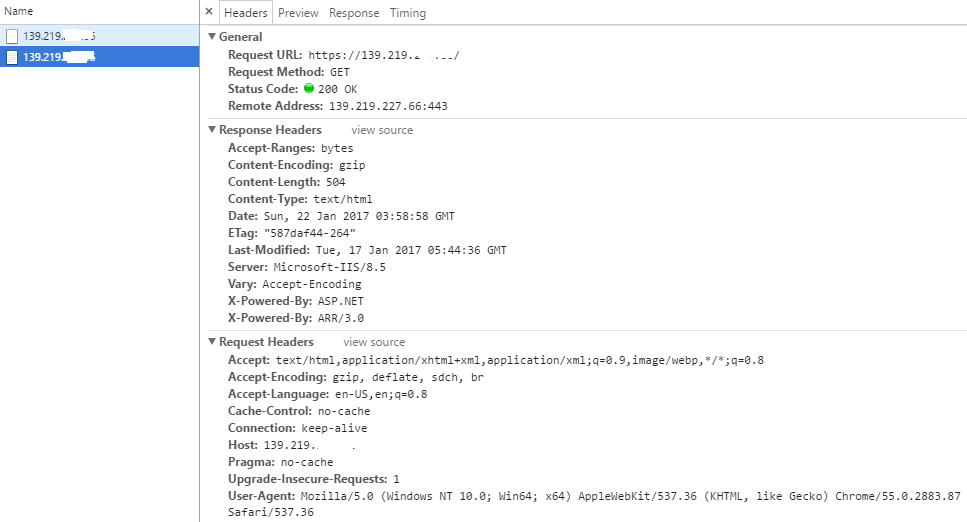

<properties
    pageTitle="如何在使用应用程序网关和 Nginx 的环境下实现强制 HTTPS 跳转"
    description="如何在使用应用程序网关和 Nginx 的环境下实现强制 HTTPS 跳转"
    service=""
    resource="applicationgateway"
    authors="Fred Li"
    displayOrder=""
    selfHelpType=""
    supportTopicIds=""
    productPesIds=""
    resourceTags="Application Gateway, Nginx, HTTPS, HTTP"
    cloudEnvironments="MoonCake" />
<tags
    ms.service="application-gateway-aog"
    ms.date=""
    wacn.date="03/16/2017" />
# 如何在使用应用程序网关和 Nginx 的环境下实现强制 HTTPS 跳转

## 背景介绍

大家在使用 Nginx 部署网站时，实现 HTTP 到 HTTPS 的强制跳转是非常容易的事情，一般可以使用 `rewrite` 命令或者使用返回自定义 301 页面的方法对 HTTP 请求进行 HTTPS 重定向。如果大家把 Nginx 服务器部署在 Azure 应用程序网关后端时，会发现如果原封不动的采取原先的方法进行重定向就无法正常工作。

本文通过讲述 Azure 应用程序网关的工作原理，向大家介绍一种在使用应用程序网关和 Nginx 的环境下实现强制 HTTPS 跳转的方法。

## 应用程序网关工作原理

Azure 应用程序网关采用的是类似于反向代理服务器的工作方式，客户端直接访问应用程序网关的公网地址而无法感知后端实际的服务器。当应用程序网关接收到客户端的请求之后，它会以自身实例在虚拟网络内部的地址作为源地址对后端池内部的服务器发起新的请求来获取数据，再将获取的数据通过原先跟客户端建立的连接返回给客户端。

如上图所示，我们部署了三台 Nginx 服务器在应用程序网关后端。应用程序网关部署在 AppGw 子网之内，Nginx 服务器部署在 Nginx 子网之内。应用程序网关本质上是由多个虚拟机实例组成的群集，默认情况下建立的应用程序网关包含两个实例，每个实例都会占用子网内的一个地址，如上图所示**实例 -0** 占用地址 192.168.0.4，**实例 -1** 占用地址 192.168.0.5。当客户端对应用程序网关发起请求时，Azure 前端的负载均衡器会将请求发送到对应的应用程序网关实例，应用程序网关上面的服务会以实例本身的内网地址向后端服务器发起新的请求。比如客户端的请求被发送到**实例 -0**，该实例会以 192.168.0.4 作为源地址对后端服务器发起请求。

## 应用程序网关转发机制

由于应用程序网关向后端服务器发起的请求改变了客户端请求的源地址，所以从 TCP 层面来讲，客户端的信息会丢失，但是从 HTTP 层面来讲这个信息并未丢失。这主要是因为应用程序网关会在 HTTP 包头内部添加 X-Forwarded 字段来记录客户端访问的源 IP、源端口、访问协议和请求的目的地址端口。

假设我们成功部署下面的环境，应用程序网关前端开启 80 端口走 HTTP 协议， 443 端口走 HTTPS 协议（同时完成 SSL 卸载），后端只开启 80 端口走 HTTP 协议（目前中国区 Azure 应用程序网关在后端只支持 HTTP 协议）。

当客户端通过 80 端口使用 HTTP 协议访问时，如果我们从后端服务器上面抓包，我们可以看到 HTTP 包头的 X-FORWARDED-PROTO 为 HTTP, X-FORWARDED-PORT 为 80，同时也会在 X-Forwarded-For 部分记录访问者的源 IP 和源端口（实际 IP 以 x.x.x.x 代替）。

    Frame: Number = 32, Captured Frame Length = 649, MediaType = ETHERNET
    + Ethernet: Etype = Internet IP (IPv4),DestinationAddress:[00-17-FA-00-73-C4],SourceAddress:[44-03-A7-A4-3F-41]
    + Ipv4: Src = 192.168.0.4, Dest = 192.168.1.4, Next Protocol = TCP, Packet ID = 32620, Total IP Length = 635
    + Tcp: Flags=...AP..., SrcPort=58266, DstPort=HTTP(80), PayloadLen=595, Seq=518190070 - 518190665, Ack=447095254, Win=515 (scale factor 0x8) = 131840
    - Http: Request, GET / 
        Command: GET
    + URI: /
        UserAgent:  Mozilla/5.0 (Windows NT 10.0; Win64; x64) AppleWebKit/537.36 (KHTML, like Gecko) Chrome/55.0.2883.87 Safari/537.36
        Upgrade-Insecure-Requests:  1
        X-FORWARDED-PROTO:  http
        X-FORWARDED-PORT:  80
        X-Original-URL:  /
        X-Forwarded-For:  x.x.x.x:64397
        X-ARR-LOG-ID:  3f7b9b21-a862-4b62-a850-dc378bc3c843
        HeaderEnd: CRLF

当客户端通过 443 端口使用 HTTPS 协议访问时，从下面的抓包可以看到应用程序网关完成了 SSL 卸载之后仍然是通过 HTTP 80 端口来访问后端服务器，但是会在 HTTP 包头的 X-FORWARDED-PROTO 记录原始访问是 HTTPS 请求以及原始访问是请求服务器的 443 端口。

    Frame: Number = 36, Captured Frame Length = 700, MediaType = ETHERNET
    + Ethernet: Etype = Internet IP (IPv4),DestinationAddress:[00-17-FA-00-73-C4],SourceAddress:[44-03-A7-A4-3F-41]
    + Ipv4: Src = 192.168.0.4, Dest = 192.168.1.4, Next Protocol = TCP, Packet ID = 15961, Total IP Length = 686
    + Tcp: Flags=...AP..., SrcPort=57271, DstPort=HTTP(80), PayloadLen=646, Seq=375761782 - 375762428, Ack=1033546289, Win=511
    - Http: Request, GET / 
        Command: GET
    + URI: /
        UserAgent:  Mozilla/5.0 (Windows NT 10.0; Win64; x64) AppleWebKit/537.36 (KHTML, like Gecko) Chrome/55.0.2883.87 Safari/537.36
        Upgrade-Insecure-Requests:  1
        X-FORWARDED-PROTO:  https
        X-FORWARDED-PORT:  443
        X-Original-URL:  /
        X-Forwarded-For:  x.x.x.x:64390
        X-ARR-SSL:  2048|256|CN=FredTest|CN=FredTest
        X-ARR-LOG-ID:  e93508a5-5242-4f0d-a778-84630f71541b
        HeaderEnd: CRLF

通过上面的分析，我们可以看到客户端的 HTTP 和 HTTPS 请求到达后端服务器都是 HTTP 请求，但是应用程序网关会在 HTTP 包头的 X-FORWARDED-PROTO 和 X-FORWARDED-PORT 中对这两种请求加以区分。

## 配置 Nginx 实现强制 HTTPS 转换

在未使用应用程序网关的场景下，我们一般可以在 Nginx 配置里使用类似于下面的 rewrite 命令来重定向客户端的 HTTP 请求。

    server {
        listen        80;
        server_name   www.abc.com
        rewrite ^/(.*) https://$host$1 permanent;
    }

但是在使用应用程序网关的场景下会发生问题，因为 Nginx 服务器本身虽然将这个请求重写为 HTTPS 请求，但是当新的 HTTPS 的请求再次经过应用程序网关到达后端服务器时又会变为 HTTP 请求从而导致死循环。解决此问题的办法就是需要在后端服务器上来判断客户的原始请求时 HTTP 还是 HTTPS，当客户的原始请求是 HTTP 时进行重定向，而当客户的原始请求是 HTTPS 时不进行重定向。通过前面的分析，我们已经知道可以通过 HTTP 包头的 X-FORWARDED-PROTO 来判断客户端的实际请求，而 Nginx 又会将字段 X-FORWARDED-PROTO 的值保存在变量 $http_x_forwarded_proto 中，这样我们就可以加入类似下面的判断语句来实现强制 HTTPS 跳转了。

    server {
        listen        80;
        server_name   www.abc.com
        if ($http_x_forwarded_proto = 'http')
        {
            rewrite ^/(.*) https://$host$1 permanent;
        }
    }

通过这样的设置，当访问网站时我们可以看到服务器端返回了 301 并请求跳转到 HTTPS。

客户端再次通过 HTTPS 访问时，服务端不再返回 301 而是返回 200 表示访问成功。

