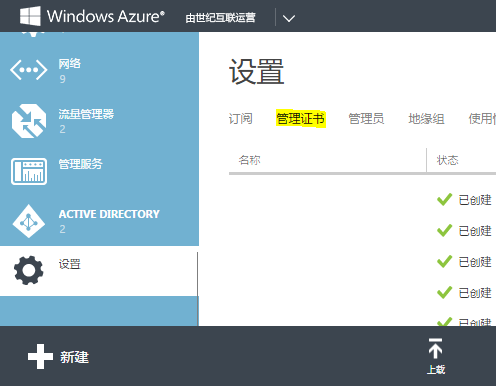
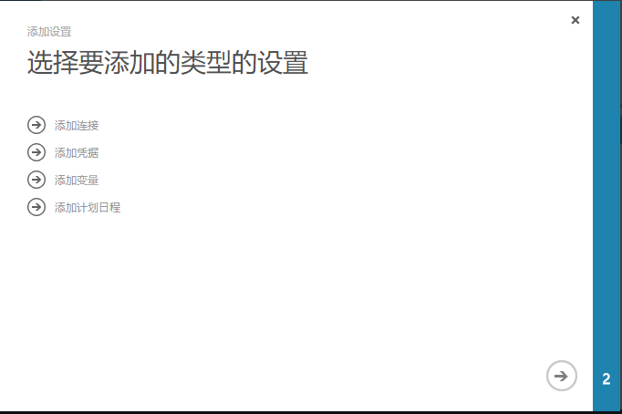
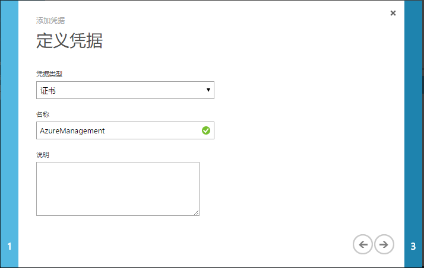
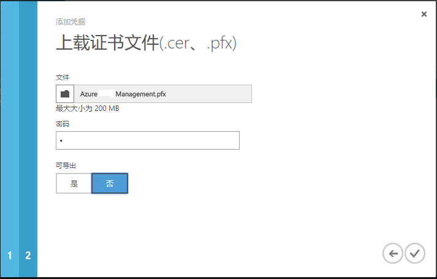
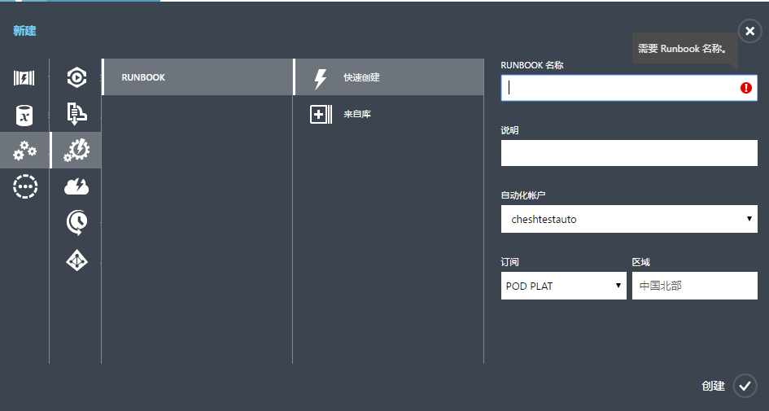
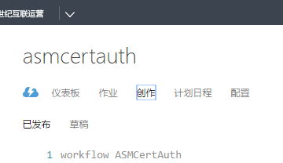
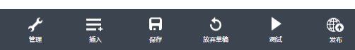

<properties
	pageTitle="在 Azure 自动化经典模式中使用证书验证"
	description="在 Azure 自动化经典模式中使用证书验证"
	service=""
	resource="automation"
	authors=""
	displayOrder=""
	selfHelpType=""
	supportTopicIds=""
	productPesIds=""
	resourceTags="Automation, PowerShell, RUNBOOK, Certification"
	cloudEnvironments="MoonCake" />
<tags 
	ms.service="automation-aog"
	ms.date=""
	wacn.date="02/07/2017" />
# 在 Azure 自动化经典模式中使用证书验证

借助 Azure 自动化，用户可以自动完成通常要在云环境和企业环境中执行的手动、长时间进行、易出错且重复性高的任务。它可以节省时间，可以提高常规管理任务的可靠性，甚至可以将这些任务安排成按特定的时间间隔自动执行。

运行 Azure 自动化任务需要首先在自动化任务中使用 PowerShell 命令登录 Azure，通常通过调用存放在自动化账户里的 Azure 账号用户名密码，使用`Add-AzureAccount`，`Login-AzureRmAccount` 等 PowerShell 命令登录后，才能正常运行后续的命令。

使用证书验证来替代通常的用户名密码验证，可以避免由于以下原因导致的自动化任务不可用：

1.	更改了 Azure 账号密码，但忘了更新自动化账户的 Runbook 所使用的账号密码。
2.	启用了[多重身份验证](/documentation/services/multi-factor-authentication/)的 Azure 账号，在自动化任务中调用用户名密码无法完成登录验证。

## 前提条件

-	有效的 Azure 订阅。
-	已经安装了最新 [Azure PowerShell](http://aka.ms/webpi-azps) 模块的本地 Windows 电脑。

## 查看并更新 Azure 自动化账户的 PowerShell 模块版本。

由于 Azure 自动化账户默认使用的 PowerShell 版本过旧，需要更新相应的模块版本。请参阅[如何更新 Azure 自动化服务的 PowerShell 模块](/documentation/articles/aog-automation-powershell-module-update/)，更新 Azure 自动化账户资产里的 Azure.Storage 模块至 2.2.0 或以上，Azure 模块至 3.0.0 或以上。

本地电脑上的 Azure Storage 模块默认存放在 `C:\Program Files (x86)\Microsoft SDKs\Azure\PowerShell\Storage`， Azure 模块默认存放在 `C:\Program Files (x86)\Microsoft SDKs\Azure\PowerShell\ServiceManagement`。如果压缩 zip 文件大小超过了 40MB，导致上传至自动化账户时报错，请使用 7zip 压缩工具，在压缩时选择极限压缩，保证压缩文件不要超过 40MB。

## 准备验证使用的证书

用户可以选择商用证书或自签名证书。选择商用证书时，需要确保证书的 EKU（Enhanced Key Usage）字段包含服务器验证（Server Authentication）和客户端验证（Client Authentication）。

用户也可以使用以下 PowerShell 命令在本地电脑中生成自签名证书，请自行更改证书 DNS 名 `$CertDNSName` 变量和 .pfx 证书密钥 `$CertPlainPassword` 变量。

	$CertDNSName = "AzureManagement"
	$CertPlainPassword = "Password"
	$CertPath = Join-Path $env:TEMP ($CertDNSName + ".pfx")
	$CertPathCer = Join-Path $env:TEMP ($CertDNSName + ".cer")
	$Cert = New-SelfSignedCertificate -DnsName $CertDNSName -CertStoreLocation cert:\LocalMachine\My -KeyExportPolicy Exportable -Provider "Microsoft Enhanced RSA and AES Cryptographic Provider"
	$CertPassword = ConvertTo-SecureString $CertPlainPassword -AsPlainText -Force
	Export-PfxCertificate -Cert ("Cert:\localmachine\my\" + $Cert.Thumbprint) -FilePath $CertPath -Password $CertPassword -Force | Write-Verbose
	Export-Certificate -Cert ("Cert:\localmachine\my\" + $Cert.Thumbprint) -FilePath $CertPathCer -Type CERT | Write-Verbose

此段命令会在本地电脑中生成一张 CN 名为 AzureManagement 的自签名证书，并导出 .pfx 和 .cer 两个版本的证书文件到 `%Temp%` 文件夹下。`$CertPlainPassword` 变量包含 .pfx 文件的密码，在后续步骤里会用到。

## 将证书导入 Azure 经典管理门户

使用 Azure 订阅的服务管理员或协同管理员账号登录 [Azure 经典管理门户](https://manage.windowsazure.cn/)，找到设置->管理证书，点击上载按钮，将 AzureManagement.cer 证书上载为 Azure 管理证书。

## 配置自动化任务中的证书

添加自动化账户后，在资产页面点击下方的添加设置按钮，选择添加凭据。

凭据类型选择证书，填写证书名称。

上载 .pfx 版本的证书，在密码中填入之前设置的 .pfx 证书密码。

## 配置 RUNBOOK

点击左下角新建按钮，选择 RUNBOOK -> 快速创建，填写 RUNBOOK 名称和说明等。

进入 RUNBOOK，点击创作，点击草稿。

将以下 PowerShell 脚本贴到 workflow 中，更改相应订阅的参数：

>[AZURE.NOTE] `workflow` `WorkflowName` `#Workflow` 名字应与 Runbook 名相同。

	{
		$SubName = “Subscription Name” #填写订阅名
		$SubId = “Subscription ID” #填写订阅ID
	    $CertificateAssetName = "AzureManagement" #填写凭据中的证书名称
	    #Write-Verbose "Getting the certificate: $CertificateAssetName" -Verbose
	    $AzureCert = Get-AutomationCertificate -Name $CertificateAssetName
	    if ($AzureCert -eq $null)
	    {
	       throw "Could not retrieve certificate asset: $CertificateAssetName. Assure that this asset exists in the Automation account."
	    }
	    Write-Verbose "Authenticating to Azure with certificate." -Verbose
	    Set-AzureSubscription -SubscriptionName $SubName -Environment AzureChinaCloud -Certificate $AzureCert -SubscriptionId $SubId 
	    Select-AzureSubscription -SubscriptionID $SubId
	}

可以在脚本最后加入其他命令，点击测试按钮，查看输出中是否包含相关命令的输出。在测试完毕后，点击发布按钮发布 RUNBOOK。

>[AZURE.NOTE] 使用 PowerShell 命令生成的自签名证书有效期为 1 年，到期后需要重复本文描述的步骤手动更新管理证书。如果需要自签名证书拥有更长的有效期，可以使用 `New-SelfSignedCertificate` 命令的 `-NotAfter` 参数设定过期时间。详情请参考 [New-SelfSignedCertificate Library](https://technet.microsoft.com/zh-cn/library/hh848633(v=wps.630)) 。

## 后续步骤

[在 Azure 自动化中计划 Runbook](/documentation/articles/automation-schedules/)
