<properties 
	pageTitle="使用 Azure Automation 实现自动开关虚拟机的操作" 
	description="本页介绍如何使用 Azure Automation 实现自动开关虚拟机的操作。" 
	services="automation" 
	documentationCenter="" 
	authors=""
	manager="" 
	editor=""/>
<tags ms.service="automation-aog" ms.date="" wacn.date="06/08/2016"/>

#使用 Azure Automation 实现自动开关虚拟机的操作
 
###本文包含以下内容

- [如何创建自动化账号和Runbook](#create)
- [如何创建凭据](#certification)
- [如何添加作业及执行计划](#scheduler)
- [更多参考资料](#resource)
 
## 如何创建自动化账号和 Runbook
 
首先，我们需要创建一个自动化账号（Automation Account）：

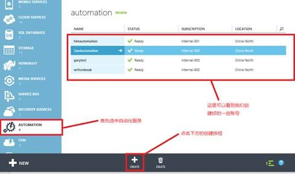 

在弹出的界面中填写自动化账号名称（用户随便定义一个即可），选择区域以及订阅：

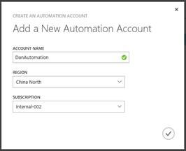 

完成后就能够在列表中看到这个自动化账号，接着点击左下角“创建”按钮创建一个 Runbook：

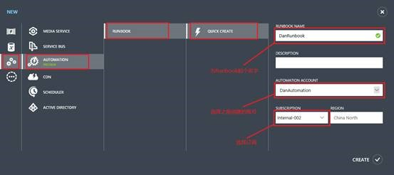  

创建完成后点击进入这个账号：

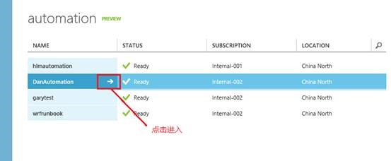 

可以看到刚刚创建的 Runbook：

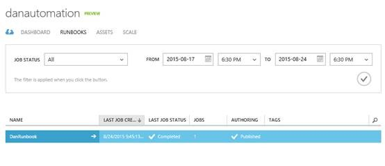 

## 如何创建凭据
 
接着我们在 ASSETS 选项中添加一个 Credential：

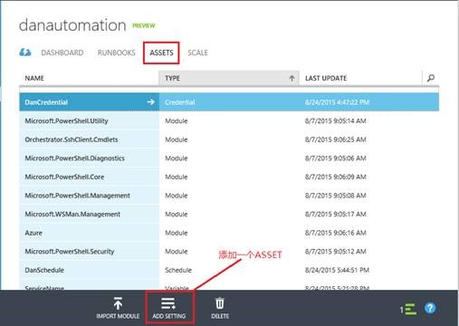 

在弹出的界面中选择 ADD CREDENTIAL：

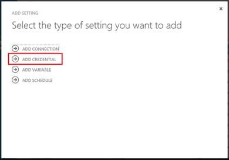  

填写 Credential 的类型以及名称：

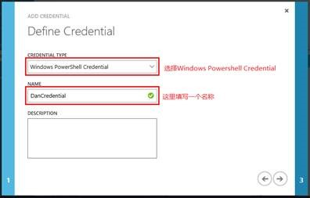  

填写用到的用户名和密码（这里是管理 Azure 的用户名和密码）：

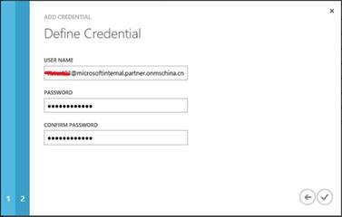

**注意**： 这个步骤中的用户是通过 AAD 创建出来的，我们可以参考[这个链接](/documentation/articles/active-directory-create-users/)来了解如何创建 AAD 用户。本例子是使用管理账号来做的， 

完成后保存。
 
## 如何添加作业及执行计划
 
接着进入之前创建的 Runbook 中，切换到 AUTHOR 选项卡，点击 EDIT RUNBOOK：

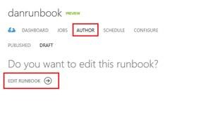   

在弹出的编辑界面中输入下面的代码：

	workflow DanRunbook
	{
	    $Cred = Get-AutomationPSCredential -Name "DanCredential"; 
	    Add-AzureAccount -Credential $Cred -Environment AzureChinaCloud;
	    Select-AzureSubscription -SubscriptionName "Internal-002";    
	    Start-AzureVM -ServiceName "DanEastCS" -Name "Dan08Test";
	}

workflow 后面的 DanRunbook 需要与你的 Runbook 的名称一致，请按照实际情况修改。
这里面第一行里面的 DanCredential 这个名字就是我们前面创建的 Credential 的名称，需要根据实际创建进行替换。Internal-002 是订阅名称 DanEastCS 是云服务的名称，Dan08Test 是虚拟机的名称，也都需要根据具体的情况进行替换。
 
创建完成后我们点击 PUBLISH，将这段脚本发布为正式版本：

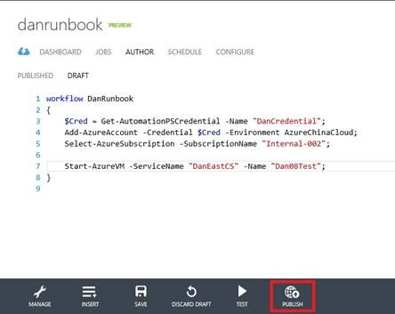
 
注：这里也可以点击 TEST（测试）先测试一下脚本的执行情况，确认无误后再点击 PUBLISH。

发布完成后，我们在 PUBLISHED 选项卡中看到发布的正式脚本，可以点击 START（开始）执行这个脚本：
 
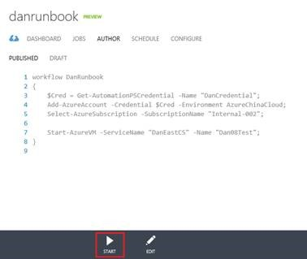

执行完成后，会对应的生成一个 JOB（作业），这里我们脚本测试了两次，所以有两条 JOB 记录：

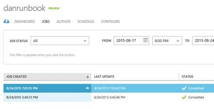

点击 JOB 右侧的白色箭头可以进入到 JOB 中查看具体的执行情况和输出结果。
JOB 执行结束后，可以看到我们的虚拟机已经成功启动了。
 
接着我们为 RUNBOOK 添加一个执行计划：

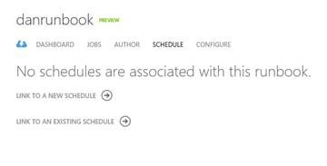
 
选择 LINK TO A NEW SCHEDULE，填写一个计划名称：

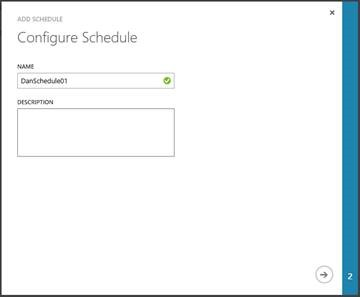 

设置一个执行周期：

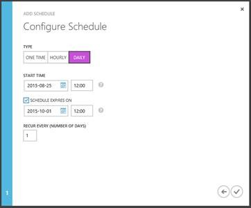

例如这里根据上面截图中的设置，这个 RUNBOOK 会在 2015 年 8 月 25 日到 2015 年 10 月 1 日每天的 12:00 执行，如果不希望设置过期时间，可以取消 SCHEDULE EXPIRES ON 的勾选。
 
这样我们的开机脚本就设置完成了，同样的原理，可以使用下面的脚本配置一个关机脚本：

	workflow StopVMRunbook
	{
	    $Cred = Get-AutomationPSCredential -Name "DanCredential"; 
	    Add-AzureAccount -Credential $Cred -Environment AzureChinaCloud;
	    Select-AzureSubscription -SubscriptionName "Internal-002";	    
	    Stop-AzureVM -ServiceName "DanEastCS" -Name "Dan08Test" -Force;
	}

这个脚本创建在名为 StopVMRunbook 的 Runbook 中。
需要注意的是，这里 Stop-AzureVM 这个命令一定要添加 -Force 参数，不然在命令执行的时候会停在确认是否要关闭虚拟机的界面而无法完成关闭操作。
后面的配置操作与前面 Start 的类似，这里就不赘述了。
 
## 更多参考资料

关于ASSETS的说明

- [凭据（Credential）](https://technet.microsoft.com/zh-cn/library/dn919926.aspx)
- [连接（Connection）](https://technet.microsoft.com/zh-cn/library/dn919922.aspx)
- [变量（Variable）](https://technet.microsoft.com/zh-cn/library/dn919925.aspx)
- [计划（Schedule）](https://technet.microsoft.com/zh-cn/library/dn919914.aspx)
- [创作自动化 Runbook](https://technet.microsoft.com/zh-cn/library/dn469262.aspx)
- [Getting Started with NEW Azure Automation preview feature](http://blogs.technet.com/b/keithmayer/archive/2014/04/04/step-by-step-getting-started-with-windows-azure-automation.aspx)
- [面向 IT 专业人员的脚本资源](https://gallery.technet.microsoft.com/scriptcenter/site/search?f%5B0%5D.Type=User&f%5B0%5D.Value=SC%20Automation%20Product%20Team&f%5B0%5D.Text=SC%20Automation%20Product%20Team&f%5B1%5D.Type=RootCategory&f%5B1%5D.Value=WindowsAzure&f%5B1%5D.Text=Windows%20Azure)
