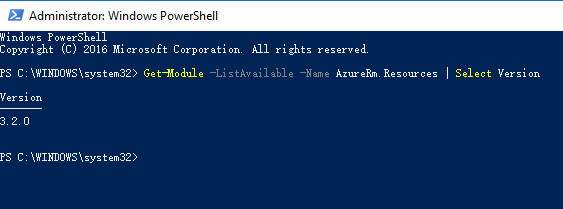
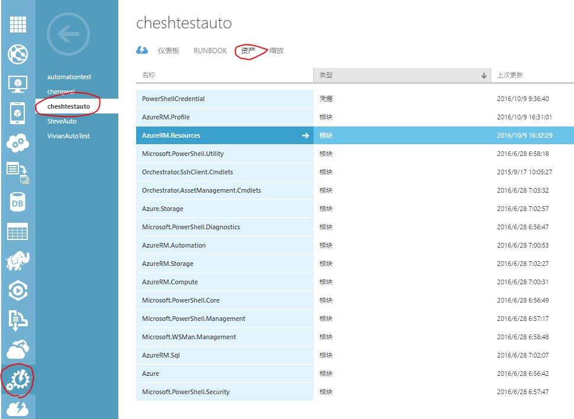
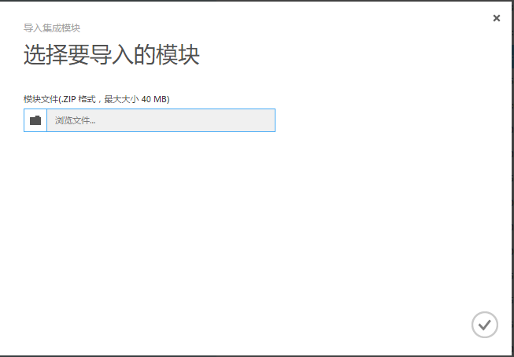

<properties 
	pageTitle="如何更新 Azure 自动化服务的 PowerShell 模块" 
	description="本页介绍如何更新 Azure 自动化服务的 PowerShell 模块。" 
	services="automation" 
	documentationCenter="" 
	authors=""
	manager="" 
	editor=""/>
	
<tags ms.service="automation-aog" ms.date="" wacn.date="10/28/2016"/>

# 如何更新 Azure 自动化服务的 PowerShell 模块 #

本文介绍了如何手动更新 Azure 自动化服务使用的 PowerShell 模块。借助 Azure 自动化，用户可以自动完成通常要在云环境和企业环境中执行的手动、长时间进行、易出错且重复性高的任务。在某些情况下，用户可能需要特定版本的 PowerShell 模块，使得自动化服务的输出符合用户预期。

## 前提条件 ##

- 有效的 Azure 订阅
- 已经安装了特定 PowerShell 模块的本地电脑

**确定当前 PowerShell 模块版本**

在本地电脑中，打开 PowerShell，使用 `Get-Module -ListAvailable -Name <module name> | Select Version` 命令，列出用户关注的模块当前的版本。

在[ Azure 传统门户](https://manage.windowsazure.cn/)里，找到自动化->自动化账户->资产，点击相应模块查看版本

**准备 PowerShell 模块文件**

由于 Azure 自动化服务需要 PowerShell 模块以 zip 文件的形式被上传，用户需要在安装了相应模块的本地电脑上找到并打包模块。

在本地电脑上进入 C:\Program Files (x86)\Microsoft SDKs 目录，找到相应的模块并打包成 .zip 文件。（Azure传统部署模式的模块默认位于 C:\Program Files (x86)\Microsoft SDKs\Azure\PowerShell\ServiceManagement\Azure 目录下，Azure 资源管理器部署模式的模块默认位于 C:\Program Files (x86)\Microsoft SDKs\Azure\PowerShell\ResourceManager\AzureResourceManager 目录下）

**在自动化服务中安装 PowerShell 模块**

在自动化->自动化账户->资产页面，点击下方的导入模块，并上传打包成 .zip 文件的 PowerShell 模块。当提示安装完成后，点击模块查看版本。

需要注意某些模块可能依赖于其他模块，如安装 AzureRM.Resources 模块需要首先安装 AzureRM.Profile 模块。如果安装模块时报错，可以仔细查阅报错信息，并安装相应的前提模块。更多排错信息，请参阅[常见 Azure 自动化错误的错误处理提示](/documentation/articles/automation-troubleshooting-automation-errors/)。

**真实案例**

客户的脚本在本地电脑 PowerShell 与 Azure 自动化服务上输出的数据格式不一致，脚本在自动化服务上正常运行需要将输出数据进行格式转换，且容易报错。支持团队排查后发现 Azure 自动化服务的 PowerShell 模块版本为 1.0.3，本地电脑 PowerShell 模块版本为 3.2.0。更新 Azure 自动化服务模块版本至 3.2.0 后解决了问题。

**更多信息**

- [Azure 自动化概述](/documentation/articles/automation-intro/)
- [常见 Azure 自动化错误的错误处理提示](/documentation/articles/automation-troubleshooting-automation-errors/)
