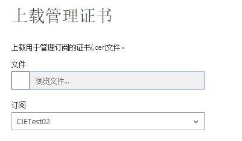
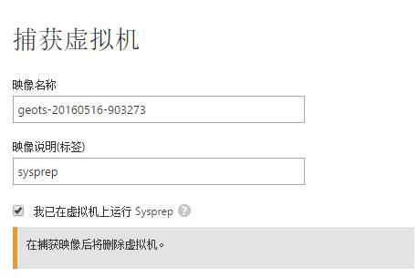
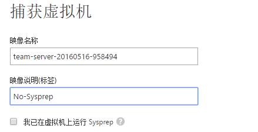
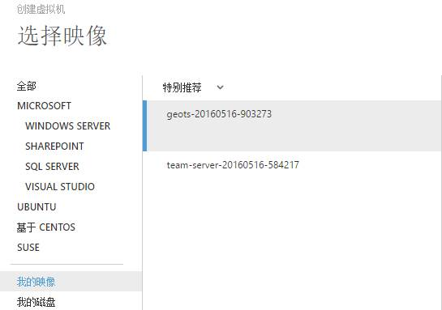

<properties 
	pageTitle="使用 Azure Java SDK 管理 VM" 
	description="本文介绍如何使用 Azure Java SDK 管理 VM" 
	services="" 
	documentationCenter="" 
	authors=""
	manager="" 
	editor=""/>
<tags 
	ms.service="virtual-machine-aog"
	ms.date="" 
	wacn.date="07/29/2016"/>

# 使用 Azure Java SDK 管理 VM

### 本文包以下内容
- [Azure Java Management SDK 介绍](#introduction)
- [Azure Java SDK 的认证方式](#authorization)
- [在云服务中创建 VM](#createVM)
- [基于捕获的映像创建虚拟机](#createVM1)
- [创建系统磁盘和数据磁盘](#createDisk)
- [附加磁盘和分离磁盘](#attachanddelete)
- [相关参考资料](#resource)

## Azure Java Management SDK介绍

azure-svc-mgmt-compute 类包是 Azure Java SDK 所有关于 Azure VM 的操作 API。我们可以从[这里](http://go.microsoft.com/fwlink/?LinkId=690320)下载最新的类包。下面是各个类包的说明：

- **com.microsoft.windowsazure.management.compute.HostedServiceOperations**: Hosted Service 设置相关操作
- **com.microsoft.windowsazure.management.compute.VirtualMachineOperations**: VM 相关操作
- **com.microsoft.windowsazure.management.compute.DeploymentOperations**: 部署相关操作
- **com.microsoft.windowsazure.management.compute.VirtualMachineDiskOperations**: 磁盘相关操作
- **com.microsoft.windowsazure.management.compute.VirtualMachineOSImageOperations**: OSImage 相关操作
- **com.microsoft.windowsazure.management.compute.VirtualMachineVMImageOperations**: VMImage 相关操作
- **com.microsoft.windowsazure.management.compute.LoadBalancerOperations**: 负载均衡相关操作
- **com.microsoft.windowsazure.management.compute.DNSServerOperations**: DNS server 相关操作
- **com.microsoft.windowsazure.management.compute.ExtensionImageOperations**: ExtensionImage 相关操作
- **com.microsoft.windowsazure.management.compute.ServiceCertificateOperations**: 服务器证书相关操作
- **com.microsoft.windowsazure.management.compute.VirtualMachineExtensionOperations**: VM 扩展相关操作
- **com.microsoft.windowsazure.management.compute.OperatingSystemOperations**: 操作系统相关操作

## Azure Java SDK 的认证方式

Azure SDK 提供多种认证方式，以下主要提供两种认证方式，publishsetting 文件认证 和 证书认证

1. Publishsettings 文件认证

    Azure Java SDK 提供的认证方式主要是使用证书来认证，使用 publishsetting 文件也是使用证书来认证，只是 SDK 将认证步骤简化。在publishsetting 文件中，对应的订阅的下会自动生成一个证书，并将证书的内容转换成 Base64 的格式保存在 publishsetting 中，在 SDK 中就是将证书的 Base64 的编码转换成证书，然后作为认证的凭证。我们可以从[这里](https://manage.windowsazure.cn/publishsettings)下载您的订阅对应的 Publishsettings 文件。

    **示例代码**

		Configuration config = PublishSettingsLoader.createManagementConfiguration("<publishsettings file path>", "");  
    	ComputeManagementClient computeManagementClient = ComputeManagementService.create(config);  
    	VirtualMachineOperations vmop = computeManagementClient.getVirtualMachinesOperations();

    
2. 证书认证

    使用购买的证书或者自定义证书，将包含公钥的 cer 文件上传到 Azure 的经典管理门户中：
    
    
    
    

    上传完成后，在本地使用带有公钥和私钥的证书连接 Azure 服务。
    
    **示例代码**
    
    	Configuration config = Configuration.configure(new URI("https://management.core.chinacloudapi.cn"), ;, <cert location>;, <cert password>;);  
		ComputeManagementClient computeManagementClient = ComputeManagementService.create(config);  
    	VirtualMachineOperations vmop = computeManagementClient.getVirtualMachinesOperations();
    

## 在云服务中创建 VM

我们创建 VM 的时候，可以将 VM 创建到新建的云服务中或者已存在的云服务中。下面的示例代码中，是把 VM 创建到已经存在的云服务中，云服务的名称通过变量 *hostedServiceName* 指定。如果需要创建新的云服务，只需要在方法 *createVMDeployment* 中把 *createHostedService* 前面的注释打开。

**示例代码**

	public class CreateVM {
 
	    protected static Configuration config;
	    protected static ComputeManagementClient computeManagementClient;
	    private static HostedServiceOperations hostedServicesOperations; 
	    protected static String testVMPrefix = "georges";                       //虚拟机名称前缀
	    private static String storageAccountName="appendstore";                 //存储账户名称，这里我们使用现有的存储账户
	    private static String storageContainer = "vhd-store";                   //容器名称，可以自定义
	    protected static String vmLocation = "China North";                     //数据中心：China North或China East
	    private static String hostedServiceName="georges01";                    //云服务的名称：可以代码创建也可以使用现有的，如果代码创建，请取消createHostedService()注释
	    private static String deploymentName = testVMPrefix + "deploy1";    
	    private static String virtualMachineName = testVMPrefix + "vm1"; 
	    private static String hostedServiceLabel = testVMPrefix + "HostedServiceLabel1";
	    private static String hostedServiceDescription = testVMPrefix +"HostedServiceDescription1";        
	    private static String deploymentLabel = testVMPrefix + "deployLabel1";
 
    
	    static{
	         // TODO Auto-generated method stub
	         try {
	               //这个地方设置相关的证书，简单来说就是Client拿到访问订阅的权限。上面设置的storageAccountName请务必保证在这个订阅下面
	               // credentials.publishsettings：通过访问http://manage.windowsazure.cn/index/publishsettings下载订阅配置文件
	               //0012e7c8-f7d7-4691-90f0-63b06f0a305b:订阅ID
	                
	               config = PublishSettingsLoader.createManagementConfiguration("E:\\AzureTestProject\\JavaWorkspace\\StorageTest001\\src\\azure\\project\\credentials.publishsettings", 
	                           "0012e7c8-f7d7-4691-90f0-63b06f0a305b");
	               computeManagementClient = ComputeManagementService.create(config);
	            hostedServicesOperations=computeManagementClient.getHostedServicesOperations();
	               createVMDeployment();
	         } catch (IOException e) {
	               // TODO Auto-generated catch block
	               e.printStackTrace();
	         } catch (Exception e) {
	               // TODO Auto-generated catch block
	               e.printStackTrace();
	         }
	    }
	    
	    private static void createVMDeployment(){
	       try {
	           //如果尚未创建云服务，请取消createHostedService()注释，通过代码创建
	           //createHostedService();
	           
	           ArrayList<Role> rolelist = createRoleList(); 
	           VirtualMachineCreateDeploymentParameters deploymentParameters = new VirtualMachineCreateDeploymentParameters();
	           deploymentParameters.setDeploymentSlot(DeploymentSlot.Staging);
	           deploymentParameters.setName(deploymentName); 
	           deploymentParameters.setLabel(deploymentLabel);        
	           deploymentParameters.setRoles(rolelist);
	           OperationResponse operationResponse = computeManagementClient.getVirtualMachinesOperations().createDeployment(hostedServiceName, deploymentParameters);
	           
	         } catch (Exception e) {
	               // TODO: handle exception
	               System.out.println(e.getMessage());
	               e.printStackTrace();
	 
	         }
	 
	    }
	    
	    private static void createHostedService() {
	         
	         try {
	            //hosted service required for vm deployment
	            HostedServiceCreateParameters createParameters = new HostedServiceCreateParameters(); 
	            //required
	            createParameters.setLabel(hostedServiceLabel);
	            //required
	            createParameters.setServiceName(hostedServiceName);
	            createParameters.setDescription(hostedServiceDescription);
	            //required
	            createParameters.setLocation(vmLocation);
	            OperationResponse hostedServiceOperationResponse = hostedServicesOperations.create(createParameters);
	 
	            
	            System.out.println("hostedservice created: " + hostedServiceName);
	         } catch (Exception e) {
	               // TODO: handle exception
	               System.out.println(e.getMessage());
	               e.printStackTrace();
	         }
	 
	    }
	    
	    private static ArrayList<Role> createRoleList() {
	       try {
	           int random = (int)(Math.random()* 100);
	           ArrayList<Role> roleList = new ArrayList<Role>();
	           Role role = new Role();
	           String roleName = virtualMachineName;
	           String computerName = virtualMachineName;
	           String adminUserPassword = testVMPrefix + "!12";
	           String adminUserName = testVMPrefix;        
	           URI mediaLinkUriValue =  new URI("http://"+ storageAccountName + ".blob.core.chinacloudapi.cn/"+storageContainer+ "/" + testVMPrefix + random +".vhd");
	           String osVHarddiskName =testVMPrefix + "oshdname"+ random;
	           String operatingSystemName ="Windows";
	 
	           //required
	           ArrayList<ConfigurationSet> configurationSetList = new ArrayList<ConfigurationSet>();
	           ConfigurationSet configurationSet = new ConfigurationSet();
	           configurationSet.setConfigurationSetType(ConfigurationSetTypes.WINDOWSPROVISIONINGCONFIGURATION);
	           //required
	           configurationSet.setComputerName(computerName);
	           //required
	           configurationSet.setAdminPassword(adminUserPassword);
	          //required
	           configurationSet.setAdminUserName(adminUserName);
	           configurationSet.setEnableAutomaticUpdates(false);
	           configurationSet.setHostName(hostedServiceName + ".cloudapp.net");
	           configurationSetList.add(configurationSet); 
	           
	           String sourceImageName = getOSSourceImage();
	           OSVirtualHardDisk oSVirtualHardDisk = new OSVirtualHardDisk();
	           //required
	           oSVirtualHardDisk.setName(osVHarddiskName);
	           oSVirtualHardDisk.setHostCaching(VirtualHardDiskHostCaching.READWRITE);
	           oSVirtualHardDisk.setOperatingSystem(operatingSystemName);
	           //required
	           oSVirtualHardDisk.setMediaLink(mediaLinkUriValue);
	           //required
	           oSVirtualHardDisk.setSourceImageName(sourceImageName);
	 
	           //required        
	           role.setRoleName(roleName);
	           //required
	           role.setRoleType(VirtualMachineRoleType.PersistentVMRole.toString());
	           role.setRoleSize(VirtualMachineRoleSize.MEDIUM);
	           role.setProvisionGuestAgent(true);
	           role.setConfigurationSets(configurationSetList);
	           role.setOSVirtualHardDisk(oSVirtualHardDisk);
	           roleList.add(role);
	           return roleList; 
	         } catch (Exception e) {
	               // TODO: handle exception
	               // TODO: handle exception
	               System.out.println(e.getMessage());
	               e.printStackTrace();
	               return null;
	         }
	 
	    }
	 
	 
	   
	    private static VirtualMachineCreateParameters createVirtualMachineCreateParameter(String roleName, ArrayList<ConfigurationSet> configlist, OSVirtualHardDisk oSVirtualHardDisk, String availabilitySetNameValue) {
	        VirtualMachineCreateParameters createParameters = new VirtualMachineCreateParameters();
	        //required       
	        createParameters.setRoleName(roleName);
	        createParameters.setRoleSize(VirtualMachineRoleSize.MEDIUM);
	        createParameters.setProvisionGuestAgent(true);
	        createParameters.setConfigurationSets(configlist);       
	        createParameters.setOSVirtualHardDisk(oSVirtualHardDisk);
	        createParameters.setAvailabilitySetName(availabilitySetNameValue);        
	        return createParameters;
	    }
	 
	    private static ArrayList<ConfigurationSet> createConfigList(String computerName,
	        String adminuserPassword, String adminUserName) {
	        ArrayList<ConfigurationSet> configlist = new ArrayList<ConfigurationSet>();
	        ConfigurationSet configset = new ConfigurationSet();
	        configset.setConfigurationSetType(ConfigurationSetTypes.WINDOWSPROVISIONINGCONFIGURATION);
	        //required
	        configset.setComputerName(computerName);
	        //required
	        configset.setAdminPassword(adminuserPassword);
	        //required
	        configset.setAdminUserName(adminUserName);
	        configset.setEnableAutomaticUpdates(false);
	        configlist.add(configset);
	        return configlist;
	    }
	    
	    private static String getOSSourceImage() throws Exception {
	        String sourceImageName = null;
	        VirtualMachineOSImageListResponse virtualMachineImageListResponse = computeManagementClient.getVirtualMachineOSImagesOperations().list();
	        ArrayList<VirtualMachineOSImageListResponse.VirtualMachineOSImage> virtualMachineOSImagelist = virtualMachineImageListResponse.getImages();
	 
	   
	        for (VirtualMachineOSImageListResponse.VirtualMachineOSImage virtualMachineImage : virtualMachineOSImagelist) {
	        
	         // 注意：示例中使用逻辑如下，由于Win-GA已经过期，导致找不到镜像，会导致后续创建部署失败。具体创建哪些基于哪些镜像的VM，您可以输出virtualMachineImage.getName()值来看着使用
	        // if ((virtualMachineImage.getName().contains("Win-GA")) && (virtualMachineImage.getName().contains("JDK")))        
	            if (virtualMachineImage.getName().contains("Windows-Server-2012-Essentials-20141204-zhcn") ) {
	                sourceImageName = virtualMachineImage.getName();
	                break;
	            }
	        }
	 
	        return sourceImageName;
	    }
	    
	    private static OSVirtualHardDisk createOSVirtualHardDisk(String osVHarddiskName, String operatingSystemName, URI mediaLinkValue, String sourceImageName)
	    {
	        OSVirtualHardDisk oSVirtualHardDisk = new OSVirtualHardDisk(); 
	        //required
	        oSVirtualHardDisk.setName(osVHarddiskName);
	        oSVirtualHardDisk.setHostCaching(VirtualHardDiskHostCaching.READWRITE);
	        oSVirtualHardDisk.setOperatingSystem(operatingSystemName);
	        //required
	        oSVirtualHardDisk.setMediaLink(mediaLinkValue);
	        //required
	        oSVirtualHardDisk.setSourceImageName(sourceImageName);
	        return oSVirtualHardDisk;
	    }
	    
	 
		public static void main(String[] args) throws Exception {
	 
	        int random = (int)(Math.random()* 100); 
	        String roleName = testVMPrefix + "vm2";
	        String computerName = testVMPrefix + "vm2";
	        String adminuserPassword = testVMPrefix + "!12";
	        String adminUserName = testVMPrefix;
	        URI mediaLinkUriValue =  new URI("http://"+ storageAccountName + ".blob.core.chinacloudapi.cn/"+storageContainer+ "/" + testVMPrefix +random + ".vhd");
	        String osVHarddiskName =testVMPrefix + "oshdname" + random;
	        String operatingSystemName ="Windows";
	 
	        //required
	        ArrayList<ConfigurationSet> configlist = createConfigList(computerName, adminuserPassword, adminUserName);
	 
	        //required
	        String sourceImageName = getOSSourceImage();
	        OSVirtualHardDisk oSVirtualHardDisk = createOSVirtualHardDisk(osVHarddiskName, operatingSystemName, mediaLinkUriValue, sourceImageName);
	        VirtualMachineCreateParameters createParameters = createVirtualMachineCreateParameter(roleName, configlist, oSVirtualHardDisk, null);
	        
	        //Act
	        OperationResponse operationResponse = computeManagementClient.getVirtualMachinesOperations().create(hostedServiceName, deploymentName, createParameters);
	 
	        System.out.println(operationResponse.getStatusCode());
	 
		}
	}

## 基于捕获的映像创建虚拟机

关于自定义的映像有两种类型，一种是经过 Sysprep（一般化）处理的，一种是未经过处理的，两种映像的主要区别是：

1. 经 Sysprep 处理后的映像：这种映像移除了特定配置，比如登录的用户名、密码等信息，类似于系统镜像。基于这种镜像创建 VM 时，我们需要设定 VM 的 ConfigurationSet 信息

	

2. 未经 Sysprep 处理的映像：这种映像包含特定的配置，比如登录的用户名、密码等信息。基于这种镜像创建VM时，我们不需要设定 VM 的 ConfigurationSet 信息。

	

关于 Sysprep，更多详细信息请参考：[Sysprep（一般化）Windows 安装](https://msdn.microsoft.com/zh-cn/library/hh824938.aspx)

根据上述描述，我们分别创建了这两种类型的映像（如下图所示）。根据这两种映像创建 VM 的方法，请参考下面的示例代码。

**使用经过 Sysprep 处理后的映像来创建 VM 的示例代码：**

	public class CreateCaptureImageWithSysprep {

	    protected static Configuration config;
	    protected static ComputeManagementClient computeManagementClient;
	    protected static String testVMPrefix = "georgeteam";      //VM前缀名称
	    protected static String vmLocation = "China North";       //VM Location
	    private static String hostedServiceName="georges02";      //我们这这里直接使用已创建好的云服务
	    
	    static{
	         try {
	               config = PublishSettingsLoader.createManagementConfiguration("E:\\AzureTestProject\\JavaWorkspace\\StorageTest001\\src\\azure\\project\\credentials.publishsettings", 
	                           "<Subscription ID>");
	               computeManagementClient = ComputeManagementService.create(config);
	         } catch (IOException e) {
	               e.printStackTrace();
	         } catch (Exception e) {
	               e.printStackTrace();
	         }
	    }
	    
	 
	    private static String getSourceImage() throws Exception {
	        String sourceImageName = null;
	        VirtualMachineVMImageListResponse virtualMachineImageListResponse = computeManagementClient.getVirtualMachineVMImagesOperations().list();
	        ArrayList<VirtualMachineVMImageListResponse.VirtualMachineVMImage> virtualMachineOSImagelist = virtualMachineImageListResponse.getVMImages();
	   
	        for (VirtualMachineVMImageListResponse.VirtualMachineVMImage virtualMachineImage : virtualMachineOSImagelist) {
	            System.out.println(virtualMachineImage.getName());          
	            sourceImageName = virtualMachineImage.getName();
	            break;
	        }
	 
	        return sourceImageName;
	    };
	    
	    private static ArrayList<ConfigurationSet> createConfigList(String computerName,
	            String adminuserPassword, String adminUserName) {
	            ArrayList<ConfigurationSet> configlist = new ArrayList<ConfigurationSet>();
	            ConfigurationSet configset = new ConfigurationSet();
	            configset.setConfigurationSetType(ConfigurationSetTypes.WINDOWSPROVISIONINGCONFIGURATION);
	            //required
	            configset.setComputerName(computerName);
	            //required
	            configset.setAdminPassword(adminuserPassword);
	            //required
	            configset.setAdminUserName(adminUserName);
	            configset.setEnableAutomaticUpdates(false);
	            configlist.add(configset);
	            return configlist;
	        }
	    
		private static VirtualMachineCreateParameters createVirtualMachineCreateParameter(String roleName, ArrayList<ConfigurationSet> configlist, String vMImageNameValue, String availabilitySetNameValue) throws 
					URISyntaxException {
	        VirtualMachineCreateParameters createParameters = new VirtualMachineCreateParameters();   
	        createParameters.setRoleName(roleName);
	        createParameters.setRoleSize(VirtualMachineRoleSize.MEDIUM);
	        createParameters.setProvisionGuestAgent(true);
	        createParameters.setConfigurationSets(configlist);              //Sysprep处理后的映像需要设置ConfigurationSet
	        
	        //createParameters.setOSVirtualHardDisk(oSVirtualHardDisk);     //基于系统映像创建的方式
	        createParameters.setVMImageName(vMImageNameValue);              //基于自定映像响创建的方式
	        return createParameters;
	    }
	    
		public static void main(String[] args)  {
	 
	            try {
	                    String roleName = testVMPrefix + "vm4";
	                    String deploymentName = testVMPrefix + "deploy1";      //deploymentName必须存在，由于我们之前已经创建了这个部署，因此这个类里面直接使用该部署
	                    String sourceImageName = "geots-20160516-903273";      //这里我们直接使用捕获的映像名字，如需代码查找，参考函数：getSourceImage()
	                    String computerName = testVMPrefix + "vm4";
	                    String adminuserPassword = testVMPrefix + "!12";
	                    String adminUserName = testVMPrefix;
	                    ArrayList<ConfigurationSet> configlist = createConfigList(computerName, adminuserPassword, adminUserName);
	                    VirtualMachineCreateParameters createParameters = createVirtualMachineCreateParameter(roleName,configlist, sourceImageName, null);
	                    OperationResponse operationResponse = computeManagementClient.getVirtualMachinesOperations().create(hostedServiceName, deploymentName, createParameters);             
	                    System.out.println(operationResponse.getStatusCode());
	                    
	            } catch (Exception e) {
	                  e.printStackTrace();
	            }	 
	   }
	}

**使用未经过 Sysprep 处理后的映像来创建 VM 的示例代码：**

	public class CreateCaptureImageWithNoSysprep {
      
	    protected static Configuration config;
	    protected static ComputeManagementClient computeManagementClient;
	    protected static String testVMPrefix = "georgeteam";      //VM前缀名称
	    protected static String vmLocation = "China North";       //VM Location
	    private static String hostedServiceName="georges02";      //我们这这里直接使用已创建好的云服务
	 
	    static{
	         try {
	               config = PublishSettingsLoader.createManagementConfiguration("E:\\AzureTestProject\\JavaWorkspace\\StorageTest001\\src\\azure\\project\\credentials.publishsettings", 
	                           "0012e7c8-f7d7-4691-90f0-63b06f0a305b");
	               computeManagementClient = ComputeManagementService.create(config);
	         } catch (IOException e) {
	               e.printStackTrace();
	         } catch (Exception e) {
	               e.printStackTrace();
	         }
	    }
	    
	    private static String getSourceImage() throws Exception {
	        String sourceImageName = null;
	        VirtualMachineVMImageListResponse virtualMachineImageListResponse = computeManagementClient.getVirtualMachineVMImagesOperations().list();
	        ArrayList<VirtualMachineVMImageListResponse.VirtualMachineVMImage> virtualMachineOSImagelist = virtualMachineImageListResponse.getVMImages();
	   
	        for (VirtualMachineVMImageListResponse.VirtualMachineVMImage virtualMachineImage : virtualMachineOSImagelist) {
	            System.out.println(virtualMachineImage.getName());          
	            sourceImageName = virtualMachineImage.getName();
	            break;
	        }
	 
	        return sourceImageName;
	    };
	        
	    private static VirtualMachineCreateParameters createVirtualMachineCreateParameter(String roleName, String vMImageNameValue, String availabilitySetNameValue) throws URISyntaxException {
	        VirtualMachineCreateParameters createParameters = new VirtualMachineCreateParameters();   
	        createParameters.setRoleName(roleName);
	        createParameters.setRoleSize(VirtualMachineRoleSize.MEDIUM);
	        createParameters.setProvisionGuestAgent(true);
	        //createParameters.setConfigurationSets(configlist);            //未经Sysprep处理的映像，不需要设置ConfigurationSet
	        //createParameters.setOSVirtualHardDisk(oSVirtualHardDisk);     //基于系统映像创建的方式
	        createParameters.setVMImageName(vMImageNameValue);              //基于自定义映像创建的方式
	 
	        return createParameters;
	    }
	    
	   public static void main(String[] args)  {
	            try {
	                    String roleName = testVMPrefix + "vm3";
	                    String deploymentName = testVMPrefix + "deploy1";                  //deploymentName必须存在，由于我们之前已经创建了这个部署，因此这个类里面直接使用该部署
	                    String sourceImageName = "team-server-20160516-584217";            //这里我们直接使用捕获的映像名字，如需代码查找，参考函数：getSourceImage()
	                    VirtualMachineCreateParameters createParameters = createVirtualMachineCreateParameter(roleName, sourceImageName, null);
	                    OperationResponse operationResponse = computeManagementClient.getVirtualMachinesOperations().create(hostedServiceName, deploymentName, createParameters);             
	                    System.out.println(operationResponse.getStatusCode());
	                    
	            } catch (Exception e) {
	                  e.printStackTrace();
	            }
	   }
	}

## 创建系统磁盘和数据磁盘

虚拟机磁盘包含两种类型，系统磁盘和数据磁盘，从名字可以看出，系统磁盘一般用来做系统盘，而数据磁盘一般用来做数据存储盘。 Azure Java SDK 中有很多方法可以创建系统磁盘和数据磁盘。  

例如：**computeManagementClient.getVirtualMachineDisksOperations().createDisk**：该方法既可以创建数据磁盘，又可以创建系统磁盘，但创建时，必须指定 VHD 文件的位置。
**computeManagementClient.getVirtualMachineDisksOperations().createDataDisk**：该方法 只可以创建数据磁盘，该方法不依赖于现有的 VHD，可以直接向已有的 VM 附加新的数据磁盘

**创建系统磁盘的示例代码**

	Public void testCreateOSDisk() throws Exception {
		URI mediaLinkUriValue = new URI("https://kevinstorage1.blob.core.chinacloudapi.cn/vhds/kevinvm-kevinvm-2016-04-14.vhd");
		VirtualMachineDiskCreateParameters createParameters= new VirtualMachineDiskCreateParameters();
		createParameters.setName("kevintest-osdisk01");
		createParameters.setLabel("kevintest-osdisk-label");
		createParameters.setMediaLinkUri(mediaLinkUriValue);
		createParameters.setOperatingSystemType(VirtualMachineOSImageOperatingSystemType.WINDOWS);
		computeManagementClient.getVirtualMachineDisksOperations().createDisk(createParameters);
	}

**创建数据磁盘的示例代码**

	Public void test CreateDataDisk() throws Exception {
		URI mediaLinkUriValue = new URI("https://kevinstorage1.blob.core.chinacloudapi.cn/vhds/kevinvm-kevinvm-0509-2.vhd");
		VirtualMachineDiskCreateParameters createParameters = new VirtualMachineDiskCreateParameters();
		createParameters.setName("kevintest-datadisk01");
		createParameters.setLabel("kevintest-datadisk-label");
		createParameters.setMediaLinkUri(mediaLinkUriValue);
		computeManagementClient.getVirtualMachineDisksOperations().createDisk(createParameters);
	}

## 附加磁盘和删除磁盘

1. 附加磁盘
    
	附加磁盘的时候，如果你附加现有的磁盘，首先确保你附加的磁盘没有被其他 VM 引用。附加现有磁盘只能通过更新 VM 来附加，请参考以下代码：
	   
	
	    VirtualMachineGetResponse virtualMachinesGetResponse = computeManagementClient.getVirtualMachinesOperations().get("kevinvm", "kevinvm", "kevinvm");
	    
	    VirtualMachineUpdateParameters updateParameters = new VirtualMachineUpdateParameters();
	    updateParameters.setRoleName(virtualMachinesGetResponse.getRoleName());
	    updateParameters.setConfigurationSets(virtualMachinesGetResponse.getConfigurationSets());
	    
	    //this is required parameters for update
	    OSVirtualHardDisk osVirtualHardDisk = virtualMachinesGetResponse.getOSVirtualHardDisk();
	    updateParameters.setOSVirtualHardDisk(osVirtualHardDisk);
	    
	    ArrayList<DataVirtualHardDisk> dataDisks = new ArrayList<DataVirtualHardDisk>();
	    VirtualMachineDiskGetResponse response = computeManagementClient.getVirtualMachineDisksOperations().getDisk("kevinvm-kevinvm-1-201605090139510196");
	    DataVirtualHardDisk dataVirtualHardDisk = new DataVirtualHardDisk();
	    dataVirtualHardDisk.setName(response.getName());
	    dataVirtualHardDisk.setMediaLink(response.getMediaLinkUri());
	    dataVirtualHardDisk.setLabel(response.getLabel());
	    dataDisks.add(dataVirtualHardDisk);
	    updateParameters.setDataVirtualHardDisks(dataDisks);
	    
	    //update
	    OperationResponse updateoperationResponse = computeManagementClient.getVirtualMachinesOperations().update("kevinvm", "kevinvm", "kevinvm", updateParameters);

2. 分离磁盘
  
	deleteDataDisk 删除磁盘是可以作为分离磁盘来用的， 这个方法的最后一个参数，deleteDataDisk 如果设置为 false，就是从当前 VM 中删除磁盘，但保留其 VHD 文件。请参考下面的代码：
	
	    
		computeManagementClient.getVirtualMachineDisksOperations().deleteDataDisk 
	    

## 相关参考资料
- [Azure Java SDK API](http://azure.github.io/azure-sdk-for-java/)
- [Azure Management Libraries for Java](https://github.com/Azure/azure-sdk-for-java/tree/0.9)
- [Getting Started with Azure Management Libraries for Java](https://azure.microsoft.com/en-us/blog/getting-started-with-the-azure-java-management-libraries/)
- [Java 开发人员中心](https://www.azure.cn/develop/java/)
