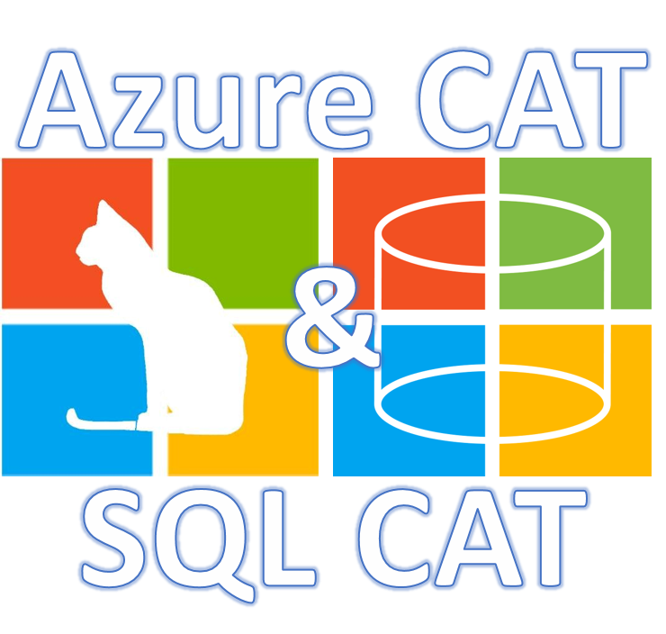
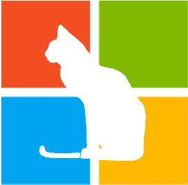

<properties
    pageTitle="Hello world! 欢迎来到 AzureCAT 指南"
    description="Hello world! 欢迎来到 AzureCAT 指南"
    service=""
    resource=""
    authors=""
    displayOrder=""
    selfHelpType=""
    supportTopicIds=""
    productPesIds=""
    resourceTags="AzureCAT, Ed Price, patterns & practices, SAP CAT, SQLCAT"
    cloudEnvironments="MoonCake" />
<tags
    ms.service="na-aog"
    ms.date=""
    wacn.date="02/24/2017" />
# Hello world! 欢迎来到 AzureCAT 指南

**欢迎来到 AzureCAT 指南博客！**

**AzureCAT 是什么？** CAT 代表 “客户顾问团队” 。我们和充当顾问的客户一同协作，将意见反馈回产品团队，通过与那些客户达成约定并制定突破性的解决方案！然后，我们从那些解决方案中学到了独特的经验教训。因此，我们将它们发布出来，给您展示关于微软产品的这些见解、体系结构、经验教训、最佳做法以及新兴模式。比如，Azure、SQL Server、Power BI、Visual Studio（开发工具）等等！

## The CATalogue(目录)

今天这篇文章是关于 AzureCAT 内容的展示，我们亲切的称其为 CATalogue。在以下内容中可以找到丰富的资源。您可以在评论中向我们提出任何疑问。如果您发现这些资源对您有所帮助请让我们知晓！

以下这篇博客将涵盖 AzureCAT 最新发布内容：

- [http://aka.ms/CAT](http://aka.ms/CAT)
    - [http://aka.ms/theCATalogue](http://aka.ms/theCATalogue) – 本页面

SQLCAT 相关内容可以在以下 SQLCAT 博客中找到：

- [http://SQLCAT.com](http://SQLCAT.com)

我们拥有一个在微软技术上致力于 SAP 工作的团队：

- [http://aka.ms/SAPCAT](http://aka.ms/SAPCAT)

AzureCAT 还包括我们的子团队、模式和实践。相关内容详见此链接：

- [http://aka.ms/patterns](http://aka.ms/patterns)

### 内容目录

1. [模式 & 实践](#patterns-practices)
    1. [清单](#checklists)
    2. [最佳实践](#best-practices-for-Cloud-Applications)
    3. [方案指南](#scenario-guides)
    4. [云设计模式](#cloud-design-patterns)
    5. [参考体系结构](#reference-architectures)
    6. [复原指南](#resiliency-guidance)
2. [AzureCAT 指南](#azurecat-guidance)
    1. [技术客户概况](#azurecat-technical-customer-profiles)
    2. [概念性文章](#azurecat-conceptual-articles)
    3. [示例代码：](#azurecat-code-samples)
    4. [工具](#azurecat-tools)
    5. [操作指南](#azurecat-how-to-guides)
3. [SQLCAT 指南](#sqlcat-guidance)
    1. [概念性文章](#sqlcat-conceptual-articles)
    2. [说明：](#sqlcat-explains)
    3. [操作指南：](#sqlcat-how-to-guides)
    4. [故障排除：](#sqlcat-troubleshooting)
4. [为什么要写这篇博客？](#why-blog)

让我们深入了解当前内容吧！

=================================

### [清单](https://docs.microsoft.com/zh-cn/azure/guidance/#checklists)

1. [可用性核对清单](https://docs.microsoft.com/zh-cn/azure/best-practices-availability-checklist)
2. [可伸缩性清单](https://docs.microsoft.com/zh-cn/azure/best-practices-scalability-checklist)

### [云应用的最佳实践](https://docs.microsoft.com/zh-cn/azure/guidance/#best-practices-articles)

1. [API 设计](https://docs.microsoft.com/zh-cn/azure/best-practices-api-design)
2. [API 实现](https://docs.microsoft.com/zh-cn/azure/best-practices-api-implementation)
3. [Azure 安全](https://github.com/mspnp/azure-guidance/blob/master/API-security.md)
4. [自动缩放](https://docs.microsoft.com/zh-cn/azure/best-practices-auto-scaling)
5. [后台作业](https://docs.microsoft.com/zh-cn/azure/best-practices-background-jobs)
6. [缓存](https://docs.microsoft.com/zh-cn/azure/best-practices-caching)
7. [内容交付网络（CDN）](https://docs.microsoft.com/zh-cn/azure/best-practices-cdn)
8. [数据分区](https://docs.microsoft.com/zh-cn/azure/best-practices-data-partitioning)
9. [监视和诊断指南（1/25 新增）](https://docs.microsoft.com/zh-cn/azure/best-practices-monitoring)
10.	[建议的命名约定](https://docs.microsoft.com/zh-cn/azure/guidance/guidance-naming-conventions)
11. [有关重试的一般性指南](https://docs.microsoft.com/zh-cn/azure/best-practices-retry-general)
12. [重试服务指南](https://docs.microsoft.com/zh-cn/azure/best-practices-retry-service-specific)

### [方案指南](https://docs.microsoft.com/zh-cn/azure/guidance/#scenario-guides)

1. [在 Azure 上运行 Elasticsearch](https://docs.microsoft.com/zh-cn/azure/guidance/guidance-elasticsearch)
2. [多租户应用程序的标识管理](https://docs.microsoft.com/zh-cn/azure/guidance/guidance-multitenant-identity)
3. [开发大数据解决方案](https://msdn.microsoft.com/library/dn749874.aspx)

### [云设计模式](https://docs.microsoft.com/zh-cn/azure/guidance/#patterns)

1. [云应用程序的的规范性体系结构指南](https://msdn.microsoft.com/library/dn568099.aspx)
2. [优化云应用程序的性能](https://github.com/mspnp/performance-optimization)

### [参考体系结构](https://docs.microsoft.com/zh-cn/azure/guidance/guidance-architecture)

#### 根据运行的 VM 工作负荷设计弹性的基础设施：

1. [在 Azure 上运行 Windows VM](https://docs.microsoft.com/zh-cn/azure/guidance/guidance-compute-single-vm)
2. [在 Azure 上运行 Linux VM](https://docs.microsoft.com/zh-cn/azure/guidance/guidance-compute-single-vm-linux)
3. [在 Azure 上运行多个 VMs 以提高可伸缩性和可用性](https://docs.microsoft.com/zh-cn/azure/guidance/guidance-compute-multi-vm)
4. [运行用于 N 层体系结构的 Windows VM](https://docs.microsoft.com/zh-cn/azure/guidance/guidance-compute-n-tier-vm)
5. [运行用于 N 层体系结构的 Linux](https://docs.microsoft.com/zh-cn/azure/guidance/guidance-compute-n-tier-vm-linux)
6. [在多个区域中运行 Windows VM 以实现高可用性](https://docs.microsoft.com/zh-cn/azure/guidance/guidance-compute-multiple-datacenters)
7. [在多个区域中运行 Linux VM 以实现高可用性](https://docs.microsoft.com/zh-cn/azure/guidance/guidance-compute-multiple-datacenters-linux)

#### 将本地网络连接到 Azure ：

1. [带有 Azure 和本地 VPN 的混合网络体系结构](https://docs.microsoft.com/zh-cn/azure/guidance/guidance-hybrid-network-vpn)
2. [带有 Azure ExpressRoute 的混合网络体系结构](https://docs.microsoft.com/zh-cn/azure/guidance/guidance-hybrid-network-expressroute)
3. [高可用性混合网络体系结构](https://docs.microsoft.com/zh-cn/azure/guidance/guidance-hybrid-network-expressroute-vpn-failover)

#### 混合网络安全：

1. [Azure 与 本地数据中心的外围网络](https://docs.microsoft.com/zh-cn/azure/guidance/guidance-iaas-ra-secure-vnet-hybrid)
2. [Azure 与 Internet 之间的外围网络](https://docs.microsoft.com/zh-cn/azure/guidance/guidance-iaas-ra-secure-vnet-dmz)

#### 提供身份服务：

1. [实现 Azure Active Directory](https://docs.microsoft.com/zh-cn/azure/guidance/guidance-identity-aad)
2. [将 Active Directory Directory Services (ADDS) 扩展到 Azure](https://docs.microsoft.com/zh-cn/azure/guidance/guidance-identity-adds-extend-domain)
3. [在 Azure 中创建 Active Directory Directory  Services（ADDS）资源林](https://docs.microsoft.com/zh-cn/azure/guidance/guidance-identity-adds-resource-forest)
4. [在 Azure 中实现 Active Directory Federation Services（ADFS）](https://docs.microsoft.com/zh-cn/azure/guidance/guidance-identity-adfs)

#### 使用 Azure PaaS 构建可扩展的 Web 应用

1. [基本 Web 应用程序](https://docs.microsoft.com/zh-cn/azure/guidance/guidance-web-apps-basic)
2. [提高 Web 应用程序的可伸缩性](https://docs.microsoft.com/zh-cn/azure/guidance/guidance-web-apps-scalability)
3. [高可用性 Web 应用程序](https://docs.microsoft.com/zh-cn/azure/guidance/guidance-web-apps-multi-region)

### [复原指南](https://docs.microsoft.com/zh-cn/azure/guidance/#resiliency-guidance)

1. [复原概述](https://docs.microsoft.com/zh-cn/azure/guidance/guidance-resiliency-overview)
2. [复原清单](https://docs.microsoft.com/zh-cn/azure/guidance/guidance-resiliency-checklist)
3. [故障模式分析](https://docs.microsoft.com/zh-cn/azure/guidance/guidance-resiliency-failure-mode-analysis)

============================

## AzureCAT 指南

“着手于解决方案，使用云思考问题”

### 技术客户概况

#### [Service Fabric：](https://blogs.msdn.microsoft.com/azureservicefabric/tag/customer-profile/)

1. [宝马 BMW](https://blogs.msdn.microsoft.com/azureservicefabric/2016/08/24/service-fabric-customer-profile-bmw-technology-corporation/)
2. [梅什系统 Mesh Systems](https://blogs.msdn.microsoft.com/azureservicefabric/2016/06/20/service-fabric-customer-profile-mesh-systems/)
3. [Proactima Solutions](https://blogs.msdn.microsoft.com/azureservicefabric/2017/01/06/service-fabric-customer-profile-proactima-solutions/) (1/24 新增)
4. [Quorum Business Solutions](https://blogs.msdn.microsoft.com/azureservicefabric/2016/11/15/service-fabric-customer-profile-quorum-business-solutions/)
5. [施耐德电气 Schneider  Electric](https://blogs.msdn.microsoft.com/azureservicefabric/2016/08/05/service-fabric-customer-profile-schneider-electric/)
6. [Talk Talk TV](https://blogs.msdn.microsoft.com/azureservicefabric/2016/03/15/service-fabric-customer-profile-talktalk-tv/)

#### SQL Server：

1. [必赢 Bwin](https://blogs.msdn.microsoft.com/sqlcat/2016/10/26/how-bwin-is-using-sql-server-2016-in-memory-oltp-to-achieve-unprecedented-performance-and-scale/)

### 概念性文章

#### Azure 资源管理器（ARM）：

1. [SAP 目前支持 Azure 资源管理器（ARM）下的 Windows 和 Linux](https://blogs.msdn.microsoft.com/saponsqlserver/2016/12/16/sap-support-for-azure-resource-manager/)
2. [新增 Azure PowerShell 命令以提高 Azure 监控性能](https://blogs.msdn.microsoft.com/saponsqlserver/2016/05/16/new-azure-powershell-cmdlets-for-azure-enhanced-monitoring/)

#### PowerShell：

1. [新增 Azure PowerShell 命令以提高 Azure 监控性能](https://blogs.msdn.microsoft.com/saponsqlserver/2016/05/16/new-azure-powershell-cmdlets-for-azure-enhanced-monitoring/)

#### 高级存储：

1. [用于在 Azure 上部署 SAP 的前 14 个最近更新及发布的技术](https://blogs.msdn.microsoft.com/saponsqlserver/2016/12/04/top-14-updates-and-new-technologies-for-deploying-sap-on-azure/)
2. [如何获取关于在 Azure 中的 SAP 工作负荷的文章或信息？](https://blogs.msdn.microsoft.com/saponsqlserver/2016/10/24/where-can-i-find-documentation-or-information-for/)
3. [用于 SAP 工作负荷的 Azure 高级存储](https://blogs.msdn.microsoft.com/saponsqlserver/2015/04/24/azure-premium-storage-is-available-for-sap-workloads/)

#### SAP HANA：

1. [Azure 中 SAP HANA 的概览与架构（大实例）](https://docs.microsoft.com/zh-cn/azure/virtual-machines/linux/sap-hana-overview-architecture?toc=%2fazure%2fvirtual-machines%2flinux%2ftoc.json)  （1/27 新增）
2. [Azure 中 SAP HANA 的基础设施与连通性（大实例）](https://docs.microsoft.com/zh-cn/azure/virtual-machines/linux/sap-hana-overview-infrastructure-connectivity?toc=%2fazure%2fvirtual-machines%2flinux%2ftoc.json) （1/27 新增）
3. [在 Azure 中的  SAP HANA 中安装 SAP HANA（大实例）](https://docs.microsoft.com/zh-cn/azure/virtual-machines/linux/sap-hana-overview-sap-hana-installation?toc=%2fazure%2fvirtual-machines%2flinux%2ftoc.json) （1/27 新增）
4. [Azure 中 SAP HANA 的高可用性与灾备恢复（大实例）](https://docs.microsoft.com/zh-cn/azure/virtual-machines/linux/sap-hana-overview-high-availability-disaster-recovery?toc=%2fazure%2fvirtual-machines%2flinux%2ftoc.json) （1/27 新增）
5. [Azure 中 SAP HANA 的故障检测与监测（大实例）](https://docs.microsoft.com/zh-cn/azure/virtual-machines/linux/sap-hana-overview-troubleshooting-monitoring?toc=%2fazure%2fvirtual-machines%2flinux%2ftoc.json) （1/27 新增）

#### 站点恢复：

1. [通过 Azure 站点恢复保护在虚拟机中运行的 SAP 系统](https://blogs.msdn.microsoft.com/saponsqlserver/2016/05/06/protecting-sap-systems-running-on-vmware-with-azure-site-recovery/)

#### SQL 数据仓库：

1. [在实践中迁移数据至 Azure SQL 数据仓库](https://blogs.msdn.microsoft.com/sqlcat/2016/08/18/migrating-data-to-azure-sql-data-warehouse-in-practice/)
2. [Azure SQL 数据仓库加载模式与策略](https://blogs.msdn.microsoft.com/sqlcat/2016/02/06/azure-sql-data-warehouse-loading-patterns-and-strategies/)
3. [选择散列分布表与 Azure SQL 数据仓库服务中的循环分布表的比较](https://blogs.msdn.microsoft.com/sqlcat/2015/08/11/choosing-hash-distributed-table-vs-round-robin-distributed-table-in-azure-sql-dw-service/)

#### SQL 数据库：

1. [使用 Bacpac 文件迁移 SQL Server 至 Azure SQL 数据库](https://blogs.msdn.microsoft.com/sqlcat/2016/10/20/migrating-from-sql-server-to-azure-sql-database-using-bacpac-files/)
2. [确定 Azure SQL 数据库 V12 的大小](https://blogs.msdn.microsoft.com/sqlcat/2016/09/21/determining-database-size-in-azure-sql-database-v12/)
3. [Azure SQL 数据库：非预期的数据库最大规模限制](https://blogs.msdn.microsoft.com/sqlcat/2016/09/13/real-world-azure-sql-db-unexpected-database-maximum-size-limit/)
4. [通过重定向连接到 Azure SQL 数据库 V12](https://blogs.msdn.microsoft.com/sqlcat/2016/09/08/connect-to-azure-sql-database-v12-via-redirection/)
5. [在 Azure SQL 数据库中使用始终加密的表值参数](https://blogs.msdn.microsoft.com/sqlcat/2016/08/09/using-table-valued-parameters-with-always-encrypted-in-sql-server-2016-and-azure-sql-database/)
6. [Azure SQL 数据库安全特性](https://blogs.msdn.microsoft.com/sqlcat/2015/04/20/azure-sql-database-security-features/)

#### 虚拟机：

1. [用于在 Azure 上部署 SAP 的前 14 个最近更新及发布的技术](https://blogs.msdn.microsoft.com/saponsqlserver/2016/12/04/top-14-updates-and-new-technologies-for-deploying-sap-on-azure/)
2. [如何获取关于在 Azure 中的 SAP 工作负荷的文章或信息？](https://blogs.msdn.microsoft.com/saponsqlserver/2016/10/24/where-can-i-find-documentation-or-information-for/)
3. [Azure 中 SAP 云设备库的更多优惠](https://blogs.msdn.microsoft.com/saponsqlserver/2016/08/03/__trashed/)
4. [SAP 的 Azure 快速启动模板](https://blogs.msdn.microsoft.com/saponsqlserver/2016/05/16/azure-quickstart-templates-for-sap/)
5. [通过 Azure 站点恢复保护在虚拟机中运行的 SAP 系统](https://blogs.msdn.microsoft.com/saponsqlserver/2016/05/06/protecting-sap-systems-running-on-vmware-with-azure-site-recovery/)
6. [关于使用 Azure IaaS VMs 发布 SAP 云部署的标准应用程序准则](https://blogs.msdn.microsoft.com/saponsqlserver/2015/10/05/world-record-sap-sales-and-distribution-standard-application-benchmark-for-sap-cloud-deployments-released-using-azure-iaas-vms/)
7. [如何调整在 Azure VM 上运行的 SAP 系统](https://blogs.msdn.microsoft.com/saponsqlserver/2015/06/19/how-to-size-sap-systems-running-on-azure-vms/)
8. [在 Azure 上部署 SAP 应用程序的十大关键注意事项](https://blogs.msdn.microsoft.com/saponsqlserver/2015/05/25/top-10-key-considerations-for-deploying-sap-applications-on-azure/)

#### Windows：

1. [SAP GUI 目前已支持 Windows 10 操作系统](https://blogs.msdn.microsoft.com/saponsqlserver/2015/10/08/sap-gui-is-supporting-windows-10-as-operating-system/)

### 示例代码：

1. [Service Fabric 和 IoT 中心的 IoT 示例](https://github.com/paolosalvatori/servicefabriciothubdemo)
2. [Service Fabric 和 事件中心的 IoT 示例](https://github.com/paolosalvatori/servicefabriceventhubdemo)
3. [Azure Service Fabric ：异步计算角色](https://github.com/paolosalvatori/servicefabricasynchronouscomputingactors)
4. [Azure Service Fabric：观察者模式示例](https://github.com/paolosalvatori/servicefabricobserver)
5. [IoT 示例：从 IoT 中心读取事件](https://code.msdn.microsoft.com/How-to-read-events-from-an-1641eb1b)
6. [事件中心示例：将事件中心的事件存储到 Azure SQL 数据库](https://code.msdn.microsoft.com/How-to-integrate-store-828769eb)
7. [服务总线示例：在多租户环境中处理服务总线中继服务](https://code.msdn.microsoft.com/How-to-handle-Service-Bus-6d65eca1)

### 工具：

1. [服务总线资源管理器](https://github.com/paolosalvatori/ServiceBusExplorer)
2. [服务总线扩展](https://github.com/paolosalvatori/ServiceBusExtensions)
3. [服务总线 PowerShell 脚本](https://code.msdn.microsoft.com/Service-Bus-PowerShell-a46b7059)

### 操作指南：

#### Active Directory：

1. [如何通过 Azure AD 和 Office 365 APIs（.NET）设置身份验证](https://github.com/AzureCAT-GSI/DevCamp/tree/master/HOL/dotnet/03-azuread-office365) （1/31 新增）
    - [如何通过 Azure AD 和 Office 365 APIs（Java）设置身份验证](https://github.com/AzureCAT-GSI/DevCamp/tree/master/HOL/java/03-azuread-office365) （1/31 新增）
    - [如何通过 Azure AD 和 Office 365 APIs（NodeJS）设置身份验证）](https://github.com/AzureCAT-GSI/DevCamp/tree/master/HOL/node/03-azuread-office365) （1/31 新增）

#### 应用服务：

1. [如何调配 ARM（.NET）](https://github.com/AzureCAT-GSI/DevCamp/tree/master/HOL/dotnet/05-arm-cd) （1/31 新增）
    - [如何调配 ARM（Java）](https://github.com/AzureCAT-GSI/DevCamp/tree/master/HOL/java/05-arm-cd) （1/31 新增）
    - [如何调配 ARM（NodeJS）](https://github.com/AzureCAT-GSI/DevCamp/tree/master/HOL/node/05-arm-cd) （1/31 新增）
2. [如何在使用 SQL 时始终通过  Azure Web 应用服务进行加密](https://blogs.msdn.microsoft.com/sqlcat/2016/09/15/using-sql-always-encrypted-with-azure-web-app-service/)

#### Application Insights:

1. [如何使用 Application Insights 进行监视（.NET）](https://github.com/AzureCAT-GSI/DevCamp/tree/master/HOL/dotnet/06-appinsights) （1/31 新增）
    - [如何使用 Application Insights 进行监视（Java）](https://github.com/AzureCAT-GSI/DevCamp/tree/master/HOL/java/06-appinsights) （1/31 新增）
    - [如何使用 Application Insights 进行监视（NodeJS）](https://github.com/AzureCAT-GSI/DevCamp/tree/master/HOL/node/06-appinsights) （1/31 新增）

#### Azure 门户预览：

1. [如何设置开发人员环境（.NET）](https://github.com/AzureCAT-GSI/DevCamp/tree/master/HOL/dotnet/01-developer-environment) （1/31 新增）
    - [如何设置开发人员环境（Java）](https://github.com/AzureCAT-GSI/DevCamp/tree/master/HOL/java/01-developer-environment) （1/31 新增）
    - [如何设置开发人员环境（NodeJS）](https://github.com/AzureCAT-GSI/DevCamp/tree/master/HOL/node/01-developer-environment) （1/31 新增）

2. [如何使用 Application Insights 进行监视（.NET）](https://github.com/AzureCAT-GSI/DevCamp/tree/master/HOL/dotnet/06-appinsights) （1/31 新增）
    - [如何使用 Application Insights 进行监视（Java）](https://github.com/AzureCAT-GSI/DevCamp/tree/master/HOL/java/06-appinsights) （1/31 新增）
    - [如何使用 Application Insights 进行监视（NodeJS）](https://github.com/AzureCAT-GSI/DevCamp/tree/master/HOL/node/06-appinsights) （1/31 新增）

#### Azure 资源管理器（ARM）：

1. [如何调配 ARM（.NET）](https://github.com/AzureCAT-GSI/DevCamp/tree/master/HOL/dotnet/05-arm-cd) （1/31 新增）
    - [如何调配 ARM（Java）](https://github.com/AzureCAT-GSI/DevCamp/tree/master/HOL/java/05-arm-cd) （1/31 新增）
    - [如何调配 ARM（NodeJS）](https://github.com/AzureCAT-GSI/DevCamp/tree/master/HOL/node/05-arm-cd) （1/31 新增）

#### 开发设置：

1. [如何设置开发人员环境（.NET）](https://github.com/AzureCAT-GSI/DevCamp/tree/master/HOL/dotnet/01-developer-environment) （1/31 新增）
    - [如何设置开发人员环境（Java）](https://github.com/AzureCAT-GSI/DevCamp/tree/master/HOL/java/01-developer-environment) （1/31 新增）
    - [如何设置开发人员环境（NodeJS）](https://github.com/AzureCAT-GSI/DevCamp/tree/master/HOL/node/01-developer-environment) （1/31 新增）

2. [如何开发 Modern Apps（.NET）](https://github.com/AzureCAT-GSI/DevCamp/tree/master/HOL/dotnet/02-modern-cloud-apps) （1/31 新增）
    - [如何开发 Modern Apps（Java）](https://github.com/AzureCAT-GSI/DevCamp/tree/master/HOL/java/02-modern-cloud-apps) （1/31 新增）
    - [如何开发 Modern Apps（NodeJS）](https://github.com/AzureCAT-GSI/DevCamp/tree/master/HOL/node/02-modern-cloud-apps) （1/31 新增）

3. [如何通过 Azure AD 和 Office 365 APIs（.NET）设置身份验证](https://github.com/AzureCAT-GSI/DevCamp/tree/master/HOL/dotnet/03-azuread-office365) （1/31 新增）
    - [如何通过 Azure AD 和 Office 365 APIs（Java）设置身份验证](https://github.com/AzureCAT-GSI/DevCamp/tree/master/HOL/java/03-azuread-office365) （1/31 新增）
    - [如何通过 Azure AD 和 Office 365 APIs（NodeJS）设置身份验证](https://github.com/AzureCAT-GSI/DevCamp/tree/master/HOL/node/03-azuread-office365) （1/31 新增）

4. [如何使用 Visual Studio Team Services 设置 DevOps（.NET）](https://github.com/AzureCAT-GSI/DevCamp/tree/master/HOL/dotnet/04-devops-ci) （1/31 新增）
    - [如何使用 Visual Studio Team Services 设置 DevOps（Java）](https://github.com/AzureCAT-GSI/DevCamp/tree/master/HOL/java/04-devops-ci) （1/31 新增）
    - [如何使用 Visual Studio Team Services 设置 DevOps（NodeJS）](https://github.com/AzureCAT-GSI/DevCamp/tree/master/HOL/node/04-devops-ci) （1/31 新增）

5. [如何调配 ARM（.NET）](https://github.com/AzureCAT-GSI/DevCamp/tree/master/HOL/dotnet/05-arm-cd) （1/31 新增）
    - [如何调配 ARM（Java）](https://github.com/AzureCAT-GSI/DevCamp/tree/master/HOL/java/05-arm-cd) （1/31 新增）
    - [如何调配 ARM（NodeJS）](https://github.com/AzureCAT-GSI/DevCamp/tree/master/HOL/node/05-arm-cd) （1/31 新增）

6. [如何使用 Application Insights 进行监视（.NET）](https://github.com/AzureCAT-GSI/DevCamp/tree/master/HOL/dotnet/06-appinsights) （1/31 新增）
    - [如何使用 Application Insights 进行监视（Java）](https://github.com/AzureCAT-GSI/DevCamp/tree/master/HOL/java/06-appinsights) （1/31 新增）
    - [如何使用 Application Insights 进行监视（NodeJS）](https://github.com/AzureCAT-GSI/DevCamp/tree/master/HOL/node/06-appinsights) （1/31 新增）

#### DocumentDB ：

1. [如何通过 Azure AD 和 Office 365 APIs（.NET）设置身份验证](https://github.com/AzureCAT-GSI/DevCamp/tree/master/HOL/dotnet/03-azuread-office365) （1/31 新增）
    - [如何通过 Azure AD 和 Office 365 APIs（Java）设置身份验证](https://github.com/AzureCAT-GSI/DevCamp/tree/master/HOL/java/03-azuread-office365) （1/31 新增）
    - [如何通过 Azure AD 和 Office 365 APIs（NodeJS）设置身份验证](https://github.com/AzureCAT-GSI/DevCamp/tree/master/HOL/node/03-azuread-office365) （1/31 新增）

#### 事件中心：

1. [如何将事件中心的事件存储到 Azure SQL 数据库](https://blogs.msdn.microsoft.com/paolos/2015/03/05/how-to-store-event-hub-events-to-azure-sql-database/)
2. [如何使用服务总线资源管理器从 IoT 中心读取时间中心的事件](https://code.msdn.microsoft.com/How-to-read-events-from-an-1641eb1b)

#### IoT 中心：

1. [如何使用服务总线资源管理器从 IoT 中心读取事件](https://code.msdn.microsoft.com/How-to-read-events-from-an-1641eb1b)

#### Redis 缓存：

1. [如何开发 Modern Apps（.NET）](https://github.com/AzureCAT-GSI/DevCamp/tree/master/HOL/dotnet/02-modern-cloud-apps) （1/31 新增）
    - [如何开发 Modern Apps（Java）](https://github.com/AzureCAT-GSI/DevCamp/tree/master/HOL/java/02-modern-cloud-apps) （1/31 新增）
    - [如何开发 Modern Apps（NodeJS）](https://github.com/AzureCAT-GSI/DevCamp/tree/master/HOL/node/02-modern-cloud-apps) （1/31 新增）

#### 服务总线：

1. [如何为 Azure 服务总线实体实现分区的 SendBatch 方法](https://blogs.msdn.microsoft.com/paolos/2015/03/26/how-to-implement-a-partitioned-sendbatch-method-for-azure-service-bus-entities/)
2. [如何使用服务总线资源管理器从 IoT 中心读取事件](https://code.msdn.microsoft.com/How-to-read-events-from-an-1641eb1b)
3. [如何使用 PowerShell 脚本创建服务总线命名空间和事件中心](https://blogs.msdn.microsoft.com/paolos/2014/12/01/how-to-create-a-service-bus-namespace-and-an-event-hub-using-a-powershell-script/)
4. [如何使用 PowerShell 脚本创建服务总线队列、主题和订阅](https://blogs.msdn.microsoft.com/paolos/2014/12/02/how-to-create-service-bus-queues-topics-and-subscriptions-using-a-powershell-script/)
5. [如何在多租户环境中处理服务总线中继服务](https://code.msdn.microsoft.com/How-to-handle-Service-Bus-6d65eca1/)

#### SQL 数据仓库：

1. [Azure SQL 数据仓库：如何通过备份还原选项将数据迁移至不同区域](https://blogs.msdn.microsoft.com/sqlcat/2016/12/20/azure-sql-dw-moving-to-a-different-region-with-restore-from-backup-option/)

#### SQL 数据库：

1. [如何将事件中心的事件存储到 Azure SQL 数据库](https://blogs.msdn.microsoft.com/paolos/2015/03/05/how-to-store-event-hub-events-to-azure-sql-database/)

#### 存储：

1. [如何开发 Modern Apps（.NET）](https://github.com/AzureCAT-GSI/DevCamp/tree/master/HOL/dotnet/02-modern-cloud-apps) （1/31 新增）
    - [如何开发 Modern Apps（Java）](https://github.com/AzureCAT-GSI/DevCamp/tree/master/HOL/java/02-modern-cloud-apps)（1/31 新增）
    - [如何开发 Modern Apps（NodeJS）](https://github.com/AzureCAT-GSI/DevCamp/tree/master/HOL/node/02-modern-cloud-apps)（1/31 新增）

#### 流分析：

1. [如何规范流分析作业中传入的事件](https://blogs.msdn.microsoft.com/paolos/2016/01/21/how-to-normalize-incoming-events-in-a-stream-analytics-job/)
2. [如何在流分析作业中找到缺失的信号](https://blogs.msdn.microsoft.com/paolos/2015/12/17/how-to-find-absence-of-signal-in-a-stream-analytics-job/)

#### 虚拟机：

1. [如何设置开发人员环境（.NET）](https://github.com/AzureCAT-GSI/DevCamp/tree/master/HOL/dotnet/01-developer-environment)（1/31 新增）
    - [如何设置开发人员环境（Java）](https://github.com/AzureCAT-GSI/DevCamp/tree/master/HOL/java/01-developer-environment)（1/31 新增）
    - [如何设置开发人员环境（NodeJS）](https://github.com/AzureCAT-GSI/DevCamp/tree/master/HOL/node/01-developer-environment)（1/31 新增）

#### Visual Studio Team Services：

1. [如何使用 Visual Studio Team Services 设置 DevOps（.NET）](https://github.com/AzureCAT-GSI/DevCamp/tree/master/HOL/dotnet/04-devops-ci)（1/31 新增）
    - [如何使用 Visual Studio Team Services 设置 DevOps（Java）](https://github.com/AzureCAT-GSI/DevCamp/tree/master/HOL/java/04-devops-ci)（1/31 新增）
    - [如何使用 Visual Studio Team Services 设置 DevOps（NodeJS）](https://github.com/AzureCAT-GSI/DevCamp/tree/master/HOL/node/04-devops-ci)（1/31 新增）

===============================

## SQLCAT 指南

### 概念性文章 & 白皮书

#### AlwaysOn：

1. [SQL Server 2016 AlwaysOn for SAP](https://blogs.msdn.microsoft.com/saponsqlserver/2016/05/02/sql-server-2016-alwayson-for-sap/)
2. [SQL Server 2012 AlwaysOn : 各方面性能及性能监测 II](https://blogs.msdn.microsoft.com/saponsqlserver/2013/04/24/sql-server-2012-alwayson-part-12-performance-aspects-and-performance-monitoring-ii/)
3. [通过 SAP 配置从数据库镜像或 AlwaysOn 辅助副本中读取数据](https://blogs.msdn.microsoft.com/saponsqlserver/2012/12/25/reading-from-database-mirroring-or-alwayson-secondary-replicas-in-sap-configurations/)

#### Azure SQL 数据仓库

1. [在实践中迁移数据至 Azure SQL 数据仓库](https://blogs.msdn.microsoft.com/sqlcat/2016/08/18/migrating-data-to-azure-sql-data-warehouse-in-practice/)
2. [Azure SQL 数据仓库加载模式与策略](https://blogs.msdn.microsoft.com/sqlcat/2016/02/06/azure-sql-data-warehouse-loading-patterns-and-strategies/)
3. [选择散列分布表与 Azure SQL 数据仓库服务中的循环分布表的比较](https://blogs.msdn.microsoft.com/sqlcat/2015/08/11/choosing-hash-distributed-table-vs-round-robin-distributed-table-in-azure-sql-dw-service/)

#### Azure SQL 数据库：

1. [使用 Bacpac 文件迁移 SQL Server 至 Azure SQL 数据库](https://blogs.msdn.microsoft.com/sqlcat/2016/10/20/migrating-from-sql-server-to-azure-sql-database-using-bacpac-files/)
2. [Azure SQL 数据库：非预期的数据库最大规模限制](https://blogs.msdn.microsoft.com/sqlcat/2016/09/13/real-world-azure-sql-db-unexpected-database-maximum-size-limit/)
3. [通过重定向连接到 Azure SQL 数据库 V12](https://blogs.msdn.microsoft.com/sqlcat/2016/09/08/connect-to-azure-sql-database-v12-via-redirection/)
4. [在 SQL Server 2016 和 Azure SQL 数据库中使用始终加密的表值参数](https://blogs.msdn.microsoft.com/sqlcat/2016/08/09/using-table-valued-parameters-with-always-encrypted-in-sql-server-2016-and-azure-sql-database/)

#### R 服务：

1. [借助 SQL Server 2016 R 服务您将成为一个更加优秀的 T-SQL 开发人员](https://blogs.msdn.microsoft.com/sqlcat/2016/07/12/sqlsweet16-episode-4-sql-server-r-services-makes-you-a-smarter-t-sql-developer/)
2. [SQL Server R 服务早期客户体验](https://blogs.msdn.microsoft.com/sqlcat/2016/06/16/early-customer-experiences-with-sql-server-r-services/)

#### SAP on SQL Server：

1. [SAP BW 对于 SQL Server 的近期改善](https://blogs.msdn.microsoft.com/saponsqlserver/2017/01/05/recent-sap-bw-improvements-for-sql-server/)
2. [SQL Server: 提高 SAP 压缩工具 MSSCOMPRESS](https://blogs.msdn.microsoft.com/saponsqlserver/2016/11/25/improved-sap-compression-tool-msscompress/)
3. [白皮书：SAP OS/DB 迁移至 SQL Server-FAQ v6.1 2016 年 11 月](https://blogs.msdn.microsoft.com/saponsqlserver/2016/11/24/sap-osdb-migration-to-sql-server-faq-v6-0-november-2016/)
4. [从 SAP 2 层配置转移到 3 层配置，性能似乎更糟](https://blogs.msdn.microsoft.com/saponsqlserver/2016/11/21/moving-from-sap-2-tier-to-3-tier-configuration-and-performance-seems-worse/)
5. [SQL Server: 简化及更快的 SAP BW 流程链](https://blogs.msdn.microsoft.com/saponsqlserver/2016/11/14/simplified-and-faster-sap-bw-process-chains/)
6. [SQL 中的 SAP：客户 & 合作伙伴全面更新 2016 年 6 月](https://blogs.msdn.microsoft.com/saponsqlserver/2016/06/07/sap-on-sql-general-update-for-customers-partners-june-2016/)
7. [用于 SAP 中的 SQL Server 2016 分布式可用性组](https://blogs.msdn.microsoft.com/saponsqlserver/2016/06/16/sql-server-2016-distributed-availability-groups-for-sap/)
8. [SQL Server 2016 AlwaysOn for SAP](https://blogs.msdn.microsoft.com/saponsqlserver/2016/05/02/sql-server-2016-alwayson-for-sap/)
9. [白皮书： SQL Server 2012 和 SQL Server 2014 中的 SAP](https://blogs.msdn.microsoft.com/saponsqlserver/2016/03/07/whitepaper-sap-on-sql-server-2012-and-sql-server-2014/)
10. [SQL Server：SAP（BW）系统拷贝的改善](https://blogs.msdn.microsoft.com/saponsqlserver/2016/01/27/improvements-of-sap-bw-system-copy/)
11. [关于使用 Azure IaaS VMs 发布 SAP 云部署的标准应用程序准则](https://blogs.msdn.microsoft.com/saponsqlserver/2015/10/05/world-record-sap-sales-and-distribution-standard-application-benchmark-for-sap-cloud-deployments-released-using-azure-iaas-vms/)
12. [SQL Server 2012 AlwaysOn : 各方面性能及性能监测 II](https://blogs.msdn.microsoft.com/saponsqlserver/2013/04/24/sql-server-2012-alwayson-part-12-performance-aspects-and-performance-monitoring-ii/)
13. [通过 SAP 配置从数据库镜像或 AlwaysOn 辅助副本中读取数据](https://blogs.msdn.microsoft.com/saponsqlserver/2012/12/25/reading-from-database-mirroring-or-alwayson-secondary-replicas-in-sap-configurations/)

#### SQL Server 2016:

1. [SQL Server：意外情况下使用临时表恢复数据](https://blogs.msdn.microsoft.com/sqlcat/2016/11/10/oops-recovery-with-temporal-tables/)
2. [SQL Server 2016：批量插入或 bcp 工具支持 UTF-8 数据](https://blogs.msdn.microsoft.com/sqlcat/2016/10/19/sqlsweet16-episode-10-i-can-eat-glass-but-can-i-load-it-into-a-database/)
3. [SQL Server 2016：始终加密操作的脚本](https://blogs.msdn.microsoft.com/sqlcat/2016/10/07/sqlsweet16-episode-9-scripting-always-encrypted-operations/)
4. [SQL Server 2016 累积更新 2（CU2）是如何提升高并发工作负荷性能的](https://blogs.msdn.microsoft.com/sqlcat/2016/09/29/sqlsweet16-episode-8-how-sql-server-2016-cumulative-update-2-cu2-can-improve-performance-of-highly-concurrent-workloads/)
5. [SQL Server 2016：即时文件初始化的安装选项](https://blogs.msdn.microsoft.com/sqlcat/2016/08/23/sqlsweet16-episode-7-install-option-for-instant-file-initialization/)
6. [在 SQL Server 2016 和 Azure SQL 数据库中使用始终加密的表值参数](https://blogs.msdn.microsoft.com/sqlcat/2016/08/09/using-table-valued-parameters-with-always-encrypted-in-sql-server-2016-and-azure-sql-database/)
7. [SQL Server 2016 检查点行为的变更](https://blogs.msdn.microsoft.com/sqlcat/2016/08/03/changes-in-sql-server-2016-checkpoint-behavior/#comments)
8. [在实际应用中您需要了解的更多关于 Parallel INSERT...SELECT 的信息](https://blogs.msdn.microsoft.com/sqlcat/2016/07/21/real-world-parallel-insert-what-else-you-need-to-know/)
9. [借助 SQL Server 2016 R Services 您将成为一个更加优秀的 T-SQL 开发人员](https://blogs.msdn.microsoft.com/sqlcat/2016/07/12/sqlsweet16-episode-4-sql-server-r-services-makes-you-a-smarter-t-sql-developer/)
10. [SQL Server 2016：Parallel INSERT...SELECT](https://blogs.msdn.microsoft.com/sqlcat/2016/07/06/sqlsweet16-episode-3-parallel-insert-select/)
11. [SQL Server 2016:  可用性组的自动种子设定](https://blogs.msdn.microsoft.com/sqlcat/2016/06/28/sqlsweet16-episode-2-availability-groups-automatic-seeding-2/)
12. [SQL Server R 服务早期客户体验](https://blogs.msdn.microsoft.com/sqlcat/2016/06/16/early-customer-experiences-with-sql-server-r-services/)
13. [SQL Server 2016 中内存优化表的检查点进程以及对日志的影响](https://blogs.msdn.microsoft.com/sqlcat/2016/05/20/logging-and-checkpoint-process-for-memory-optimized-tables-2/)
14. [用于 SAP 中的 SQL Server 2016 分布式可用性组](https://blogs.msdn.microsoft.com/saponsqlserver/2016/06/16/sql-server-2016-distributed-availability-groups-for-sap/)
15. [SQL Server 2016 AlwaysOn for SAP](https://blogs.msdn.microsoft.com/saponsqlserver/2016/05/02/sql-server-2016-alwayson-for-sap/)
16. [SQL Server 2016：SSIS 数据流缓冲区自动调整有利于在集群列存储表上加载数据](https://blogs.msdn.microsoft.com/sqlcat/2016/02/29/sql-server-2016-ssis-data-flow-buffer-auto-sizing-capability-benefits-data-loading-on-clustered-columnstore-tables/)
17. [在 SQL Server 2016 中使用本机编译的 UDFs 降低 RBAR 的影响](https://blogs.msdn.microsoft.com/sqlcat/2016/02/17/soften-the-rbar-impact-with-native-compiled-udfs-in-sql-server-2016/)
18. [SQL Server 2016：列存储与行组的合并规则及索引维护改进](https://blogs.msdn.microsoft.com/sqlcat/2015/08/17/sql-2016-columnstore-row-group-merge-policy-and-index-maintenance-improvements/)
19. [SQL Server 和 “即时文件初始化”：缓冲池扩展](https://blogs.msdn.microsoft.com/arvindsh/2015/05/26/sql-server-and-instant-file-initialization-under-the-hood-part-3/)
20. [SQL Server 和 “即时文件初始化”：当创建数据库文件时会发生什么](https://blogs.msdn.microsoft.com/arvindsh/2015/05/19/sql-server-and-instant-file-initialization-under-the-hood-part-2/)
21. [SQL Server 和 “即时文件初始化”：物理层和有效数据的大小](https://blogs.msdn.microsoft.com/arvindsh/2015/05/04/sql-server-and-instant-file-initialization-under-the-hood-part-1/)

#### SSIS：

1. [SQL Server 2016：SSIS 数据流缓冲区自动调整有利于在集群列存储表上加载数据](https://blogs.msdn.microsoft.com/sqlcat/2016/02/29/sql-server-2016-ssis-data-flow-buffer-auto-sizing-capability-benefits-data-loading-on-clustered-columnstore-tables/)

#### T-SQL：

1. [借助 SQL Server 2016 R Services 您将成为一个更加优秀的 T-SQL 开发人员](https://blogs.msdn.microsoft.com/sqlcat/2016/07/12/sqlsweet16-episode-4-sql-server-r-services-makes-you-a-smarter-t-sql-developer/)
2. [T-SQL 排名函数](https://blogs.msdn.microsoft.com/arvindsh/2016/04/16/t-sql-ranking-functions-to-the-rescue-once-again/)

### 说明：

#### 简短的描述和说明：

1. [SQL Server 2016 对于 SAP（BW）的改善](https://blogs.msdn.microsoft.com/saponsqlserver/2016/11/11/sql-server-2016-improvements-for-sap-bw/)
2. [什么是 DAX 表达式？](https://blogs.msdn.microsoft.com/user_ed/2016/11/06/what-is-a-dax-expression/)
3. [确定 Azure SQL 数据库 V12 的大小](https://blogs.msdn.microsoft.com/sqlcat/2016/09/21/determining-database-size-in-azure-sql-database-v12/)
4. [SQL Server 2016：指定 MAXDOP 的 DBCC CHECKDB 命令](https://blogs.msdn.microsoft.com/sqlcat/2016/08/17/sqlsweet16-episode-6-dbcc-checkdb-with-maxdop/)
5. [SQL Server 2016：TRUNCATE 所选分区](https://blogs.msdn.microsoft.com/sqlcat/2016/08/11/sqlsweet16-episode-5-truncate-selected-partitions/)
6. [“聚合串联”的 T-SQL （反）模式](https://blogs.msdn.microsoft.com/arvindsh/2016/06/27/the-aggregate-concatenation-t-sql-anti-pattern/)
7. [SQL Server 中不再使用的常见子表达式](https://blogs.msdn.microsoft.com/arvindsh/2016/04/09/common-sub-expression-elimination-in-sql-server-what-you-need-to-know/)
8. [发现大内存授予的 SQL Server 查询](https://blogs.msdn.microsoft.com/arvindsh/2015/05/06/query-of-the-day-finding-sql-server-queries-with-large-memory-grants/)
9. [Azure SQL 数据库安全特性](https://blogs.msdn.microsoft.com/sqlcat/2015/04/20/azure-sql-database-security-features/)

### 操作指南：

1. [Azure SQL 数据仓库：如何通过备份还原选项将数据迁移至不同区域](https://blogs.msdn.microsoft.com/sqlcat/2016/12/20/azure-sql-dw-moving-to-a-different-region-with-restore-from-backup-option/)
2. [如何在 SQL Server 2016 上安装或升级  SAP 系统](https://blogs.msdn.microsoft.com/saponsqlserver/2016/12/09/software-logistics-on-sql-server-2016/)
3. [如何在 SQL Server 2016  SP1 中通过临时表构建新索引以提高内存优化表的查询性能](https://blogs.msdn.microsoft.com/sqlcat/2016/12/08/improve-query-performance-on-memory-optimized-tables-with-temporal-using-new-index-creation-enhancement-in-sp1/)
4. [如何部署无法联网的 SQL Server R 服务](https://blogs.msdn.microsoft.com/sqlcat/2016/10/20/do-it-right-deploying-sql-server-r-services-on-computers-without-internet-access/)
5. [如何在 Azure Web 应用服务中使用始终加密的 SQL](https://blogs.msdn.microsoft.com/sqlcat/2016/09/13/real-world-azure-sql-db-unexpected-database-maximum-size-limit/)
6. [如何降低 SQL Server 数据库备份](https://blogs.msdn.microsoft.com/saponsqlserver/2016/08/10/how-to-slowdown-a-sql-server-database-backup/)
7. [如何安装 SQL Server 016 RTM](https://blogs.msdn.microsoft.com/sqlcat/2016/07/28/installing-sql-server-2016-rtm-you-must-do-this/#comments)
8. [如何将代理键分配给 SQL DW 和 APS 中的维度表](https://blogs.msdn.microsoft.com/sqlcat/2016/02/18/assigning-surrogate-key-to-dimension-tables-in-sql-dw-and-aps/)

### 故障排除：

1. [Azure SQL 数据库：非预期的数据库最大规模限制](https://blogs.msdn.microsoft.com/sqlcat/2016/09/13/real-world-azure-sql-db-unexpected-database-maximum-size-limit/)
2. [内存优化表的事务依赖性限制 – 错误 41839](https://blogs.msdn.microsoft.com/sqlcat/2016/07/11/transaction-dependency-limits-with-memory-optimized-tables-error-41839/)
3. [PolyBase 安装错误及可能的解决方案](https://blogs.msdn.microsoft.com/sqlcat/2016/06/21/polybase-setup-errors-and-possible-solutions/)
4. [关于在内存优化表中使用外键而产生的 41305 和 41325 验证错误的注意事项](https://blogs.msdn.microsoft.com/sqlcat/2016/03/24/considerations-around-validation-errors-41305-and-41325-on-memory-optimized-tables-with-foreign-keys/)

给我们留下您的意见，让我们知道您的想法以及哪些内容对您有所帮助！

## 为什么要写这篇博客？

为了分享内容！分享解决方案！就像我们的标签行所说，我们提供“着手于解决方案，使用云思考问题”。

但是，在我们内心深处，我们享受我们的解决方案，并且无论如何我们都应该将我们所想大声喊出来，对吧？

所以，考虑到这一点，我们不能只发布一个“Hello World”博客, 而不深入探讨 Scott Adam 自己关于这篇博客为什么会存在的想法...

> DILBERT 自己的博客
> 
> 当我看到世界各地不同人群的痛苦经历时，我替他们担心，我绞劲脑汁想要知道我怎样才能改变现状。所以我决定开始写自己的博客。这样我就没有时间去考虑别人的事了。
> 
> 那些试图决定是否创建博客的人的思维过程大致都是这样的：
> 
> 1. 这个世界太需要我
> 2. 也许我需要更频繁的喊出来，这样周围的人才能感受到我的想法的乐趣
> 3. 不，等等，用喊得方式看起来太疯狂了
> 4. 我知道了，我会写下我的每日想法并且督促他人阅读
> 5. 如果只有这个过程的描述而不涉及偏激或不必要的言辞就好了
> 6. 什么？它被成为博客？我来了！
> 
> 博主的理念往往是这样的：
> 
> - 我所想的一切都比你头脑中的"poopy"更加迷人。
> 
> 与编写一本书相比，博客的美好在于没有编辑会干扰我的任意想法以及语法的校验，我完全无视事实（博客让你富有），并且我的这句话好像是要一直写下去也不会结束以至于你需要换口气并且保持头脑清醒然后再考虑要读到这句话的结尾之前有可能这句话其实并不需要写这么长。
> 
> Dilbert 的简讯，Dogbert's New Ruling Class 的官方出版物，2005 年 10 月 25 日，第 61 期
> 
> http://www.unitedmedia.com/comics/dilbert/dnrc/html/newsletter61.html (之前发布在这里)

另外... 我可能稍微美化了一下他的笑话，尽管，你永远不会知道！

给我们留下您的意见，让我们知道您的想法以及哪些内容对您有所帮助！同时，您也可以说说您的关于为什么要有这篇博客的想法。=^
